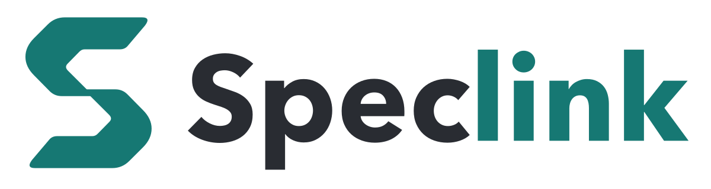

<p align="center">
  
</p>

<p align="center">
  <b>One SDD Engine for Local Repo and Remote Store</b>
</p>

<p align="center">
  <a href="https://github.com/MomoChenisMe/speclink/actions/workflows/ci.yml"></a>
  <a href="https://github.com/MomoChenisMe/speclink/releases/latest"></a>
  <a href="https://www.npmjs.com/package/@speclink/cli"></a>
  <a href="LICENSE"></a>
</p>

<p align="center">
  <a href="README.md">繁體中文</a> · <b>English</b>
</p>

Speclink is a Spec-Driven Development (SDD) engine and tool platform written in Rust. PMs, POs, engineers, and AI agents use one shared set of terms: change, artifact, task, verify, and archive.

Speclink has two deployment paths:

- **Local Repo**: Specs live in the `openspec/` folder of your repo. Git handles collaboration. No server is necessary.
- **Remote Store**: Specs live in a shared Store. A Host handles authentication, revisions, transactions, events, and workflow decisions. The Host and Protocol are public contracts, so you can use the official server or write your own.

The Local CLI started with the CLI of [Spectra App 2.3.1](https://github.com/kaochenlong/spectra-app) as its behavior reference. Golden tests and CLI integration tests protect the human output, the `--json` shape, and the core workflow. On top of that base, Speclink adds discussions, a desktop app, a Store abstraction, a Node SDK, and a remote platform.


## <a id="features"></a>Features

- **Plain text, OpenSpec-compatible**: Local mode uses the OpenSpec folder layout: `specs/<capability>/spec.md`, `changes/<name>/`, `changes/archive/`, and `config.yaml`. All content is Markdown and YAML. You can read and edit it without Speclink, and each change shows in the Git diff. Speclink adds only two items: `discussions/` (discussion records) and a `.openspec.yaml` file in each change (lifecycle metadata). This applies to Local mode only. In remote mode, the specs live in the Store, and your machine has only a read-only projection.
- **Skills for AI agents**: `speclink init` writes skill files for Claude Code, Codex, and GitHub Copilot. Each stage, from discussion to archive, has a `/speclink-*` command (`$speclink-*` in Codex).
- **Desktop board**: Each change is a card. You can see its stage, its task progress, and the spec changes it makes.
- **Quality stations**: `review` checks code craft. `verify` checks that the delivery matches the specs. Both stations are optional.
- **Execution order**: `speclink plan` puts changes into waves from their declared dependencies and shows the next change that is ready to start.
- **Team sharing**: After you connect a server, the CLI, the desktop app, and AI agents read and write the same specs.

## <a id="status"></a>Status

- **Available**: Local Repo CLI, Local desktop app, agent skills (Claude, Codex, and GitHub Copilot), quality stations, execution order, manual and trace, Node SDK (`@speclink/engine`), three TeamStores (SQLite, Server FS, PostgreSQL), single-node server and admin console, Remote CLI, install channels, server operations (deployment, backup, and restore).
- **Partial**: Remote workspaces in the desktop app, the Claude Code plugin.
- **Planned**: Agent tool packages and MCP, SSO, runtime plugins, multi-node deployment.

For the evidence, limits, and check date of each item, see [Product status](docs/product-status.md). For the work that is not done yet, see the [Roadmap](docs/roadmap.md).

## <a id="install"></a>Install

The desktop app and the CLI are two ways to use the same engine. Pick one:

- To see the board, specs, and discussions, install the desktop app. The installer includes the CLI of the same version.
- To work without a GUI, or in scripts and CI, install only the CLI. It has all the features.

You need a server only when a team shares one set of specs. For one person in one repo, you do not need a server.

### Desktop app

Download the installer for your platform from [Releases](https://github.com/MomoChenisMe/speclink/releases/latest):

| Platform | Installer |
| --- | --- |
| macOS | `Speclink_<version>_universal.dmg` (one file for Apple Silicon and Intel) |
| Windows | `Speclink_<version>_x64-setup.exe` |
| Linux desktop | `Speclink_<version>_amd64.AppImage` (x86_64) or `Speclink_<version>_aarch64.AppImage` (arm64), no install step |

- The Windows installer has no code signature. On the first run, SmartScreen shows a warning. Click "More info", then "Run anyway".
- Releases do not include a `.deb` package after 0.5.0. If you installed the `.deb`, run `sudo apt remove speclink`, then use the AppImage.
- On Linux without a GUI (servers, WSL, CI), use the CLI below, not the desktop app.

### CLI

All three methods install the same binary (the source is `@speclink/cli` on npm). Pick one:

```bash
# With Node.js (any platform)
npm i -g @speclink/cli

# macOS or Linux without Node.js (servers, WSL, CI)
curl -fsSL https://raw.githubusercontent.com/MomoChenisMe/speclink/main/scripts/install.sh | sh

# Homebrew (macOS or Linux)
brew install MomoChenisMe/tap/speclink
```

Windows has no install script. With Node.js, use npm. Without Node.js, install the desktop app. Its installer also puts the CLI on your PATH.

The install script finds your platform, checks the sha512 of the npm package, and puts `speclink` in `~/.local/bin`. Three environment variables change its behavior:

| Variable | Use |
| --- | --- |
| `SPECLINK_INSTALL_DIR` | Change the install folder |
| `SPECLINK_INSTALL_VERSION` | Pin a version (`0.5.0` or `v0.5.0`; versions before 0.5.0 are not on npm) |
| `SPECLINK_INSTALL_REGISTRY` | Use a different npm registry |

<details>
<summary><b>Do you have the CLI and want the desktop app too? Read this first</b></summary>

The desktop app and the install script both use `~/.local/bin/speclink`. Thus the desktop app can replace your CLI:

| Platform | What the desktop app does to `~/.local/bin/speclink` |
| --- | --- |
| macOS | It checks on each start. If the CLI is missing or its version is different from the app, it deletes the file and puts a symlink to the bundled CLI in its place |
| Linux AppImage | It writes over the file only when the versions are different |
| Windows | It does not touch this location; the installer manages PATH |

Thus a version that you pin with `SPECLINK_INSTALL_VERSION` does not stay: if it is different from the app version, the app replaces it. To keep your own CLI, set `SPECLINK_INSTALL_DIR` to a different folder when you install. Then put that folder before `~/.local/bin` in your PATH.

</details>

### Server (optional)

`speclink-server` is the official **reference implementation**. Use it to start fast or to try the remote features. Pick one way to run it:

| Method | Command |
| --- | --- |
| npx (needs only Node.js) | `npx @speclink/server` |
| Docker | `docker run -d -p 8080:8080 -v speclink-data:/data ghcr.io/momochenisme/speclink-server:latest` |
| Docker Compose | `cd deploy && docker compose up -d` |

On the first start, the server prints a one-time `/setup` link. A normal restart does not print it again. The default Store is SQLite, and the data goes to `./speclink-data` (`/data` in the container). For environment variables, PostgreSQL, upgrades, and rollbacks, see [Server deployment](docs/server-deployment.md).

Remote mode does not depend on this server. Two public contracts define remote mode: `host-runtime` and `client-protocol` in `openspec/specs/`. You can write your own server with the Speclink engine and connect your own authentication, database, and permission model. The CLI and the desktop app work with it too. To load the engine, see the [Node SDK](docs/sdk-node.md).

### Claude Code plugin (optional)

`speclink-skills` adds a row of speclink skill buttons above the Claude Code input box. It also adds a side panel that lists changes, discussions, and open quality tickets. In Claude Code, enter:

```text
/plugin install speclink-skills --marketplace MomoChenisMe/speclink
```

For requirements, settings, and known limits, see [speclink-skills](integrations/claude-code/speclink-skills/README.en.md).

## <a id="quick-start"></a>Quick start

In the repo where you want to use Speclink, run:

```bash
speclink init --tools claude,codex
speclink list
```

`--tools` lists the agent tools that you use: `claude`, `codex`, and `copilot`, in any comma-separated combination.

Then ask your agent to start a change. In Claude Code or GitHub Copilot, enter `/speclink-propose <change-name>`. In Codex, enter `$speclink-propose <change-name>`. The agent creates the documents that the change needs.

For the full first round (propose, apply, check, archive), see [Getting started](docs/getting-started.md). To connect to a remote server, see [Remote getting started](docs/remote-getting-started.md).

## <a id="workflow"></a>Workflow

```text
baseline? → discuss?/improve? → propose → apply ⇄ ingest → (quality? | review? ∥ verify?) → archive
                                            ↑
                                    resume after a pause: drift first

worktree: apply-with-worktree ⇄ ingest → (quality? | review? ∥ verify?) → worktree-merge → archive

tools: validate / analyze / audit / commit / config / manual / trace / plan
```

A stage with `?` is optional. Your situation tells you where to start:

| Situation | Entry |
| --- | --- |
| The requirement is clear | `propose` |
| The requirement needs decisions | `discuss` (you bring the topic) or `improve` (the model finds topics) |
| The code has no specs yet | `baseline` |
| The requirement changes during the work | `ingest` |
| You resume a change after a pause | `drift` first |
| You want to move several independent changes at the same time | the worktree flow |

Before archive, two optional quality stations are available: `review` checks craft, and `verify` checks the specs. Choose the stations from the risk. For a low-risk change, you can skip both.

For the purpose, skill, done criteria, and next step of each stage, see the [SDD workflow](docs/workflow.md).

## <a id="docs"></a>Documentation

**For one person, start with these three**

| Document | Content |
| --- | --- |
| [Getting started](docs/getting-started.md) | From install to your first archive |
| [SDD workflow](docs/workflow.md) | The purpose, skill, done criteria, and next step of each stage |
| [Configuration](docs/configuration.md) | `.speclink.yaml`, `openspec/config.yaml`, and remote settings |

**For a team that shares one set of specs**

| Document | Content |
| --- | --- |
| [Remote getting started](docs/remote-getting-started.md) | From server start to a connected desktop app and CLI |
| [Server deployment](docs/server-deployment.md) | npx, Docker, Compose, upgrades, and rollbacks |
| [Server Store drivers](docs/server-store-drivers.md) | How to choose SQLite, Server FS, or PostgreSQL |
| [Server backup and restore](docs/server-backup.md) | `backup`, `verify-backup`, and `restore` |

**To connect Speclink to your own program**

| Document | Content |
| --- | --- |
| [Node SDK](docs/sdk-node.md) | Load `@speclink/engine`, the Store interface, and `dispatch` |
| [Verb and flag contract](docs/verb-contract.md) | Local and remote verbs, output shapes, and HTTP endpoints |

**Project status and direction**

| Document | Content |
| --- | --- |
| [Product status](docs/product-status.md) | What is available and what is partial, with evidence and limits |
| [Roadmap](docs/roadmap.md) | The work that comes next |
| [Changelog](CHANGELOG.md) | The changes in each version (Traditional Chinese) |
| [Brand assets](docs/assets/brand/README.en.md) | Logo, colors, and usage |

`openspec/` holds the specs of Speclink itself. `openspec/changes/archive/` and `openspec/discussions/archive/` are history records, not user guides.

## <a id="contributing"></a>Contributing

To build the CLI from source (you need a stable Rust toolchain):

```bash
cargo install --path crates/adapters/speclink-cli
speclink --version
```

For the one-command dev environment (`npm run dev` and four more entry points), the full test commands, and the repo layout, see [Development](docs/development.md).

## <a id="license"></a>License

[MIT](LICENSE)
