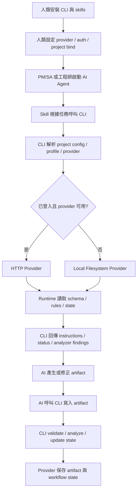

# SpecLink Provider API 與 Skill/CLI Runtime 設計

日期：2026-05-19

本文整理一個基於 OpenSpec 與 Spectra 核心思路延伸的新 SDD 規格驅動開發工具設計。本文使用 `SpecLink` 作為暫定名稱；正式名稱仍可替換。

核心定位：

```text
Skill + CLI + 可替換 Provider + 可同步狀態的 SDD Workflow Engine
```

此工具不是要複製 `spectra-cli`，而是保留並強化 Spectra 已驗證有效的核心思路：

- AI skill 只負責理解需求、產生內容、遵循流程。
- CLI 是 workflow engine，負責規則、狀態、artifact DAG、instructions、驗證、分析、打包、同步。
- Provider 負責實際儲存、遠端狀態同步、外部系統整合。
- Auth、URL、token、profile、provider 選擇都由人或 CLI 設定，不交給 AI skill 決定。
- 若沒有登入或沒有設定 provider，CLI 自動 fallback 到本機 filesystem provider。

## 設計目標

### 主要目標

1. 支援 PM、SA、工程師在不同環境使用同一套 SDD workflow。
2. 支援 AI Agent 透過 skill 呼叫 CLI，但不需要知道遠端 URL、token 或 provider 細節。
3. 支援不同開發者、公司或產品團隊自行串接自家的儲存服務、任務系統、規格平台或內部系統。
4. 支援跨平台 CLI：Windows、macOS、Linux。
5. 支援本機模式與遠端模式共用同一套指令語意。
6. 支援從 discuss、propose、pack 到 unpack、apply、finish、archive 的完整生命週期。
7. 支援固定 Provider API Contract，讓外部服務可以穩定實作。

### 非目標

1. 不要求與 `spectra-cli` 完全相容。
2. 不要求所有使用者都必須有 Web 系統。
3. 不要求遠端服務採用固定產品形態。
4. 不讓 AI skill 負責登入、設定 URL、選擇 provider 或處理 token。
5. 不讓每個 skill 直接呼叫遠端 API。

## 核心角色

| 角色 | 責任 |
| --- | --- |
| 人 | 安裝 CLI、設定 provider、登入、綁定 project、決定是否切換遠端或本機模式。 |
| AI Agent | 依照 skill 指示呼叫 CLI，產生 proposal、design、spec、tasks，或執行 apply 工作。 |
| Skill | AI 的工作流程腳本，描述什麼時候呼叫哪些 CLI 指令，以及如何解讀 CLI 回傳。 |
| CLI | SDD workflow engine，負責 artifact DAG、instructions、schema/rule resolution、analyze、validate、pack、unpack、finish、archive。 |
| Provider | CLI 的儲存與同步後端，可是本機 filesystem、HTTP API、企業內部系統、SaaS 或自訂服務。 |
| Remote Service | Provider 背後的實際服務，不是固定產品，可以由不同團隊自行實作。 |

## 核心邊界

最重要的設計邊界：

```text
Skill 不知道 URL
Skill 不知道 Token
Skill 不知道 Provider API
Skill 只知道 CLI 指令
```

也就是說，skill 只應該呼叫：

```bash
speclink discuss start --topic "訂單匯出流程"
speclink propose create --change add-order-export
speclink pack create --change add-order-export
speclink unpack add-order-export
speclink apply add-order-export
speclink finish add-order-export --summary "完成訂單匯出實作"
speclink archive add-order-export
```

skill 不應該呼叫：

```bash
speclink auth login
speclink provider add acme --base-url https://sdd.acme.internal
speclink propose create --url https://sdd.acme.internal/api
speclink propose create --token xxx
```

這些指令屬於人類設定階段，不屬於 AI workflow。

## 建議技術選型

CLI 建議使用 Rust。

理由：

- 容易發佈單一 binary。
- 適合 Windows、macOS、Linux 跨平台。
- 適合長期維護穩定 CLI contract。
- 適合處理 filesystem、HTTP、auth、SQLite、Git、壓縮包、JSON schema、TOML/YAML。
- 適合未來支援 daemon、stdio server、plugin host 或 provider SDK。

建議 crate 拆分：

```text
crates/
  cli/                 # clap command surface
  runtime/             # SDD workflow engine
  provider/            # provider trait 與資料模型
  provider-local/      # filesystem fallback provider
  provider-http/       # HTTP remote provider
  auth/                # token、profile、keychain
  analyzer/            # coverage、consistency、ambiguity、drift
  validator/           # schema、artifact、spec delta validation
  pack/                # pack/unpack format
  skill-templates/     # skill 安裝與更新
```

## 設定模型

設定分成三層：

| 層級 | 用途 | 誰設定 |
| --- | --- | --- |
| Global config | 記錄 profiles、providers、active profile | 人 |
| Project config | 記錄此 repo 綁定哪個 remote project | 人 |
| Command flags | 臨時覆蓋 provider/profile/project | 人或 CI |

AI skill 預設不應該修改這些設定。

### Global config

範例：

```toml
# ~/.config/speclink/config.toml
active_profile = "default"

[profiles.default]
provider = "acme"

[providers.acme]
type = "http"
base_url = "https://sdd.acme.internal"
auth = "device_code"
```

### Project config

範例：

```toml
# .speclink/config.toml
project = "billing-system"
provider = "acme"
remote_project_id = "proj_123"
mode = "remote"
```

### Auth storage

Token 不應該存在一般 config 檔。

建議順序：

```text
Windows Credential Manager
macOS Keychain
Linux Secret Service
加密 token file fallback
```

## Provider Resolution

CLI 每次執行時解析 provider：

```text
1. command flag 指定的 provider
2. project config 指定的 provider
3. global active profile 指定的 provider
4. environment variable 指定的 provider
5. local filesystem fallback provider
```

若找不到可用 provider，或使用者尚未登入，CLI 不應該讓 skill 失敗在 auth 流程，而是進入 local provider。

建議輸出清楚的 machine-readable warning：

```json
{
  "status": "ok",
  "mode": "local",
  "warnings": [
    {
      "code": "provider.not_authenticated",
      "message": "Remote provider is configured but not authenticated. Using local provider fallback."
    }
  ]
}
```

## Local Provider Fallback

本機 fallback 是核心能力，不是附屬功能。

建議目錄：

```text
.speclink/
  config.toml
  state.db
  cache/
  changes/
    <change-id>/
      proposal.md
      design.md
      tasks.md
      specs/
      metadata.json
  packs/
    <change-id>.slpack
  archive/
```

本機 provider 必須實作與遠端 provider 相同的 provider trait。這樣 runtime 不需要知道目前是在本機或遠端。

## AI Skill 與 CLI 分工

## Skill 設計可參考 Spectra Skills

新專案的 skill 可以直接參考目前 `spectra-cli` 產生的 Spectra skills 設計方式，尤其是：

```text
.agents/skills/spectra-discuss/SKILL.md
.agents/skills/spectra-propose/SKILL.md
.agents/skills/spectra-apply/SKILL.md
.agents/skills/spectra-ingest/SKILL.md
.agents/skills/spectra-archive/SKILL.md
```

這些 skills 已經示範了幾個重要模式：

- skill 本身是 AI 的 workflow prompt，而不是業務邏輯實作。
- skill 會要求 AI 先讀取上下文，再決定下一步。
- skill 會透過 CLI 取得 instructions、status、validation、analysis 結果。
- skill 會把 artifact 寫入、狀態更新、驗證規則交給 CLI。
- skill 會將討論、提案、實作、歸檔拆成不同階段。

但新專案不應該照搬所有 Spectra-specific coupling。需要調整的地方：

| Spectra skill 現況 | 新專案應調整為 |
| --- | --- |
| 假設 CLI 是 `spectra` | 改成新 CLI，例如 `speclink` 或正式命名後的 binary。 |
| 假設 artifacts 在 `openspec/changes/` | 改成由 CLI/provider resolution 決定儲存位置。 |
| 假設 specs 在本機 filesystem | 改成可能來自 local provider 或 remote provider。 |
| 假設 `.git/spectra-app/spectra.db` 保存部分狀態 | 改成 CLI runtime state，可由 local provider 或 remote provider 保存。 |
| skill 可能直接描述本機 Spectra layout | 改成描述 CLI contract 與 JSON output。 |
| apply/archive 偏向工程師本機流程 | 補上 `finish`，讓工程師完成 apply 後同步狀態回 provider。 |

因此新 skill 的撰寫策略是：

```text
保留 Spectra skills 的 workflow 結構
移除 Spectra CLI 與本機 openspec layout 假設
改依賴新 CLI 的穩定 command contract
改依賴 provider-backed runtime state
```

這樣可以沿用 Spectra 在 SDD workflow 上已經驗證過的設計，同時讓新工具支援本機、遠端、CI、PM/SA agent、工程師 coding agent 等不同使用情境。

### Skill 負責

- 理解使用者需求。
- 詢問問題並收斂結論。
- 根據 CLI instructions 產生 artifact 內容。
- 呼叫 CLI 寫入 artifact。
- 根據 CLI analyzer/validator 回報修正 artifact。
- 在 apply 階段修改程式碼、執行測試、回報完成狀態。

### CLI 負責

- 決定使用哪個 provider。
- 讀取 schema、rules、project config。
- 產生 artifact instructions。
- 維護 artifact DAG。
- 寫入 artifact。
- 執行 analyze、validate、drift scoring。
- 建立 pack。
- unpack 到工程師本機。
- 記錄 task done、changed files、test result、finish report。
- 呼叫 provider API 同步狀態。
- 無登入時 fallback 到本機。

### Provider 負責

- 儲存 project、change、artifact、pack、state。
- 接收 lifecycle state 更新。
- 提供遠端 rules、schema、templates。
- 接收 finish report。
- 提供 archive 能力。
- 與外部任務系統、文件系統、知識庫、CI、Git provider 整合。

## Skill 不應該知道的資訊

Skill 不應該知道：

- `base_url`
- `access_token`
- `refresh_token`
- provider name
- remote project id
- API path
- storage layout
- credential location

Skill 可以知道：

- change id
- artifact id
- task id
- CLI command
- CLI JSON output schema
- analyzer finding code
- validator error code
- lifecycle state

## 建議 CLI 指令面

### 人類設定指令

這些指令由人執行，不由 AI skill 執行。

```bash
speclink provider add acme --type http --base-url https://sdd.acme.internal
speclink provider list
speclink provider use acme

speclink auth login --provider acme
speclink auth status
speclink auth logout --provider acme

speclink project bind --provider acme --remote-project billing-system
speclink project status
```

### AI workflow 指令

這些指令可以由 skill 呼叫。

```bash
speclink discuss start --topic "<topic>" --json
speclink discuss capture --change "<change>" --stdin --json

speclink propose create --change "<change>" --summary "<summary>" --json
speclink instructions <artifact> --change "<change>" --json
speclink status --change "<change>" --json
speclink artifact write <artifact> --change "<change>" --stdin --json
speclink analyze --change "<change>" --json
speclink validate --change "<change>" --json
speclink pack create --change "<change>" --json

speclink unpack "<change-or-pack>" --json
speclink apply start --change "<change>" --json
speclink task done <task-id> --change "<change>" --json
speclink drift --change "<change>" --json
speclink finish "<change>" --summary "<summary>" --json
speclink archive "<change>" --json
```

### Interop 指令

這些只做匯入匯出，不作為核心相容層。

```bash
speclink import spectra ./openspec/changes/add-order-export
speclink export spectra add-order-export --out ./openspec/changes/add-order-export
```

## Lifecycle State Machine

建議生命週期：

```text
draft
  -> discussed
  -> proposed
  -> validated
  -> packed
  -> unpacked
  -> in_progress
  -> finished
  -> reviewing
  -> accepted
  -> archived
```

可選分支：

```text
reviewing -> changes_requested -> in_progress
reviewing -> rejected
draft -> cancelled
proposed -> parked
parked -> proposed
```

## Runtime Flow



## Provider API Contract

Provider API 應該固定，讓不同服務可以實作同一套協議。以下以 HTTP provider 為例。

### 基本規則

所有 request / response 預設使用 JSON。

建議 header：

```http
Authorization: Bearer <token>
Content-Type: application/json
Accept: application/json
SpecLink-Version: 0.1
```

所有 response 建議包含：

```json
{
  "ok": true,
  "data": {},
  "warnings": [],
  "requestId": "req_..."
}
```

錯誤 response：

```json
{
  "ok": false,
  "error": {
    "code": "change.not_found",
    "message": "Change not found.",
    "details": {}
  },
  "requestId": "req_..."
}
```

### Capability Discovery

CLI 先查 provider 能力，避免假設所有 provider 都支援完整功能。

```http
GET /v1/capabilities
```

Response：

```json
{
  "ok": true,
  "data": {
    "provider": "acme-sdd",
    "version": "1.0.0",
    "features": {
      "remoteArtifacts": true,
      "packs": true,
      "finishReports": true,
      "archive": true,
      "rules": true,
      "schemas": true,
      "locks": false
    }
  },
  "warnings": []
}
```

### Project

列出可用 projects：

```http
GET /v1/projects
```

取得 project：

```http
GET /v1/projects/{projectId}
```

綁定或確認 project 狀態：

```http
GET /v1/projects/{projectId}/status
```

### Schema / Rules / Templates

取得可用 schema：

```http
GET /v1/projects/{projectId}/schemas
```

取得指定 schema：

```http
GET /v1/projects/{projectId}/schemas/{schemaId}
```

取得 project rules：

```http
GET /v1/projects/{projectId}/rules
```

取得 artifact template：

```http
GET /v1/projects/{projectId}/templates/{artifactId}
```

這些 API 讓遠端可以管理 openspec-like 設定、規則、artifact template，而不是強制都存在本機 filesystem。

### Changes

建立 change：

```http
POST /v1/projects/{projectId}/changes
```

Request：

```json
{
  "changeId": "add-order-export",
  "summary": "新增訂單匯出流程",
  "createdBy": {
    "type": "agent",
    "name": "codex"
  },
  "schemaId": "spec-driven",
  "source": {
    "kind": "skill",
    "name": "propose"
  }
}
```

取得 change：

```http
GET /v1/projects/{projectId}/changes/{changeId}
```

列出 changes：

```http
GET /v1/projects/{projectId}/changes?state=proposed
```

更新狀態：

```http
PATCH /v1/projects/{projectId}/changes/{changeId}/state
```

Request：

```json
{
  "state": "validated",
  "reason": "All required artifacts passed validation.",
  "actor": {
    "type": "cli",
    "version": "0.1.0"
  }
}
```

### Artifact DAG / Status

取得 artifact 狀態：

```http
GET /v1/projects/{projectId}/changes/{changeId}/status
```

Response：

```json
{
  "ok": true,
  "data": {
    "changeId": "add-order-export",
    "schemaId": "spec-driven",
    "state": "proposed",
    "applyRequires": ["tasks"],
    "artifacts": [
      {
        "id": "proposal",
        "path": "proposal.md",
        "status": "done",
        "required": true,
        "dependencies": []
      },
      {
        "id": "design",
        "path": "design.md",
        "status": "ready",
        "required": false,
        "dependencies": ["proposal"]
      },
      {
        "id": "tasks",
        "path": "tasks.md",
        "status": "blocked",
        "required": true,
        "dependencies": ["proposal", "specs"]
      }
    ]
  },
  "warnings": []
}
```

### Artifact Instructions

取得 artifact instructions：

```http
GET /v1/projects/{projectId}/changes/{changeId}/instructions/{artifactId}
```

Response：

```json
{
  "ok": true,
  "data": {
    "changeId": "add-order-export",
    "artifactId": "proposal",
    "schemaId": "spec-driven",
    "locale": "zh-TW",
    "outputPath": "proposal.md",
    "dependencies": [],
    "unlocks": ["design", "specs"],
    "instruction": "Write a concise proposal that explains why the change is needed...",
    "template": "## Why\n\n...\n\n## What Changes\n\n...\n",
    "rules": [
      {
        "id": "proposal.must_include_why",
        "level": "error",
        "description": "Proposal must include a Why section."
      }
    ]
  },
  "warnings": []
}
```

CLI 可以直接從 provider 取得 instructions，也可以由本機 runtime 根據 schema 產生。建議保留兩種模式：

```text
remote-managed instructions
local-runtime-generated instructions
```

### Artifact Write / Read

寫入 artifact：

```http
PUT /v1/projects/{projectId}/changes/{changeId}/artifacts/{artifactId}
```

Request：

```json
{
  "content": "## Why\n\n...",
  "contentType": "text/markdown",
  "format": "markdown",
  "source": {
    "kind": "skill",
    "name": "propose"
  }
}
```

Response：

```json
{
  "ok": true,
  "data": {
    "artifactId": "proposal",
    "version": 3,
    "validated": true,
    "warnings": []
  },
  "warnings": []
}
```

讀取 artifact：

```http
GET /v1/projects/{projectId}/changes/{changeId}/artifacts/{artifactId}
```

### Analyze

提交或取得 analyzer 結果：

```http
POST /v1/projects/{projectId}/changes/{changeId}/analyze
```

Response：

```json
{
  "ok": true,
  "data": {
    "summary": {
      "errors": 0,
      "warnings": 2,
      "info": 1
    },
    "findings": [
      {
        "code": "ambWeakLanguage",
        "severity": "warning",
        "artifactId": "specs",
        "message": "Scenario uses weak language.",
        "location": {
          "path": "specs/auth/spec.md",
          "line": 12
        }
      }
    ]
  },
  "warnings": []
}
```

### Validate

驗證 change 是否可進入下一階段：

```http
POST /v1/projects/{projectId}/changes/{changeId}/validate
```

Response：

```json
{
  "ok": true,
  "data": {
    "valid": true,
    "errors": [],
    "warnings": []
  },
  "warnings": []
}
```

### Pack

建立 pack：

```http
POST /v1/projects/{projectId}/changes/{changeId}/pack
```

Response：

```json
{
  "ok": true,
  "data": {
    "changeId": "add-order-export",
    "packId": "pack_123",
    "state": "packed",
    "downloadUrl": "https://sdd.acme.internal/downloads/pack_123",
    "checksum": "sha256:..."
  },
  "warnings": []
}
```

CLI 可以選擇：

```text
1. 由 provider 回傳 pack bytes 或 download URL
2. 由 CLI 本機 runtime 產生 pack，再上傳 provider
```

### Unpack

工程師在本機 unpack 時，CLI 通知 provider：

```http
POST /v1/projects/{projectId}/changes/{changeId}/unpack
```

Request：

```json
{
  "workspace": {
    "repo": "git@example.com:acme/billing.git",
    "branch": "feature/add-order-export",
    "commit": "abc123"
  },
  "actor": {
    "type": "human",
    "name": "engineer@example.com"
  }
}
```

### Task Done

工程師或 AI coding agent 完成 task：

```http
POST /v1/projects/{projectId}/changes/{changeId}/tasks/{taskId}/done
```

Request：

```json
{
  "done": true,
  "summary": "完成訂單匯出 API 與前端操作串接",
  "touchedFiles": [
    "src/orders/export.ts",
    "src/pages/OrderExport.tsx"
  ],
  "tests": [
    {
      "command": "pnpm test",
      "status": "passed"
    }
  ]
}
```

### Drift

取得 drift scoring：

```http
POST /v1/projects/{projectId}/changes/{changeId}/drift
```

Request 可包含目前 workspace 狀態：

```json
{
  "git": {
    "branch": "feature/add-order-export",
    "baseCommit": "abc123",
    "headCommit": "def456"
  },
  "touchedFiles": [
    "src/orders/export.ts"
  ]
}
```

### Finish

`finish` 是這套新工具相對於 `spectra-cli` 可以強化的關鍵流程。它讓工程師在完成 apply 後，把本機實作狀態同步回遠端。

```http
POST /v1/projects/{projectId}/changes/{changeId}/finish
```

Request：

```json
{
  "summary": "完成訂單匯出流程，包含 API、前端表單與測試。",
  "result": "implemented",
  "git": {
    "repo": "git@example.com:acme/billing.git",
    "branch": "feature/add-order-export",
    "commit": "def456",
    "pullRequest": "https://github.com/acme/billing/pull/123"
  },
  "tasks": [
    {
      "id": "1",
      "done": true
    },
    {
      "id": "2",
      "done": true
    }
  ],
  "touchedFiles": [
    "src/orders/export.ts",
    "src/pages/OrderExport.tsx",
    "tests/orders/export.test.ts"
  ],
  "tests": [
    {
      "command": "pnpm test",
      "status": "passed",
      "outputSummary": "128 passed"
    }
  ],
  "notes": "需要 PM 驗收匯出欄位與檔名格式。"
}
```

Response：

```json
{
  "ok": true,
  "data": {
    "state": "reviewing",
    "finishReportId": "fin_123"
  },
  "warnings": []
}
```

### Archive

PM/SA 驗收後 archive：

```http
POST /v1/projects/{projectId}/changes/{changeId}/archive
```

Request：

```json
{
  "decision": "accepted",
  "summary": "登入流程已驗收完成。",
  "archiveSpecs": true
}
```

Response：

```json
{
  "ok": true,
  "data": {
    "state": "archived",
    "archivedAt": "2026-05-19T12:00:00Z"
  },
  "warnings": []
}
```

## CLI JSON Contract

因為 AI skill 會依賴 CLI output，所以 CLI 必須支援穩定 machine interface。

必要規則：

```text
--json
--no-color
--quiet
--stdin
stable exit codes
stable error codes
stable JSON schema
```

建議 exit codes：

| Code | 意義 |
| --- | --- |
| 0 | 成功 |
| 1 | 一般錯誤 |
| 2 | 使用者輸入錯誤 |
| 3 | validation failed |
| 4 | analyzer found blocking issues |
| 5 | provider unavailable |
| 6 | auth required but no fallback allowed |
| 7 | conflict |

預設情況下，provider unavailable 不應該直接讓 AI workflow 中斷。若允許 fallback，CLI 應轉 local provider 並輸出 warning。

## Auth UX

Auth 必須由人觸發。

建議流程：

```bash
speclink auth login --provider acme
```

可支援：

```text
device code flow
browser OAuth
personal access token
service account token for CI
```

AI skill 若遇到未登入，不應該主動登入。CLI 應做兩件事之一：

```text
1. fallback local provider
2. 回傳 provider.not_authenticated，並提示人類先執行 auth login
```

是否允許 fallback 可由人設定：

```toml
# .speclink/config.toml
fallback = "local"
```

或：

```toml
fallback = "disabled"
```

## Provider SDK / Plugin Model

Provider 可以有兩種實作方式。

### HTTP Provider

最推薦的 MVP 方式。外部系統只要實作固定 HTTP API，CLI 就能串接。

優點：

- 跨語言。
- 容易部署。
- 容易讓企業內部系統接入。
- CLI 不需要載入第三方程式碼。

### Native Provider Plugin

進階模式。讓開發者提供 native plugin 或 WASM plugin。

建議等 HTTP provider 穩定後再做。

## 安全設計

1. AI skill 不可接觸 token。
2. CLI 不應把 token 印到 stdout/stderr。
3. `--json` output 不包含 secret。
4. Provider base URL 由人設定，不由 skill 或 artifact 內容注入。
5. Pack 需包含 checksum。
6. Remote artifact 寫入應有 optimistic concurrency control。
7. Finish report 應保留 actor、timestamp、CLI version。
8. Provider API 應支援 request id，方便 audit。

## Concurrency / Conflict

遠端 provider 應支援 artifact version。

寫入 artifact 時可使用：

```http
If-Match: artifact-version-3
```

或 request body：

```json
{
  "content": "...",
  "expectedVersion": 3
}
```

若版本衝突：

```json
{
  "ok": false,
  "error": {
    "code": "artifact.version_conflict",
    "message": "Artifact was updated by another actor.",
    "details": {
      "expectedVersion": 3,
      "actualVersion": 4
    }
  }
}
```

## MVP 範圍

建議第一版只做以下能力：

1. Rust CLI。
2. Local provider。
3. HTTP provider。
4. Human-managed provider/auth/project config。
5. `discuss`、`propose`、`instructions`、`artifact write`、`status`。
6. `analyze`、`validate`。
7. `pack`、`unpack`。
8. `task done`、`finish`。
9. `archive`。
10. 固定 Provider API Markdown 規格。

暫緩：

1. Native provider plugin。
2. 完整 Web UI。
3. 多人即時協作鎖。
4. 與所有 Git provider 深度整合。
5. 與 `spectra-cli` 完全相容。

## 核心結論

這套新工具的核心不是「AI 直接操作遠端 API」，而是：

```text
AI skill 呼叫 CLI
CLI 執行 workflow engine
CLI 依人類設定選擇 provider
Provider 負責儲存與狀態同步
```

所以 Provider URL、登入、project binding 都應該由人處理。

AI 只需要知道：

```text
現在是哪個 workflow 階段
要呼叫哪個 CLI 指令
CLI 回傳了什麼 instructions/status/findings
下一步要產生或修正什麼內容
```

這樣才能保留 Spectra 的優點，同時把 workflow engine 從「工程師本機規格工具」擴展成「可由不同服務自由串接的 SDD 流程引擎」。

