# Spectra CLI 與 Skills 運作流程

日期：2026-05-19

本文整理 `spectra-cli` 如何搭配 `$spectra-*` skills 運作，並補充各 CLI 指令在流程中提供哪些 instructions、執行哪些檔案或資料庫副作用，以及何時更新 SQLite 狀態。

參考文件：

- `docs/spectra-cli-reverse-engineering.zh-TW.md`
- `docs/spectra-discuss-propose-service-split.md`

## 核心概念

Spectra 的設計可以拆成兩層：

| 層級 | 角色 |
| --- | --- |
| Skill | AI 的工作流程腳本，負責理解需求、提問、產生 artifact、修正 analyzer findings、引導使用者。 |
| `spectra-cli` | 規格工作流引擎，負責專案初始化、schema resolution、artifact DAG、instructions、artifact 寫入、validation、analysis、park/unpark/archive 與 SQLite 狀態。 |

也就是說：

- AI skill 負責「理解、生成、修正、決策」。
- `spectra-cli` 負責「規則、狀態、持久化、驗證、交接」。

## `spectra-cli` 給 AI 的幫助

`spectra-cli` 對 AI 的主要幫助如下：

| 幫助類型 | CLI 指令 | 給 AI 的資訊 |
| --- | --- | --- |
| 專案初始化 | `spectra init` | 建立 `openspec/`、`.agents/skills/`、`AGENTS.md`，讓 AI 知道可用 Spectra workflow。 |
| Change 建立 | `spectra new change` | 建立固定 change 目錄與 `.openspec.yaml` metadata。 |
| Schema resolution | `spectra schema which`、`spectra schemas` | 告訴 AI 使用哪個 workflow schema，以及 schema 來自 built-in、project 或 user。 |
| Artifact DAG | `spectra status --json` | 告訴 AI 哪些 artifact ready / blocked / done，以及 `applyRequires`。 |
| Artifact instructions | `spectra instructions <artifact> --json` | 提供 template、instruction、dependencies、outputPath、locale、rules、context。 |
| Artifact 寫入與基本驗證 | `spectra new artifact ... --stdin --json` | 寫入 proposal/spec/design/tasks，並做基本格式檢查。 |
| 一致性分析 | `spectra analyze --json` | 回報 Coverage、Consistency、Ambiguity、Gaps。 |
| 最終驗證 | `spectra validate` | 確認 change/spec 可解析且可供 apply/archive 使用。 |
| 停放與交接 | `spectra park`、`spectra unpark` | 將 active change 移入或移出 `.git/spectra-app/changes`，並更新 SQLite。 |
| 實作進度 | `spectra task done` | 修改 `tasks.md` checkbox，必要時記錄 touched files。 |
| 漂移檢查 | `spectra drift` | 回報 stale、broken anchors、maybe-done tasks、recommendation。 |
| 完成歸檔 | `spectra archive` | 將 delta specs 套用到 `openspec/specs`，並把 change 移入 archive。 |

## 主要儲存位置

```text
openspec/changes/<change-name>
openspec/specs
openspec/config.yaml
.spectra.yaml
.agents/skills
.git/spectra-app/changes/<change-name>
.git/spectra-app/spectra.db
.spectra/touched/<change>.json
```

## SQLite 狀態

`spectra-cli` 目前確認會使用 `.git/spectra-app/spectra.db` 保存部分 workflow 狀態。

實測確認的 tables：

```sql
CREATE TABLE in_progress_change (
    change_id TEXT PRIMARY KEY
)
```

```sql
CREATE TABLE parked_changes (
  change_id TEXT PRIMARY KEY,
  original_modified INTEGER,
  tasks_total INTEGER DEFAULT 0,
  tasks_done INTEGER DEFAULT 0,
  has_proposal INTEGER DEFAULT 0,
  has_tasks INTEGER DEFAULT 0,
  created_by TEXT,
  created_with TEXT
)
```

SQLite 更新時機：

| 指令 | SQLite 行為 |
| --- | --- |
| `spectra init` | 不會立即建立 `.git/spectra-app/spectra.db`。 |
| `spectra new change` | 不會立即建立 SQLite DB。 |
| `spectra in-progress add <change>` | 會建立 `.git/spectra-app/spectra.db`，並在 `in_progress_change` 寫入 `change_id`。 |
| `spectra park <change>` | 會建立或開啟 DB，並在 `parked_changes` 寫入 change metadata。 |
| `spectra unpark <change>` | 會刪除 `parked_changes` 中對應 row；不會清掉 `in_progress_change` row。 |
| `spectra task done` | 不寫 SQLite；它更新 `tasks.md`，並可能寫 `.spectra/touched/<change>.json`。 |
| `spectra archive` | 目前確認會移動 files 與套用 specs；是否寫 SQLite 尚未確認。 |

`parked_changes` 實測 row 範例：

```text
change_id:         flow-case
original_modified: 1779168903
tasks_total:       1
tasks_done:        0
has_proposal:      1
has_tasks:         1
created_by:        Probe User <probe@example.test>
created_with:      codex
```

## Skill 啟動階段

### 1. `spectra init`

目的：

- 將專案初始化為 Spectra project。
- 產生 skill files，讓 AI 可以使用 `$spectra-discuss`、`$spectra-propose`、`$spectra-apply` 等 workflow。

CLI 做的事：

```text
spectra init . --tools codex
```

產生：

```text
.spectra.yaml
AGENTS.md
.agents/skills/<skill-name>/SKILL.md
openspec/config.yaml
openspec/changes/
openspec/specs/
.gitignore
```

給 AI 的幫助：

- 透過 `AGENTS.md` 告訴 AI 何時使用哪些 `$spectra-*` skills。
- 透過 `.agents/skills/*/SKILL.md` 提供每個 skill 的具體工作流程。
- 透過 `.spectra.yaml` 提供 locale、tools、parallel task 等設定。

SQLite：

- 此階段通常不建立 `.git/spectra-app/spectra.db`。

## Discuss Skill 流程

`$spectra-discuss` 主要是「討論與收斂」，不是主要 CLI 寫入流程。

### 1. 載入詞彙與上下文

Skill 做的事：

- 嘗試讀 `openspec/LANGUAGE.md`。
- 從 topic 抽 2-5 個 keywords。
- 搜尋 source files。
- 讀最多 5 個相關檔案。

可能使用的 CLI：

```text
spectra list --json
spectra show <change-or-spec> --json
```

`spectra-cli` 給 AI 的幫助：

- `list --json` 告訴 AI 目前有哪些 active changes、parked changes 或 specs。
- `show --json` 讓 AI 讀取既有 change/spec 的 proposal、design、tasks、deltaSpecs。

SQLite：

- `list` 可能讀 `.git/spectra-app/spectra.db` 以列出 parked changes 或 in-progress 狀態。
- `show` 主要讀 filesystem artifacts，不會更新 SQLite。

### 2. 選擇 discussion mode

Skill 做的事：

- 如果找到 3 個以上相關 source files，走 assumptions mode。
- 否則走 interview mode。

CLI 角色：

- 沒有必要 CLI 寫入。
- CLI 僅提供現有 Spectra context。

### 3. 收斂結論

輸出格式：

```markdown
## Conclusion

**Decision**: ...
**Rationale**: ...
**Capture to**: proposal.md / design.md / specs/<capability>/spec.md / tasks.md / openspec/LANGUAGE.md
```

CLI 角色：

- 若只是討論，不寫 artifact。
- 若使用者要 formalize，交給 `$spectra-propose`。

SQLite：

- 不更新 SQLite。

## Propose Skill 流程

`$spectra-propose` 是 CLI-heavy workflow。它的目標是建立完整、可交接給 apply 的 Spectra change。

### 1. 需求整理與 change name 產生

Skill 做的事：

- 從使用者輸入、討論結論或 plan file 擷取需求。
- 產生 kebab-case change name。
- 判斷 change type：Feature / Bug Fix / Refactor。
- 掃描既有 specs，避免重複 capability。

可能使用：

```text
spectra list --json
spectra show <spec> --json
```

CLI 給 AI 的幫助：

- `list` 提供既有 specs/change 名稱。
- `show` 提供 spec purpose 或 change artifacts，讓 AI 判斷是否已有相關 capability。

SQLite：

- 只讀，不更新。

### 2. 建立 change

CLI：

```text
spectra new change "<name>" --agent codex --description "<summary>"
```

CLI 做的事：

- 建立 `openspec/changes/<name>/`。
- 寫入 `openspec/changes/<name>/.openspec.yaml`。
- 記錄 schema、created date、created_by、created_with 等 metadata。

給 AI 的幫助：

- 產生固定 change 目錄。
- 讓後續 `instructions`、`status`、`new artifact` 都能依 change name 找到上下文。

SQLite：

- 實測不會立即建立或更新 `.git/spectra-app/spectra.db`。

### 3. 取得 proposal instructions

CLI：

```text
spectra instructions proposal --change "<name>" --json
```

CLI 做的事：

- 解析 change 使用的 schema。
- 找到 `proposal` artifact 的 definition。
- 回傳 proposal 的 outputPath、template、instruction、dependencies、unlocks、rules、context。

給 AI 的 instruction：

```text
artifactId
outputPath
description
instruction
template
dependencies
unlocks
locale
context
rules
```

AI 如何使用：

- 用 `template` 當 markdown 結構。
- 用 `instruction` 判斷 proposal 要寫什麼。
- 用 `rules` 約束內容，但不把 rules 原文貼進 artifact。
- 根據 change type 產生 `## Why`、`## Problem` 或 `## Summary` 等 section。

SQLite：

- 不更新 SQLite。

### 4. 寫入 proposal artifact

CLI：

```text
spectra new artifact proposal --change "<name>" --stdin --json
```

CLI 做的事：

- 從 stdin 讀 proposal content。
- 驗證 proposal 至少包含 `## Why`、`## Problem` 或 `## Summary`。
- 寫入 `openspec/changes/<name>/proposal.md`。
- 回傳 JSON 結果，例如 artifact、change、path、status、validated、warnings。

給 AI 的幫助：

- CLI 會擋掉空內容或基本格式錯誤。
- AI 可根據 validation error 修正後重試。

SQLite：

- 不更新 SQLite。

### 5. 查詢 artifact DAG 狀態

CLI：

```text
spectra status --change "<name>" --json
```

CLI 做的事：

- 讀取 schema DAG。
- 檢查 change directory 中哪些 artifacts 已存在。
- 回傳 artifact 狀態：`ready`、`blocked`、`done`。
- 回傳 `applyRequires`。

給 AI 的幫助：

```json
{
  "changeName": "add-foo",
  "schemaName": "spec-driven",
  "isComplete": false,
  "applyRequires": ["tasks"],
  "artifacts": [
    {
      "id": "proposal",
      "outputPath": "proposal.md",
      "status": "done"
    }
  ]
}
```

AI 如何使用：

- 不用猜下一個 artifact。
- 只產生 `ready` 且必要的 artifact。
- 持續跑到所有 `applyRequires` 都完成。

SQLite：

- 不更新 SQLite。

### 6. 取得 specs instructions 並寫入 spec artifacts

CLI：

```text
spectra instructions specs --change "<name>" --json
spectra new artifact spec <capability> --change "<name>" --stdin --json
```

CLI 做的事：

- `instructions specs` 告訴 AI specs artifact 的格式、dependencies 與 outputPath。
- `new artifact spec` 會驗證 capability name 必須是 kebab-case。
- 寫入 `openspec/changes/<name>/specs/<capability>/spec.md`。
- 驗證 spec 必須可 parse 為 delta spec。

給 AI 的 instruction：

- 哪些 artifacts 是 dependencies。
- Spec 應放在哪裡。
- Delta spec 應使用 ADDED / MODIFIED / REMOVED / RENAMED sections。
- Requirements 應使用 SHALL / MUST 等規範語句。

AI 如何使用：

- 從 proposal 的 Capabilities 拆出 capability。
- 為每個 capability 建立一份 delta spec。
- 為 requirement 補 scenario，降低 `ambNoScenario` 或 `ambAbstractScenario`。

SQLite：

- 不更新 SQLite。

### 7. 取得 design instructions 並寫入 design artifact

CLI：

```text
spectra instructions design --change "<name>" --json
spectra new artifact design --change "<name>" --stdin --json
```

CLI 做的事：

- 回傳 design template、rules、dependencies。
- 驗證 design 至少包含 `## Context`。
- 寫入 `openspec/changes/<name>/design.md`。

給 AI 的 instruction：

- Design 要說明 context、goals/non-goals、decisions、risks/trade-offs。
- Design decision 可用 `### <Decision Heading>` 表示。

AI 注意事項：

- `analyze` 會檢查 `###` decision heading 是否出現在 tasks。
- 例如 design 有 `### FlowAdapter`，tasks 應提到 `FlowAdapter`。

SQLite：

- 不更新 SQLite。

### 8. 取得 tasks instructions 並寫入 tasks artifact

CLI：

```text
spectra instructions tasks --change "<name>" --json
spectra new artifact tasks --change "<name>" --stdin --json
```

CLI 做的事：

- 回傳 tasks template 與 dependencies。
- 驗證 tasks 至少包含 checkbox `- [ ]`。
- 寫入 `openspec/changes/<name>/tasks.md`。

給 AI 的 instruction：

- Tasks 要可執行、可驗證、可交接。
- 如果 `.spectra.yaml` 設 `parallel_tasks: true`，AI 可加入 `[P]` parallel task markers。

AI 注意事項：

- 避免只有檔案路徑沒有行為。
- 避免 line-number-coupled instructions。
- 每個 task 應能對應 requirement 或 design decision。

SQLite：

- 不更新 SQLite。

### 9. Analyze / fix loop

CLI：

```text
spectra analyze "<name>" --json
```

CLI 做的事：

- 讀 proposal、specs、design、tasks。
- 產生四個 dimensions：

```text
Coverage
Consistency
Ambiguity
Gaps
```

常見 findings：

| Finding | 意義 | AI 修正方向 |
| --- | --- | --- |
| `covMissingSpec` | Proposal 有 capability，但沒有對應 spec。 | 補 `specs/<capability>/spec.md`。 |
| `covMissingTask` | Requirement 沒有 matching task。 | 在 `tasks.md` 補 task。 |
| `ambNoScenario` | Requirement 沒有 scenario。 | 補 `#### Scenario`。 |
| `ambAbstractScenario` | Scenario 太抽象或缺 example。 | 補具體 GIVEN/WHEN/THEN 或 `##### Example`。 |
| `ambWeakLanguage` | 使用 `should` 等 weak wording。 | 改成 SHALL / SHALL NOT。 |
| `conDesignNotInTasks` | Design `###` decision heading 沒出現在 tasks。 | 在 tasks 補該 decision keyword。 |
| `gapNoMainSpec` | MODIFIED capability 沒有 main spec。 | 建立或確認 `openspec/specs/<cap>/spec.md`。 |
| `gapModifiedNotFound` | MODIFIED requirement 不在 main spec。 | 修正 requirement 名稱或 main spec。 |

給 AI 的幫助：

- 把 AI 產物從「看起來合理」拉回「結構一致」。
- 提供 location、summary、recommendation。
- AI 可迭代修 artifact。

SQLite：

- 不更新 SQLite。

### 10. Validate

CLI：

```text
spectra validate "<name>" --json
```

CLI 做的事：

- 驗證 change 與 delta specs 可解析。
- 回傳 `valid`、`errors`、`warnings`。

給 AI 的幫助：

- 作為 propose 完成前的阻塞檢查。
- Validation failure 必須修正，否則 apply/archive 可能失敗。

SQLite：

- 不更新 SQLite。

### 11. Park change

CLI：

```text
spectra park "<name>"
```

CLI 做的事：

- 將 active change 從：

```text
openspec/changes/<name>
```

移到：

```text
.git/spectra-app/changes/<name>
```

- 建立或開啟：

```text
.git/spectra-app/spectra.db
```

- 寫入 `parked_changes` row。

SQLite 更新：

```text
parked_changes.change_id
parked_changes.original_modified
parked_changes.tasks_total
parked_changes.tasks_done
parked_changes.has_proposal
parked_changes.has_tasks
parked_changes.created_by
parked_changes.created_with
```

給 AI 的幫助：

- Propose 完成後不直接進實作。
- Change 可暫存，讓工程師或後續 `$spectra-apply` 接手。

## Apply Skill 與本機實作流程

`$spectra-apply` 通常留給工程師本機執行。

### 1. Unpark

若 change 被 park，apply/ingest skill 會處理還原，或工程師手動執行：

```text
spectra unpark "<name>"
```

CLI 做的事：

- 將 `.git/spectra-app/changes/<name>` 移回 `openspec/changes/<name>`。
- 從 SQLite `parked_changes` 刪除該 change row。

SQLite：

- `parked_changes` row 被刪除。
- `in_progress_change` 不會因此自動清除。

### 2. 標記 in-progress

CLI：

```text
spectra in-progress add "<name>"
```

CLI 做的事：

- 建立或開啟 `.git/spectra-app/spectra.db`。
- 寫入 `in_progress_change(change_id)`。

SQLite：

```text
in_progress_change.change_id = <name>
```

給 AI 的幫助：

- `spectra list --json` 可顯示 change status 為 `in-progress`。
- 對 multi-step 實作流程提供目前工作中的 change marker。

### 3. 實作程式碼

Skill 做的事：

- 讀 proposal、specs、design、tasks。
- 根據 tasks 修改程式碼。
- 跑測試或驗證。

CLI 角色：

- 主要提供 context，不直接改 application code。

SQLite：

- 不更新。

### 4. 標記 task done

CLI：

```text
spectra task done <task-id> --change "<name>" --json
```

CLI 做的事：

- 讀 `openspec/changes/<name>/tasks.md`。
- 將對應 checkbox 從 `- [ ]` 改成 `- [x]`。
- 回傳 JSON：

```text
change
status
task_desc
task_id
```

Touched-file 行為：

- 若執行前 Git worktree 有 modified 或 staged files，會建立：

```text
.spectra/touched/<change>.json
```

內容包含：

```text
change
touched[].task_id
touched[].task_desc
touched[].files
```

SQLite：

- 不寫 SQLite。

給 AI 的幫助：

- 建立 task completion state。
- 將實作 touched files 與 task 對應，供後續 drift 或人工 review 使用。

### 5. Drift 檢查

CLI：

```text
spectra drift "<name>" --json
```

CLI 做的事：

- 檢查 change created age。
- 檢查 design anchors。
- 檢查 pending task 是否可能已被 later commit 解決。
- 檢查 Git commits since created。
- 回傳 `total_score`、`severity`、`primary_recommendation`。

給 AI 的幫助：

- 判斷應繼續 apply，還是先 ingest 更新 artifacts。
- 常見 recommendation：

```text
/spectra-apply <change>
/spectra-ingest <change>
```

SQLite：

- 不更新 SQLite。

### 6. Archive

CLI：

```text
spectra archive "<name>" --yes --mark-tasks-complete
```

CLI 做的事：

- 可選擇先 validate。
- 可 mark tasks complete。
- 將 delta specs 套用到 `openspec/specs`。
- 將 completed change 移到：

```text
openspec/changes/archive/<date>-<name>
```

- 建立 snapshot 以支援 unarchive。

給 AI / 工程師的幫助：

- 將 proposed spec change 變成正式 spec。
- 保留 archived change 供追蹤。

SQLite：

- 目前確認的主要副作用是 filesystem move 與 spec merge；是否更新 SQLite 尚未確認。

## 指令與 Instructions 對照表

| 指令 | 給 AI 的 instructions / 資訊 | CLI 實際做的事 | SQLite |
| --- | --- | --- | --- |
| `spectra init` | 透過產生 skill files 與 `AGENTS.md` 告訴 AI 可用 workflow。 | 建立 Spectra 專案結構。 | 不更新。 |
| `spectra list --json` | 提供 changes/specs/parked status。 | 讀 active specs/changes 與可能的 parked metadata。 | 可能讀 DB，不寫。 |
| `spectra show --json` | 提供既有 artifact/spec context。 | 讀 change 或 spec 內容。 | 不更新。 |
| `spectra new change` | 建立後續 artifact workflow 的根節點。 | 建目錄與 `.openspec.yaml`。 | 不更新。 |
| `spectra schema which` | 告訴 AI schema 來源與 precedence。 | Resolve built-in/project/user schema。 | 不更新。 |
| `spectra schemas` | 列出可用 workflow schemas。 | 查 schema registry。 | 不更新。 |
| `spectra templates` | 列出 template names。 | 查 embedded/project templates。 | 不更新。 |
| `spectra instructions` | 回傳 artifact template、instruction、dependencies、rules、context。 | 解析 schema artifact definition。 | 不更新。 |
| `spectra status` | 回傳 artifact DAG 與 `applyRequires`。 | 檢查 artifact files 是否存在。 | 不更新。 |
| `spectra new artifact` | 透過 validation error 協助 AI 修正 artifact。 | 從 stdin 寫 proposal/spec/design/tasks。 | 不更新。 |
| `spectra analyze` | 回傳 Coverage / Consistency / Ambiguity / Gaps findings。 | 分析 artifacts 一致性與缺口。 | 不更新。 |
| `spectra validate` | 回傳 final parse/validation result。 | 驗證 change/spec。 | 不更新。 |
| `spectra park` | 告訴 AI change 已停放，可交接 apply。 | 移動 change 到 `.git/spectra-app/changes`。 | 寫 `parked_changes`。 |
| `spectra unpark` | 讓 apply 可恢復 active change。 | 移回 `openspec/changes`。 | 刪除 `parked_changes` row。 |
| `spectra in-progress add` | 標記目前工作 change。 | 寫 in-progress marker。 | 寫 `in_progress_change`。 |
| `spectra task done` | 回傳 task completion JSON，建立 touched-file 對應。 | 更新 `tasks.md` checkbox，可能寫 touched JSON。 | 不更新。 |
| `spectra drift` | 回傳 stale / maybe-done / broken anchors / recommendation。 | 分析 Git 與 artifacts drift。 | 不更新。 |
| `spectra archive` | 將 change 轉成正式 spec 狀態。 | 套用 delta specs，移到 archive。 | 未確認。 |

## 完整運作流程圖

```mermaid
flowchart TD
    A["使用者提出需求或討論主題"] --> B{"選擇 skill"}

    B -->|"spectra-discuss"| C["Discuss Skill 啟動"]
    C --> C1["讀 openspec/LANGUAGE.md"]
    C1 --> C2["搜尋 source files / specs"]
    C2 --> C3["可選：spectra list --json"]
    C3 --> C4["可選：spectra show <change-or-spec> --json"]
    C4 --> C5{"脈絡足夠？"}
    C5 -->|"是"| C6["Assumptions mode：列假設、證據、風險"]
    C5 -->|"否"| C7["Interview mode：一次問一個問題"]
    C6 --> C8["收斂 Conclusion"]
    C7 --> C8
    C8 --> C9["Decision / Rationale / Capture target"]
    C9 --> D{"是否 formalize 成 change？"}

    B -->|"spectra-propose"| D
    D -->|"否"| Z["停在討論結論，不寫 SQLite"]
    D -->|"是"| E["Propose Skill 整理需求"]

    E --> E1["spectra list/show：查既有 specs 與 changes"]
    E1 --> E2["產生 kebab-case change name"]
    E2 --> F["spectra new change <name> --agent codex"]
    F --> F1["建立 openspec/changes/<name>/.openspec.yaml"]
    F1 --> F2["SQLite：不更新"]

    F2 --> G["spectra instructions proposal --json"]
    G --> G1["CLI 給 AI：template / instruction / outputPath / deps / rules"]
    G1 --> H["AI 產生 proposal.md"]
    H --> I["spectra new artifact proposal --stdin --json"]
    I --> I1["CLI 驗證 proposal section 並寫 proposal.md"]

    I1 --> J["spectra status --json"]
    J --> J1["CLI 給 AI：artifact DAG / ready / blocked / done / applyRequires"]
    J1 --> K{"下一個 ready artifact"}

    K -->|"specs"| L1["spectra instructions specs --json"]
    L1 --> L2["AI 產生 delta spec"]
    L2 --> L3["spectra new artifact spec <capability> --stdin --json"]
    L3 --> L4["CLI 驗證 capability name 與 delta spec parse"]
    L4 --> J

    K -->|"design"| M1["spectra instructions design --json"]
    M1 --> M2["AI 產生 design.md"]
    M2 --> M3["spectra new artifact design --stdin --json"]
    M3 --> M4["CLI 驗證 ## Context 並寫 design.md"]
    M4 --> J

    K -->|"tasks"| N1["spectra instructions tasks --json"]
    N1 --> N2["AI 產生 tasks.md"]
    N2 --> N3["spectra new artifact tasks --stdin --json"]
    N3 --> N4["CLI 驗證 checkbox 並寫 tasks.md"]
    N4 --> J

    K -->|"applyRequires 完成"| O["spectra analyze <name> --json"]
    O --> O1["CLI 回傳 Coverage / Consistency / Ambiguity / Gaps"]
    O1 --> P{"有 Critical 或 Warning？"}
    P -->|"有"| Q["AI 修正 artifacts"]
    Q --> O
    P -->|"無或達修正上限"| R["spectra validate <name> --json"]

    R --> R1{"Validation 通過？"}
    R1 -->|"否"| Q
    R1 -->|"是"| S["spectra park <name>"]
    S --> S1["移動 openspec/changes/<name> 到 .git/spectra-app/changes/<name>"]
    S1 --> S2["SQLite：寫 parked_changes row"]
    S2 --> T["Propose 結束，等待工程師本機 apply"]

    T --> U["工程師執行 spectra-apply"]
    U --> U1["必要時 spectra unpark <name>"]
    U1 --> U2["SQLite：刪除 parked_changes row"]
    U2 --> U3["spectra in-progress add <name>"]
    U3 --> U4["SQLite：寫 in_progress_change row"]

    U4 --> V["AI / 工程師讀 proposal/spec/design/tasks 並實作程式碼"]
    V --> W["spectra task done <task-id> --change <name>"]
    W --> W1["更新 tasks.md checkbox"]
    W1 --> W2{"Git worktree 有 modified/staged files？"}
    W2 -->|"是"| W3["寫 .spectra/touched/<change>.json"]
    W2 -->|"否"| W4["不寫 touched metadata"]
    W3 --> X["spectra drift <name> --json"]
    W4 --> X

    X --> X1["CLI 回傳 time score / broken anchors / maybe-done / recommendation"]
    X1 --> Y{"實作完成？"}
    Y -->|"否"| V
    Y -->|"是"| AA["spectra archive <name>"]
    AA --> AA1["套用 delta specs 到 openspec/specs"]
    AA1 --> AA2["移動 change 到 openspec/changes/archive/<date>-<name>"]
    AA2 --> AA3["SQLite：是否更新尚未確認"]
```



## 重點結論

1. `spectra-cli` 是 workflow state machine，不只是檔案產生器。
2. Skills 透過 `instructions` 知道每個 artifact 要怎麼寫。
3. Skills 透過 `status` 知道 artifact DAG 與下一步。
4. Skills 透過 `analyze` 得到 AI 產物品質回饋。
5. Skills 透過 `validate` 確認 artifacts 可被 apply/archive 使用。
6. `park`、`unpark`、`in-progress add` 是目前確認會觸及 SQLite workflow state 的主要指令。
7. `task done` 不寫 SQLite，但會更新 `tasks.md`，並在 Git worktree 有修改時寫 touched-file JSON。
8. `archive` 是 change lifecycle 的完成點，將 delta specs 合併進正式 specs。

