# Spectra CLI 反組譯與功能分析（凍結、歷史參考）

> **狀態**：凍結（2026-05-21 整合）。本文於 2026-05-19 ~ 2026-05-20 整理，作為 SpecLink 設計初期的參考資料。
>
> SpecLink 自 2026-05-20 clean slate 重設計後已脫離「對齊 spectra-cli」原則，本文不再持續維護，僅供：
>
> - 理解 Spectra CLI 的設計取捨（對照 SpecLink 設計差異時的參考）
> - 反組譯方法與 SQLite / config 細節的歷史紀錄
> - 未來如需研究類似 SDD CLI 時的 starting point
>
> **重要提醒**：本文反映 spectra.exe 2.3.1 (Windows x64) 的觀察結果。SpecLink 設計**不對齊** spectra；任何 spectra 行為跟 `speclink-design.md` 衝突時、以 design.md 為準。任何提到「新工具」/「新 CLI」/「新專案」均指 SpecLink，部分早期內容可能引用已棄用名稱（如 `speclink-provider-api-and-runtime-design.md`、`pack/unpack`、`spec_dir` 等）— 為保留原始分析證據，文字未改寫。

---

## 目錄

本文由原先 4 份 Spectra 分析文件合併（2026-05-21）：

| Part | 原文件 | 主題 |
|---|---|---|
| Part 1 | `spectra-cli-reverse-engineering.zh-TW.md`（2026-05-19）| Binary metadata、command surface 反組譯、SQLite 結構 |
| Part 2 | `spectra-cli-skill-runtime-flow.md`（2026-05-19）| Skill 流程 + CLI 副作用 + 流程圖 |
| Part 3 | `spectra-config-read-flow.md`（2026-05-20）| `.spectra.yaml` + `config.yaml` + 全域 config 三層讀取流程 |
| Part 4 | `spectra-cli-uncovered-subsystems.md`（2026-05-20）| worktree / documents / SQLite 完整表 / CLI 邊界 4 個子系統補強 |

各 Part 內部可能交叉引用其他 Part 的內容（合併前是獨立文件）— 出現「見 `docs/spectra-...`」字樣即指本文其他 Part。

---

## Part 1: Spectra CLI 反向工程筆記

> 來源：`spectra-cli-reverse-engineering.zh-TW.md`（2026-05-19）


目標執行檔：

```text
C:\Users\momoc\AppData\Local\Spectra\spectra.exe
```

本文記錄目前針對 `spectra.exe` 的靜態反向工程筆記。分析範圍限於指令行為、檔案系統副作用、二進位 metadata、PE 結構、字串交叉參照，以及本機測試觀察。不包含繞過授權、修補執行檔、擷取秘密資訊，或修改二進位檔。

## 範圍

目標是理解 Spectra CLI 各指令內部做了什麼，特別是本機 skills 會用到的工作流程指令：

- `spectra init`
- `spectra new change`
- `spectra new artifact`
- `spectra status`
- `spectra instructions`
- `spectra validate`
- `spectra analyze`
- `spectra park`
- `spectra unpark`
- `spectra task done`
- `spectra archive`
- `spectra drift`
- `spectra config`
- `spectra schema`
- `spectra list`
- `spectra show`

下列發現混合兩種證據：

- **實測行為**：在臨時專案中執行 CLI 驗證。
- **靜態推論**：從 PE metadata、字串、原始碼路徑參照、`.pdata` 函式範圍與本機 x64 反組譯推得。

## 二進位 Metadata

觀察到的 metadata：

```text
File:      C:\Users\momoc\AppData\Local\Spectra\spectra.exe
Size:      8,351,232 bytes
SHA256:    6e0a525ae4605fe5199aadfa623ffea7413e0a441faee207eac2917ef5d7f1e2
Version:   spectra 2.3.1 (x64)
Format:    PE32+ / x86-64
Subsystem: Windows console
Entry VA:  0x1405d3510
PDB ref:   spectra.pdb
```

PE sections：

```text
.text
.rdata
.data
.pdata
.tls
.reloc
```

此二進位看起來是 Rust release binary。它包含 Rust runtime 字串、panic 字串、Cargo registry 路徑與專案原始碼路徑。CLI parser 是 `clap_builder-4.6.0`。

從字串與 imports 推得的主要 crates / libraries：

```text
clap
clap_complete
serde_json
serde_yaml
regex
chrono
git2
libgit2
rusqlite
libsqlite3-sys
colored
```

Windows imports 包含檔案系統、process、networking、cryptography、WinHTTP 與 shell API。這與一個會使用檔案系統、git、SQLite，以及可選 network-capable dependencies 的 Rust CLI 相符。

## 分析方法

使用的工具與技術：

- `spectra --help` 與子指令 `--help`
- `%TEMP%` 下的臨時專案 probes
- `Get-Command`、`Get-FileHash`、`Format-Hex`
- 使用 `pefile` 做 Python PE parsing
- 使用 `capstone` 做 x64 disassembly
- ASCII 字串擷取
- 解析 `.pdata` exception directory 以還原函式範圍
- RIP-relative string reference scanning
- 從臨時 probe 資料檢查 SQLite schema

臨時 Python dependencies 安裝於 repository 外：

```text
C:\Users\momoc\AppData\Local\Temp\spectra-re-python
```

## 驗證回合：2026-05-19

第二輪可信度驗證是在乾淨的臨時專案中執行：

```text
C:\Users\momoc\AppData\Local\Temp\spectra-credibility-83f736bea80740ffb0ef805725868b8d
```

此 probe 重新執行核心指令，並將觀察到的副作用與本文的靜態發現比對。

已驗證的指令結果：

| 區域 | 驗證結果 |
| --- | --- |
| Binary identity | `spectra --version` 回傳 `spectra 2.3.1 (x64)`，與 binary metadata 區段一致。 |
| `init` | 建立 `openspec/`、`.spectra.yaml`、`AGENTS.md`、`.agents/skills` 與 Codex skill files。 |
| `new change` | 建立 `openspec/changes/verify-cli/.openspec.yaml`，其中包含 `schema`、`created`、`created_by`、`created_with`。 |
| `new artifact` failure paths | 重現 invalid artifact type、missing spec capability、invalid kebab-case capability、empty stdin、invalid proposal errors。 |
| `new artifact` success paths | 建立 `proposal.md`、`design.md`、`tasks.md` 與 `specs/verify-cli/spec.md`；JSON output 包含 `artifact`、`change`、`path`、`status`、`validated`、`warnings`。 |
| `status` | 確認初始 DAG（`proposal` ready；`design`、`specs`、`tasks` blocked）以及 artifacts 建立完成後的完整 DAG。 |
| `validate` | 確認 JSON shape 包含 `change`、`errors`、`valid`、`warnings`。 |
| `analyze` | 確認 dimensions 為 `Coverage`、`Consistency`、`Ambiguity`、`Gaps`；觀察到缺少具體 examples 的 scenario 會產生 `ambAbstractScenario` suggestion。 |
| `task done` | 確認 task checkbox 由 `- [ ]` 變成 `- [x]`，JSON output 包含 `change`、`status`、`task_desc`、`task_id`。 |
| `park` | 確認 active change 從 `openspec/changes/<name>` 移除，並儲存在 `.git/spectra-app/changes/<name>`。 |
| `unpark` | 確認恢復到 `openspec/changes/<name>`，並從 `.git/spectra-app/changes/<name>` 移除。 |
| SQLite | 確認 `parked_changes` table schema，且 unpark 會清掉該 table 的 rows。 |
| `show` | 確認 JSON shape 包含 `created`、`deltaSpecs`、`design`、`name`、`proposal`、`schema`、`tasks`。 |
| `instructions` | 確認 proposal instruction JSON shape 包含 `changeName`、`artifactId`、`schemaName`、`changeDir`、`outputPath`、`description`、`instruction`、`locale`、`template`、`dependencies`、`unlocks`。 |
| `schemas` / `templates` / `schema which` | 確認 built-in `spec-driven` schema 與 embedded template metadata。 |
| `search` | 在此 Windows x64 build 上確認 `{"error":"vector_not_compiled","results":[]}`。 |
| `archive` | 確認 archive directory 會建立於 `openspec/changes/archive/2026-05-19-verify-cli`，spec 會套用到 `openspec/specs/verify-cli/spec.md`，並輸出 `Specs applied`。 |

此回合的修正，後續又由深度 probe pass 進一步細化：

- 先前 `task done` 區段對 `.spectra/touched.json` 描述過強。簡單 probe 沒有建立 `.spectra/touched.json` 或 `.spectra/touched/<change>.json`，因此第一輪可信度 pass 先將 touched tracking 降級。後續 deep probe 找到缺少的條件：Git worktree 已經有 modified 或 staged files 時，才會建立 touched metadata。

## 深度 Probe 回合：2026-05-19

額外的 targeted probes 執行於以下臨時專案：

```text
C:\Users\momoc\AppData\Local\Temp\spectra-deep-probes-qrfh55lk
C:\Users\momoc\AppData\Local\Temp\spectra-targeted-probes-nrjdyosz
C:\Users\momoc\AppData\Local\Temp\spectra-anchor-probes-6w1crqmc
```

新驗證的發現：

| 區域 | 結果 |
| --- | --- |
| `analyze` | 使用合法 delta specs 時，確認 clean output、missing spec、missing task、weak-language findings。 |
| `analyze` JSON | 確認這些 probes 中不會輸出 aggregate score；它輸出 `change_id`、`dimensions`、`findings`、`artifacts_analyzed`、`artifacts_missing`。 |
| `drift` time score | 確認 time scores：`fresh (0d)` = 0、`aging (8d/15d)` = 1、`stale (31d)` = 2、`abandoned (91d)` = 4。 |
| `drift` severity | `total_score: 4` 產生 `severity: medium` 且 recommendation 為 `/spectra-ingest <change>`；scores 0-2 維持 `light` 且 recommendation 為 `/spectra-apply <change>`。 |
| `drift` environment | Git commits since creation 會出現在 Environment dimension，但觀察到的 JSON 中 `contributes_to_total` 是 `false`。 |
| `drift` structure | 移除 `design.md` 會讓 Structure status 變成 `design absent`；移除 `tasks.md` 會讓 Tasks status 變成 `no tasks.md`。這些在 probes 中沒有加到 total score。 |
| `schema which` | Built-in `spec-driven` resolves to `(embedded in binary)`；project custom schemas resolves from `openspec/schemas/<name>/schema.yaml`。 |
| `schema validate` | Custom artifact entry 缺少 `generates` 時 validation failed，錯誤為 `artifacts[0]: missing field generates`。 |
| `schema fork` | `schema fork spec-driven forked-flow` 會建立 `openspec/schemas/forked-flow/schema.yaml`，之後 `schema which forked-flow` resolves to `project`。 |
| `task done` touched tracking | 當 Git worktree 在執行 `task done` 前已有 modified 或 staged files 時，確認會建立 `.spectra/touched/<change>.json`。 |
| `task done` touched conditions | 非 Git project 或乾淨 Git worktree（只有 command 本身 mutation `tasks.md`）不會建立 touched file。 |

此回合後仍未解的細節，後續會在下面重新檢驗：

- `conDesignNotInTasks` 存在於 embedded strings，但簡單的 valid design/task mismatch 沒有觸發。Trigger 看起來比「任何 design decision 沒出現在 tasks」更窄。
- `drift` broken-anchor scoring 在刪除 proposal/spec/task files 後沒有觸發。「anchors」看起來是 internal design anchors 或 parsed references，而不只是 required artifact files。
- 即使存在 touched-file tracking 與後續 external commits，`drift` 的 task-blocked 與 maybe-resolved arrays 仍為空。其 trigger 可能依賴更特定的 task/file/reference patterns。
- User-level schema resolution 仍由字串推論；built-in 與 project resolution 已動態驗證。

## 不明分支解析回合：2026-05-19

剩餘不明區域用另一組 targeted projects 測試：

```text
C:\Users\momoc\AppData\Local\Temp\spectra-unclear-probes-vzx22s4b
C:\Users\momoc\AppData\Local\Temp\spectra-more-unclear-r69boman
C:\Users\momoc\AppData\Local\Temp\spectra-covdelta-75b0elgl
C:\Users\momoc\AppData\Local\Temp\spectra-gap-probes-5vu289ec
```

新解析的發現：

| 區域 | 結果 |
| --- | --- |
| `conDesignNotInTasks` | 由 `design.md` 中 decisions 下的 `###` headings 觸發。Heading text 會轉小寫並在 `tasks.md` 中搜尋。缺少 headings 會產生 `CON-1` / `conDesignNotInTasks`。 |
| `ambNoScenario` | 沒有任何 `#### Scenario` 的 requirement 會產生 Ambiguity `Warning`，key 為 `ambNoScenario`。 |
| `gapNoMainSpec` | 對沒有 `openspec/specs/<cap>/spec.md` 的 capability 使用 `MODIFIED` delta，會產生 Gaps `Warning`。 |
| `gapModifiedNotFound` | `MODIFIED` requirement 的 name 不存在於 main spec 時，會產生 Gaps `Warning`。 |
| `tasks_maybe_resolved` | Pending tasks 的 verb/target words 若與較晚 Git commit subject 匹配，會標成 maybe-done，例如 task `Update login cache` 與 commit `Update login cache handling`。 |
| `broken_anchors` | Design reference 指向缺失的 CLI flag，例如 `` `--probe-mode` ``，會產生 broken anchor，category 為 `CliFlag`，reason 為 `not in --help`。 |
| Drift structure score | 一個 broken CLI flag anchor 會讓 Structure score +3。加上 Time score 1 後，total score 變成 4，severity 為 `medium`。 |
| User schema path | 真實 user schema 位於 `%APPDATA%\openspec\schemas\<name>\schema.yaml` 時 resolves as source `user`。其他測試位置不會 resolve。 |
| Schema precedence | 同名 project schema resolves as `project`，會覆蓋 user-level schema。 |
| `in-progress` | 此 build 只暴露 `in-progress add <name>`；`list`、`remove`、`clear` 不是 CLI subcommands。 |
| `demo` | 此 build 的 `spectra demo` 沒有 `--json` option。 |

擴充 probes 後仍未解：

- `tasks_blocked_external` 仍未觸發。測試變體包含 backticked paths、plain paths、Windows-style paths、path-only tasks，以及後續 commits 修改 referenced file。全部都產生 `0 blocked`。Embedded documentation 說它用於「pending tasks whose referenced files were modified by commits outside the change dir」，但實際 parser/condition 比這些 probes 更窄。
- File-path、symbol、function anchors 會被算入 denominator，但在簡單 missing-reference probes 中沒有變成 broken。CLI flag anchors 已驗證；其他 anchor categories 仍部分未解。
- `covDeltaValidation` 仍只在 embedded strings 中觀察到，尚未直接動態觀察。Malformed specs 不是被 analyzer coverage 當成 missing usable specs，就是由 `validate` 顯示；tested malformed cases 中 analyzer 沒有輸出該 key。

## Source Path References

Binary 包含 source path strings，可將主要功能對回 Rust modules：

```text
crates/spectra-cli/src/commands/demo.rs
crates/spectra-cli/src/commands/list.rs
crates/spectra-cli/src/commands/new_artifact.rs
crates/spectra-cli/src/commands/park.rs
crates/spectra-cli/src/commands/schema_mgmt.rs
crates/spectra-cli/src/commands/schemas.rs
crates/spectra-cli/src/commands/show.rs
crates/spectra-cli/src/commands/validate.rs

crates/spectra-core/src/analyzer.rs
crates/spectra-core/src/archive.rs
crates/spectra-core/src/change.rs
crates/spectra-core/src/db/connection.rs
crates/spectra-core/src/db/schema.rs
crates/spectra-core/src/delta_parser.rs
crates/spectra-core/src/drift.rs
crates/spectra-core/src/init.rs
crates/spectra-core/src/park.rs
crates/spectra-core/src/preflight.rs
crates/spectra-core/src/spectra_config.rs
crates/spectra-core/src/task_parser.rs
crates/spectra-core/src/templates/skills_templates.rs
crates/spectra-core/src/trace_parser.rs
```

這些路徑不代表 source 目前存在於本機；它們是 build 中 embedded strings。

## 函式候選

以下 virtual address ranges 由 `.pdata` 與 string cross-references 識別。名稱是推論 label，不是 debug symbols。

```text
new artifact wrapper       0x140051100 - 0x1400527f4
new artifact core          0x140114b00 - 0x140115e64
artifact validation core   0x1401174f0 - 0x140119614
park/list storage path     0x14003ea20 - 0x140040876
park command               0x140042580 - 0x140042d50
unpark command             0x140041670 - 0x140042063
park core                  0x140169ed0 - 0x14016ade6
validate command           0x14006a680 - 0x14006c6d7
instructions command       0x14004c3f0 - 0x14004e69b
task done command          0x14005d600 - 0x1400603ce
archive command wrapper    0x140037220 - 0x1400388a8
archive core               0x140144c20 - 0x14014781d
show command               0x140066c60 - 0x14006917f
schemas command            0x140086380 - 0x140087c97
schema management command  0x140045960 - 0x140049d77
init command wrapper       0x14005cac0 - 0x14005d159
init core                  0x140331590 - 0x140331c8d
update command             0x140075960 - 0x1400761c1
config command             0x1400582b0 - 0x14005991a
config core                0x1405d65c0 - 0x1405d8446
analyzer main              0x14012f9f0 - 0x1401367de
analyzer JSON summary      0x140140dd0 - 0x14014138d
drift command/display      0x140053340 - 0x1400567a5
drift JSON/serde helpers   0x140140040 - 0x1401415a0
db connection/migration    0x140161190 - 0x140163c97
preflight helper           0x14011a850 - 0x14011aaf1
```

後續 pass 的 focused static xref checks：

- `conDesignNotInTasks.summary` 與 `Verify tasks cover this design decision` 都 cross-reference analyzer function range `0x14012f9f0 - 0x1401367de`。
- `broken_anchors`、`tasks_maybe_resolved`、`tasks_blocked_external` cross-reference `0x140140040 - 0x1401415a0` 附近的 JSON/serde helper ranges。
- Schema resolution strings `project`、`openspec/schemas`、`user`、`(embedded in binary)`、`built-in` cross-reference `schema management command 0x140045960 - 0x140049d77`。

## Command Surface

Top-level help 暴露以下 commands：

```text
init
update
list
show
validate
analyze
drift
archive
status
instructions
new
schemas
templates
feedback
schema
config
search
completion
park
unpark
task
in-progress
demo
help
```

透過 `spectra schemas --json` 觀察到的 default workflow schema：

```json
[
  {
    "name": "spec-driven",
    "description": "Default OpenSpec workflow - proposal -> specs -> design -> tasks",
    "artifacts": ["proposal", "specs", "design", "tasks"],
    "source": "package"
  }
]
```

`spectra schema which --json --all` 回報此 schema 是 built in：

```json
{
  "name": "spec-driven",
  "resolved": "built-in",
  "sources": [
    {
      "path": "(embedded in binary)",
      "source": "built-in"
    }
  ]
}
```

## `spectra init`

在臨時專案中觀察到的行為：

- 建立 `.spectra.yaml`
- 建立 `AGENTS.md`
- 建立 `.agents/skills/<skill-name>/SKILL.md`
- 建立 `openspec/config.yaml`
- 建立 `openspec/changes/`
- 建立 `openspec/specs/`
- 建立或更新 `.gitignore`

相關字串：

```text
Already initialized. Use --force to reinitialize.
Initialized at
<!-- SPECTRA:START
<!-- SPECTRA:END -->
```

靜態推論：

- init command 使用 embedded templates。
- Core config generator 位於 `crates/spectra-core/src/spectra_config.rs`。
- Default `.spectra.yaml` content embedded in binary。

Binary 內 embedded 的重要 config keys：

```text
spec_dir
locale
tdd
audit
parallel_tasks
claude_slash_commands
worktree
worktrees_dir
claude_effort
tools
```

## `spectra update`

靜態推論：

- 更新 configured tools 的 generated instruction files。
- 使用與 init 相同的 tool mapping。
- Recognized tool targets 包含：

```text
claude
cursor
windsurf
cline
gemini
github-copilot
kiro
roocode
continue
opencode
codebuddy
costrict
cospec
antigravity
auggie
amazon-q
kilocode
factory
iflow
qoder
qwen
codex
crush
trae
```

相關字串：

```text
Updated instruction files for:
No AI tool configurations found. Use 'spectra init --tools' to set up.
```

## `spectra new change`

觀察到的行為：

- 建立 `openspec/changes/<name>/`
- 寫入 `openspec/changes/<name>/.openspec.yaml`
- 儲存 schema 與 agent metadata。

從 probe change 觀察到的 `.openspec.yaml` metadata footprint 很小，包含 created time 與 schema/agent fields。

靜態推論：

- `new change` 會驗證或預期 kebab-case names。
- 可接受 `--description`、`--schema`、`--agent`。
- 若 change 已存在，會報錯而不是 overwrite。

## `spectra new artifact`

這是目前 reverse-engineered path 最清楚的 command。

相關函式：

```text
new artifact wrapper       0x140051100 - 0x1400527f4
new artifact core          0x140114b00 - 0x140115e64
artifact validation core   0x1401174f0 - 0x140119614
```

觀察到的行為：

- `proposal` 寫入 `proposal.md`
- `design` 寫入 `design.md`
- `tasks` 寫入 `tasks.md`
- `spec <capability>` 寫入 `specs/<capability>/spec.md`
- `--stdin` 從 standard input 讀 artifact content。
- `--force` 覆寫既有 artifacts。
- `--json` 回傳 created artifact path 與 validation status。

靜態推論：

1. 解析 active change，或使用 `--change`。
2. 驗證 artifact type。
3. 對 `spec` 要求 capability name。
4. 驗證 spec capability name 必須是 kebab-case。
5. 依 artifact type 決定 output path。
6. 如果 artifact 已存在且未設定 `--force`，拒絕。
7. 若設定 `--stdin`，讀取 stdin。
8. 拒絕空 stdin content。
9. 執行 artifact content validation。
10. 寫入 artifact file。
11. 回傳 JSON 或 human-readable status。

相關 validation strings：

```text
Unknown artifact type ''. Valid types: proposal, design, tasks, spec
Capability name is required for spec type. Usage: spectra new artifact spec <capability> --change <name>
Invalid capability name ''. Must be kebab-case (e.g., user-auth, data-export)
No content received from stdin
Artifact already exists: . Use --force to overwrite
```

由字串推論的 minimum content validation：

```text
proposal -> must contain ## Why, ## Problem, or ## Summary
design   -> must contain ## Context
tasks    -> must contain at least one checkbox (- [ ])
spec     -> must parse as a delta spec
```

相關字串：

```text
Proposal must contain a ## Why, ## Problem, or ## Summary section
Design must contain a ## Context section
Tasks must contain at least one checkbox (- [ ])
Delta spec parse error:
Delta spec validation failed:
Content validated
```

## `spectra status`

觀察到的行為：

只有 `.openspec.yaml` 的 change，`spectra status --change <name> --json` 回傳：

```json
{
  "changeName": "inspect-cli",
  "schemaName": "spec-driven",
  "isComplete": false,
  "applyRequires": ["tasks"],
  "artifacts": [
    {"id": "proposal", "outputPath": "proposal.md", "status": "ready"},
    {"id": "design", "outputPath": "design.md", "status": "blocked", "missingDeps": ["proposal"]},
    {"id": "specs", "outputPath": "specs/**/*.md", "status": "blocked", "missingDeps": ["proposal"]},
    {"id": "tasks", "outputPath": "tasks.md", "status": "blocked", "missingDeps": ["specs"]}
  ]
}
```

建立 proposal、spec、design、tasks 後，status 顯示：

```text
isComplete: true
proposal: done
design: done
specs: done
tasks: done
```

靜態推論：

- Status 評估 schema DAG。
- 它回報 ready、blocked、done 與 missing dependency states。
- `applyRequires` 控制何時 change 可以進入 apply。

## `spectra instructions`

相關函式：

```text
instructions command       0x14004c3f0 - 0x14004e69b
```

靜態推論：

- 解析 schema 與 artifact。
- 回傳 artifact-specific instructions。
- 支援 `--skill <name>`。
- 可輸出 JSON 或 human-readable text。

字串中出現的相關 output fields：

```text
Artifact
Output
Description
Instruction
Dependencies
Unlocks
Template
ChangeState
Progress
Schema
```

相關 JSON field strings：

```text
changeName
changeDir
schemaName
contextFiles
progress
tasks
state
missingArtifacts
locale
instruction
worktreePath
preflight
artifactId
outputPath
description
context
rules
template
dependencies
unlocks
total
complete
remaining
```

相關錯誤字串：

```text
Unknown skill:
```

## `spectra validate`

相關函式：

```text
validate command           0x14006a680 - 0x14006c6d7
artifact validation core   0x1401174f0 - 0x140119614
```

觀察到的行為：

- `spectra validate <change> --json` 回傳 validation results array。
- 有效測試 change 回傳：

```json
[
  {
    "change": "inspect-cli",
    "valid": true,
    "errors": [],
    "warnings": []
  }
]
```

靜態推論：

- 驗證 changes 或 specs。
- 讀取 delta specs。
- 產生 `valid`、`errors`、`warnings`。
- 處理 no-delta-spec cases。

相關字串：

```text
Validation failed
No delta specs found
errors
warnings
valid
Delta spec validation failed:
```

## `spectra analyze`

相關函式：

```text
analyzer main              0x14012f9f0 - 0x1401367de
analyzer JSON summary      0x140140dd0 - 0x14014138d
```

觀察到的行為：

對 minimal test change，analyzer 回傳一個 warning：

```json
{
  "dimension": "Coverage",
  "severity": "Warning",
  "summary": "Requirement 'CLI probe artifact' has no matching task",
  "recommendation": "Add a task in tasks.md that references 'CLI probe artifact'"
}
```

Targeted valid-spec probes 產生以下 findings：

| Probe | `validate` | `analyze` result |
| --- | --- | --- |
| Clean proposal/spec/design/tasks | valid | 四個 dimensions 全部 clean。 |
| Proposal names capability but no spec exists | valid with warning `No delta specs found` | Coverage `Critical`: `Capability <name> has no corresponding spec file`. |
| Requirement text not referenced by any task | valid | Coverage `Warning`: `Requirement '<name>' has no matching task`. |
| Requirement contains `should` | valid | Ambiguity `Suggestion`: `Vague language 'should' found`. |
| Concrete scenario without `##### Example` | valid | 在 targeted probe 中為 clean。 |
| Abstract scenario without concrete examples | 不依賴 validation 的 rough probe | Ambiguity `Suggestion`: `Scenario '<name>' has no concrete examples`. |
| Requirement without `#### Scenario` | valid | Ambiguity `Warning`: `Requirement '<name>' has no scenarios`. |
| `###` design decision heading absent from tasks | valid | Consistency `Warning`: `Design topic '<keyword>' not referenced in tasks`. |
| `MODIFIED` capability without main spec | valid | Gaps `Warning`: `MODIFIED requirements reference capability '<cap>' but no main spec found`. |
| `MODIFIED` requirement absent from main spec | valid | Gaps `Warning`: `MODIFIED requirement '<name>' not found in main spec`. |

重要邊界：

- `analyze` 比 `validate` 寬鬆；早期 rough probe 中 invalidly indented delta specs 仍產生 analyzer findings，但 `validate` 會拒絕相同 specs。
- `conDesignNotInTasks` 不會因任意 prose mismatch 觸發。它由 `###` decision headings 觸發，並檢查 normalized heading keyword 是否出現在 `tasks.md`。
- `covDeltaValidation` 仍未被動態觀察到。目前測試過的 invalid delta files 不是被 analyzer coverage 視為沒有 usable delta spec，就是由 `validate` 回報。

靜態推論：

Analyzer dimensions：

```text
Coverage
Consistency
Ambiguity
Gaps
```

從 embedded message keys 推得的 finding categories：

```text
covMissingSpec
covMissingTask
covDeltaValidation
ambNoScenario
ambAbstractScenario
ambWeakLanguage
conDesignNotInTasks
gapNoMainSpec
gapModifiedNotFound
```

已動態確認的 finding keys 或 summaries：

```text
covMissingSpec
covMissingTask
ambNoScenario
ambAbstractScenario
ambWeakLanguage
conDesignNotInTasks
gapNoMainSpec
gapModifiedNotFound
```

從字串推論的檢查：

- Proposal capabilities 應有 matching specs。
- Requirements 應有 matching tasks。
- Delta specs 必須能 parse 並 validate。
- Scenarios 應有 concrete examples。
- Abstract scenario language 會被標記。
- Weak wording 會被標記。
- Design decisions 應由 tasks 覆蓋。
- Placeholder tokens 會被標記。

Analyzer strings 中 embedded 的 weak 或 placeholder terms：

```text
should
may
might
consider
possibly
TBD
TODO
???
TKTK
```

從字串推論的 Analyzer JSON fields：

```text
change_id
dimensions
findings
artifacts_analyzed
artifacts_missing
dimension
status
finding_count
severity
location
summary
recommendation
summary_msg
recommendation_msg
```

在測試案例中，觀察到的 JSON 不包含 total score 或 aggregate pass/fail field。

## `spectra drift`

相關函式候選：

```text
drift command/display      0x140053340 - 0x1400567a5
drift core helper          0x1405da860 - 0x1405db6cf
```

靜態推論：

Drift 使用 git commands 或 libgit2-backed data，檢查 change 是否 stale 或受到 external changes 影響。

觀察到的 JSON shape：

```text
change_id
created
last_commit
dimensions
broken_anchors
tasks_maybe_resolved
tasks_blocked_external
commits_since_created
total_score
severity
primary_recommendation
```

觀察到的 dimensions：

```text
Time
Structure
Tasks
Environment
```

觀察到的 time scoring：

| Created age | Time status | Time score | Total score | Severity | Recommendation |
| --- | --- | ---: | ---: | --- | --- |
| 0 days | `fresh (0d)` | 0 | 0 | `light` | `/spectra-apply <change>` |
| 8 days | `aging (8d)` | 1 | 1 | `light` | `/spectra-apply <change>` |
| 15 days | `aging (15d)` | 1 | 1 | `light` | `/spectra-apply <change>` |
| 31 days | `stale (31d)` | 2 | 2 | `light` | `/spectra-apply <change>` |
| 91 days | `abandoned (91d)` | 4 | 4 | `medium` | `/spectra-ingest <change>` |

觀察到的 structure/task status cases：

- 正常完整 change：`0/9 anchors broken`。
- 沒有 `design.md` 的 change：Structure status `design absent`，score 0。
- 沒有 `tasks.md` 的 change：Tasks status `no tasks.md`，score 0。
- 在 targeted probe 中，移除 proposal/spec directories 沒有產生 broken anchors。
- Design reference 指向缺失 CLI flag，例如 `` `--probe-mode` ``，會產生：

```json
{
  "anchor": "--probe-mode",
  "category": "CliFlag",
  "reason": "not in --help"
}
```

- 一個 broken CLI flag anchor 會產生 Structure score 3。加上 Time score 1，total score 為 4，severity 為 `medium`，recommendation 為 `/spectra-ingest <change>`。

觀察到的 environment behavior：

- 後續 Git commit 會增加 `commits_since_created` 與 Environment status，例如 `1 commits`。
- 觀察到的 JSON 中 Environment 為 `contributes_to_total: false`，所以不影響 `total_score`。
- 即使在 Git repository 中，所有 probes 的 `last_commit` 仍為 `null`。

觀察到的 task-collision behavior：

- `tasks_maybe_resolved` 會在 pending tasks 的 verb/target words 與 change `created` date 後的 commit subjects 匹配時觸發。
- 產生一個 maybe-done task 的例子：
  - Task: `Implement ProbeAdapter.` / commit subject: `Implement ProbeAdapter`
  - Task: `Update login cache.` / commit subject: `Update login cache handling`
- 觀察到的 probes 中，一個 maybe-done task 會讓 Tasks score +1。
- 在已測 path-reference variants 中，即使後續 commits 修改 task-referenced files，`tasks_blocked_external` 也沒有觸發。

相關字串：

```text
git
ls-files
log--since=
--pretty=format:COMMIT|%H|%at|%s
--name-only
.openspec.yaml
Drift Report
Broken anchors
Tasks blocked by external changes
Tasks possibly resolved elsewhere
Severity drift
```

推論的 drift dimensions：

- Broken anchors
- Tasks blocked by external changes
- Tasks possibly resolved elsewhere
- Staleness / commits since created

未解的 drift branches：

- File path、symbol、function anchors 會被計入 denominator，例如 `0/4 anchors broken`，但簡單 missing-file 與 missing-symbol probes 沒有讓它們出現在 `broken_anchors`。目前只有 CLI flag anchors 是已動態確認的 broken-anchor category。
- `tasks_blocked_external` 在所有已測 variants 中都維持空。它的條件比「pending task 提到 path 且後續 commit 修改該 path」更特定。

## `spectra park`

相關函式：

```text
park command               0x140042580 - 0x140042d50
park core                  0x140169ed0 - 0x14016ade6
db connection/migration    0x140161190 - 0x140163c97
```

觀察到的行為：

- 將 active change 從 `openspec/changes/<name>` 移出。
- 儲存在 `.git/spectra-app/changes/<name>`。
- 建立 `.git/spectra-app/spectra.db`。
- 在 SQLite 記錄 metadata。

觀察到的 SQLite schema：

```sql
CREATE TABLE parked_changes (
  change_id TEXT PRIMARY KEY,
  original_modified INTEGER,
  tasks_total INTEGER DEFAULT 0,
  tasks_done INTEGER DEFAULT 0,
  has_proposal INTEGER DEFAULT 0,
  has_tasks INTEGER DEFAULT 0,
  created_by TEXT,
  created_with TEXT
)
```

Probe 中觀察到的 row：

```text
change_id:         inspect-cli
tasks_total:       2
tasks_done:        0
has_proposal:      1
has_tasks:         1
created_by:        MomoChen <momochenisme@gmail.com>
created_with:      codex
```

靜態推論：

- Park 會檢查 change directory 是否存在。
- Park 會建立或開啟 `.git/spectra-app`。
- Park 使用 transaction。
- Park 將 metadata 記錄到 `parked_changes`。
- Park 將 change directory 移動或複製到 `.git/spectra-app/changes/<name>`。

相關字串：

```text
Change directory does not exist:
spectra-app
spectra_core::park
Failed to read park storage dir
COMMIT
ROLLBACK
Transaction dropped unexpectedly.
```

## `spectra unpark`

相關函式：

```text
unpark command             0x140041670 - 0x140042063
park core                  0x140169ed0 - 0x14016ade6
```

觀察到的行為：

- 將 `.git/spectra-app/changes/<name>` 移回 `openspec/changes/<name>`。
- 移除 SQLite parked record。

相關 SQL string：

```sql
DELETE FROM parked_changes WHERE change_id = ?1
```

相關字串：

```text
Unparked change:
unparked
Change '' is not parked
' is already active (not parked)
```

## `spectra list`

相關函式：

```text
park/list storage path     0x14003ea20 - 0x140040876
```

靜態推論：

- 從 `openspec/changes` 列出 active changes。
- 從 `.git/spectra-app/changes` 和/或 SQLite 列出 parked changes。
- 從 `openspec/specs` 列出 specs。
- 使用 `proposal.md` 是否存在來摘要 changes。

相關字串：

```text
No active changes.
Changes:
No parked changes.
Parked:
No specs.
Specs:
proposal.md
```

## `spectra show`

相關函式：

```text
show command               0x140066c60 - 0x14006917f
```

靜態推論：

- 輸出 proposal 與 delta specs 等 sections。
- 支援 JSON 與 human-readable output。
- 可顯示 change 或 spec。

相關字串：

```text
--- Proposal ---
--- Delta Specs ---
Change:
Schema
Created
proposal.md
tasks.md
design.md
specs
```

## `spectra task done`

相關函式：

```text
task done command          0x14005d600 - 0x1400603ce
```

觀察到的行為：

- `spectra task done 1 --change verify-cli --json` 回傳 JSON，包含 `change`、`status`、`task_desc`、`task_id`。
- `tasks.md` 的第一個 checkbox 從 `- [ ]` 變成 `- [x]`。
- 在非 Git project 中，不會建立 touched-file metadata。
- 在乾淨 Git worktree 中，除了 `tasks.md` checkbox mutation 外，不會建立 touched-file metadata。
- 在 Git worktree 執行 `task done` 前若已有 modified 或 staged files，command 會建立 `.spectra/touched/<change>.json`。

Touched-file behavior：

```json
{
  "change": "touch-case",
  "touched": [
    {
      "task_id": "1",
      "task_desc": "1. Implement Touch behavior in src/touched_target.txt and track touched files.",
      "files": [
        "src/touched_target.txt"
      ]
    }
  ]
}
```

額外 probes 顯示：

- Unstaged 與 staged file modifications 都會被記錄。
- 多個 modified files 會記錄在同一個 `files` array。
- `src/` 之外的檔案，例如 `README.md`，也可以被記錄。
- `task done` 本身造成的 `tasks.md` mutation 不會被記成 touched file。
- 建立 touched-file 不需要先執行 `spectra in-progress add <change>`。

靜態推論：

- 解析 change。
- 讀取 `tasks.md`。
- 將 task checkbox 標成 done。
- 使用 Git worktree state 決定是否寫入 touched-file metadata。

相關字串：

```text
tasks.md
Task  marked as done:
tasks.md not found for change ''
Failed to read tasks.md:
Failed to write tasks.md:
.spectra/touched.json
change
touched
task_id
task_desc
files
```

Embedded serde strings 提到：

```text
struct TouchedEntry
struct TouchedTracking
```

可信度註記：

- Checkbox mutation 是已驗證行為。
- Git worktree 已含 modified 或 staged files 時，touched-file recording 是已驗證行為。在測試情境中，非 Git 或 clean-Git cases 不會建立。

## `spectra archive`

相關函式：

```text
archive command wrapper    0x140037220 - 0x1400388a8
archive core               0x140144c20 - 0x14014781d
```

觀察到的行為：

- `spectra archive verify-cli --yes --mark-tasks-complete` 將 active change archive 為 `openspec/changes/archive/2026-05-19-verify-cli`。
- 它移除 `openspec/changes/verify-cli`。
- 它將 delta spec 套用到 `openspec/specs/verify-cli/spec.md`。
- 它印出 `Specs applied: verify-cli (added: 1, modified: 0, removed: 0, renamed: 0)`。
- 它印出 `Snapshot created for unarchive support.`。
- 產生的 main spec 含有 placeholder Purpose section：`TBD - created by archiving change 'verify-cli'. Update Purpose after archive.`

靜態推論：

- 解析 active change。
- 可選擇在 archive 前 validate。
- 可 mark tasks complete。
- 將 delta specs 套用到 `openspec/specs`。
- 將 completed changes 移到 archive。
- 建立 snapshot 以支援 unarchive。
- 使用 date prefix format `%Y-%m-%d-`。

相關字串：

```text
Specs applied:  (added: , modified: , removed: , renamed: )
Snapshot created for unarchive support.
Validation failed for:
created_specs.json
spec.md
tasks.md
- [ ]
- [x]
%Y-%m-%d-
```

## `spectra config`

相關函式：

```text
config command             0x1400582b0 - 0x14005991a
config core                0x1405d65c0 - 0x1405d8446
```

觀察到的行為：

- Global config path：

```text
C:\Users\momoc\AppData\Roaming\openspec\config.yaml
```

- `spectra config list --json` 在目前環境回傳 `{}`。

靜態推論：

- 讀寫 global OpenSpec config。
- 支援透過 `EDITOR` 或 `VISUAL` edit。
- 可將 values 視為 strings。
- 可 reset config。

相關字串：

```text
Cannot determine config path
Cannot determine config directory
No configuration set.
Config reset.
EDITOR
VISUAL
Editor exited with error.
Failed to open editor '':
```

## `spectra schema`

相關函式：

```text
schema management command  0x140045960 - 0x140049d77
```

靜態推論：

- 支援 `which`、`validate`、`fork`、`init`。
- 可 resolve built-in、project 或 user schemas。
- 使用 `schema.yaml`。

觀察到的行為：

- `spectra schema which spec-driven --json --all` 將 default schema resolve 為 `built-in`，path 為 `(embedded in binary)`。
- 位於 `openspec/schemas/mini-flow/schema.yaml` 的 project schema resolve 為 `project`。
- 位於 `%APPDATA%\openspec\schemas\<name>\schema.yaml` 的真實 user schema resolve 為 `user`。
- 同名 project schemas 優先於 user schemas。
- 即使 `schema validate` 後續會拒絕 project schema，`spectra schemas --json` 仍會列出該 schema。
- `schema validate mini-flow --json --verbose` 拒絕缺少 `generates` 的 artifact entry：

```text
Schema parse error: artifacts[0]: missing field `generates`
```

- `spectra schema fork spec-driven forked-flow --json` 建立 `openspec/schemas/forked-flow/schema.yaml`。
- Fork 後，`spectra schema which forked-flow --json --all` resolve 到 project schema path。

從 forked file 觀察到的 built-in schema fields 包含：

```text
name
version
description
artifacts
generates
template
instruction
requires
unlocks
```

Resolution confidence：

- Built-in resolution 已驗證。
- Project-local resolution 已驗證。
- User-level resolution 已在 `%APPDATA%\openspec\schemas` 驗證。
- Project-over-user precedence 已驗證。
- 測試過但不會 resolve 的 user-schema locations：`%APPDATA%\Spectra\schemas`、`%APPDATA%\spectra\schemas`、`%USERPROFILE%\.spectra\schemas`、`%USERPROFILE%\.openspec\schemas`。

相關字串：

```text
Schema validation failed:
Schema '' already exists. Use --force to overwrite.
Forked ''
Created schema '' at
schema.yaml
templates
Custom schema:
project
openspec/schemas
user
(embedded in binary)
built-in
```

## `spectra schemas` 與 `spectra templates`

相關函式：

```text
schemas command            0x140086380 - 0x140087c97
```

觀察到的行為：

- `schemas --json` 列出 built-in `spec-driven` schema。
- `templates --json` 列出 template names：

```text
proposal.md
spec.md
design.md
tasks.md
```

靜態推論：

- 這些 commands 主要查詢 schema/template registries。
- Built-in schema 與 templates embedded in binary。

額外觀察到的 list behavior：

- Active changes 存在時，`list --json` 回傳 top-level `changes` array。
- `list --changes --json` 回傳相同的 change shape：

```text
name
status
summary
totalTasks
completedTasks
```

- `list --specs --json` 回傳 top-level `specs` array。
- `in-progress add <change>` 會讓 listed change 的 `status` 變成 `in-progress`。
- 此 build 的 `in-progress` command 只暴露 `add` subcommand；嘗試 `list`、`remove`、`clear` 會得到 clap errors。
- `demo` 不支援 `--json`；`spectra demo --json` 回傳 clap unexpected-argument error。

相關字串：

```text
Available schemas:
schema.yaml
artifacts
Default OpenSpec workflow - proposal -> specs -> design -> tasks
```

## `spectra search`

此平台觀察到的行為：

```json
{"error":"vector_not_compiled","results":[]}
```

使用者可見錯誤表示目前平台沒有編譯 vector search：

```text
Vector search is not available on this platform (requires Apple M-series).
vector_not_compiled
```

靜態推論：

- Search 是 vector semantic search command。
- Windows x64 build 上，vector search support 不可用。

## Database and Storage

觀察到的 storage locations：

```text
openspec/changes/<change-name>
openspec/specs
openspec/config.yaml
.spectra.yaml
.agents/skills
.git/spectra-app/changes/<change-name>
.git/spectra-app/spectra.db
```

SQLite 用於 parked change metadata。Binary 連結了 `rusqlite` 與 `libsqlite3-sys`。

Touched-file storage note：

- Binary 包含 `.spectra/touched.json` 與 touched-tracking serde strings。
- Dynamic probes 在 `task done` 執行於已有 modified 或 staged files 的 Git worktree 時，建立 `.spectra/touched/<change>.json`，不是 `.spectra/touched.json`。
- Clean Git 與 non-Git probes 不會建立 touched metadata。

Database migration strings 提到：

```text
.spectra/spectra.db
PRAGMA .table_info()
spectra_core::db::connection
Failed to acquire migration lock:
spectra.db.bak
ATTACH DATABASE ?1 AS legacy
DETACH DATABASE legacy
INSERT OR IGNORE INTO
```

靜態推論：

- 可能支援從 legacy `.spectra/spectra.db` path migration 到 `.git/spectra-app/spectra.db`。
- Migration 由 lock file 或 lock mechanism 保護。

## Embedded Workflow and Skill Content

Binary embedded 了大量 skill text 與 workflow instructions。這解釋了為何 `spectra init` 不需 external template files 就能產生 `.agents/skills/.../SKILL.md`。

觀察到的 embedded skills 包含：

```text
spectra-apply
spectra-archive
spectra-ask
spectra-audit
spectra-commit
spectra-debug
spectra-discuss
spectra-drift
spectra-ingest
spectra-propose
```

Binary 也包含 preflight、analyze、drift、apply、archive 與 artifact generation 的 workflow text。

## 目前可信度

高可信度：

- Binary format 與 Rust/clap origin。
- Command surface。
- `init` file generation side effects。
- `new change` directory side effects。
- `new artifact` output paths 與 basic validation。
- `status` DAG behavior。
- `validate` JSON structure。
- `analyze` dimensions 與 confirmed finding categories：missing spec、missing task、weak language、abstract scenario。
- `analyze` consistency 與 gap findings，包含 design decision headings 與 modified-spec checks。
- `drift` JSON shape 與 time-based scoring thresholds，已觀察 0、8、15、31、91 days。
- `drift` maybe-done task detection，根據 pending task text 與後續 commit subjects。
- `drift` broken CLI flag anchor behavior 與 structure score contribution。
- `park/unpark` storage location 與 SQLite schema。
- `archive` 會將 completed change 移入 date-prefixed archive directory，並將 delta specs 套用到 `openspec/specs`。
- Global config path。
- Windows x64 上 vector search unavailable。
- `task done` 會在 `tasks.md` 標記 checkbox complete。
- `task done` 在 Git worktree 執行前已有 modified 或 staged files 時，會寫入 `.spectra/touched/<change>.json`。
- Built-in、project-local、user-level schema resolution，包含 project-over-user precedence。

中可信度：

- 部分 command steps 的 exact internal ordering。
- Analyzer rule implementation details，特別是 embedded 但未觀察到的 `covDeltaValidation`。
- Drift file-path、symbol、function anchor resolution。
- Drift `tasks_blocked_external` heuristic。

低可信度：

- Embedded serde/source path strings 之外的 exact Rust type names。
- Full function names 與 call graph，因為 PDB 不存在。
- 每個 error path 的 exact branch-level behavior。

## 後續反向工程目標

建議下一批目標，依優先順序：

1. 完整重建 `new artifact` pseudo-code。
2. 完整重建 `park` 與 `unpark` pseudo-code。
3. 從 `crates/spectra-core/src/analyzer.rs` candidates 重建 analyzer rules。
4. 重建 archive spec-application flow。
5. 重建 schema loader 與 template resolver。
6. 重建 preflight path validation rules。

Unclear-branch pass 後更新的 unresolved targets：

1. 觸發並重建 `tasks_blocked_external`。
2. 識別 `design.md` 中 file-path、symbol、function anchors 的 exact syntax 與 resolver rules。
3. 從 analyzer 觸發 `covDeltaValidation`，或證明它對 filesystem-present malformed specs 目前不可達。
4. 重建 `REMOVED` 與 `RENAMED` operations 的 archive spec-merge behavior。
5. 重建 legacy `.spectra/spectra.db` 的 database migration。

## 註記

因為這是 Rust release binary，直接線性閱讀 raw assembly listing 會非常吵雜。實用方法是：

1. 使用 strings 找出 feature-specific constants。
2. 將 string references map 到 functions。
3. 使用 `.pdata` 還原 function ranges。
4. 只反組譯 candidate functions。
5. 在臨時 Spectra project 中驗證推論行為。

這比從 entry point 開始線性讀 raw assembly 更能可靠理解 command-level behavior。

## 可信度審查紀錄

2026-05-19 pass：

- 使用 `spectra --version`、PE parsing 與 SHA-256 重新檢查 binary identity。
- 針對 key patterns 重建 string-to-function cross-reference mapping：
  - artifact validation strings
  - analyzer message keys
  - park/unpark SQL
  - source path strings
  - vector search platform error
- 在乾淨臨時專案中重放 command behavior。
- 在簡單 probe 沒建立 metadata 後，修正第一版 `task done` touched-file statement；後續 deep probe 找出 Git modified-file condition，並重新升級為 observed behavior。
- 確認 archive output 與 generated files 後，將 archive behavior 從 static inference 升級為 observed behavior。
- Analyzer rule internals 保持 medium confidence，因為 probe 確認了數個 findings 與 dimensions，但不是每個 branch 或 severity rule。

2026-05-19 deep probe pass：

- 使用 valid delta specs 重跑 analyzer probes，以分離 analyzer behavior 與 validation errors。
- 確認 missing specs、missing tasks、weak language、abstract scenarios 的 specific analyzer findings。
- 量測 drift time-score thresholds，並確認 Environment commit counts 不會 contribute to observed output 中的 `total_score`。
- 透過刪除 top-level artifacts 測試 broken-anchor hypotheses；沒有觸發 `broken_anchors`，因此該 branch 仍未解。
- 確認 project schema resolution 與 `schema fork` output。
- 將 touched-file tracking 從 inferred 升級為 observed behavior，並記錄會建立 `.spectra/touched/<change>.json` 的 Git-worktree conditions。

2026-05-19 unclear-branch pass：

- 解析 `conDesignNotInTasks`：analyzer 會 cross-check `###` design decision headings 與 `tasks.md`。
- 確認 `ambNoScenario`、`gapNoMainSpec`、`gapModifiedNotFound`。
- 確認 `tasks_maybe_resolved`：pending task verb/target words 與後續 Git commit subjects 匹配時觸發。
- 確認 broken CLI flag anchors 與其 Structure score contribution。
- 測試多個 `tasks_blocked_external` hypotheses；皆未觸發，因此這仍是主要 drift gap。
- 驗證真實 user schema path `%APPDATA%\openspec\schemas` 與 project-over-user precedence，之後移除 temporary user schema。
- 新增 static xref notes，將 analyzer、drift serializer、schema resolution strings 連回已識別 function ranges。


---

## Part 2: Spectra CLI 與 Skills 運作流程

> 來源：`spectra-cli-skill-runtime-flow.md`（2026-05-19）


本文整理 `spectra-cli` 如何搭配 `$spectra-*` skills 運作，並補充各 CLI 指令在流程中提供哪些 instructions、執行哪些檔案或資料庫副作用，以及何時更新 SQLite 狀態。

參考文件：

- `docs/spectra-cli-reverse-engineering.zh-TW.md`
- `docs/spectra-discuss-propose-service-split.md`

## 核心概念

Spectra 的設計可以拆成兩層：

| 層級 | 角色 |
| --- | --- |
| Skill | AI 的工作流程腳本，負責理解需求、提問、產生 artifact、修正 analyzer findings、引導使用者。 |
| `spectra-cli` | 規格工作流引擎，負責專案初始化、schema resolution、artifact DAG、instructions、artifact 寫入、validation、analysis、park/unpark/archive 與 SQLite 狀態。 |

也就是說：

- AI skill 負責「理解、生成、修正、決策」。
- `spectra-cli` 負責「規則、狀態、持久化、驗證、交接」。

## `spectra-cli` 給 AI 的幫助

`spectra-cli` 對 AI 的主要幫助如下：

| 幫助類型 | CLI 指令 | 給 AI 的資訊 |
| --- | --- | --- |
| 專案初始化 | `spectra init` | 建立 `openspec/`、`.agents/skills/`、`AGENTS.md`，讓 AI 知道可用 Spectra workflow。 |
| Change 建立 | `spectra new change` | 建立固定 change 目錄與 `.openspec.yaml` metadata。 |
| Schema resolution | `spectra schema which`、`spectra schemas` | 告訴 AI 使用哪個 workflow schema，以及 schema 來自 built-in、project 或 user。 |
| Artifact DAG | `spectra status --json` | 告訴 AI 哪些 artifact ready / blocked / done，以及 `applyRequires`。 |
| Artifact instructions | `spectra instructions <artifact> --json` | 提供 template、instruction、dependencies、outputPath、locale、rules、context。 |
| Artifact 寫入與基本驗證 | `spectra new artifact ... --stdin --json` | 寫入 proposal/spec/design/tasks，並做基本格式檢查。 |
| 一致性分析 | `spectra analyze --json` | 回報 Coverage、Consistency、Ambiguity、Gaps。 |
| 最終驗證 | `spectra validate` | 確認 change/spec 可解析且可供 apply/archive 使用。 |
| 停放與交接 | `spectra park`、`spectra unpark` | 將 active change 移入或移出 `.git/spectra-app/changes`，並更新 SQLite。 |
| 實作進度 | `spectra task done` | 修改 `tasks.md` checkbox，必要時記錄 touched files。 |
| 漂移檢查 | `spectra drift` | 回報 stale、broken anchors、maybe-done tasks、recommendation。 |
| 完成歸檔 | `spectra archive` | 將 delta specs 套用到 `openspec/specs`，並把 change 移入 archive。 |

## 主要儲存位置

```text
openspec/changes/<change-name>
openspec/specs
openspec/config.yaml
.spectra.yaml
.agents/skills
.git/spectra-app/changes/<change-name>
.git/spectra-app/spectra.db
.spectra/touched/<change>.json
```

## SQLite 狀態

`spectra-cli` 目前確認會使用 `.git/spectra-app/spectra.db` 保存部分 workflow 狀態。

實測確認的 tables：

```sql
CREATE TABLE in_progress_change (
    change_id TEXT PRIMARY KEY
)
```

```sql
CREATE TABLE parked_changes (
  change_id TEXT PRIMARY KEY,
  original_modified INTEGER,
  tasks_total INTEGER DEFAULT 0,
  tasks_done INTEGER DEFAULT 0,
  has_proposal INTEGER DEFAULT 0,
  has_tasks INTEGER DEFAULT 0,
  created_by TEXT,
  created_with TEXT
)
```

SQLite 更新時機：

| 指令 | SQLite 行為 |
| --- | --- |
| `spectra init` | 不會立即建立 `.git/spectra-app/spectra.db`。 |
| `spectra new change` | 不會立即建立 SQLite DB。 |
| `spectra in-progress add <change>` | 會建立 `.git/spectra-app/spectra.db`，並在 `in_progress_change` 寫入 `change_id`。 |
| `spectra park <change>` | 會建立或開啟 DB，並在 `parked_changes` 寫入 change metadata。 |
| `spectra unpark <change>` | 會刪除 `parked_changes` 中對應 row；不會清掉 `in_progress_change` row。 |
| `spectra task done` | 不寫 SQLite；它更新 `tasks.md`，並可能寫 `.spectra/touched/<change>.json`。 |
| `spectra archive` | 目前確認會移動 files 與套用 specs；是否寫 SQLite 尚未確認。 |

`parked_changes` 實測 row 範例：

```text
change_id:         flow-case
original_modified: 1779168903
tasks_total:       1
tasks_done:        0
has_proposal:      1
has_tasks:         1
created_by:        Probe User <probe@example.test>
created_with:      codex
```

## Skill 啟動階段

### 1. `spectra init`

目的：

- 將專案初始化為 Spectra project。
- 產生 skill files，讓 AI 可以使用 `$spectra-discuss`、`$spectra-propose`、`$spectra-apply` 等 workflow。

CLI 做的事：

```text
spectra init . --tools codex
```

產生：

```text
.spectra.yaml
AGENTS.md
.agents/skills/<skill-name>/SKILL.md
openspec/config.yaml
openspec/changes/
openspec/specs/
.gitignore
```

給 AI 的幫助：

- 透過 `AGENTS.md` 告訴 AI 何時使用哪些 `$spectra-*` skills。
- 透過 `.agents/skills/*/SKILL.md` 提供每個 skill 的具體工作流程。
- 透過 `.spectra.yaml` 提供 locale、tools、parallel task 等設定。

SQLite：

- 此階段通常不建立 `.git/spectra-app/spectra.db`。

## Discuss Skill 流程

`$spectra-discuss` 主要是「討論與收斂」，不是主要 CLI 寫入流程。

### 1. 載入詞彙與上下文

Skill 做的事：

- 嘗試讀 `openspec/LANGUAGE.md`。
- 從 topic 抽 2-5 個 keywords。
- 搜尋 source files。
- 讀最多 5 個相關檔案。

可能使用的 CLI：

```text
spectra list --json
spectra show <change-or-spec> --json
```

`spectra-cli` 給 AI 的幫助：

- `list --json` 告訴 AI 目前有哪些 active changes、parked changes 或 specs。
- `show --json` 讓 AI 讀取既有 change/spec 的 proposal、design、tasks、deltaSpecs。

SQLite：

- `list` 可能讀 `.git/spectra-app/spectra.db` 以列出 parked changes 或 in-progress 狀態。
- `show` 主要讀 filesystem artifacts，不會更新 SQLite。

### 2. 選擇 discussion mode

Skill 做的事：

- 如果找到 3 個以上相關 source files，走 assumptions mode。
- 否則走 interview mode。

CLI 角色：

- 沒有必要 CLI 寫入。
- CLI 僅提供現有 Spectra context。

### 3. 收斂結論

輸出格式：

```markdown
## Conclusion

**Decision**: ...
**Rationale**: ...
**Capture to**: proposal.md / design.md / specs/<capability>/spec.md / tasks.md / openspec/LANGUAGE.md
```

CLI 角色：

- 若只是討論，不寫 artifact。
- 若使用者要 formalize，交給 `$spectra-propose`。

SQLite：

- 不更新 SQLite。

## Propose Skill 流程

`$spectra-propose` 是 CLI-heavy workflow。它的目標是建立完整、可交接給 apply 的 Spectra change。

### 1. 需求整理與 change name 產生

Skill 做的事：

- 從使用者輸入、討論結論或 plan file 擷取需求。
- 產生 kebab-case change name。
- 判斷 change type：Feature / Bug Fix / Refactor。
- 掃描既有 specs，避免重複 capability。

可能使用：

```text
spectra list --json
spectra show <spec> --json
```

CLI 給 AI 的幫助：

- `list` 提供既有 specs/change 名稱。
- `show` 提供 spec purpose 或 change artifacts，讓 AI 判斷是否已有相關 capability。

SQLite：

- 只讀，不更新。

### 2. 建立 change

CLI：

```text
spectra new change "<name>" --agent codex --description "<summary>"
```

CLI 做的事：

- 建立 `openspec/changes/<name>/`。
- 寫入 `openspec/changes/<name>/.openspec.yaml`。
- 記錄 schema、created date、created_by、created_with 等 metadata。

給 AI 的幫助：

- 產生固定 change 目錄。
- 讓後續 `instructions`、`status`、`new artifact` 都能依 change name 找到上下文。

SQLite：

- 實測不會立即建立或更新 `.git/spectra-app/spectra.db`。

### 3. 取得 proposal instructions

CLI：

```text
spectra instructions proposal --change "<name>" --json
```

CLI 做的事：

- 解析 change 使用的 schema。
- 找到 `proposal` artifact 的 definition。
- 回傳 proposal 的 outputPath、template、instruction、dependencies、unlocks、rules、context。

給 AI 的 instruction：

```text
artifactId
outputPath
description
instruction
template
dependencies
unlocks
locale
context
rules
```

AI 如何使用：

- 用 `template` 當 markdown 結構。
- 用 `instruction` 判斷 proposal 要寫什麼。
- 用 `rules` 約束內容，但不把 rules 原文貼進 artifact。
- 根據 change type 產生 `## Why`、`## Problem` 或 `## Summary` 等 section。

SQLite：

- 不更新 SQLite。

### 4. 寫入 proposal artifact

CLI：

```text
spectra new artifact proposal --change "<name>" --stdin --json
```

CLI 做的事：

- 從 stdin 讀 proposal content。
- 驗證 proposal 至少包含 `## Why`、`## Problem` 或 `## Summary`。
- 寫入 `openspec/changes/<name>/proposal.md`。
- 回傳 JSON 結果，例如 artifact、change、path、status、validated、warnings。

給 AI 的幫助：

- CLI 會擋掉空內容或基本格式錯誤。
- AI 可根據 validation error 修正後重試。

SQLite：

- 不更新 SQLite。

### 5. 查詢 artifact DAG 狀態

CLI：

```text
spectra status --change "<name>" --json
```

CLI 做的事：

- 讀取 schema DAG。
- 檢查 change directory 中哪些 artifacts 已存在。
- 回傳 artifact 狀態：`ready`、`blocked`、`done`。
- 回傳 `applyRequires`。

給 AI 的幫助：

```json
{
  "changeName": "add-foo",
  "schemaName": "spec-driven",
  "isComplete": false,
  "applyRequires": ["tasks"],
  "artifacts": [
    {
      "id": "proposal",
      "outputPath": "proposal.md",
      "status": "done"
    }
  ]
}
```

AI 如何使用：

- 不用猜下一個 artifact。
- 只產生 `ready` 且必要的 artifact。
- 持續跑到所有 `applyRequires` 都完成。

SQLite：

- 不更新 SQLite。

### 6. 取得 specs instructions 並寫入 spec artifacts

CLI：

```text
spectra instructions specs --change "<name>" --json
spectra new artifact spec <capability> --change "<name>" --stdin --json
```

CLI 做的事：

- `instructions specs` 告訴 AI specs artifact 的格式、dependencies 與 outputPath。
- `new artifact spec` 會驗證 capability name 必須是 kebab-case。
- 寫入 `openspec/changes/<name>/specs/<capability>/spec.md`。
- 驗證 spec 必須可 parse 為 delta spec。

給 AI 的 instruction：

- 哪些 artifacts 是 dependencies。
- Spec 應放在哪裡。
- Delta spec 應使用 ADDED / MODIFIED / REMOVED / RENAMED sections。
- Requirements 應使用 SHALL / MUST 等規範語句。

AI 如何使用：

- 從 proposal 的 Capabilities 拆出 capability。
- 為每個 capability 建立一份 delta spec。
- 為 requirement 補 scenario，降低 `ambNoScenario` 或 `ambAbstractScenario`。

SQLite：

- 不更新 SQLite。

### 7. 取得 design instructions 並寫入 design artifact

CLI：

```text
spectra instructions design --change "<name>" --json
spectra new artifact design --change "<name>" --stdin --json
```

CLI 做的事：

- 回傳 design template、rules、dependencies。
- 驗證 design 至少包含 `## Context`。
- 寫入 `openspec/changes/<name>/design.md`。

給 AI 的 instruction：

- Design 要說明 context、goals/non-goals、decisions、risks/trade-offs。
- Design decision 可用 `### <Decision Heading>` 表示。

AI 注意事項：

- `analyze` 會檢查 `###` decision heading 是否出現在 tasks。
- 例如 design 有 `### FlowAdapter`，tasks 應提到 `FlowAdapter`。

SQLite：

- 不更新 SQLite。

### 8. 取得 tasks instructions 並寫入 tasks artifact

CLI：

```text
spectra instructions tasks --change "<name>" --json
spectra new artifact tasks --change "<name>" --stdin --json
```

CLI 做的事：

- 回傳 tasks template 與 dependencies。
- 驗證 tasks 至少包含 checkbox `- [ ]`。
- 寫入 `openspec/changes/<name>/tasks.md`。

給 AI 的 instruction：

- Tasks 要可執行、可驗證、可交接。
- 如果 `.spectra.yaml` 設 `parallel_tasks: true`，AI 可加入 `[P]` parallel task markers。

AI 注意事項：

- 避免只有檔案路徑沒有行為。
- 避免 line-number-coupled instructions。
- 每個 task 應能對應 requirement 或 design decision。

SQLite：

- 不更新 SQLite。

### 9. Analyze / fix loop

CLI：

```text
spectra analyze "<name>" --json
```

CLI 做的事：

- 讀 proposal、specs、design、tasks。
- 產生四個 dimensions：

```text
Coverage
Consistency
Ambiguity
Gaps
```

常見 findings：

| Finding | 意義 | AI 修正方向 |
| --- | --- | --- |
| `covMissingSpec` | Proposal 有 capability，但沒有對應 spec。 | 補 `specs/<capability>/spec.md`。 |
| `covMissingTask` | Requirement 沒有 matching task。 | 在 `tasks.md` 補 task。 |
| `ambNoScenario` | Requirement 沒有 scenario。 | 補 `#### Scenario`。 |
| `ambAbstractScenario` | Scenario 太抽象或缺 example。 | 補具體 GIVEN/WHEN/THEN 或 `##### Example`。 |
| `ambWeakLanguage` | 使用 `should` 等 weak wording。 | 改成 SHALL / SHALL NOT。 |
| `conDesignNotInTasks` | Design `###` decision heading 沒出現在 tasks。 | 在 tasks 補該 decision keyword。 |
| `gapNoMainSpec` | MODIFIED capability 沒有 main spec。 | 建立或確認 `openspec/specs/<cap>/spec.md`。 |
| `gapModifiedNotFound` | MODIFIED requirement 不在 main spec。 | 修正 requirement 名稱或 main spec。 |

給 AI 的幫助：

- 把 AI 產物從「看起來合理」拉回「結構一致」。
- 提供 location、summary、recommendation。
- AI 可迭代修 artifact。

SQLite：

- 不更新 SQLite。

### 10. Validate

CLI：

```text
spectra validate "<name>" --json
```

CLI 做的事：

- 驗證 change 與 delta specs 可解析。
- 回傳 `valid`、`errors`、`warnings`。

給 AI 的幫助：

- 作為 propose 完成前的阻塞檢查。
- Validation failure 必須修正，否則 apply/archive 可能失敗。

SQLite：

- 不更新 SQLite。

### 11. Park change

CLI：

```text
spectra park "<name>"
```

CLI 做的事：

- 將 active change 從：

```text
openspec/changes/<name>
```

移到：

```text
.git/spectra-app/changes/<name>
```

- 建立或開啟：

```text
.git/spectra-app/spectra.db
```

- 寫入 `parked_changes` row。

SQLite 更新：

```text
parked_changes.change_id
parked_changes.original_modified
parked_changes.tasks_total
parked_changes.tasks_done
parked_changes.has_proposal
parked_changes.has_tasks
parked_changes.created_by
parked_changes.created_with
```

給 AI 的幫助：

- Propose 完成後不直接進實作。
- Change 可暫存，讓工程師或後續 `$spectra-apply` 接手。

## Apply Skill 與本機實作流程

`$spectra-apply` 通常留給工程師本機執行。

### 1. Unpark

若 change 被 park，apply/ingest skill 會處理還原，或工程師手動執行：

```text
spectra unpark "<name>"
```

CLI 做的事：

- 將 `.git/spectra-app/changes/<name>` 移回 `openspec/changes/<name>`。
- 從 SQLite `parked_changes` 刪除該 change row。

SQLite：

- `parked_changes` row 被刪除。
- `in_progress_change` 不會因此自動清除。

### 2. 標記 in-progress

CLI：

```text
spectra in-progress add "<name>"
```

CLI 做的事：

- 建立或開啟 `.git/spectra-app/spectra.db`。
- 寫入 `in_progress_change(change_id)`。

SQLite：

```text
in_progress_change.change_id = <name>
```

給 AI 的幫助：

- `spectra list --json` 可顯示 change status 為 `in-progress`。
- 對 multi-step 實作流程提供目前工作中的 change marker。

### 3. 實作程式碼

Skill 做的事：

- 讀 proposal、specs、design、tasks。
- 根據 tasks 修改程式碼。
- 跑測試或驗證。

CLI 角色：

- 主要提供 context，不直接改 application code。

SQLite：

- 不更新。

### 4. 標記 task done

CLI：

```text
spectra task done <task-id> --change "<name>" --json
```

CLI 做的事：

- 讀 `openspec/changes/<name>/tasks.md`。
- 將對應 checkbox 從 `- [ ]` 改成 `- [x]`。
- 回傳 JSON：

```text
change
status
task_desc
task_id
```

Touched-file 行為：

- 若執行前 Git worktree 有 modified 或 staged files，會建立：

```text
.spectra/touched/<change>.json
```

內容包含：

```text
change
touched[].task_id
touched[].task_desc
touched[].files
```

SQLite：

- 不寫 SQLite。

給 AI 的幫助：

- 建立 task completion state。
- 將實作 touched files 與 task 對應，供後續 drift 或人工 review 使用。

### 5. Drift 檢查

CLI：

```text
spectra drift "<name>" --json
```

CLI 做的事：

- 檢查 change created age。
- 檢查 design anchors。
- 檢查 pending task 是否可能已被 later commit 解決。
- 檢查 Git commits since created。
- 回傳 `total_score`、`severity`、`primary_recommendation`。

給 AI 的幫助：

- 判斷應繼續 apply，還是先 ingest 更新 artifacts。
- 常見 recommendation：

```text
/spectra-apply <change>
/spectra-ingest <change>
```

SQLite：

- 不更新 SQLite。

### 6. Archive

CLI：

```text
spectra archive "<name>" --yes --mark-tasks-complete
```

CLI 做的事：

- 可選擇先 validate。
- 可 mark tasks complete。
- 將 delta specs 套用到 `openspec/specs`。
- 將 completed change 移到：

```text
openspec/changes/archive/<date>-<name>
```

- 建立 snapshot 以支援 unarchive。

給 AI / 工程師的幫助：

- 將 proposed spec change 變成正式 spec。
- 保留 archived change 供追蹤。

SQLite：

- 目前確認的主要副作用是 filesystem move 與 spec merge；是否更新 SQLite 尚未確認。

## 指令與 Instructions 對照表

| 指令 | 給 AI 的 instructions / 資訊 | CLI 實際做的事 | SQLite |
| --- | --- | --- | --- |
| `spectra init` | 透過產生 skill files 與 `AGENTS.md` 告訴 AI 可用 workflow。 | 建立 Spectra 專案結構。 | 不更新。 |
| `spectra list --json` | 提供 changes/specs/parked status。 | 讀 active specs/changes 與可能的 parked metadata。 | 可能讀 DB，不寫。 |
| `spectra show --json` | 提供既有 artifact/spec context。 | 讀 change 或 spec 內容。 | 不更新。 |
| `spectra new change` | 建立後續 artifact workflow 的根節點。 | 建目錄與 `.openspec.yaml`。 | 不更新。 |
| `spectra schema which` | 告訴 AI schema 來源與 precedence。 | Resolve built-in/project/user schema。 | 不更新。 |
| `spectra schemas` | 列出可用 workflow schemas。 | 查 schema registry。 | 不更新。 |
| `spectra templates` | 列出 template names。 | 查 embedded/project templates。 | 不更新。 |
| `spectra instructions` | 回傳 artifact template、instruction、dependencies、rules、context。 | 解析 schema artifact definition。 | 不更新。 |
| `spectra status` | 回傳 artifact DAG 與 `applyRequires`。 | 檢查 artifact files 是否存在。 | 不更新。 |
| `spectra new artifact` | 透過 validation error 協助 AI 修正 artifact。 | 從 stdin 寫 proposal/spec/design/tasks。 | 不更新。 |
| `spectra analyze` | 回傳 Coverage / Consistency / Ambiguity / Gaps findings。 | 分析 artifacts 一致性與缺口。 | 不更新。 |
| `spectra validate` | 回傳 final parse/validation result。 | 驗證 change/spec。 | 不更新。 |
| `spectra park` | 告訴 AI change 已停放，可交接 apply。 | 移動 change 到 `.git/spectra-app/changes`。 | 寫 `parked_changes`。 |
| `spectra unpark` | 讓 apply 可恢復 active change。 | 移回 `openspec/changes`。 | 刪除 `parked_changes` row。 |
| `spectra in-progress add` | 標記目前工作 change。 | 寫 in-progress marker。 | 寫 `in_progress_change`。 |
| `spectra task done` | 回傳 task completion JSON，建立 touched-file 對應。 | 更新 `tasks.md` checkbox，可能寫 touched JSON。 | 不更新。 |
| `spectra drift` | 回傳 stale / maybe-done / broken anchors / recommendation。 | 分析 Git 與 artifacts drift。 | 不更新。 |
| `spectra archive` | 將 change 轉成正式 spec 狀態。 | 套用 delta specs，移到 archive。 | 未確認。 |

## 完整運作流程圖

```mermaid
flowchart TD
    A["使用者提出需求或討論主題"] --> B{"選擇 skill"}

    B -->|"spectra-discuss"| C["Discuss Skill 啟動"]
    C --> C1["讀 openspec/LANGUAGE.md"]
    C1 --> C2["搜尋 source files / specs"]
    C2 --> C3["可選：spectra list --json"]
    C3 --> C4["可選：spectra show <change-or-spec> --json"]
    C4 --> C5{"脈絡足夠？"}
    C5 -->|"是"| C6["Assumptions mode：列假設、證據、風險"]
    C5 -->|"否"| C7["Interview mode：一次問一個問題"]
    C6 --> C8["收斂 Conclusion"]
    C7 --> C8
    C8 --> C9["Decision / Rationale / Capture target"]
    C9 --> D{"是否 formalize 成 change？"}

    B -->|"spectra-propose"| D
    D -->|"否"| Z["停在討論結論，不寫 SQLite"]
    D -->|"是"| E["Propose Skill 整理需求"]

    E --> E1["spectra list/show：查既有 specs 與 changes"]
    E1 --> E2["產生 kebab-case change name"]
    E2 --> F["spectra new change <name> --agent codex"]
    F --> F1["建立 openspec/changes/<name>/.openspec.yaml"]
    F1 --> F2["SQLite：不更新"]

    F2 --> G["spectra instructions proposal --json"]
    G --> G1["CLI 給 AI：template / instruction / outputPath / deps / rules"]
    G1 --> H["AI 產生 proposal.md"]
    H --> I["spectra new artifact proposal --stdin --json"]
    I --> I1["CLI 驗證 proposal section 並寫 proposal.md"]

    I1 --> J["spectra status --json"]
    J --> J1["CLI 給 AI：artifact DAG / ready / blocked / done / applyRequires"]
    J1 --> K{"下一個 ready artifact"}

    K -->|"specs"| L1["spectra instructions specs --json"]
    L1 --> L2["AI 產生 delta spec"]
    L2 --> L3["spectra new artifact spec <capability> --stdin --json"]
    L3 --> L4["CLI 驗證 capability name 與 delta spec parse"]
    L4 --> J

    K -->|"design"| M1["spectra instructions design --json"]
    M1 --> M2["AI 產生 design.md"]
    M2 --> M3["spectra new artifact design --stdin --json"]
    M3 --> M4["CLI 驗證 ## Context 並寫 design.md"]
    M4 --> J

    K -->|"tasks"| N1["spectra instructions tasks --json"]
    N1 --> N2["AI 產生 tasks.md"]
    N2 --> N3["spectra new artifact tasks --stdin --json"]
    N3 --> N4["CLI 驗證 checkbox 並寫 tasks.md"]
    N4 --> J

    K -->|"applyRequires 完成"| O["spectra analyze <name> --json"]
    O --> O1["CLI 回傳 Coverage / Consistency / Ambiguity / Gaps"]
    O1 --> P{"有 Critical 或 Warning？"}
    P -->|"有"| Q["AI 修正 artifacts"]
    Q --> O
    P -->|"無或達修正上限"| R["spectra validate <name> --json"]

    R --> R1{"Validation 通過？"}
    R1 -->|"否"| Q
    R1 -->|"是"| S["spectra park <name>"]
    S --> S1["移動 openspec/changes/<name> 到 .git/spectra-app/changes/<name>"]
    S1 --> S2["SQLite：寫 parked_changes row"]
    S2 --> T["Propose 結束，等待工程師本機 apply"]

    T --> U["工程師執行 spectra-apply"]
    U --> U1["必要時 spectra unpark <name>"]
    U1 --> U2["SQLite：刪除 parked_changes row"]
    U2 --> U3["spectra in-progress add <name>"]
    U3 --> U4["SQLite：寫 in_progress_change row"]

    U4 --> V["AI / 工程師讀 proposal/spec/design/tasks 並實作程式碼"]
    V --> W["spectra task done <task-id> --change <name>"]
    W --> W1["更新 tasks.md checkbox"]
    W1 --> W2{"Git worktree 有 modified/staged files？"}
    W2 -->|"是"| W3["寫 .spectra/touched/<change>.json"]
    W2 -->|"否"| W4["不寫 touched metadata"]
    W3 --> X["spectra drift <name> --json"]
    W4 --> X

    X --> X1["CLI 回傳 time score / broken anchors / maybe-done / recommendation"]
    X1 --> Y{"實作完成？"}
    Y -->|"否"| V
    Y -->|"是"| AA["spectra archive <name>"]
    AA --> AA1["套用 delta specs 到 openspec/specs"]
    AA1 --> AA2["移動 change 到 openspec/changes/archive/<date>-<name>"]
    AA2 --> AA3["SQLite：是否更新尚未確認"]
```



## 重點結論

1. `spectra-cli` 是 workflow state machine，不只是檔案產生器。
2. Skills 透過 `instructions` 知道每個 artifact 要怎麼寫。
3. Skills 透過 `status` 知道 artifact DAG 與下一步。
4. Skills 透過 `analyze` 得到 AI 產物品質回饋。
5. Skills 透過 `validate` 確認 artifacts 可被 apply/archive 使用。
6. `park`、`unpark`、`in-progress add` 是目前確認會觸及 SQLite workflow state 的主要指令。
7. `task done` 不寫 SQLite，但會更新 `tasks.md`，並在 Git worktree 有修改時寫 touched-file JSON。
8. `archive` 是 change lifecycle 的完成點，將 delta specs 合併進正式 specs。


---

## Part 3: Spectra Config 讀取流程反推

> 來源：`spectra-config-read-flow.md`（2026-05-20）


本文整理 `spectra-cli` 讀取 `.spectra.yaml` 與 `config.yaml` 的時機、用途與 workflow 影響。結論來自既有反組譯紀錄、binary 字串交叉檢查，以及臨時專案實驗。

## 結論摘要

Spectra 的設定檔分成三類：

| 檔案 | 類型 | 主要用途 |
| --- | --- | --- |
| `.spectra.yaml` | project runtime config | 決定 Spectra runtime 行為，例如 `spec_dir`、`locale`、`parallel_tasks`、`tdd`、`audit`、`worktree`、`tools`。 |
| `<spec_dir>/config.yaml` | OpenSpec project config | 決定 SDD workflow 設定，例如 default `schema`、project `context`、per-artifact `rules`。預設是 `openspec/config.yaml`。 |
| `%APPDATA%\openspec\config.yaml` | user global config | 由 `spectra config ...` 管理的全域設定。目前未確認一般 workflow 指令會依賴它。 |

最重要的分層：

```text
.spectra.yaml
  -> CLI / runtime / project discovery 設定

openspec/config.yaml
  -> SDD / OpenSpec / artifact generation 設定
```

若 `.spectra.yaml` 設定了 `spec_dir`，則 `config.yaml` 會跟著該 spec root 走：

```text
.spectra.yaml: spec_dir: customspec

實際 project config:
customspec/config.yaml
```

## `.spectra.yaml`

`.spectra.yaml` 是 Spectra 專案層級的 runtime 設定。binary 字串中可看到 `SpectraConfig` 與以下欄位：

```text
spec_dir
locale
tdd
audit
parallel_tasks
claude_slash_commands
worktree
worktrees_dir
claude_effort
tools
```

### 預設產生時機

`spectra init` 會建立 `.spectra.yaml`。

範例內容：

```yaml


```

### 已驗證用途

| 欄位 | 已確認用途 | 信心 |
| --- | --- | --- |
| `spec_dir` | 影響 CLI 讀寫 spec root。`new change`、`list`、`show`、`status`、`validate`、`analyze`、`archive` 等會從此目錄讀取 changes/specs。 | 高 |
| `locale` | `spectra instructions <artifact> --json` 會讀取並轉成完整語言名稱，例如 `tw` -> `Traditional Chinese (繁體中文)`。 | 高 |
| `parallel_tasks` | 主要由內嵌 skill instructions 要求 AI 讀取，用於決定是否在 tasks artifact 加 `[P]` markers 或 apply 時並行執行 `[P]` tasks。 | 高 |
| `tdd` | 內嵌 debug/apply skill instructions 會要求 AI 在 `tdd: true` 時抓取 TDD instructions。 | 中 |
| `audit` | binary 與預設設定包含此欄位，但本次未完整動態驗證具體 workflow 行為。 | 中低 |
| `tools` | `spectra init --tools` 會產生工具對應 instruction files；`spectra update` 與工具產生流程相關。但本次觀察到 `spectra update` 仍以既有工具檔案為主，未完整驗證手動修改 `tools` 後的所有行為。 | 中 |
| `claude_slash_commands` | binary 中存在，預設設定說明用於 Claude slash commands；本次未完整動態驗證。 | 中低 |
| `worktree` / `worktrees_dir` | binary 中存在 worktree 相關字串與 ownership/storage 字串，推測用於 isolated change branches / worktree artifact ownership。未完整動態驗證。 | 中低 |
| `claude_effort` | 預設設定與 binary 中存在，推測用於產生 Claude skill 或 command metadata。未完整動態驗證。 | 中低 |

### `spec_dir` 實驗

實驗設定：

```yaml
spec_dir: customspec
locale: tw
```

執行：

```bash
spectra new change specdir-change --agent codex --description "spec dir probe"
```

觀察結果：

```text
Path: ...\customspec\changes\specdir-change
```

而不是：

```text
...\openspec\changes\specdir-change
```

這代表 `.spectra.yaml` 會在 command handler 讀取前或 early project discovery 階段被解析，用來決定 OpenSpec root。

### `locale` 實驗

實驗設定：

```yaml
locale: tw
```

執行：

```bash
spectra instructions proposal --change cfg-probe --json
```

觀察結果：

```json
{
  "locale": "Traditional Chinese (繁體中文)"
}
```

若 `.spectra.yaml` 沒有設定 `locale`，預設回傳：

```json
{
  "locale": "English"
}
```

### invalid `.spectra.yaml` 行為

實驗中將 `.spectra.yaml` 設為 malformed YAML：

```yaml
locale: [
```

觀察：

- `spectra list --json` 仍可正常列出 changes。
- `spectra instructions ... --json` 仍可正常回傳，且 `locale` fallback 為 `English`。

推論：

- `.spectra.yaml` 的解析錯誤在部分命令中不是 hard failure。
- Spectra 可能採取 best-effort 讀取，失敗時回落到 default config。

此行為需再用更多欄位與命令驗證。

## `<spec_dir>/config.yaml`

`<spec_dir>/config.yaml` 是 SDD / OpenSpec 專案設定。預設路徑為：

```text
openspec/config.yaml
```

若 `.spectra.yaml` 設定：

```yaml
spec_dir: customspec
```

則實際讀取：

```text
customspec/config.yaml
```

### 預設產生時機

`spectra init` 會建立：

```text
openspec/config.yaml
```

預設內容：

```yaml
schema: spec-driven


```

### 已驗證用途

| 欄位 | 已確認用途 | 信心 |
| --- | --- | --- |
| `schema` | `spectra new change` 會讀取它作為新 change 的 default schema，並寫入 `changes/<change>/.openspec.yaml`。 | 高 |
| `context` | `spectra instructions <artifact> --json` 會把它注入 JSON 的 `context` 欄位，提供 AI 生成 artifact 時使用。 | 高 |
| `rules.<artifact>` | `spectra instructions <artifact> --json` 會把 artifact-specific rules 注入 JSON 的 `rules` 欄位。 | 高 |

### `schema` 實驗

先 fork 一個 schema：

```bash
spectra schema fork spec-driven alt-flow
```

修改 project config：

```yaml
schema: alt-flow
```

執行：

```bash
spectra new change default-schema-probe --agent codex --description "schema default probe"
```

觀察 `.openspec.yaml`：

```yaml
schema: alt-flow
created: 2026-05-20
created_by: MomoChen <momochenisme@gmail.com>
created_with: codex
```

這代表 `new change` 階段會讀 `<spec_dir>/config.yaml` 的 `schema`，作為 change metadata 的 schema 來源。

注意：

- fork 出來的 `alt-flow/schema.yaml` 內部 `name` 仍是 `spec-driven`。
- 後續 `status` / `instructions` JSON 顯示的 `schemaName` 會來自 schema file 內部 `name`，因此仍可能顯示 `spec-driven`。
- `.openspec.yaml` 記錄的是 change 選用的 schema key/path resolution 名稱。

### `context` 與 `rules` 實驗

修改：

```yaml
schema: spec-driven
context: |
  Runtime probe context from openspec config.
rules:
  proposal:
    - Proposal must mention PROBE-RULE.
  tasks:
    - Tasks must be grouped by module.
```

執行：

```bash
spectra instructions proposal --change cfg-probe --json
```

觀察結果：

```json
{
  "context": "Runtime probe context from openspec config.",
  "rules": [
    "Proposal must mention PROBE-RULE."
  ]
}
```

因此 `config.yaml` 的 `context` / `rules` 是 CLI 給 AI 的重要資料來源，不只是人類閱讀用註解。

### 搭配 `spec_dir` 的 `config.yaml`

實驗設定：

```yaml
spec_dir: customspec
locale: tw
```

建立：

```yaml
schema: spec-driven
context: |
  Context from customspec config.
rules:
  proposal:
    - Customspec proposal rule.
```

執行：

```bash
spectra new change customspec-cfg --agent codex --description "custom spec dir config"
spectra instructions proposal --change customspec-cfg --json
```

觀察：

```text
changeDir: ...\customspec\changes\customspec-cfg
context:   Context from customspec config.
rules:     Customspec proposal rule.
locale:    Traditional Chinese (繁體中文)
```

結論：

- `.spectra.yaml` 先決定 `spec_dir`。
- CLI 再從 `<spec_dir>/config.yaml` 讀 project config。
- `instructions` 同時合併 `.spectra.yaml` 的 runtime 設定與 `<spec_dir>/config.yaml` 的 artifact 設定。

### invalid `config.yaml` 行為

實驗中將 `openspec/config.yaml` 設為 malformed YAML：

```yaml
schema: [
```

觀察：

- `spectra list --json` 正常。
- `spectra new change ...` 正常，且 fallback 到 `spec-driven`。
- `spectra instructions ... --json` 正常，且沒有 `context` / `rules` 注入。

推論：

- `<spec_dir>/config.yaml` 解析失敗時，在部分命令中不是 hard failure。
- Spectra 可能採用 default project config，至少 default schema 會回落為 `spec-driven`。
- 此行為對錯誤提示不明顯，若新工具要仿照，應考慮更明確地回傳 warning。

## `%APPDATA%\openspec\config.yaml`

`spectra config` 指令管理的全域設定路徑為：

```text
C:\Users\momoc\AppData\Roaming\openspec\config.yaml
```

實測：

```bash
spectra config path
```

輸出：

```text
C:\Users\momoc\AppData\Roaming\openspec\config.yaml
```

在未設定時：

```bash
spectra config list
```

輸出：

```text
No configuration set.
```

本次尚未確認一般 workflow 指令，如 `new change`、`instructions`、`status`、`validate`，會讀取或套用這個全域 config。

目前較可靠的定位：

```text
spectra config ...
  -> user-level config management command

.spectra.yaml / <spec_dir>/config.yaml
  -> project workflow runtime 使用
```

## 推定讀取流程

整體流程可推定為：

```text
CLI 啟動
  -> 找 project root
  -> 讀 .spectra.yaml
       - 決定 spec_dir
       - 決定 locale
       - 取得 workflow toggles
       - 取得 tool/worktree 相關設定
  -> 解析 spec root
       - 預設 openspec/
       - 或 .spectra.yaml 的 spec_dir
  -> 讀 <spec_dir>/config.yaml
       - 取得 default schema
       - 取得 project context
       - 取得 per-artifact rules
  -> 讀 change/.openspec.yaml
       - 取得該 change 實際 schema
       - 取得 created/created_by/created_with
  -> resolve schema
       - built-in
       - project schema: <spec_dir>/schemas/<name>/schema.yaml
       - user schema: %APPDATA%\openspec\schemas/<name>/schema.yaml
  -> 執行 command handler
       - list/show/status
       - instructions
       - new artifact
       - validate/analyze
       - archive
```

## 指令與設定讀取對照

| 指令 | `.spectra.yaml` | `<spec_dir>/config.yaml` | 說明 |
| --- | --- | --- | --- |
| `spectra init` | 產生 | 產生 | 建立 `.spectra.yaml` 與預設 `openspec/config.yaml`。 |
| `spectra update` | 可能讀 `tools` / tool-specific settings | 未確認 | 更新 instruction files。實際工具來源仍需更細驗證。 |
| `spectra list` | 讀 `spec_dir` | 通常不需要 | 從 spec root 列出 changes/specs。 |
| `spectra show` | 讀 `spec_dir` | 可能不需要 | 從 spec root 讀 change/spec artifacts。 |
| `spectra new change` | 讀 `spec_dir` | 讀 `schema` | 在 spec root 建立 change，並把 schema 寫進 `.openspec.yaml`。 |
| `spectra status` | 讀 `spec_dir` | 可能讀 schema context，但主要依 change schema | 評估 artifact DAG。 |
| `spectra instructions` | 讀 `spec_dir`、`locale` | 讀 `context`、`rules`、可能讀 default schema | 回傳 AI artifact instructions。 |
| `spectra new artifact` | 讀 `spec_dir` | 間接受 schema/rules 影響 | 寫入 artifact，輸出路徑由 schema artifact definition 決定。 |
| `spectra validate` | 讀 `spec_dir` | 間接受 schema 影響 | 驗證 changes/specs。 |
| `spectra analyze` | 讀 `spec_dir` | 間接受 schema/rules 影響 | 分析 artifacts 一致性與缺口。 |
| `spectra archive` | 讀 `spec_dir` | 間接受 schema 影響 | 將 change delta specs 套用到 main specs 並移入 archive。 |
| `spectra config ...` | 不明 | 不明 | 管理 `%APPDATA%\openspec\config.yaml`，不是 project-local `openspec/config.yaml`。 |

## 對新工具設計的啟發

若新工具要保留 Spectra 的優點，建議也保留兩層設定：

```text
runtime config
  - provider
  - spec_dir / local cache root
  - locale
  - feature toggles
  - worktree settings
  - tool/skill installation settings

project workflow config
  - default schema
  - project context
  - artifact rules
  - schema/rules source
```

對應新工具可設計為：

```text
.speclink/config.toml
  -> runtime / provider / auth profile binding / fallback

<workspace spec root>/config.yaml
  -> SDD workflow schema / context / rules
```

但建議補強 Spectra 的弱點：

- malformed config 不應靜默 fallback，應回傳 warning 或明確 error。
- `instructions --json` 應明確標示每個欄位來源，例如 `localeSource`、`contextSource`、`rulesSource`。
- 若使用 remote provider，project config 可由 provider 提供，但 CLI 應保留 local fallback。

## 信心分級

高信心：

- `.spectra.yaml` 的 `spec_dir` 會改變 OpenSpec root。
- `.spectra.yaml` 的 `locale` 會進入 `instructions` JSON。
- `<spec_dir>/config.yaml` 的 `schema` 會影響 `new change` 的 `.openspec.yaml`。
- `<spec_dir>/config.yaml` 的 `context` / `rules` 會進入 `instructions` JSON。
- `spectra config path` 指向 `%APPDATA%\openspec\config.yaml`。

中信心：

- `tdd`、`parallel_tasks`、`audit`、`tools` 更多是 skill/template generation 與 AI workflow 行為的一部分，其中 `parallel_tasks` 與 `tdd` 有內嵌 skill 文字支撐。
- `spectra update` 與 `.spectra.yaml.tools` 的關係需要更細測試，尤其是 init 後既有工具檔案與手動修改 tools 的互動。

中低信心：

- `worktree`、`worktrees_dir`、`claude_effort`、`claude_slash_commands` 的完整 runtime 行為尚未動態驗證。
- 全域 `%APPDATA%\openspec\config.yaml` 是否會被一般 workflow fallback 讀取，尚未確認。


---

## Part 4: Spectra CLI 尚需補強的子系統

> 來源：`spectra-cli-uncovered-subsystems.md`（2026-05-20）


本文補充 `spectra-cli-reverse-engineering.zh-TW.md` 與 `spectra-cli-skill-runtime-flow.md` 中較分散或尚未被充分提醒的四個區塊。這些區塊不是 Spectra 基本 workflow 的主線，但對設計新的 SDD workflow engine 很重要。

本文分成：

1. Worktree / preflight / artifact ownership
2. Documents / search / spectra-ask 安全規則
3. SQLite 完整資料表與 migration
4. CLI 邊界能力與產品化指令

其中第 2 點是 Spectra CLI 已有的能力線索，但目前新專案不打算優先實作。保留此節是為了避免未來誤以為沒有分析過這個子系統。

## 1. Worktree / Preflight / Artifact Ownership

### 已觀察到的 Spectra CLI 線索

Binary 與既有文件中出現下列字串或欄位：

```text
worktree
worktrees_dir
worktreePath
preflight
worktree_artifact_ownership
.spectra/worktrees
```

`.spectra.yaml` 也存在相關設定：

```yaml

```

`instructions` / `status` 類輸出中也觀察到可能包含：

```text
worktreePath
preflight
```

這表示 Spectra CLI 的 worktree 不是單純的 Git convenience feature，而是 workflow runtime 的一部分。它可能同時影響：

- change 對應的隔離工作目錄
- artifact 與 worktree 的 ownership
- apply 前的 preflight 檢查
- AI coding agent 應該在哪個目錄工作
- 多個 change 並行時的狀態隔離

### 文件應補充的提醒

目前文件已提到 worktree 設定，但應加強以下提醒：

1. `worktree` / `worktrees_dir` 是 runtime 層設定，不只是 Git 設定。
2. `worktreePath` 若出現在 `instructions`，AI skill 應該把它視為工作目錄提示。
3. `preflight` 可能是 apply 前的檢查結果，應視為 workflow guardrail。
4. `worktree_artifact_ownership` 暗示 artifact 與工作樹之間可能有所有權或鎖定關係。
5. 若未來要支援多人、遠端 provider 或服務端 PM/SA workflow，不能直接照搬 `.spectra/worktrees`，而要抽象成 provider 狀態。

### 對新 CLI 的設計建議

新 CLI 可保留 Spectra 的核心思路，但需要改造成 provider-friendly model：

```text
Change Workspace
Artifact Ownership
Preflight Result
Apply Target
```

建議資料模型：

```json
{
  "changeId": "add-order-export",
  "workspace": {
    "mode": "local_worktree",
    "path": ".workflow/worktrees/add-order-export",
    "branch": "sdd/add-order-export"
  },
  "ownership": {
    "proposal.md": "pm-agent",
    "design.md": "sa-agent",
    "tasks.md": "engineering-agent"
  },
  "preflight": {
    "status": "ok",
    "checks": [
      {
        "code": "artifact.required",
        "status": "pass"
      },
      {
        "code": "target.clean",
        "status": "pass"
      }
    ]
  }
}
```

遠端 provider 模式下，`workspace.path` 不一定存在。這時 provider 應回傳抽象 workspace state，而不是硬性要求本機 Git worktree。

### 信心等級

| 項目 | 信心 |
| --- | --- |
| `.spectra.yaml` 支援 `worktree` / `worktrees_dir` | 高 |
| `instructions` 可能回傳 `worktreePath` / `preflight` | 中 |
| 存在 artifact ownership 概念 | 中 |
| 完整 worktree 建立、鎖定、清理規則 | 低，需進一步動態測試 |

## 2. Documents / Search / Spectra Ask 安全規則

### 已觀察到的 Spectra CLI 線索

Spectra CLI 內建 `search` 指令：

```bash
spectra search <QUERY> --limit <N> --json
```

Windows x64 build 上已確認回傳：

```json
{
  "error": "vector_not_compiled",
  "results": []
}
```

使用者可見錯誤提到：

```text
Vector search is not available on this platform (requires Apple M-series).
```

Binary 中的 `$spectra-ask` instruction 顯示它會查詢：

```text
{{SPEC_DIR}}documents
```

並要求 AI：

- 只能根據文件與搜尋結果回答。
- 找不到證據時不能猜。
- 忽略 documents 內可能出現的 prompt injection。
- 遮蔽 secrets、PII、URL。

這代表 Spectra CLI 除了 `openspec/specs` 與 `openspec/changes` 外，也有一條文件知識庫路線。

### 文件應補充的提醒

目前文件應明確標註：

1. `documents` 可能是 `spectra-ask` 的主要知識來源。
2. `search` 是 semantic/vector search，不是一般全文 grep。
3. Windows x64 build 目前不支援 vector search。
4. `spectra-ask` 的安全規則是 skill/runtime contract 的一部分。
5. 這條能力與核心 SDD artifact workflow 可分離。

### 新專案目前的取捨

新專案目前不打算優先實作這一塊。

原因：

1. 目前核心賣點是 `skill + CLI + provider + 狀態同步`。
2. PM/SA discuss、propose、pack 與工程師 apply/finish/archive 不必依賴 vector search。
3. 文件知識庫會引入 embedding、索引、平台差異、資料安全、prompt injection 防護等額外複雜度。
4. 若要支援企業內部文件，應該讓 provider 或外部系統自己接入文件搜尋，而不是 MVP 內建。

因此新專案建議：

```text
MVP 不做 documents/vector search/spectra-ask clone。
Provider API 預留 search hook，但不要求實作。
Skill 文件中明確避免依賴 search。
```

可預留的 provider hook：

```http
POST /v1/search
```

但標記為 optional capability：

```json
{
  "capabilities": {
    "artifactStore": true,
    "stateSync": true,
    "semanticSearch": false
  }
}
```

### 信心等級

| 項目 | 信心 |
| --- | --- |
| `spectra search` 存在 | 高 |
| Windows x64 build 不支援 vector search | 高 |
| `spectra-ask` 依賴 `documents` 與 search | 中高 |
| search index 的建立與更新規則 | 低 |
| 新專案 MVP 不實作此能力 | 產品決策，已記錄 |

## 3. SQLite 完整資料表與 Migration

### 已觀察到的 Spectra CLI 線索

目前已實驗確認：

- SQLite DB 主要位於 `.git/spectra-app/spectra.db`。
- `spectra park` 會寫入 `parked_changes`。
- `spectra unpark` 會刪除 `parked_changes` row。
- `spectra in-progress add` 會寫入 `in_progress_change`。
- `spectra task done` 不寫 SQLite，而是更新 `tasks.md`，並在特定 Git worktree 條件下寫 `.spectra/touched/<change>.json`。

Binary 內還出現更多 table 或 state 名稱：

```text
parked_changes
archived_cache
shared_changes
worktree_artifact_ownership
documents
change_sort_order
in_progress_change
agent_input_history
```

這表示 Spectra CLI 的 SQLite 不只是 parked change metadata，也承擔更廣的 runtime 狀態。

### Migration 線索

Binary 中觀察到下列 migration 相關字串：

```text
spectra.db.bak
PRAGMA table_info
schema_version=
Failed to acquire migration lock
spectra.db.migrated.migrate.lock
legacy.migrated.txt
Spectra metadata database has moved to:
ATTACH DATABASE ?1 AS legacy
DETACH DATABASE legacy
PRAGMA integrity_check
.spectra/spectra.db
```

推論 Spectra CLI 可能支援：

1. 從 legacy `.spectra/spectra.db` 遷移到 `.git/spectra-app/spectra.db`。
2. 透過 lock file 避免多程序同時 migration。
3. migration 前後做 SQLite integrity check。
4. 建立 backup。
5. 將 legacy tables `INSERT OR IGNORE` 到新 DB。
6. 記錄 migration marker，避免重複遷移。

### 文件應補充的提醒

目前 reverse engineering 文件應提醒：

1. `.git/spectra-app/spectra.db` 是目前主要 DB，但不是唯一曾經存在的 DB path。
2. `.spectra/spectra.db` 可能是 legacy path。
3. 若要解析或搬移 Spectra 專案，不能只搬 `openspec/changes`，也要注意 `.git/spectra-app`。
4. parked/in-progress/shared/worktree/document/search 類狀態可能存在 SQLite，不一定在 filesystem artifact 中。
5. SQLite migration 是產品級能力，不是測試附屬功能。

### 對新 CLI 的設計建議

新 CLI 應把本地狀態 DB 明確版本化：

```text
.speclink/
  state.db
  migrations/
  backups/
```

建議 state DB 至少包含：

```text
schema_migrations
changes
artifacts
artifact_versions
workflow_state
in_progress
packs
sync_queue
sync_events
agent_runs
```

若要支援 provider fallback 與遠端同步，應額外加入：

```text
provider_bindings
remote_refs
conflict_records
outbox_events
```

重要設計原則：

1. 本機 DB 是 provider-local 的實作細節，不應滲透到 skill。
2. 遠端 provider 不應被迫使用 SQLite，但必須能表達相同 workflow state。
3. migration 必須 machine-readable，不能只靠檔案存在與否。
4. CLI 每次啟動應檢查 schema version。
5. migration 失敗時應停止 workflow，不能靜默 fallback。

### 信心等級

| 項目 | 信心 |
| --- | --- |
| `.git/spectra-app/spectra.db` 是目前主要 DB | 高 |
| `parked_changes` / `in_progress_change` 寫入行為 | 高 |
| 額外 table 名稱存在於 binary | 中高 |
| legacy `.spectra/spectra.db` migration | 中 |
| 每個 table 的完整欄位與寫入時機 | 低，需專門 probe |

## 4. CLI 邊界能力與產品化指令

### Command Surface

Spectra CLI 的 help 顯示命令面不只核心 SDD 流程：

```text
init
update
list
show
validate
analyze
drift
archive
status
instructions
new
schemas
templates
feedback
schema
config
search
completion
park
unpark
task
in-progress
demo
```

目前文件已涵蓋主要 workflow，但以下產品化指令需要更明確地被整理。

### init / update / tool target

`spectra init` 支援：

```bash
spectra init --tools <TOOLS> --force --dir <DIR>
```

其中 `--dir` 可指定 spec root，不只透過 `.spectra.yaml spec_dir` 決定。

`spectra update` 用於更新已設定工具的 generated instruction files：

```bash
spectra update [PATH] --force
```

Binary 內觀察到多個 AI tool target：

```text
claude
cursor
windsurf
cline
gemini
github-copilot
kiro
roocode
continue
opencode
codebuddy
costrict
antigravity
auggie
amazon-q
kilocode
factory
iflow
qoder
qwen
codex
crush
trae
```

也觀察到一些 target path：

```text
.claude
.cursor
.windsurf
.clinerules
.gemini
.github/prompts
.kiro
.roo
.continue
.opencode
.agents
```

文件應提醒：`update` 不是 SDD artifact 指令，而是「skill/instruction distribution」指令。新 CLI 若主打 skill+CLI，這是核心產品能力。

### schema init / fork / validate

除了 `schema fork` 與 `schema validate`，Spectra 還有：

```bash
spectra schema init <NAME> --description --artifacts --default --force
```

這代表它支援建立自訂 workflow schema。新 CLI 若要讓外部服務或團隊定義自己的 SDD artifact DAG，應把 schema creation 視為一級能力。

文件也應提醒已觀察到的 subtle behavior：

- `schema fork spec-driven alt-flow` 會建立 `openspec/schemas/alt-flow/schema.yaml`。
- 但 schema 檔內部 `name` 可能仍是 `spec-driven`。
- 後續 `status` / `instructions` 可能顯示內部 name，而不是目錄名。

新 CLI 應避免這種混淆，schema id、schema name、schema path 應有明確規則。

### config command

Spectra 有完整 user/global config command：

```bash
spectra config path
spectra config list
spectra config get <KEY>
spectra config set <KEY> <VALUE> --string --allow-unknown
spectra config unset <KEY>
spectra config reset --all --yes
spectra config edit
```

文件應明確分層：

| 層級 | Spectra 類似物 | 用途 |
| --- | --- | --- |
| User/global config | `%APPDATA%/openspec/config.yaml` 與 `spectra config` | 使用者層設定 |
| Project runtime config | `.spectra.yaml` | `spec_dir`、locale、tools、worktree |
| SDD project config | `<spec_dir>/config.yaml` | schema、context、artifact rules |

新 CLI 應更嚴格分層，避免 config 修改後使用者不知道實際影響哪個 workflow。

### completion

Spectra 支援：

```bash
spectra completion generate <SHELL>
spectra completion install <SHELL>
spectra completion uninstall <SHELL>
```

這對 AI workflow 不是必要能力，但對 CLI 產品成熟度很重要。新 CLI 可以在 MVP 後補。

### demo

Spectra 支援：

```bash
spectra demo
```

已觀察到它會建立示範 change，例如：

```text
openspec/changes/spx-proud-charmander
```

此 build 的 `demo` 不支援 `--json`。

新 CLI 建議保留 demo/fixture 能力，但應讓輸出 machine-readable：

```bash
speclink demo create --json
```

用途：

- onboarding
- provider integration test
- schema engine smoke test
- skill template 驗證

### feedback

Spectra 支援：

```bash
spectra feedback <MESSAGE> --body <BODY>
```

Binary 中有 WinHTTP、proxy、request status 等網路相關字串，表示此命令可能會送出 network request。簡單字串掃描未找到明確 endpoint。

文件應提醒：

1. `feedback` 是 network-capable command。
2. 應與核心 SDD workflow 分離。
3. 若新 CLI 要做 feedback，必須明確揭露 endpoint、資料內容與 opt-in 行為。
4. AI skill 不應自動呼叫 feedback。

### archive flags

`archive` 有幾個會影響保護流程的 flags：

```bash
spectra archive <CHANGE> --skip-specs --no-validate --mark-tasks-complete
```

這些不是一般 happy path，而是 bypass 或修復流程。新 CLI 若實作類似能力，應：

- 要求人類確認。
- 預設不讓 AI skill 使用。
- 在 audit log 中記錄。
- 在 `--json` output 中明確標示 skipped checks。

### validate / show / list 的完整模式

文件也應補足這些查詢模式：

```bash
spectra list --specs --changes --parked --sort <name|modified|created> --json
spectra show <ITEM> --json --item-type <change|spec> --deltas-only --requirements
spectra validate <ITEM> --all --changes --specs --strict --json
```

這些對 AI skill 很重要，因為 AI 不應自行掃 filesystem 猜狀態，而應透過 CLI 取得穩定 JSON。

### 對新 CLI 的設計建議

新 CLI command surface 應分成四層：

| 層級 | 例子 | 是否給 AI skill 使用 |
| --- | --- | --- |
| Workflow commands | `discuss`、`propose`、`apply`、`finish`、`archive` | 是 |
| State/query commands | `status`、`list`、`show`、`validate`、`analyze`、`instructions` | 是 |
| Human setup commands | `auth`、`provider`、`config`、`init`、`update` | 否，除非 skill 只讀狀態 |
| Product utility commands | `completion`、`demo`、`feedback`、`schema init` | 視情境，通常由人使用 |

Skill 文件應明確寫出：

```text
AI Agent 可以呼叫 workflow/state commands。
AI Agent 不應呼叫 auth/provider/login/feedback。
```

### 信心等級

| 項目 | 信心 |
| --- | --- |
| command surface | 高 |
| `init --dir` / `update --force` / `completion` / `demo` flags | 高 |
| tool target 清單 | 中高 |
| 每個 tool target 的完整輸出路徑 | 中 |
| feedback endpoint 與 payload | 低 |

## 對目前新專案設計文件的影響

這四塊應反映到 `speclink-provider-api-and-runtime-design.md`：

1. Worktree / preflight 應被抽象成 provider state，不要硬綁本機 Git worktree。
2. Documents / search / spectra-ask clone 目前不做，但 provider capability 可預留 optional search。
3. Local provider 需要 state DB migration 策略，遠端 provider 需要等價 workflow state。
4. CLI command surface 要分清楚 AI 可呼叫與人類 setup/utility command。

建議 MVP 調整：

- 保留：workflow、state/query、provider、local fallback、pack/unpack、finish/archive。
- 保留：schema init/fork/validate 的最小版本。
- 保留：demo fixture 的最小版本。
- 暫緩：documents/vector search/spectra-ask clone。
- 暫緩：feedback network command。
- 暫緩：native provider plugin。

## 後續待實驗清單

若之後要把 Spectra CLI 反組譯可信度再提高，建議測：

1. 啟用 `.spectra.yaml worktree: true` 後跑 `new change`、`instructions apply`、`apply` skill 流程，觀察 worktree 建立與 `worktreePath`。
2. 人為建立 legacy `.spectra/spectra.db`，觀察是否 migration 到 `.git/spectra-app/spectra.db`。
3. 建立多個 parked/shared/in-progress changes，檢查 SQLite 是否出現 `shared_changes`、`change_sort_order` 等表。
4. 測 `schema init` 產生的 schema 結構與 default schema 設定。
5. 測 `spectra update` 在不同 `--tools` 與 `.spectra.yaml tools` 下的實際輸出。
6. 在支援 vector search 的平台測 `documents` index 與 `spectra search`，但此項不是新專案 MVP 需求。
