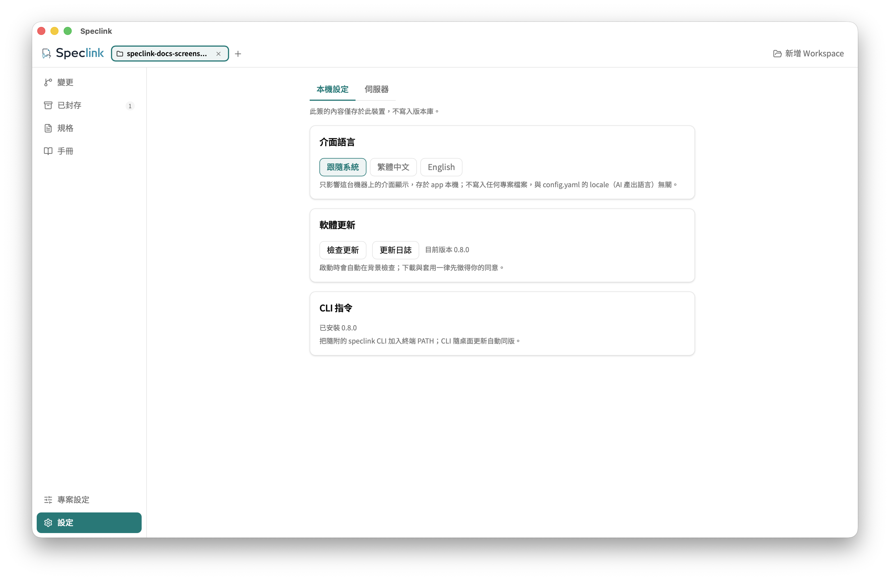

# 設定說明

**繁體中文** · [English](configuration.md)

Speclink 的設定分三層：工作流政策寫在 `openspec/config.yaml`，跟著規格走；這個 workspace 接哪些 AI 工具、連哪個遠端，寫在 `.speclink.yaml`；登入憑證放在使用者層，不進專案。環境變數可以在單次執行時蓋過政策。

## <a id="layers"></a>設定放在哪裡

| 位置 | 放什麼 | 誰會讀 | 進版本控制 |
| --- | --- | --- | --- |
| `openspec/config.yaml` | 工作流政策：`schema`、`locale`、`spec_locale`、`tdd`、`audit`、`worktree`、`context`、`rules` | CLI、桌面 app；技能透過 `speclink instructions` 取得生效值 | 是 |
| `.speclink.yaml` | 這個 workspace 的綁定：`tools`、`spec_dir`、`remote` | CLI、桌面 app | 是（裡面沒有憑證） |
| `.speclink/` | 本機工作資料：封存與品質關卡用的快照、生成工具的記錄、遠端模式的唯讀內容快照 | CLI、桌面 app | 否（`speclink init` 會把它加進 `.gitignore`） |
| 使用者層設定目錄 | `credentials.yaml`（CLI 用存取金鑰登入時存的憑證）、`schemas/`（使用者層自訂 schema）、`config.yaml`（`speclink config` 的鍵值） | CLI、桌面 app | 否 |
| 系統鑰匙圈 | 裝置登入的憑證、桌面 app 存的存取金鑰（PAT） | CLI 與桌面 app 共用 | 否 |
| `SPECLINK_*` 環境變數 | 單次執行的覆寫 | CLI、Node SDK | 否 |

使用者層設定目錄的位置：

- macOS：`~/Library/Application Support/speclink/`
- Linux：`$XDG_CONFIG_HOME/speclink/`；沒設 `XDG_CONFIG_HOME` 時是 `~/.config/speclink/`
- Windows：`%USERPROFILE%\AppData\Roaming\speclink\`

桌面 app 自己的介面語言與伺服器連線清單存在 app 的資料夾，憑證存在系統鑰匙圈，都不寫進專案。

桌面 app 的「設定」頁分成兩個分頁：「本機設定」的內容只存在這台機器，「伺服器」管理伺服器連線清單。



新設定該放哪裡，照這三條判斷：

- 會改變產出內容的設定（語言、TDD、audit、worktree 流程）是**政策**，放 `openspec/config.yaml`，全隊讀到同一份。
- 只跟這個 checkout 有關的設定（接哪些 AI 工具、連哪個遠端）放 `.speclink.yaml`。
- 個人或 CI 的臨時差異用環境變數，不改任何檔案。

`speclink config` 與 `speclink workflow-config` 是兩回事。`speclink config` 管使用者層 `config.yaml` 的通用鍵值，Speclink 的其他指令都不讀它。工作流政策一律用 `speclink workflow-config` 改。

## <a id="resolution"></a>解析順序

政策值由上往下找，先找到的生效：

| 順序 | 來源 | 說明 |
| --- | --- | --- |
| 1 | `SPECLINK_LOCALE`、`SPECLINK_SPEC_LOCALE`、`SPECLINK_TDD`、`SPECLINK_AUDIT`、`SPECLINK_WORKTREE` | 布林變數只認 `true`／`false`（不分大小寫）。`1`、`yes`、空字串都當成沒設，往下一層找 |
| 2 | `openspec/config.yaml` | 專案的正式值 |
| 3 | 內建預設 | `locale` 與 `spec_locale` 為 English；`tdd`、`audit`、`worktree` 為關閉；`schema` 為 `spec-driven` |

另外三件事：

- `.speclink.yaml` 裡的政策鍵（`locale`、`tdd` 等）不會生效，也不會警告。請照原值搬到 `openspec/config.yaml`。
- 環境變數只影響你這台機器上執行的 CLI 與 Node SDK。遠端模式的指引由 server 依團隊設定產生，本機環境變數蓋不過團隊政策。
- 要不要產生兩個 worktree 技能，只看 `openspec/config.yaml` 的 `worktree`。`SPECLINK_WORKTREE` 不影響技能檔。

遠端連線另有兩條順序：

- **連線網址**：`SPECLINK_STORE_URL` 優先，其次是 `.speclink.yaml` 的 `remote.url`。是不是遠端模式只看 `.speclink.yaml` 有沒有 `remote:` 區段，`SPECLINK_STORE_URL` 不會把本機專案切成遠端模式。有 `remote:` 區段、兩邊卻都沒有網址時，指令直接報錯，不會退回本機模式。
- **憑證**：依序找 `SPECLINK_TOKEN` → 鑰匙圈裡的裝置登入 → 鑰匙圈裡的存取金鑰 → 使用者層的 `credentials.yaml`。憑證以伺服器的 origin（`scheme://host:port`）區分，同一台 server 上的專案共用一份登入。`speclink auth status` 會告訴你目前用的是哪一層。

## <a id="workflow-config"></a>修改工作流政策

用 `speclink workflow-config`。本機模式改 `openspec/config.yaml`，遠端模式改 server 上的那一份。

| 子指令 | 作用 |
| --- | --- |
| `show [--json]` | 顯示檔案裡的值。不套用環境變數 |
| `set <key> <value>` | 改 `locale`、`spec_locale`、`tdd`、`audit`、`worktree` 其中一個 |
| `context --stdin` | 用 stdin 的內容整段取代 `context`。內容只有空白時移除這個鍵 |
| `rules <artifact> --stdin` | 用 stdin 整段取代一個 artifact 的規則，一行一條，空行略過。stdin 為空時移除這一節。`<artifact>` 必須是目前 schema 的 artifact id |

寫入規則：

- `locale` 只收 `tw`、`ja`、`en`；`spec_locale` 另外收 `auto`（跟著 `locale`）。大小寫要相同。寫「繁體中文」這類名稱會被拒絕，錯誤訊息會列出可用的代碼。
- `tdd`、`audit`、`worktree` 只收 `true`／`false`。設成 `false`（或把 `locale` 設成空字串）會刪掉那一行，回到預設值。
- 三個寫入子指令都有 `--dry-run`：只印出差異，不寫檔。
- 只改目標那幾行，其他內容與註解原樣保留。檔案無法解析時讀寫都會拒絕，不會蓋掉你的內容。
- 本機模式下改 `worktree` 會同時產生或移除兩個 worktree 技能。還有 worktree 沒收尾時，不能從 `true` 改成 `false`；指令會列出那些 worktree，請先用 `speclink-worktree-merge` 收掉。
- 遠端模式下，如果別人剛好同時寫入，指令會失敗並請你重跑，不會蓋掉別人的修改。離線或憑證失效也會直接失敗，不會排隊。

```bash
speclink workflow-config set tdd true --dry-run   # 先看差異
speclink workflow-config set tdd true             # 再寫入
cat CONTEXT.md | speclink workflow-config context --stdin
```

在剛 `speclink init` 完的專案跑第一行，**預期輸出**：

```text
--- a/openspec/config.yaml
+++ b/openspec/config.yaml
@@ -1,5 +1,7 @@
 schema: spec-driven
 
+tdd: true
+
 # Workflow policy (optional)
 # Personal/CI overrides: SPECLINK_LOCALE, SPECLINK_SPEC_LOCALE, SPECLINK_TDD, SPECLINK_AUDIT, SPECLINK_WORKTREE
 #
```

`workflow-config set` 不收 `schema`。要換 schema，用下列任一種方式：

- 直接編輯 `openspec/config.yaml` 的 `schema:` 那一行。
- `speclink schema init <name> --default`：建立一個新的自訂 schema，並設成專案預設。
- 桌面 app「專案設定」的 Schema 分頁。

桌面 app 的「專案設定」改的是同一份檔案，規則也相同。內建技能 `speclink-config` 會從程式碼整理出 `context` 與 `rules`，先給你看差異，你同意後才寫入。

## <a id="tools"></a>AI 工具與自訂工具

`.speclink.yaml` 的 `tools` 決定要為哪些 AI 工具產生技能檔：

| 值 | 技能檔位置 |
| --- | --- |
| `claude` | `.claude/skills/` |
| `codex`（`agents` 是它的別名） | `.agents/skills/` |
| 自訂工具描述子 | 描述子的 `skills_dir` |

改完 `tools` 後執行 `speclink update`。新加的工具會產生技能檔；從清單拿掉的工具，它的 `speclink-*` 技能目錄會被刪除，因此變空的目錄也一併移除。桌面 app 的設定頁勾選內建工具時，會自動做同樣的同步。

其他 AI 工具用描述子接上：

```yaml
tools:
  - claude
  - name: my-harness
    skills_dir: .my-harness/skills
    invocation: tool-call
```

| 欄位 | 必填 | 規則 |
| --- | --- | --- |
| `name` | 是 | kebab-case，2–50 個字元，只能用 `a-z`、`0-9`、`-`。不能是 `claude`、`codex`、`agents` |
| `skills_dir` | 是 | 專案根目錄下的相對路徑。不能跑出專案、不能是專案根目錄本身，也不能是 `.claude/skills` 或 `.agents/skills` |
| `invocation` | 否 | `cli`（預設）：技能寫「執行 `speclink <動詞>`」。`tool-call`：技能寫「呼叫 speclink 工具，參數是 argv 陣列」 |
| `instructions_file` | 否，已棄用 | 不再產生任何內容，只用來讓 `speclink update` 清掉舊版留下的 `SPECLINK` 區塊。留著會在 stderr 印一行棄用提示 |

欄位不合法時，指令印出一行指出欄位的錯誤，並以非零結束。描述子產生的技能沒有 `/speclink-` 斜線指令，也不提 plan mode；內建的 claude 與 codex 不受影響。

## <a id="remote"></a>遠端模式

接上遠端後，設定的歸屬不變，只是「規格放在哪裡」換成 server：

- `speclink link <url> --repo <name>` 在 `.speclink.yaml` 寫入 `remote:` 區段（`url` 與 `repo`），`speclink unlink` 移除它。有這個區段就是遠端模式。
- 工作流政策改存在 server 上。`speclink workflow-config` 讀寫 server 那一份，本機的 `openspec/config.yaml` 不再生效。
- `.speclink/context/` 是遠端內容的唯讀快照。不要手改，下一個指令會發現它被改過而拒絕執行；要刷新就重新執行 `speclink instructions`。
- 憑證不寫進任何專案檔案，所以 `.speclink.yaml` 可以放心 commit。

怎麼啟動 server、登入、斷線後怎麼恢復，見 [Remote 入門](remote-getting-started.zh-TW.md)。啟動 server 用的環境變數（例如 `SPECLINK_PORT`）也在那裡。

## <a id="reference"></a>完整鍵值參考

### `openspec/config.yaml`

| 鍵 | 值 | 預設 | 用途 |
| --- | --- | --- | --- |
| `schema` | schema 名稱 | `spec-driven` | 新變更使用的產出流程（產出哪些文件、什麼順序） |
| `locale` | `tw`、`ja`、`en` | English | AI 產出 artifact 的語言 |
| `spec_locale` | `tw`、`ja`、`en`、`auto` | English | 規格檔的語言；`auto` 跟著 `locale` |
| `tdd` | `true`／`false` | `false` | 實作時先寫會失敗的測試，再寫程式（紅→綠） |
| `audit` | `true`／`false` | `false` | 實作時對新 API 與參數處理做 sharp-edges 安全檢查 |
| `worktree` | `true`／`false` | `false` | 開啟 worktree 平行實作流程，並產生兩個 worktree 技能 |
| `context` | 多行文字 | 無 | 產生 artifact 時提供給 AI 的專案背景 |
| `rules` | artifact id → 規則清單 | 無 | 各 artifact 的撰寫規則 |

其他鍵會被忽略。

### `.speclink.yaml`

| 鍵 | 值 | 預設 | 用途 |
| --- | --- | --- | --- |
| `spec_dir` | 相對路徑 | `openspec` | 規格目錄的位置，相對於專案根目錄 |
| `tools` | 清單 | 無 | 要產生技能檔的 AI 工具：`claude`、`codex` 或自訂工具描述子 |
| `remote.url` | 網址 | 無 | 遠端專案的連線網址（project-scoped URL） |
| `remote.repo` | 名稱 | 無 | 這個 repo 在遠端專案裡的註冊名稱；只有一個 repo 的專案可以省略 |

### 環境變數

| 變數 | 值 | 作用 |
| --- | --- | --- |
| `SPECLINK_LOCALE` | 語言代碼 | 覆寫 `locale` |
| `SPECLINK_SPEC_LOCALE` | 語言代碼或 `auto` | 覆寫 `spec_locale` |
| `SPECLINK_TDD` | `true`／`false` | 覆寫 `tdd` |
| `SPECLINK_AUDIT` | `true`／`false` | 覆寫 `audit` |
| `SPECLINK_WORKTREE` | `true`／`false` | 覆寫 `worktree`；不影響技能檔要不要產生 |
| `SPECLINK_STORE_URL` | 網址 | 取代 `remote.url`；不會把本機專案切成遠端模式 |
| `SPECLINK_TOKEN` | 存取金鑰 | 遠端憑證，優先於鑰匙圈與 `credentials.yaml`，適合 CI |
