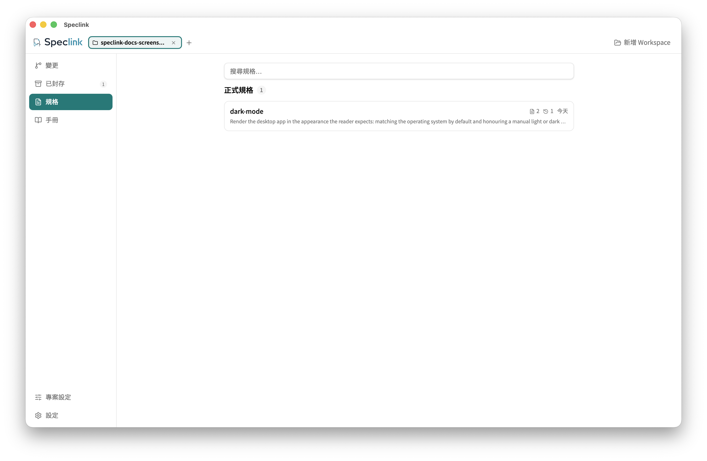

# Local Repo 入門

**繁體中文** · [English](getting-started.md)

照這份文件走完第一輪：**安裝 → 初始化 → 提案 → 實作 → 檢查 → 封存**。規格放在你的 repo 裡，用 Git 協作，不需要 server。

每一步都附上預期輸出。看到的不一樣，就先停下來找差在哪裡。這裡只走主路徑；其他分支見[完整 SDD 工作流](workflow.zh-TW.md)。

## <a id="before"></a>開始前

範例需求是「新增 CSV 匯出」，而且需求已經清楚。如果你還在比較做法、需要做決定，先跑 `discuss`（見[工作流](workflow.zh-TW.md#discuss)）。

你可以用三種方式操作，效果相同：

| 方式 | 寫法 | 說明 |
| --- | --- | --- |
| Claude Code | `/speclink-propose add-csv-export` | 斜線指令 |
| Codex | `$speclink-propose add-csv-export` | `$` 加技能名；也可以輸入 `/skills` 從清單挑 |
| 直接用 CLI | `speclink new change add-csv-export` | 不經 Agent，自己寫每份文件 |

技能（skill）是寫給 Agent 讀的流程說明：什麼時候讀什麼、怎麼產生文件、什麼時候停下來。真正執行動作的是 `speclink` CLI。一般使用者用技能就好。

## <a id="install"></a>1. 安裝

裝 CLI，三種擇一：

```bash
# 有 Node.js（任何平台）
npm i -g @speclink/cli

# 沒有 Node.js 的 macOS／Linux（伺服器、WSL、CI）
curl -fsSL https://raw.githubusercontent.com/MomoChenisMe/speclink/main/scripts/install.sh | sh

# Homebrew（macOS／Linux）
brew install MomoChenisMe/tap/speclink
```

想要圖形介面，到 [Releases](https://github.com/MomoChenisMe/speclink/releases/latest) 下載桌面安裝檔（macOS universal dmg、Windows 安裝器、Linux AppImage），裡面已含同版 CLI。Windows 沒有安裝腳本：用 npm，或裝桌面 app。

已經裝過 CLI 又要裝桌面 app，先看 [README 的安裝說明](../README.md#install)，桌面 app 可能換掉你的 CLI。

確認安裝成功：

```bash
speclink --version
```

**預期輸出**：一行版本字串，例如 `speclink 0.8.0 (arm64, engine v1.41.0)`。

## <a id="init"></a>2. 初始化

切到你的 repo，執行：

```bash
speclink init --tools claude,codex
```

**預期輸出**：

```text
✓ Initialized at /path/to/your-repo/openspec
Generated files for: claude, codex
```

這一步會：

- 建立 `openspec/` 與 `.speclink.yaml`。
- 產生技能檔：Claude 在 `.claude/skills/`，Codex 在 `.agents/skills/`。
- 把 `.speclink/`（本機工作資料）加進 `.gitignore`。

它不會改你的 `CLAUDE.md` 或 `AGENTS.md`。Agent 靠技能檔自己的說明判斷什麼時候用哪個技能。

`openspec/` 沿用 OpenSpec 的目錄結構：

```text
openspec/
├── config.yaml                  工作流設定
├── specs/<capability>/spec.md   正式規格，一個 capability 一份
├── changes/<名稱>/               進行中的變更
├── changes/archive/             已封存的變更
└── discussions/                 討論記錄（Speclink 新增）
```

全部是純 Markdown 與 YAML。不裝 Speclink 也讀得懂、改得動，每次變動都看得到 Git diff。Speclink 只多兩樣東西：`discussions/`，以及每個變更目錄裡的 `.openspec.yaml`（記錄開工時間、來源討論等生命週期資料）。

這個相容性只適用 Local 模式。接上遠端 server 之後，正式規格在 Store 裡，本機只有唯讀的投影（`.speclink/context/`）。

確認起點是空的：

```bash
speclink list
speclink validate --specs --all --strict
```

**預期輸出**：`list` 印出 `No active changes.`。`validate` 在還沒有任何正式規格時不印任何東西，並以 0 結束。沒有輸出就是通過。

如果 repo 已經有很多程式碼卻沒有規格，先跑 `/speclink-baseline`（Codex 為 `$speclink-baseline`），依現在的行為建立規格，再開新變更。

## <a id="propose"></a>3. 提案

請 Agent 建立變更。在 Claude Code：

```text
/speclink-propose add-csv-export
```

在 Codex：

```text
$speclink-propose add-csv-export
```

Agent 會建立變更，並寫出開工前需要的文件：

- `proposal.md`：為什麼做、做什麼。
- delta 規格：這次要新增或修改的規格。
- `tasks.md`：任務清單。

`design.md`（技術設計）是選用的，只有跨模組或有重要技術決定時才寫。所以不是每個變更都有四份文件。

隨時可以查進度：

```bash
speclink status --change add-csv-export
```

**預期輸出**（文件寫完之後）：

```text
Change: add-csv-export
Schema: spec-driven

  ✓ proposal (proposal.md)
  ○ design (design.md)
  ✓ specs (specs/**/*.md)
  ✓ tasks (tasks.md)
```

`✓` 是已完成，`○` 是可以寫但還沒寫，`✗` 是還在等前一份文件。`design` 停在 `○` 是正常的：開工只需要 `tasks` 完成。

提案完成後，Agent 會自己跑 `analyze` 與 `validate` 檢查文件。

如果需求來自一份已寫結論的討論，改用 `/speclink-propose --from-discussion <slug>`。其他討論結論的走法見[討論結論怎麼走](workflow.zh-TW.md#discussion-outcomes)。

<details>
<summary>不經 Agent，直接用 CLI 寫文件</summary>

適合已經熟悉文件格式的人。流程是：建立變更 → 讀某份文件的寫作說明 → 從 stdin 寫入。

```bash
speclink new change add-csv-export
speclink instructions proposal --change add-csv-export
speclink new artifact proposal --change add-csv-export --stdin < proposal.md
speclink new artifact spec csv-export --change add-csv-export --new --stdin < spec.md
speclink new artifact tasks --change add-csv-export --stdin < tasks.md
```

- `instructions` 印出這份文件該寫哪些段落與範本。
- 新的 capability 要加 `--new`，而且 delta 規格要以 `## Purpose` 段落開頭（一兩句、50 字元以上）。
- `new change` 的預期輸出：

```text
✓ Created change: add-csv-export
  Path: /path/to/your-repo/openspec/changes/add-csv-export
  Schema: spec-driven
```

</details>

## <a id="apply"></a>4. 實作

文件完成後，請 Agent 開始實作。在 Claude Code：

```text
/speclink-apply add-csv-export
```

在 Codex：

```text
$speclink-apply add-csv-export
```

Agent 會先跑 `speclink plan` 確認這個變更沒有被其他變更擋住，再讀提案、規格、設計（如果有）與任務，一項一項實作。每完成一項，它用 `speclink task done` 勾掉：

```text
✓ Task 1 marked as done: 1.1 Serialize report rows to CSV
```

只有這一項的行為與該過的測試都通過了，才可以勾。勾錯了用 `speclink task undone --change add-csv-export <編號>` 取消。不要直接改 `tasks.md` 的勾選。

標著 `[M]` 的任務是手動任務，要由你自己確認，Agent 不會代勾。

全部勾完後，`speclink list` 顯示進度已滿：

```text
Changes:
  • add-csv-export [2/2] — Reports can only be read insid…
```

## <a id="check"></a>5. 檢查

**多數時候你不必自己跑這一步。** `propose`、`ingest` 與 `apply` 技能都會自動跑 `analyze`。想自己看一眼、或要在 CI 裡把關時，執行：

```bash
speclink analyze add-csv-export
speclink validate add-csv-export
```

- `analyze` 交叉比對提案、規格、設計與任務，從四個面向找問題：涵蓋（Coverage）、一致（Consistency）、模糊（Ambiguity）、缺漏（Gaps）。
- `validate` 檢查文件的格式與必要段落。

**預期輸出**：

```text
Change: add-csv-export

  ● Coverage       1 issue(s) found (1 findings)
  ✓ Consistency    Skipped (insufficient artifacts) (0 findings)
  ✓ Ambiguity      Clean (0 findings)
  ✓ Gaps           Clean (0 findings)
  ...
  [WARNING] Requirement 'Export report as CSV' has no matching task

✓ add-csv-export — valid
```

這個 WARNING 的意思是：規格寫了一條要求，任務清單裡沒有明確對應的項目。Consistency 顯示 `Skipped` 是因為沒有 `design.md`。

- CRITICAL：先修文件再實作。
- WARNING 與 SUGGESTION：不擋你，但要看過再決定。

`analyze` 與 `validate` 只檢查文件，**不能取代程式測試**。專案自己的測試、lint 與 build 照常要跑。

程式碼的把關有兩道選用的品質關卡：`/speclink-review` 看程式碼寫得好不好，`/speclink-verify` 看交付是否符合規格，兩道都要跑就用 `/speclink-quality`。第一輪的小變更跳過也可以。規則見[工作流](workflow.zh-TW.md#quality)。

## <a id="archive"></a>6. 封存

任務全部完成、文件檢查通過、選擇要跑的品質關卡也結束之後，請 Agent 封存。在 Claude Code：

```text
/speclink-archive add-csv-export
```

在 Codex：

```text
$speclink-archive add-csv-export
```

或直接執行：

```bash
speclink archive add-csv-export -y
```

**預期輸出**：

```text
✓ Archived: add-csv-export → <日期>-add-csv-export
Specs applied: csv-export (added: 1, modified: 0, removed: 0, renamed: 0)
Snapshot created for unarchive support.
```

封存會把 delta 規格合併進正式規格，並把變更移到 `openspec/changes/archive/`。之後 `speclink list` 回到 `No active changes.`，`openspec/specs/csv-export/` 出現。這就是這一輪的成果。

在桌面 app 的「規格」頁可以看到合併後的正式規格，每項能力一張卡片。



不要用 `--mark-tasks-complete` 或 `--no-validate` 跳過沒做完的工作。

## <a id="created"></a>產物在哪裡

| 路徑 | 內容 |
| --- | --- |
| `openspec/specs/<capability>/spec.md` | 正式規格：系統現在的行為 |
| `openspec/changes/<名稱>/` | 進行中的變更與它的文件 |
| `openspec/changes/archive/` | 已封存的變更 |
| `openspec/discussions/` | 討論記錄（需要做決定時才有） |
| `openspec/config.yaml` | 工作流設定：語言、專案說明、產出規則、TDD、audit、worktree |
| `.speclink.yaml` | 這個 workspace 的工具與遠端綁定 |
| `.speclink/` | 本機工作資料（不進 Git） |

設定的細節見[設定說明](configuration.zh-TW.md)。

## <a id="next"></a>接下來

- 需求還要收斂：`/speclink-discuss`；講不出要改哪裡：`/speclink-improve`。
- 實作途中需求改變：`/speclink-ingest`。
- 變更停了一陣子才繼續：先跑 `/speclink-drift <變更名稱>`。
- 想同時推多個互不衝突的變更：worktree 流程，見[工作流](workflow.zh-TW.md#worktree)。
- 想知道哪個變更先做：`speclink plan`。
- 要和團隊共用規格：見 [Remote 入門](remote-getting-started.zh-TW.md)。
- 想知道某項能力現在能不能用：見[專案能力狀態](product-status.zh-TW.md)。
