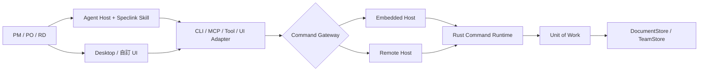

# Speclink 現況對齊與重構路線圖

> 狀態：**2026-07-27 當時的重構規劃，已不是現行計畫**
>
> 這份文件是 2026 年 7 月做的一次現況盤點與重構排序。之後的實際交付已經偏離它——例如本文的現況表把
> `speclink-server` 記為「尚無存在」、把 production server 列為 Phase 1 之後才可動工，但 server 已經交付並發布；
> §8 的驗證基線也停在當時。又如本文把 `speclink-remote` 記為舊 REST v1 prototype——它已是正式的 typed protocol client；
> §3 列為縫的命令旁路、remote policy 歸屬與遠端文件 materialize，以及 §5–7 待排的 drift 拆分、remote dev harness
> 與 desktop workspace session，都已交付——桌面遠端已能真實寫入，含認領（claim）操作與認領人呈現。
> **不要以本文判斷任何能力是否已交付，也不要以本文的順序推論之後會做什麼。**
>
> 現在的判準只有兩個：能力現況查 [`product-status.zh-TW.md`](product-status.zh-TW.md)，行為與邊界的正典是
> `openspec/specs/` 底下的規格（含 `host-runtime`、`command-runtime`、`teamstore-contract`、`client-protocol`
> 與各 `phase*-acceptance`）。方向見面向使用者的 [`roadmap.zh-TW.md`](roadmap.zh-TW.md)（[English](roadmap.md)）。
>
> 保留本文的理由是它記錄了當時為什麼這樣切、哪些舊路徑被判定為不延伸——這段判斷背景在正典規格裡讀不到。
> 讀它請當成歷史紀錄，不是計畫書。架構構想的同期文件是
> [`platform-architecture.zh-TW.md`](platform-architecture.zh-TW.md)。

## 1. 結論

Speclink 需要分階段重構，但不需要推翻目前的 Local Repo、CLI、Desktop UI 或 Markdown 規格模型。

現況已具備可保留的產品基礎：

- Rust CLI 與 Local Repo 工作流可運作，並有 golden 與整合測試保護。
- `speclink-core` 已將多數規格文件存取放到 `Store` trait 後方。
- `speclink-fs` 已保留 `openspec/` 的既有檔案佈局與行為。
- `@speclink/engine` 已證明同一份 Rust Engine 可透過 N-API 被 Node.js 載入。
- Desktop 已有 Local UI、Tauri adapter、共用 UI package 與 `SpeclinkDataSource` 雛形。
- `speclink-remote` 已驗證 project-scoped URL、repo key、PAT、部分 `If-Match` 與 HTTP error mapping。

真正需要重構的是：

1. 將多入口各自組裝流程，收斂成唯一 Command Runtime 與 Host application boundary。
2. 將目前只能替換文件讀寫的 `Store`，提升成具 revision、CAS、snapshot、Unit of Work、history 與 outbox 的 TeamStore。
3. 將本機 code/git 事實從 Engine 的規格面運算拆出，透過 evidence/bundle 接回 verify、drift 與 archive。
4. 將現有 remote REST client 從 CLI 旁路重構為正式 Protocol/Client SDK/Context 路徑。
5. 在上述正確性基礎完成後，才實作官方 Server、Desktop Remote Workspace 與 Agent Tools。

## 2. 現況能力與定位

| 元件 | 現況 | 可保留部分 | 不應直接延伸的部分 |
|---|---|---|---|
| `speclink-core` | Rust 流程模組，尚無統一 typed command 前門 | parsing、schema、status、validate、analyze、delta merge 等領域演算法 | 各入口直接呼叫模組函式、隱式讀 env/git/workspace |
| `speclink-fs` | 本地 `openspec/` Store | Layout、檔案相容性、本地零服務模式 | 不能直接宣稱具 TeamStore transaction/recovery 能力 |
| `speclink-cli` | 完整本地 CLI，加上舊 remote REST 旁路 | clap surface、rendering、輸出凍結護欄 | 每個 handler 自行判斷 local/remote 並重組結果 |
| `speclink-remote` | 舊 REST v1 client prototype | transport/error mapping、project URL/repo key 經驗 | 不作為新 Protocol 的相容負擔或正式 Server contract |
| `@speclink/engine` | N-API、FsStore、自訂 JS Store bridge、四組 dispatch 動詞 | 同一 Rust binary、render API、bridge 測試基礎 | 手刻 argv router、panic tunnel、thread-per-dispatch、現有 31-method Store contract |
| Desktop core | Local Repo query/command 與設定操作 | Local UX、watcher、cache、UI 元件 | 直接刪檔、自行改 tasks、root-only ProjectContext |
| `@speclink/ui` | 共用元件與 DataSource 介面 | Presentation 與 Tauri 解耦方向 | ordinal task identity、缺 capabilities/subscribe/workspace session |
| `speclink-server` | 尚未存在 | 無 | 不得在 Phase 1 正確性契約前先實作 production server |

現有 remote client 應視為實驗性基礎。正式架構不承諾保留它的 raw JSON payload、逐 verb endpoint 或 CLI 旁路結構。

## 3. 主要重構缺口

### 3.1 Store seam 尚不是 TeamStore contract

目前 `speclink_core::store::Store` 的讀取大量使用 `Option`、`Vec` 與 `bool`，因此無法區分：

- 文件不存在。
- actor 無權限。
- revision 衝突。
- Store 暫時不可用。
- 文件或 metadata 損壞。
- backend I/O、網路或資料庫失敗。

現有 trait 也暴露 `PathBuf` display location，並缺少 Project/Repo scope、consistent snapshot、CAS、transaction、immutable history、migration 與 outbox。

不建議直接在目前每一個 method 加入 `expectedRevision`。目標應分成：

```text
Local DocumentStore
  保留 openspec/ 與單機相容行為

TeamStore
  manifest / capabilities
  consistent snapshot
  begin UnitOfWork
  CAS commit / rollback
  immutable revisions
  transactional outbox 或 recovery journal
  export / import / migration
```

TeamStore 的文件定址使用 `ProjectId + RepoId + DocumentId`，不使用實體 path 作跨媒介身分。所有 API 回 typed `Result` 與穩定錯誤碼。

### 3.2 多入口仍各自組裝流程

目前 CLI、Node dispatch、Desktop core 與 remote handlers 都會自行組裝 core 函式。這會造成：

- lifecycle、錯誤分類與輸出語意需要多處同步。
- Desktop 的 delete、task reset、task reorder 等操作繞過 Engine command。
- Node dispatch 只覆蓋 list/status/new/claim，與 CLI 功能面不一致。
- 新增 Server 後會出現第四或第五套 application orchestration。

目標呼叫鏈：



CLI 應只做 argv parsing 與 rendering。local/remote 差異由 `CommandGateway` 處理；兩條路徑回相同 typed outcome，避免維護兩套 renderer。

### 3.3 Engine 混合規格面與本機 code/git 事實

目前下列行為直接依賴 `Workspace` 或本機 Git：

- new/discuss/archive 的 git identity。
- task done 的 dirty/touched files。
- archive 的 `@trace`。
- drift 的 git log、tracked files、symbols 與工作樹。
- instructions 的本機 env、`.speclink.yaml` 與 schema path。

正式遠端 Server 無法讀取 RD 本機 checkout。應拆成：

| 責任 | 執行位置 |
|---|---|
| spec drift、canonical/delta assumption | Server/Engine |
| code/git drift | RD client + 本機 checkout |
| touched files、base/head commit、test summary | RD client 產生 evidence |
| VerifyBundle 與 policy/spec basis | Server 固定 revision 產生 |
| verify 執行 | RD Agent Host / client |
| evidence 驗證與保存 | Remote Host |
| archive trace | Host 以已接受且未 stale 的 evidence 建立 |

Engine 接收 Host 已解析好的 `EffectiveWorkflowPolicy` 與明確 actor，而不是自行讀 process environment 或 git identity。

### 3.4 遠端 policy 與 schema 仍可能由 client 決定

現有 remote artifact 建立流程只向 Server 取得 schema 名稱，再由 client 本機 Engine 解析 template。若 Client 與 Server 的 schema/Engine 版本不同，可能寫入不同內容。

正式路徑要求：

- Remote Store 的 repo-scoped `config.yaml` 是唯一 authoritative policy。
- Server 在固定 `policyRevision` 下產生 instructions、template 與 Context Manifest。
- `.speclink.yaml` 只保存 endpoint、binding 與本機 preference。
- Remote policy 不接受 client env 或本機 `.speclink.yaml` 鍵靜默覆寫。
- Client 不自行用本機 schema 猜測 Server artifact template。

### 3.5 Task identity、evidence 與 lifecycle gate 未完成

目前 task command 與 Desktop 都以 ordinal 定址。多人重排或修改 `tasks.md` 後，原本的第 3 項可能已是另一個任務。

建議以 markdown 內嵌、不可變 task ID 保持本地可讀寫體驗：

```markdown
- [ ] 1.1 Implement login <!-- speclink-task:tsk_01J... -->
```

規則：

- ordinal 只作顯示與舊 CLI compatibility，不作 command identity。
- Engine 為新 task 指派 ID，拒絕 duplicate ID。
- 手動新增且沒有 ID 的 task，在 normalize/command 前補 ID；不可用內容 hash 代替永久身分。
- task reorder 只改順序與顯示編號，不改 stable ID。
- task complete evidence 攜 task ID、actor、repo、base/head commit、touched files 與 spec revision。

正式多人流程還需要 `drafting -> review -> ready -> applying -> verified -> archived` 或等價 gate。內容或 policy revision 改變後，舊 approval 與 verify evidence 必須 stale。

### 3.6 Config 與 metadata fail-closed 尚未閉合

進行中的 `engine-typed-core` 已規劃讓 `.speclink.yaml` 與 `config.yaml` 存在但損壞時停止，但 `.openspec.yaml` 的 `ChangeMeta::from_text` 仍會靜默退回 default。

建議：

- Query/list 可回傳帶診斷的 `invalid` change，避免一份壞檔讓整個 UI 無法開啟。
- 任何 lifecycle、metadata 或 artifact 寫入 command 遇到壞 change metadata 必須 fail closed。
- 不得把壞 metadata 解讀為預設 schema、未開工、無來源討論或無 board rank。

### 3.7 Host application service 也要單一實作

平台架構已要求 Rust Engine 是唯一流程語意實作，但 Rust Server 與未來 `@speclink/host` 都會負責 authorization、binding、CAS、idempotency、UoW 與 event commit。若兩邊各自實作，Host 正確性仍可能分叉。

建議發布關係：

```text
speclink-engine / speclink-core
  唯一 SDD command 與領域語意

speclink-host（Rust canonical application service）
  execution context / authorization hook / binding / UoW / event commit

speclink-server
  Rust HTTP/SSE/Auth/Admin adapters

@speclink/engine、@speclink/host
  上述 Rust crates 的 N-API facade
  Node session/auth resolver 與 async custom Store bridge
```

自訂 Node 系統可以注入已驗證的 session actor 與 Store adapter，但不能重寫 Host 的 scope、CAS 或 commit 規則。

### 3.8 Context Projection 與 Skill delivery 尚未接線

目前 remote instructions 告訴 Agent 不要讀本地規格檔，但新架構要求 Agent 透過唯讀 `.speclink/context/` 搜尋規格。現行 apply/verify skill 又會讀 `contextFiles`，CLI 尚未 materialize 這些遠端文件。

Context Materializer 完成時需同步調整：

- `ContextManifest`、snapshot ID、project/repo/policy revision 與 digest。
- `<workspaceRoot>/.speclink/context/` staging + atomic switch。
- read-only 屬性、gitignore、digest dirty detection 與 stale marker。
- remote Skill 明確讀 Projection、禁止直接修改 Projection。
- 無 checkout 時改用 MCP resources、Tool-native context 或 Desktop app data。
- Codex/neutral renderer 必須能交付 verify；不能因缺少 fork/subagent 能力直接省略整個 verify workflow。

## 4. 優先順序

### 4.1 總體順序

```mermaid
flowchart LR
    G0["G0 交付基線修復<br/>delivery-baseline-and-node-packaging"]
    P1A["Phase 1A<br/>engine-typed-core<br/>＋ change-metadata-fail-closed"]
    P1B["Phase 1B<br/>teamstore-contract-v2"]
    P1C["Phase 1C<br/>host-runtime-binding-policy"]
    P1D["Phase 1D<br/>stable-task-and-evidence<br/>＋ drift-client-server-split"]
    P1E["Phase 1E<br/>protocol-client-context"]
    P2["Phase 2<br/>speclink-server + Store drivers"]
    P3["Phase 3<br/>Desktop Remote Workspace"]
    P4["Phase 4<br/>MCP / Copilot Tools / Ecosystem"]

    G0 --> P1A --> P1B --> P1C --> P1D --> P1E --> P2 --> P3 --> P4
```



`G0` 是可靠交付的先行 gate，不是產品架構 Phase。它可與 Phase 1A 的純 Rust 段並行，但必須在 Node 遷移與全量回歸（`engine-typed-core` 第 5、6 節）前完成。Phase 1A 與 1D 各含兩把刀，上圖標註即 §4.2 的七把 Phase 1 刀；正式能力仍以平台架構的 Phase 1 到 Phase 4 為準。

### 4.2 刀組與優先級

| 順位 | 建議 change | 對應最新設計 | 必須先完成的原因 |
|---:|---|---|---|
| G0 | `delivery-baseline-and-node-packaging` | 全 Phase 的驗證基礎 | Node `package-lock` 與 `npm ci` 不一致；root test 未涵蓋 Node；CI 只 build/smoke、未完整跑 tests |
| 1 | 現有 `engine-typed-core` | Phase 1 第 1 項 | 統一 typed command/outcome/error/event，讓後續 Host/Server 不再新增旁路 |
| 2 | `change-metadata-fail-closed` | Phase 1 / P0 正確性 | 補足 `.openspec.yaml` 損壞仍退 default 的缺口；可作 `engine-typed-core` 後的小刀 |
| 3 | `teamstore-contract-v2` | Phase 1 第 2 項 | Server、event、snapshot、CAS、archive 原子性全部依賴此契約 |
| 4 | `host-runtime-binding-policy` | Phase 1 第 3、4 項 | 固定 canonical Rust Host、ExecutionContext、Project/Repo、policy injection 與 lifecycle gate |
| 5 | `stable-task-and-evidence` | Phase 1 / P0、P1 | task identity、task-done evidence、VerifyBundle、archive trace 與 stale evidence |
| 6 | `drift-client-server-split` | Phase 1 / 遠端 drift | 將 spec drift 與 code/git drift 拆分並定義單一合併報告 |
| 7 | `protocol-client-context` | Phase 1 第 4、5 項 | Command/Query/Context/Event schema、typed client、binding handshake、Context Materializer |
| 8 | `reference-server` | Phase 2 | Rust Host adapter、SQLite/ServerFS/PostgreSQL、auth/account/admin、SSE/ETag、backup |
| 9 | `remote-dev-harness` | Phase 3 前置基建 | 一鍵 `npm run dev` 同起 server（env 驅動設定）與 desktop 的本地開發迴圈；Phase 3 每日手動測試不能依賴 docker 重建映像（排 `phase2-e2e-chain` 之後、`desktop-workspace-session` 之前） |
| 10 | `desktop-workspace-session` | Phase 3 | Local/remote spec-only/remote+checkout、Keychain、RemoteDataSource、event manager |
| 11 | `agent-tool-adapters` | Phase 4 | MCP、Copilot Tools、typed N-API Host/Engine 與 tool-specific Skill renderer |

### 4.3 可以平行的工作

只有不依賴未定契約的工作適合平行：

| 可平行項目 | 可開始時間 | 限制 |
|---|---|---|
| Node packaging/CI 修復 | 立即 | 不改 Engine 語意 |
| Protocol DTO 草案與 error registry | TeamStore contract 設計期間 | contract 定案前不承諾 API stable |
| Server Admin/Account UI wireframe | Phase 1 後半 | 不先寫假 API 或假權限模型 |
| Desktop WorkspaceSession UX prototype | Protocol/Binding 草案後 | 不接真實 remote mutation |
| Store conformance harness | TeamStore contract 同時 | 第一個 SQLite driver 前必須可執行 |

不建議平行實作三個 Store driver。先讓 SQLite reference implementation 與 failure tests 通過，再以相同 conformance suite 實作 Server FS、PostgreSQL；官方 v1 發布時仍可同時提供三者。

## 5. 各 Phase 驗收 Gate

### G0：交付基線

- `npm ci` 可在 `crates/speclink-node` 成功。
- root 一個命令可執行 Rust、UI、Desktop、Node build/tests。
- CI 不只 `cargo build`；至少執行 `cargo test --workspace` 與 npm workspace tests。
- Node native package 在所有宣告平台完成 build/load smoke test。
- React test 的 `act(...)` warnings 清零，避免 async 更新未被測試等待。

### Phase 1：Engine 與正確性

- CLI、Node、Embedded Host 對同 command 回相同 typed outcome/error。
- Desktop mutation 不再直接刪改 spec 文件，而是經 Host command。
- TeamStore conformance 包含 CAS race、mixed snapshot、partial commit、outbox failure、crash recovery 與 tenant scope。
- Engine 規格面不直接讀 git、process env 或憑證。
- stable task ID 在 reorder/edit 後不變。
- VerifyEvidence 帶 spec/policy/task basis；basis 改變即拒絕或標 stale。
- Context Projection 可刪除重建，且修改 projection 不會改遠端正典。

### Phase 2：Server

- SQLite、Server FS、PostgreSQL 全部通過共同 conformance suite。
- 一般使用者可經 invite 登入、device flow 連 Desktop、自助建立/撤銷 PAT。
- Project/Repo binding 缺失或多義時 fail closed。
- Query + ETag 可在完全漏掉 push event 後收斂。
- command commit、revision/history 與 outbox 具原子或可恢復保證。
- backup/export/restore validation 經端到端演練。

### Phase 3：Desktop

- 同一 UI 支援 local、remote spec-only、remote + checkout。
- Workspace tab 不再只以 root path 作 identity。
- RemoteDataSource 依 capabilities 顯示/停用操作。
- credential 存 OS Keychain；PAT 不進 localStorage、repo 或 URL。
- SSE/WS 中斷時以 Polling + ETag 恢復。
- stale/offline snapshot 只能讀，不可產生隱性 local write queue。

### Phase 4：Agent 與生態

- N-API binary 與 Engine/Host/Store contract version handshake fail closed。
- async JS Store bridge 有 bounded concurrency、timeout、cancellation 與 typed error，不以 panic 作正常錯誤通道。
- Tool closure 綁定 actor/project/repo，模型不能傳入或覆寫 identity。
- Claude、Codex、Cursor、Copilot 等 renderer 共享 Skill semantic contract，但使用各工具原生 delivery 格式。
- MCP 無 checkout、Tool-native Context 與 Session FS Projection 有端到端測試。

## 6. 不建議的做法

- 不先建立只有 CRUD 的 `speclink-server`，再事後補 transaction/CAS/history。
- 不把現有 `Store` 的 31 個 Node methods 當作最終 custom TeamStore API。
- 不讓 CLI remote handlers、Web UI backend 或 Copilot Tool 各自重寫 lifecycle。
- 不讓 Server shell-out 到使用者的本機 Git；code evidence 必須由 client 上行。
- 不讓 RemoteDataSource 直接模仿 LocalDataSource 的 path/mtime/ordinal 假設。
- 不在 TeamStore contract 未定前同時開發 SQLite、FS、PostgreSQL 三套不同語意。
- 不因 Context Projection 是檔案，就允許 Agent 直接寫回並同步遠端。
- 不把 board/card 個人呈現狀態默認混入共享規格 revision；若要共享順序，定義獨立、具 CAS 的 board resource。

## 7. 建議保留與逐步遷移的程式

| 保留 | 遷移方式 |
|---|---|
| CLI clap 定義與 human/JSON rendering | command parsing 後改呼叫 CommandGateway |
| delta/canonical parsing 與 merge | 改在 UoW snapshot 上執行，移除 path/git 副作用 |
| validate/analyze/status | 包成 typed query/outcome，不重寫演算法 |
| `speclink-fs::Layout` | 留給 Local DocumentStore；Server FS 另加 journal/recovery contract |
| Desktop React components | 注入新的 DataSource/WorkspaceSession，不重做 UI |
| filesystem watcher 與 local cache | 限 LocalDataSource；remote 改 event manager + ETag |
| N-API render API 與 bridge 測試 | 改接 typed Engine/Host API 與 TeamStore conformance |
| remote error translation 經驗 | 移入正式 protocol client，raw `serde_json::Value` 改 typed DTO |

## 8. 目前驗證基線

本次審查時的基線：

- `cargo test --workspace` 通過。
- `@speclink/ui`：16 個 test files、201 tests 通過。
- Desktop：9 個 test files、113 tests 通過，但仍有 React `act(...)` warnings。
- `@speclink/engine` 的 JavaScript tests 無法直接啟動：尚未產生 `binding.js`。
- `npm run build` 因本機 Node dependencies 未安裝而無法找到 `napi`。
- `npm ci` 因 `crates/speclink-node/package.json` 與 lock file 的 platform optional dependencies 不同步而失敗；現有 Node CI 也使用 `npm ci`，因此 G0 必須先修。

這些結果代表本地 Rust/UI 功能已有可用護欄，但不能用來證明 TeamStore、Server、Context、CAS、evidence 或遠端恢復語意已成立。

## 9. 決策摘要

最優先的產品工作不是 Server UI，也不是 Desktop Remote UI，而是完成 Phase 1：

```text
engine-typed-core
-> metadata fail-closed
-> TeamStore contract
-> canonical Rust Host + binding/policy
-> stable task/evidence/drift
-> Protocol/Client/Context
-> speclink-server
-> Desktop Remote Workspace
-> MCP/Copilot Tools
```

只要這個順序不被顛倒，目前的 Local Repo 能持續交付，Remote Store 也能在不重寫第二套流程引擎的前提下逐步完成。
