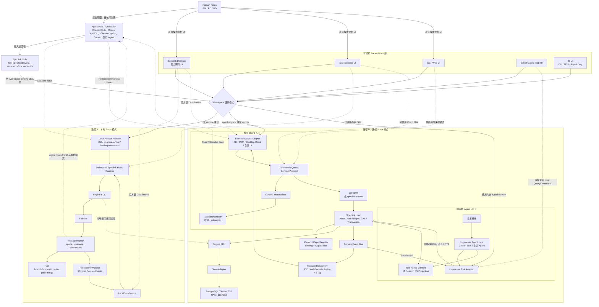
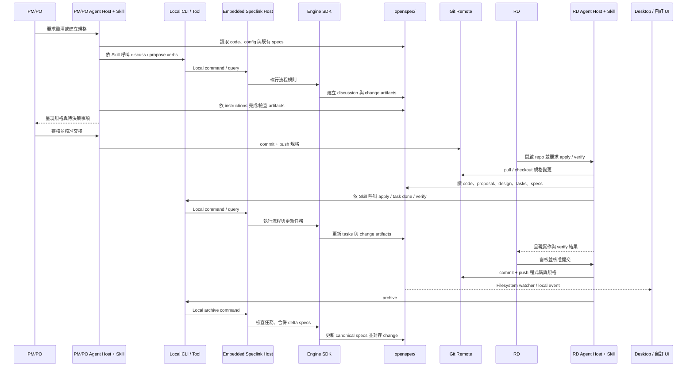
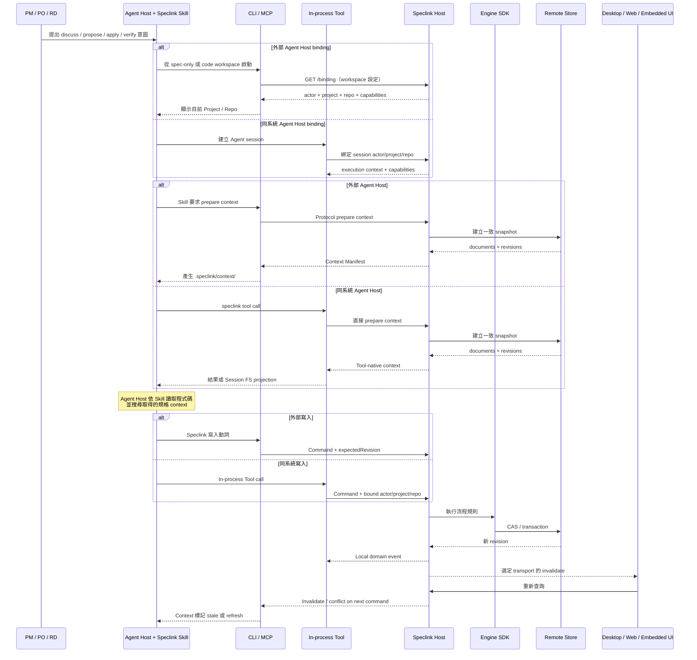
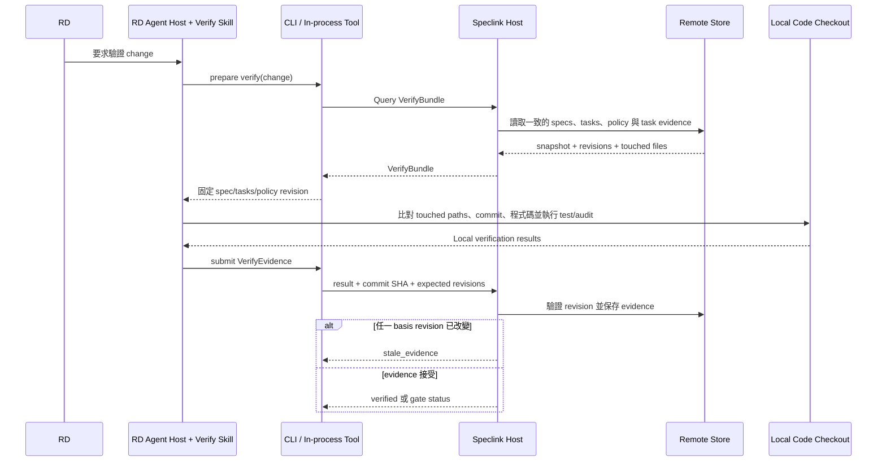
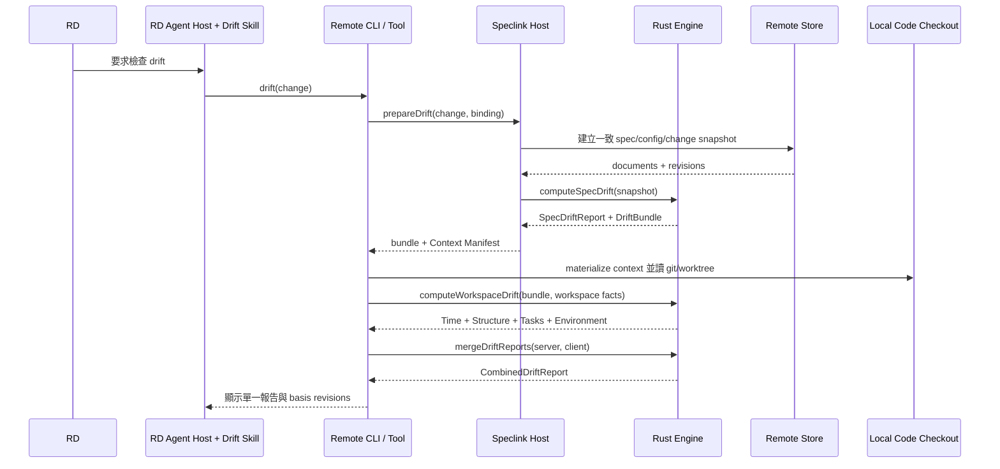
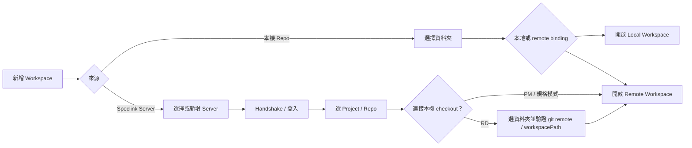
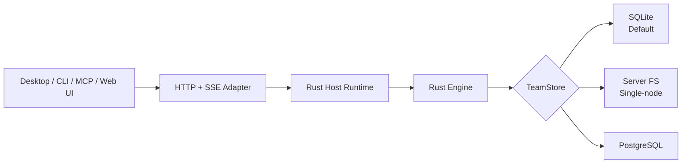
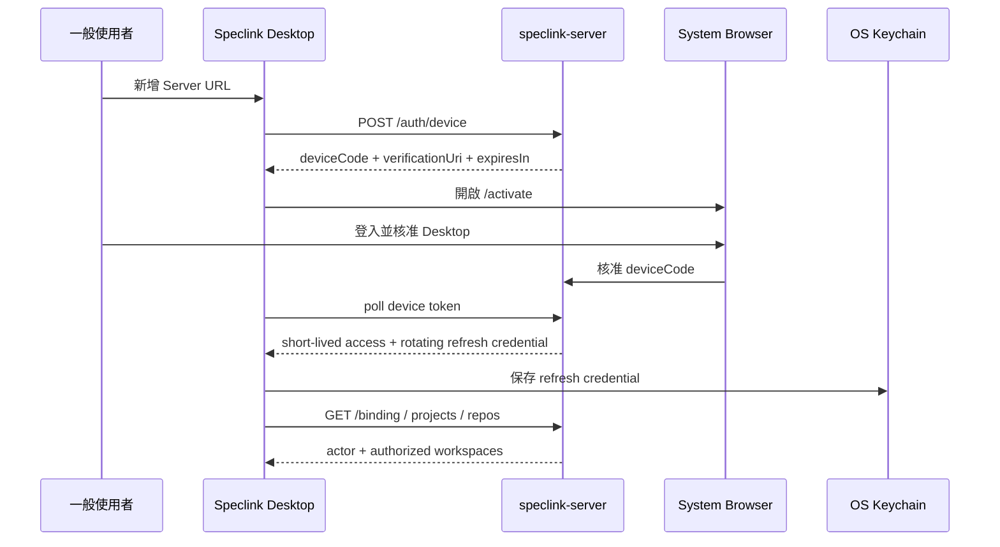

# Speclink 可組合平台架構藍圖

> 狀態：**2026-07-27 當時的架構構想，不是現行行為的正典**
>
> 這份文件描述 Speclink 從本地 SDD 工具擴展為可組合平台的目標架構，是當時做整體設計時的整合基準。
> 之後的實作與規劃已經有所偏離，本文沒有隨之更新——**不要以本文判斷現在的行為、邊界或介面**。
>
> 現行的行為正典是 `openspec/specs/` 底下的規格（`host-runtime`、`command-runtime`、`teamstore-contract`、
> `client-protocol`、`verb-contract`、`server-*` 等）；能力現況查
> [`product-status.zh-TW.md`](product-status.zh-TW.md)；流程入口見
> [`workflow.zh-TW.md`](workflow.zh-TW.md)；之後的方向見 [`roadmap.zh-TW.md`](roadmap.zh-TW.md)。
>
> 保留本文的理由是它把「為什麼要拆成 Engine／Host／Store／Protocol」這層設計意圖寫得比任何單份規格完整。
> 讀它請當成設計背景，不是介面文件。同期的交付規劃是
> [`implementation-refactor-roadmap.zh-TW.md`](implementation-refactor-roadmap.zh-TW.md)。

## 1. 核心結論

Speclink 應定義成「**同一套 Engine、兩條執行路徑、多種可替換入口與呈現**」。

- **本地 repo 路徑**：保留現在的 `openspec/`、Git、直接讀檔與離線體驗，不要求服務。
- **遠端 Store 路徑**：規格正典位於自訂 Store，經使用者自建服務或官方 `speclink-server` 組合 Engine 與 Store。
- **外部 Agent Host 入口**：Claude Code、Codex、GitHub Copilot、Cursor 等載入 Speclink Skill，再以 CLI/MCP 經 Protocol 呼叫遠端 Host。
- **同系統 Agent Host 入口**：Copilot SDK 等自訂 Agent 載入 rendered Skill，以 In-process Tool 直接呼叫同程序 Speclink Host，不繞 CLI、MCP 或 HTTP。
- **UI 可替換**：Speclink Desktop 是官方開箱 UI 與參考實作，不是唯一 UI；本地 repo 建議使用 Desktop/native UI，遠端 Store 可建立 Web、Desktop 或 Agent 內嵌 UI。
- **Store 可替換**：本地 FS、PostgreSQL、Server FS、NAS 或自訂媒介皆可實作 Store，但必須聲明可提供的並發與交易保證。

最終產品邊界如下：

```text
Speclink
├── Engine SDK                 SDD 流程與規格語意
├── Speclink Host              身分、政策、並發、交易、事件
├── Store Adapter Contract     可替換的規格持久化介面
├── Client Protocol            Command / Query / Context / Event
├── Invocation Adapters        Embedded / CLI / MCP / HTTP / Tool
├── DataSource / UI Contract   可替換的呈現介面
└── 官方選配產品
    ├── FsStore
    ├── PostgreSQL Store
    ├── speclink-server
    ├── Speclink CLI
    ├── MCP Adapter
    └── Speclink Desktop
```

## 2. 設計原則

### 2.1 一套流程語意

本地與遠端必須使用同一顆 Engine。`discuss`、`propose`、`apply`、`validate`、`analyze`、
`drift`、`verify`、`archive` 等流程不能因 Store、Client 或 UI 不同而分叉。

### 2.2 程式碼工作區與規格 Store 正交

PM/PO 與 RD 在三種產品情境中都可以取得程式碼 checkout。差異不在「有沒有程式碼」，而在：

- 規格正典位於 repo 的 `openspec/`，或位於遠端 Store。
- Agent 在外部工具、同系統應用，或本地 CLI 中執行。
- UI 使用官方 Desktop 或自訂呈現。

### 2.3 Store 不是遠端 Client API

`Store` 是 Engine/Host 內部的持久化介面。外部 CLI、Desktop、Web UI 與 Agent 不應直接連 PostgreSQL、
NAS 或 Store 實作，而應經 Speclink Host 的應用層介面。

```text
正確：Client / Tool -> Host -> Engine -> Store
錯誤：Client / Tool -----------------> Store
```

In-process Tool 可以略過 HTTP，但不能略過 Host 與 Engine，否則會繞過 lifecycle、權限、CAS、交易、
封存規則與事件發布。

### 2.4 UI 是 Presentation Adapter

UI 不屬於 Engine 或 Store。官方與自訂 UI 都只依賴穩定的 DataSource/Client contract，因此 Store 的實體媒介
與 UI 技術選型可以獨立替換。部署建議仍有清楚邊界：本地 repo 以能直接內嵌 Engine 並存取 workspace 的
Desktop/native UI 為主；Web UI 以具備 Host、Query Protocol 與 Event transport 的遠端 Store 模式為主。

### 2.5 遠端規格只有一個正典

遠端模式不得維護可雙向寫入的第二份 `openspec/`。Agent 需要檔案閱讀體驗時，使用可丟棄、唯讀、
帶 revision 的 Context Projection；所有遠端寫入仍經 Command API 或 In-process Tool。

### 2.6 Human、Agent Host、Skill 與 Speclink Host

文件中的「Agent」必須拆成不同責任，避免把 AI 工具與 Speclink runtime 畫成同一個元件：

| 層 | 例子 | 責任 |
|---|---|---|
| Human role | PM、PO、RD | 提出意圖、審核結果、承擔決策與操作責任 |
| Agent Host/Application | Claude Code、Codex App/CLI、GitHub Copilot、Cursor、自訂 Agent | 執行模型、讀寫 workspace、呼叫外部 tools |
| Speclink Skill | discuss/propose/apply/ingest/verify/archive 等 workflow knowledge | 告訴 Agent 何時讀 context、產生 artifact、呼叫哪個 Speclink verb；本身不是 runtime |
| Access Adapter | CLI、MCP、In-process Tool、Desktop command | 把 Agent/UI 的意圖轉成 Speclink command/query/context call |
| Speclink Host/Runtime | Embedded Host 或 Remote Host | 組合 Engine/Store，執行 binding、auth、CAS、transaction、event 與 application boundary |

各 Agent Host 對 `SKILL.md`、project instructions、prompt files 或 tools 的原生支援不同；Speclink 保持一份
Skill semantic contract，再由 tool-specific renderer/installer 投遞。不能假設 Cursor、GitHub Copilot、Claude Code
與 Codex 使用完全相同的目錄格式，但它們最終必須呼叫相同 Speclink verbs。

## 3. 完整架構圖



## 4. 核心元件與契約

### 4.1 Engine SDK

Engine 負責 SDD 領域語意：

- change、artifact、discussion 與 canonical spec 的生命週期。
- schema、instructions、task、validate、analyze、drift 與 archive。
- 流程守衛、artifact 依賴與狀態推導。
- 成功異動後產生 domain events，例如 `ArtifactUpdated`、`ChangeReady`、`TaskCompleted`、`Archived`。

SDK 應逐步提供 typed command 介面；既有 `dispatch(argv, stdin)` 保留為 CLI、skills 與通用 Tool 的相容入口。

Rust Engine 是唯一流程語意實作。除 Rust crate 外，官方還必須以 N-API 發布 Node.js native addon，讓
Copilot SDK、自訂 Node.js Agent 與 `speclink-server` 直接內嵌同一份 Engine，而不是在 TypeScript 重寫流程規則。
Node binding 應包裝 typed commands、queries、context 與 domain events；`dispatch(argv, stdin)` 只是相容層。

```ts
await host.execute({
  type: "discussion.addRound",
  actor,
  project,
  repo,
  expectedRevision,
  payload: { slug, mode, content },
});
```

### 4.2 Speclink Host

Host 是 Engine 對外的唯一應用層邊界，負責：

- actor、project、repo context 與認證授權。
- lifecycle 與 ownership 的服務端裁決。
- optimistic concurrency、CAS、idempotency 與 Unit of Work。
- 組合 Engine 與 Store。
- commit 成功後發布 domain events。
- 提供 Query 與 Context Service。

HTTP server 只是 Host 的一個 adapter。使用者在自家系統內可直接把 Host 當 library 使用，不必先自我呼叫 HTTP。

### 4.3 Store Adapter Contract

現有 `speclink_core::store::Store` 與 Node SDK Store 以領域詞彙存取 change、artifact、spec、discussion、config
與 archive。目標契約必須在開發 SQLite、Server FS、PostgreSQL 與自訂 Store 前先固定；否則每個 adapter
雖能讀寫文件，transaction、CAS、錯誤與 recovery 語意仍可能不同。

為避免「任何媒介都能接」退化成「每個媒介的正確性不同且不可知」，Store/Host 應聲明能力等級：

| 能力等級 | 適用媒介 | 最低保證 |
|---|---|---|
| Local/Single-writer | 本地 FS | 單一 process、原子檔案替換或 recovery journal |
| Single-node TeamStore | SQLite、Server FS、單一 Host 掛載 NAS | revision、CAS、transaction/recovery、immutable history、單一 server |
| Cluster TeamStore | PostgreSQL + 分散式 Event Bus | 多 Host instance、transactional outbox、可靠 invalidation 與跨 instance 協調 |

NAS 或網路磁碟應由單一 Host 存取，不應讓每台 Desktop 直接共同寫入同一掛載點。若要多 Host，adapter 必須另有可靠的分散式鎖與交易機制。

概念契約至少包含：

```ts
interface TeamStore {
  manifest(): StoreManifest;
  health(): Promise<StoreHealth>;
  migrate(targetVersion: string): Promise<void>;
  snapshot(scope: RepoScope, revision?: Revision): Promise<StoreSnapshot>;
  beginUnitOfWork(command: CommandContext): Promise<UnitOfWork>;
  commit(uow: UnitOfWork, events: DomainEvent[]): Promise<CommitResult>;
  rollback(uow: UnitOfWork): Promise<void>;
  export(scope: ProjectScope): Promise<ExportBundle>;
  import(bundle: ExportBundle, mode: ImportMode): Promise<ImportResult>;
}
```

契約規則：

- 所有讀取以 typed `Result` 區分不存在、衝突、無權限與儲存故障，不以 `Option`/空集合吞錯。
- 使用 Project/Repo scope 與 logical document locator，不把 `PathBuf` 暴露成跨媒介身分。
- 同一 command 的文件 commit、project revision、immutable history 與 outbox 必須落在同一 Unit of Work。
- Store 宣告 snapshot、CAS、transaction、history、outbox、migration、backup 與 cluster capabilities；Host 啟動時驗證。
- 官方提供共用 conformance suite、故障注入與 crash-recovery fixtures；自訂 Store 未通過不得宣稱 Team mode。

官方 `speclink-server` v1 內建 `sqlite`、`fs`、`postgres` 三個 driver。自訂 Store 先透過 Rust `TeamStore`
crate 編譯自訂 server distribution，或以 Node `@speclink/host` + async Store bridge 自建服務；官方 Rust binary
暫不動態載入任意 library，避免依賴不穩定的 Rust plugin ABI。未來若需要 runtime plugin，另行版本化
out-of-process Store Protocol，不把它混入 Client Protocol。

官方 driver 的唯一實作是 Rust crate；Server 與 Node 的關係如下：

```text
speclink-store-sqlite / speclink-store-fs / speclink-store-postgres
├── speclink-server 直接連結 Rust crate
└── @speclink/store-* 可選 N-API facade，供 Node Host/in-process Agent 使用
```

`@speclink/store-*` 不包含第二份 TypeScript driver，不是 `speclink-server` 的 runtime dependency；migration、schema、
CAS、transaction 與 error mapping 皆重用同一 Rust 實作。Node facade 宣告 `storeContractVersion`、driver version 與
支援 capabilities，Host 發現與 Engine/TeamStore contract 不相容時 fail closed。使用者自行撰寫的 JavaScript/
TypeScript Store 則是另一種 custom adapter，經 async Store bridge 接入並通過同一 conformance suite。

Server FS 只允許 single-node，啟動時測試 atomic rename、locking、fsync 與 journal recovery；NAS 無法通過能力
探測時拒絕 Team mode。Store driver 只能在首次 setup 選擇；已有資料後更換 driver 必須走 maintenance、
export、import、validation 與明確 cutover，不能直接切換設定值。

### 4.4 Invocation Adapters

所有入口都應轉為同一個 Host command/query，而不是各自實作流程：

| Adapter | 使用位置 | 是否經網路 |
|---|---|---|
| Embedded Adapter | 本地 CLI、Desktop、自訂 native app | 否 |
| CLI Adapter | Claude Code、Codex CLI、Codex App | 遠端模式需要 |
| MCP Adapter | Claude Desktop、通用 Agent Host | 通常需要 |
| HTTP Protocol Adapter | Desktop、Web UI、第三方 Client | 是 |
| In-process Tool Adapter | Copilot SDK、自家 Agent 平台 | 否 |

Agent Host 與 Skill delivery 的建議映射：

| Agent Host | Skill/instruction delivery | Speclink access |
|---|---|---|
| Claude Code | `.claude/skills/` 與 project instructions | CLI 或 MCP |
| Codex App / Codex CLI | `.agents/skills/` 與 `AGENTS.md` | CLI 或 MCP |
| Cursor | tool-specific rules/skills renderer | terminal CLI 或 MCP |
| GitHub Copilot Chat | repository instructions/prompts renderer | terminal CLI 或 MCP |
| GitHub Copilot SDK / 自訂 Agent | rendered skill bundle | `@speclink/copilot-tools` / In-process Tool |

上表描述 integration contract，不保證所有第三方 Agent Host 原生理解相同 `SKILL.md` 格式；renderer/installer
負責轉譯與版本協商，Engine workflow semantics 不因工具而變。

### 4.5 Client Protocol

自訂服務若希望被 Speclink CLI、Desktop 或第三方 UI 使用，應實作並通過同一套 protocol conformance tests：

- **Command API**：寫入與流程動詞。
- **Query API**：change、spec、discussion、artifact 與 derived status。
- **Context API**：為 Agent 建立一致 snapshot。
- **Event discovery**：Query + ETag 為必要恢復地基，另宣告 SSE/WebSocket push transports 與 resume 能力。
- API version、標準 error reason、ETag/If-Match 與 actor/repo scope。

Protocol 應發布 OpenAPI/JSON Schema、Client SDK 與 conformance suite，避免每個自訂服務對相同動詞產生不同語意。

### 4.6 Project / Repo Binding Contract

遠端 Store 先以 Project 隔離產品或 SDD 工作空間，再於 Project 內註冊一至多個 Repo：

```text
Speclink Service
└── Project: ERP（prj_01H...）
    ├── Repo: backend（repo_01H...）
    ├── Repo: frontend（repo_02H...）
    └── Repo: mobile（repo_03H...）
```

- **Project ID** 與 **Repo ID** 是 server 產生、不可變的內部身分。
- `key` 是穩定、可讀的專案內名稱，例如 `erp`、`backend`；顯示名稱可修改。
- `gitUrl`、default branch 與 monorepo path 是驗證或呈現 metadata，不是身分來源。fork、mirror 與搬移 repo 不得改變 Repo ID。
- canonical specs 與 changes 預設為 repo-scoped，避免不同 repo 使用相同 capability 名時碰撞。
- discussion 可為 project-scoped；轉為 change 時必須指定 Repo。一個跨 repo discussion 可轉出多個 changes，每個 change 恰屬一個 Repo。

官方 server 應提供 admin UI/API 建立 Project 與註冊 Repo；自訂服務可映射既有產品、tenant 與 repository model，
但對 Speclink Host 必須提供相同的 `projectId`/`repoId` binding。

本地 workspace 使用 project-scoped URL 加 repo key 綁定：

```yaml
remote:
  url: https://team.example.com/api/speclink/v1/projects/prj_01H
  repo: backend
```

連接流程：

1. 管理員在 server 建立 Project 並註冊 repos。
2. 使用者在 code workspace 執行 `speclink link <project-url> --repo <repo-key>`，或由 Desktop 設定相同 binding。
3. Client 以使用者憑證向 Host 驗證 Project 存取權與 Repo 是否存在。
4. 驗證成功後才保存 binding；每個遠端 command/query 自動攜帶 repo 身分。
5. Git remote 僅作不一致警告，不自動覆寫 binding。

對 monorepo，Repo registration 可另外帶 `workspacePath`；同一 Git remote 下不同子工作區仍可擁有不同 Repo ID。

### 4.7 Agent Execution Binding

Agent 不應自行推測或在 tool arguments 中選擇 Project/Repo。每個 Agent session 在開始前必須取得不可含糊的
`SpeclinkExecutionContext`：

```ts
interface SpeclinkExecutionContext {
  actor: Actor;
  project: { id: string; key: string; name: string };
  repo: { id: string; key: string; name: string };
  workspaceRoot?: string;
  mode: "fs" | "shared-store";
  apiVersion: string;
  engineVersion: string;
  skillContractVersion: string;
  capabilities: SpeclinkCapabilities;
}
```

| 入口 | Binding 來源 |
|---|---|
| Claude Code、Codex App/CLI、Cursor、GitHub Copilot 等 CLI-backed Agent Host | 從 cwd 向上尋找 `.speclink.yaml`；Skill delivery 由各工具 renderer 處理 |
| Workspace-scoped MCP | MCP 啟動時綁定 workspace root |
| Global MCP | 使用者先於 host UI 選 workspace，MCP 只取得 opaque workspace ID |
| Copilot SDK / In-process Tool | Tool closure 綁定 session 的 actor/project/repo |
| Speclink Desktop | 開啟的 workspace 與 `.speclink.yaml` |
| 遠端 Web UI | 登入後由使用者選 Project/Repo，保存於 server session |
| 同系統 Agent UI | 應用自己的登入、tenant 與 workspace context |

遠端 Host 應提供 binding handshake，例如 `GET /binding`：

```json
{
  "actor": { "id": "u_42", "name": "王小明" },
  "project": { "id": "prj_01H", "key": "erp", "name": "ERP" },
  "repo": { "id": "repo_01H", "key": "backend", "name": "Backend" },
  "apiVersion": "1",
  "engineVersion": "1.4.0",
  "capabilities": {
    "contextSnapshots": true,
    "authentication": ["device", "pat"],
    "events": ["sse", "websocket", "polling"]
  }
}
```

每個 skill/tool workflow 開始時先確認 binding，並把 `Project / Repo` 顯示給使用者與 Agent。binding 缺失、無權限
或有多個候選時必須停止，不得自動選第一個。長時間 Agent session 的 binding 應固定；切換 Project/Repo 必須建立
新 session 或執行明確 rebind，避免前一個 Project 的 context 洩漏到下一個。

### 4.8 Workflow Policy 的歸屬

本地 repo 模式以 `openspec/config.yaml` 為 workflow policy 文件；遠端模式則以 Remote Store 內 repo-scoped、
可版本化的 `config.yaml` 為唯一 authoritative policy。`schema`、`context`、`rules`、`spec_locale`、`tdd` 與
`audit` 均由 Host 在固定 Store revision 讀取，再交給同一份 Rust Engine fail-closed 解析成
`EffectiveWorkflowPolicy`；`policyRevision` 與 digest 必須進入 instructions、Context Snapshot、apply 與 verify bundle。

遠端模式的 `.speclink.yaml` 只負責 endpoint、Project/Repo binding 與本機 client preferences，不鏡射 workflow
policy，也不得用本機環境變數或 `.speclink.yaml` 政策鍵靜默覆寫團隊規則。Context Projection 可以包含遠端
`config.yaml` 的唯讀副本供 Agent 閱讀，但該副本不是第二個正典，修改它不會更新 policy。

## 5. 本地 Repo 模式

### 5.1 架構與特性

```text
PM / PO / RD
  -> Agent Host（Claude Code / Codex / Copilot / Cursor / ...）
       -> 載入 Speclink Skill
       -> 讀寫 code 與 repo/openspec/
       -> CLI 或 In-process Tool
            -> Embedded Speclink Host / Runtime
            -> Engine SDK
            -> FsStore
            -> repo/openspec/
            -> Git

PM / PO / RD
  -> Speclink Desktop / 自訂 native UI
       -> LocalDataSource -> Embedded Speclink Host / Runtime
```

本地模式完整保留目前優點：

- Agent 可直接找到並搜尋 `openspec/`。
- 規格與程式碼共享 Git history。
- PM 到 RD 的交接透過 commit、push、pull 或 PR。
- 完整離線使用。
- 不需要認證、server、SSE 或 Context cache。
- Desktop 以 LocalDataSource 讀本地檔案，使用 filesystem watcher 或 local event 更新。
- 使用者可不用 Desktop，自行建立 native UI 並內嵌 SDK/Host。

### 5.2 完整流程



### 5.3 本地 UI 建議

本地 repo 模式建議使用 Speclink Desktop 或自訂 Desktop/native UI，讓 UI 直接內嵌 Host/Engine、讀取
workspace 的 `openspec/`，並以 filesystem watcher 或 local domain event 更新。此路徑維持零服務、完整離線與
作業系統檔案權限的一致體驗。

不建議為本地模式另建 Web UI。一般瀏覽器無法任意讀取 repo 檔案，也無法直接載入 native Engine；為此加入
localhost bridge 會額外引入程序生命週期、port、認證、CORS 與檔案權限問題，卻沒有遠端協作帶來的收益。
需要 Web UI 時，應採遠端 Store 模式，讓瀏覽器透過正式 Query/Command/Event Protocol 存取 Host。

## 6. 遠端 Store 模式

### 6.1 外部 Client 路徑

```text
PM / PO / RD
  -> Agent Host（Claude Code / Codex / GitHub Copilot / Cursor / ...）
  -> Speclink Skill
  -> CLI / MCP Access Adapter
  -> Speclink Protocol
  -> 自訂服務或 speclink-server
  -> Speclink Host
  -> Engine SDK
  -> Store Adapter
  -> Remote Store
```

PM/PO 可在 spec-only workspace 或 code checkout 中使用 Agent Host；RD 的 apply、完整 drift 與 verify 需要本機 code
checkout。Agent Host 依 Skill 透過 CLI/MCP 取得 Context Projection 並呼叫 commands，遠端寫入一律走 Host。
Desktop/Web UI 是平行 Presentation Client，不是 Skill 或 Agent Host。

### 6.2 同系統 Agent 路徑

```text
PM / PO / RD
  -> Copilot SDK / 自訂 Agent Host
  -> rendered Speclink Skill
  -> @speclink/copilot-tools
  -> @speclink/host
  -> @speclink/engine（Rust 經 N-API）
  -> TeamStore Adapter（官方 N-API facade 或自訂 async bridge）
  -> 同系統 Store
```

此路徑不需要 CLI、MCP 或外部 HTTP。Tool handler 與 Host/Store 位於同一系統時，直接做 library call 即可，但仍須通過 Host 與 Engine。

### 6.3 完整流程



### 6.4 規格運算與程式碼驗證的邊界

- `validate`、`analyze` 與規格面的 `drift` 在遠端模式由 server 端固定 Engine 版本運算，確保全隊一致。
- `apply` 與實作面的 `verify` 必須在有 code checkout 的 RD/Agent 環境執行，因為只有該環境能檢查程式碼並執行測試。
- Remote Store 保存 tasks 與 task completion 時回報的 touched-file evidence；verify 先取得固定版本 bundle，再於 RD 本機比對該 evidence、實際程式碼與測試結果。
- verify 結果寫回遠端成為 evidence，但 server 不應假裝能驗證它拿不到的本地程式碼狀態。



`VerifyBundle` 至少包含：

```ts
interface VerifyBundle {
  changeId: string;
  repoId: string;
  specRevision: string;
  tasksRevision: string;
  policyRevision: string;
  tasks: Task[];
  taskEvidence: Array<{
    taskId: string;
    actorId: string;
    touchedFiles: string[];
    baseCommit?: string;
    headCommit?: string;
  }>;
  requiredDisciplines: Array<"test" | "tdd" | "audit">;
}
```

Touched files 是檢查範圍與追蹤線索，不是實作正確性的證明。它們必須按 stable task ID、actor、repo 與
base/head commit 保存，不能只保留跨任務合併後的路徑清單。完成本機驗證後，`VerifyEvidence` 應帶回
spec/tasks/policy revisions、commit SHA、逐 task 結果、test/audit 摘要、Agent/CLI/Engine 版本與 trust level。
若任一 basis revision 已變動，Host 回 `stale_evidence` 並要求重新取得 bundle。

### 6.5 遠端 Drift 的分解與彙整

`drift` 在產品語意上仍是一個 read-only 動詞，但遠端執行必須拆成 Store 規格面與本機實作面，不能把
現有依賴 Git/worktree 的五個維度整體搬到 server：

| 維度 | 執行位置 | 主要輸入 |
|---|---|---|
| Specs | Server | change delta、canonical specs、base/current revisions |
| Time | Client | change created metadata、本機 Git commit window |
| Structure | Client | design anchors、Context Projection、本機 tracked files/symbols |
| Tasks | Client | tasks、task file references、本機 commit 與 worktree 狀態 |
| Environment | Client | 本機 Git log、HEAD、dirty state、task evidence/touched files |

完整遠端流程：



`DriftBundle` 應固定 `projectId`、`repoId`、change/spec/config revisions、Context Snapshot ID、created metadata、
design、tasks 與 task evidence。Remote CLI 偵測到 binding 後，不再進入目前的 fs-only `cmd_drift`，而是呼叫
`prepareDrift`、materialize context、執行本機 workspace analyzer，再使用 Rust Engine 的共用 merger 輸出既有
human/JSON shape。如此 CLI、Node SDK 與 Desktop 不會各自重寫 scoring 與合併規則。

沒有 code checkout 時，Time、Structure、Tasks、Environment 必須標示 `unavailable`，不能視為 clean 或零分。
Remote CLI 預設回 `workspace_required`；只有顯式 `--spec-only` 才輸出 `coverage: "spec-only"` 的部分報告。
合併結果帶 basis revisions；若報告產生期間遠端 revision 已改變，標示 stale 並要求重跑。Drift 是診斷結果，
不直接寫回正典；若要保存為 handoff/evidence，另走帶 revision 的明確 command。

## 7. Agent Context Projection

### 7.1 為什麼需要

Coding Agent 擅長對檔案做 Read、Search 與 Grep。若遠端模式只提供逐文件 API，Agent 會增加大量 round trip，難以做跨文件搜尋；若完整雙向同步遠端 Store，又會產生第二個可寫真相。

因此採用「遠端正典、本地唯讀 snapshot」：

```text
Remote Store（唯一真相）
  -> Context API / Snapshot
  -> .speclink/context/（可丟棄、唯讀、gitignored）
  -> Agent Read / Search / Grep
```

### 7.2 預設位置與建議佈局

有 code checkout 時，`.speclink/` 位於 workspace/repo root，Context Projection 預設為
`<workspaceRoot>/.speclink/context/`。這延續現有本機 work-data 目錄，初始化時加入 `.gitignore`，並讓 Skill
能以穩定、workspace-relative 的明確路徑要求 Agent Host 讀取。

```text
repo-or-worktree/
└── .speclink/
    └── context/
        ├── manifest.json
        ├── INDEX.md
        └── openspec/
            ├── config.yaml
            ├── LANGUAGE.md
            ├── specs/
            │   └── payment/spec.md
            └── changes/
                └── add-payment/
                    ├── proposal.md
                    ├── design.md
                    ├── tasks.md
                    └── specs/
```

不建議預設放在 `.git/speclink/`：

- linked worktree 與 submodule 的 `.git` 可能是指向實際 gitdir 的檔案，不是可直接建立子目錄的資料夾。
- Agent、IDE 與 `rg` 常將 `.git` 視為內部資料並強制排除，會破壞 Projection 的 Read/Search/Grep 目的。
- 多 worktree 可能共享 common gitdir，把不同 checkout 的 code/spec basis 混進同一 cache。
- spec-only remote workspace 沒有 `.git`，仍需要相同 Context Service 語意。

若特定組織堅持把 cache 放入 gitdir，可提供非預設的 `projection.location: git-dir`，並以
`git rev-parse --git-path speclink/context` 解析實際位置；此模式必須通過 worktree 隔離測試，且 Agent 透過
manifest/MCP resources 讀取，不依賴一般 repo 搜尋。它是部署選項，不是 portable default。

沒有 code checkout 時，不建立假的 repo：

| Agent/UI 環境 | Projection 位置/形式 |
|---|---|
| Speclink Desktop | OS app data 下 `Speclink/workspaces/<workspaceId>/context/` |
| Global MCP | 優先使用 MCP resources/search；需要檔案時使用 host-managed session directory |
| 同系統 Agent | Tool-native Context；必要時使用 Session FS Projection |
| 短命 CLI session | 明確指定 workspace/cache root，否則只允許不需 filesystem context 的 query |

Context 規則：

- 永遠 gitignored，且可隨時刪除重建。
- 文件帶 snapshot ID、revision 與 digest。
- Agent 可讀但不能把直接檔案修改視為遠端寫入。
- Materializer 以 staging directory 產生完整 snapshot 後再切換；不逐檔覆寫 Agent 正在閱讀的 context。
- Materializer 盡可能設定唯讀屬性；每次 command 前驗證 manifest digest，偵測被修改的 projection 並 fail closed。
- 所有寫入帶 `expectedRevision` 經 Host 執行。
- push/local event 只將 context 標記 stale，不在 Agent 閱讀途中偷偷覆換文件。
- `refresh` 建立新 snapshot；衝突時要求重新讀取或先執行 drift/ingest。

### 7.3 依流程縮小 context

| 流程 | 預設 context |
|---|---|
| discuss | config、LANGUAGE、canonical specs 索引 |
| propose | discussion、相關 canonical specs、schema/template |
| apply | proposal、design、tasks、delta specs、base specs |
| verify | apply context、最新 tasks、驗證規則 |
| archive | delta specs、canonical base、tasks、revision |

同系統 Agent 可用 Tool-native Context 或 Session FS Projection，通常不需要先寫入實體 `.speclink/context/`；兩者仍消費同一個 Context Service 與 snapshot 語意。

## 8. In-process Tool

Copilot SDK 等 Agent runtime 可註冊自訂 Tool。Speclink 應提供一個 `InProcessToolAdapter`，把 tool call 轉成 Host command/query。

Copilot SDK 的 Node.js/TypeScript runtime 不能直接載入 Rust crate，因此官方 Node 路徑必須明確交付為：

```text
@speclink/engine
  Rust speclink-runtime -> napi-rs / N-API -> 預編譯 .node binary

@speclink/host
  Node application boundary -> auth / binding / execution context / Engine + Store composition

@speclink/copilot-tools
  Copilot SDK tool schemas + handlers -> 同 process 呼叫 @speclink/host
```

完整的同系統執行路徑為：

```text
Copilot SDK Agent
  -> @speclink/copilot-tools
  -> @speclink/host
  -> @speclink/engine（N-API / Rust）
  -> TeamStore Adapter
       -> 官方 @speclink/store-*（N-API / 同一 Rust driver）
       -> 或自訂 Node async Store bridge
  -> 既有 PostgreSQL repository 或其他同系統儲存層
```

此路徑沒有 CLI、MCP 或 HTTP round trip。Tool handler 不直接讀寫 Store，而是直接呼叫同 process Host；
TeamStore Adapter（官方 N-API facade 或自訂 async bridge）才連到同系統 repository。如此可省去網路繞行，
同時保留 lifecycle、authorization、revision、CAS、policy、stable task ID 與 domain event 規則。

Node 發布契約至少包含 Windows、macOS、Linux 的 x64/arm64 預編譯 binary、Node ABI/N-API 相容範圍、
Engine/native binary 版本檢查與載入錯誤。Native addon 不可用時必須 fail closed，不得靜默切換到另一套
JavaScript 流程實作。若 Store 由 Node.js 實作，Node binding 需提供受測試的 async Store bridge，並維持
與 Rust Store contract 相同的 transaction、CAS 與錯誤語意。

初期可維持既有技能的動詞詞彙：

```ts
const speclinkTool = defineTool("speclink", {
  description: "Execute a Speclink workflow verb",
  parameters: z.object({
    argv: z.array(z.string()),
    stdin: z.string().optional(),
  }),
  handler: ({ argv, stdin }) =>
    speclinkHost.dispatch({
      actor: sessionUser,
      project: sessionProject,
      repo: sessionRepo,
      argv,
      stdin,
    }),
});
```

安全規則：

- `actor`、`project`、`repo` 由應用 session 綁定，不能讓模型自行傳入。
- Generic `speclink` Tool 不應整體 `skipPermission`，因為同時含讀寫動詞。
- Host 仍執行授權、revision、ownership 與 lifecycle 檢查。
- 多租戶 runtime 應顯式註冊 Tool、隔離 session 與 workspace，避免環境權限外溢。

未來若需更細權限，可拆成：

```text
speclink_query      唯讀查詢
speclink_command    寫入與流程命令
speclink_context    Context snapshot/search
```

參考：[GitHub Copilot SDK 自訂 Tool 範例](https://github.com/github/copilot-sdk/blob/main/nodejs/examples/basic-example.ts)、
[多租戶部署指南](https://github.com/github/copilot-sdk/blob/main/docs/setup/multi-tenancy.md)。

## 9. Event 與即時更新

### 9.1 事件原則

Engine/Host commit 成功後發布 domain event；事件是 invalidation hint，不承載完整規格內容。Client 收到事件後經 Query API 重讀，因此漏掉事件仍能以 polling 恢復。

```json
{
  "type": "invalidate",
  "scope": "change",
  "id": "add-payment",
  "revision": 42
}
```

### 9.2 Transport 決策

遠端更新應拆成「正確性地基」與「通知 transport」兩層：

```text
Query + ETag（所有遠端服務必備）
├── 純 Polling
├── SSE invalidation
└── WebSocket invalidation / bidirectional channel
```

三種遠端選擇都可支援，但不是三個彼此獨立的真相來源：

- **Polling + ETag** 是必要 fallback，也是 Client 初次載入與漏事件後恢復的地基。
- **SSE** 適合 Speclink 的單向 invalidation，實作與 proxy 維運成本較低，建議作官方預設 push transport。
- **WebSocket** 適合已有 WS 基礎設施，或同時需要 Agent chat、presence、共同編輯等雙向通道的服務。
- 一個 Client subscription 一次只選一個 push transport，不同時開 SSE 與 WebSocket，避免重複事件與排序歧義。
- 事件只攜 `eventId`、scope、resource ID 與 revision；Client 收到後仍以 Query + ETag 重讀正典。

Server 經 binding/capability discovery 宣告：

```json
{
  "events": {
    "transports": [
      { "type": "sse", "url": "/events", "resume": true },
      { "type": "websocket", "url": "/ws", "resume": true }
    ],
    "polling": { "url": "/sync-state", "etag": true }
  }
}
```

Client 選擇規則：

1. In-process Agent/UI 使用 Local Event Bus。
2. 遠端規格 invalidation 優先選 SSE；服務只提供 WebSocket 時選 WS。
3. 自訂應用若同時承載 Agent 雙向串流，可明確偏好 WebSocket。
4. push 連線失敗或 resume cursor 過期時，立即以 Polling + ETag 恢復，不猜測遺失內容。
5. 一般短命 CLI 不維持事件連線；只有 `watch` 或長時間 Agent workflow 訂閱。

Browser 認證需額外約束：原生 `EventSource` 不適合攜帶自訂 Bearer header。Web UI 應使用 same-origin HttpOnly
cookie 或 fetch streaming；不得把 PAT 放進 SSE/WS URL query string。WebSocket 應在 handshake 或連線後第一個
受保護訊息完成認證，並沿用相同 Project/Repo binding。

| 環境 | 更新方式 |
|---|---|
| 本地 repo | Filesystem watcher 或 local domain event |
| 同系統 Agent/UI | Local Event Subscriber |
| 遠端 Desktop/Web | SSE 或 WebSocket；Polling + ETag fallback |
| CLI | 一般命令不訂閱；watch/長任務才選 transport |

## 10. UI 與 Presentation Contract

### 10.1 Speclink Desktop 定位

Speclink Desktop 是：

- 沒有自訂 UI 時的官方開箱方案。
- 本地 repo 與遠端 Store 的雙模式 UI。
- UI/DataSource contract 的參考實作。
- 一個可替換的 presentation consumer，而非 Store 管理器或唯一介面。

Local Desktop 的部分產品方向與 UI/UX 設計之初曾參考
[Spectra App 2.3.1](https://github.com/kaochenlong/spectra-app)，例如 changes/specs/tasks 的視覺追蹤、專案切換、
任務進度與 archive 瀏覽。Speclink Desktop 並非其 fork；程式獨立實作，且本藍圖的 DataSource、Remote Workspace、
Server、Store 與 Agent 整合均屬 Speclink 自己的目標架構。

```text
Speclink Desktop
├── LocalDataSource
│   └── Embedded Host -> Engine -> FsStore -> openspec/
└── RemoteDataSource
    └── Client SDK -> Protocol + negotiated events -> Remote Host
```

### 10.2 自訂 UI 選擇

| UI 形式 | 本地 Repo | 遠端 Store |
|---|---|---|
| Speclink Desktop | Embedded Host + FsStore | Client SDK + Protocol |
| 自訂 Desktop/native UI | 直接內嵌 SDK/Host | Client SDK 或 Protocol |
| 自訂 Web UI | 不建議；改用 Desktop/native UI | Web backend 或 Protocol（建議） |
| 同系統 Agent UI | 內嵌 Host | In-process Host/Tool |
| 無 UI | CLI/Agent | CLI、MCP、Tool |

### 10.3 UI 整合契約

現有 `SpeclinkDataSource` 已讓 UI 不知道背後是 Tauri 或其他來源；目標介面應收斂 Query、Command 與 Subscribe：

```ts
interface SpeclinkDataSource {
  listChanges(): Promise<ChangeSummary[]>;
  getChange(name: string): Promise<ChangeDetail>;
  getArtifact(change: string, artifact: string): Promise<Document>;
  listSpecs(): Promise<SpecSummary[]>;
  getSpec(capability: string): Promise<Document>;
  listDiscussions(): Promise<DiscussionSummary[]>;
  execute(command: SpeclinkCommand): Promise<CommandResult>;
  subscribe(listener: InvalidationListener): Unsubscribe;
}
```

可提供三個官方 adapter：

```text
SpeclinkDataSource
├── LocalDataSource       Embedded Host / Tauri / FsStore
├── RemoteDataSource      Client SDK / Protocol / negotiated event transport
└── InProcessDataSource   同系統 Host / local event
```

### 10.4 Desktop 的 Workspace Session

目前 Desktop 分頁以本機 filesystem root 為身分，App 只注入一個全域 DataSource，WorkspaceAdapter 也只負責
開資料夾與本機設定。遠端模式需要把分頁提升為可同時表達本地 repo、remote spec-only 與 remote + checkout 的
`WorkspaceSession`：

```ts
type WorkspaceLocator =
  | { kind: "local"; root: string }
  | {
      kind: "remote";
      connectionId: string;
      projectId: string;
      repoId: string;
      checkoutRoot?: string;
    };

interface WorkspaceSession {
  id: string;
  locator: WorkspaceLocator;
  descriptor: WorkspaceDescriptor;
  dataSource: SpeclinkDataSource;
  settings: WorkspaceSettingsProvider;
  events: WorkspaceEventSource;
}
```

- PM/PO 可開啟沒有 code checkout 的 remote spec-only session，完整使用規格 UI。
- RD 可在同一 remote Project/Repo 綁定本機 checkout，取得 Context Projection、apply、完整 drift 與 verify 能力。
- credential 存 OS Keychain；Desktop 本機 registry 只存 connection profile 與 workspace locator；`.speclink.yaml` 不存 secret。
- 同一 server 的背景 tabs 共用一條可 multiplex 的 SSE connection；push 失敗以 Polling/ETag 恢復。

### 10.5 開啟與連線流程

現有右上「開啟專案」與分頁 `+` 應改為 Workspace chooser：



Desktop 的「登入」預設是 browser/device authorization，不要求一般使用者先到 Admin UI 複製 PAT；PAT 是可選的
進階登入方式。Server 回傳 `deviceAuthorization` capability 時，Desktop 開啟系統瀏覽器完成登入/授權，成功後將
refresh credential 存入 OS Keychain。Server 不支援 device flow 或 headless 情境才顯示「使用 PAT」。

開啟含 remote binding 的資料夾時，Desktop 解析 Project/Repo、從 Keychain 取得 credential 並 handshake；登入失效
時要求重新認證，不得退回 local mode。若同時存在本地 `openspec/` 與 remote binding，必須停止並要求選擇
繼續本地或執行正式 migration，不得讓其中一方靜默覆蓋另一方。

Remote tab 使用 cloud/connection-state icon、`Project / Repo` 與進行中數量；離線或失去授權時顯示明確狀態。
沒有 checkout 的 session 停用 apply、完整 drift 與 verify，並提供「連接 checkout」命令。離線時只允許讀取最後
snapshot，所有寫入停用並標示 stale，恢復後重新 query。

### 10.6 Desktop 設定資訊架構

設定頁應從只以檔名分頁，調整成使用者能理解的 scope；檔案/遠端來源可作次要說明：

| 頁籤 | 本地 Workspace | 遠端 Workspace |
|---|---|---|
| Workflow | 編輯本地 `openspec/config.yaml` | 編輯 server policy，顯示 revision 與權限 |
| Workspace | root、Agent tools | Server、Project/Repo、role、checkout、Agent tools |
| Application | UI 語言、本機偏好 | UI 語言、saved servers、credential 管理 |

遠端 Workflow 儲存帶 expected revision；`409` 時保留使用者輸入並提供 reload/compare，不允許 force overwrite。
Reader 看得到 policy 但不能編輯。Server Store driver、migration、backup 與全域使用者管理屬 installation scope，
不放在每一個 Desktop Workspace 設定頁。

## 11. 三種產品情境

| 情境 | 使用路徑 | PM/PO | RD | UI 選擇 |
|---|---|---|---|---|
| 1. 外部 Agent Host | 遠端 CLI/MCP | spec-only 或 checkout + Agent Host + Skill + remote spec | checkout + Agent Host + Skill + CLI/MCP | Desktop 或自訂 UI |
| 2. 規格應用內建 Agent | 遠端 In-process Tool | 應用 Agent Host + rendered Skill + Tool-native context | checkout 或同系統 code access + Agent Host/Skill | 應用內建 UI、Desktop 或自訂 UI |
| 3. 目前本地 Repo | 本地 Embedded | checkout + Agent Host + Skill + `openspec/` + Git | checkout + Agent Host + Skill + `openspec/` + Git | Desktop、自訂 Desktop/native UI 或無 UI |

跨 repo 需求在 v1 維持一個 change 歸屬一個 repo；共同 discussion 可轉出多個 repo-specific changes，避免單一 change 同時承擔多個 checkout 的 apply/verify 狀態。

## 12. 兩種模式的行為差異

| 項目 | 本地 Repo | 遠端外部 Client | 遠端 In-process Tool |
|---|---|---|---|
| 規格正典 | `openspec/` | Remote Store | Remote Store |
| Agent 閱讀 | 直接讀檔 | 唯讀 Context Projection | Tool Context 或 Session FS |
| Agent 寫入 | 檔案／CLI 動詞 | Command Protocol | Host library call |
| 網路繞行 | 無 | 有 | 無 |
| 協作同步 | Git | Service + revision | Service + revision |
| 衝突控制 | Git merge | CAS / transaction | CAS / transaction |
| UI 資料來源 | LocalDataSource | RemoteDataSource | InProcessDataSource |
| 即時更新 | FS watcher/local event | SSE/WS + Polling/ETag | Local event |
| 離線 | 完整支援 | 僅既有 snapshot 可讀 | 依宿主與 Store 而定 |
| 服務需求 | 無 | 自訂服務或 `speclink-server` | 應用內嵌 Host |

## 13. 自訂服務與官方 speclink-server

使用者可以：

1. 直接內嵌 Engine/Host，實作 Store 與自己的 UI/Agent。
2. 在既有服務掛載 Speclink Protocol adapter，沿用自家認證、租戶與部署。
3. 不自行實作服務，直接部署官方 `speclink-server`。

### 13.1 產品定位與 Runtime

`speclink-server` 是可供小型團隊正式使用的 production-lite single-node service，不是只用來展示 API 的 example。
Standalone server 直接編譯成 Rust binary 並呼叫同一份 Rust command runtime；Node/N-API Host 路徑保留給
Copilot SDK 與自訂 Node 系統。兩者只有 adapter 不同，不維護第二套流程規則。



官方發布 native binary、Docker image、SQLite one-container compose 與 PostgreSQL compose profile。SQLite 是預設；
Server FS 與 PostgreSQL 在首次 setup 可選。SQLite/FS profile 僅允許一個 server instance；PostgreSQL 在完成
distributed coordination 前也不宣稱 Cluster mode。各 driver 的組態、選型依據與前提（Server FS 需檔案系統支援
flock 語意）見 [Server Store Driver 選型](server-store-drivers.zh-TW.md)。

### 13.2 Server Admin UI

為達到與 Desktop 相同的開箱體驗，server 必須內建最小化 Admin Web UI，但它只處理 installation/administration，
不取代 Desktop 的規格 UI。靜態前端資源嵌入同一 Rust binary：

```text
speclink-server
├── /api/...       Client/Admin Protocol
├── /events        SSE
├── /setup         First-run setup UI
├── /login         一般使用者登入
├── /activate      Desktop/CLI device authorization
├── /account       一般使用者帳號與 PAT 自助入口
├── /admin         Server Admin UI
├── /healthz
└── /readyz
```

`/setup` 使用 server 首次啟動輸出的一次性 bootstrap token，完成第一位 Admin、Store driver/能力測試、migration、
public URL、第一個 Project/Repo 與初始連線資訊；初始化完成後 token 立即失效且 setup route 關閉。

`/admin` 至少提供使用者邀請/停權、role、Project/Repo registry、Engine/API/Store schema versions、Store/outbox health、
migration、backup/export、restore validation、audit log 與 token revocation。使用 same-origin secure cookie，PAT/secret
不得存 browser localStorage；PostgreSQL password 等 deployment secret 優先來自環境變數或 secret file。
所有管理動作寫 audit log。Headless 環境可關閉 Admin UI，改用 server CLI/Admin API。備份、還原與驗證的離線子命令操作與排程範例見 [Server 備份、還原與驗證](server-backup.zh-TW.md)。

Server Admin UI 不提供 change 看板、proposal、tasks、discussion、workflow policy 日常編輯、apply、drift、verify
或本機 Agent tools；這些由 Desktop/自訂 Presentation UI 負責。有 Admin 權限的 Desktop 可以呼叫同一套 Admin API
建立 Project/Repo，但 server 不依賴 Desktop 才能完成首次設定。

### 13.3 一般使用者帳號、PAT 與 Desktop Authentication

Admin UI 與一般使用者入口必須分開。Admin 建立或邀請 user、指派 Project/Repo role；一般使用者登入
`/account` 管理自己的 sessions 與 PAT，不需要也不能進入 `/admin`。

一般使用者取得 PAT 的流程：

```text
Admin 建立 invitation + Project/Repo role
-> 使用者開啟一次性 invite URL
-> 設定本機帳號密碼，或經已設定的 OIDC 登入
-> 瀏覽 /account，由帳號頁表單 POST /account/tokens 建立 PAT
-> 選擇名稱、到期日與不超過自身 role 的 scopes
-> PAT 明文只顯示一次；Server 只保存 token id/prefix、hash、scopes、expiry、last-used
```

- PAT 建議使用可辨識 prefix，例如 `spk_pat_`；預設具有期限，使用者可自助撤銷。
- PAT scopes 不得超過使用者在 Project/Repo 的有效權限；role 被降低或 user 停權後既有 PAT 立即失效。
- Admin 可檢視 metadata、last-used 與撤銷 token，但不能讀回 PAT 明文。
- CI/bot 使用由 Admin 建立的 service account token，不借用真人 PAT。
- PAT 不寫入 `.speclink.yaml`、repo、Desktop localStorage 或 log；Desktop/CLI 使用時存 OS Keychain。

Desktop 的首選登入流程：



Desktop 不把 device credential 稱為 PAT，也不顯示其明文。Access token 短效、refresh credential rotation；登出時
撤銷 server session 並刪除 Keychain entry。CLI 可共用 device login；CI、MCP headless 或明確選擇「使用 PAT」時
才要求貼上 `/account/tokens` 建立的 PAT。Server v1 可先提供 invite + local password，OIDC/SSO 在後續 Phase 加入。

### 13.4 Server 與 Desktop 的開箱流程

```text
docker compose up -d
-> 開啟 /setup，建立 Admin、Store、Project、Repo
-> Admin 邀請使用者並配置 Project/Repo role
-> Desktop「新增 Workspace -> Speclink Server」
-> Browser/device login（或選用 PAT），選 Project/Repo
-> PM 直接開規格 workspace；RD 可再連接本機 checkout
```

Server URL 是 Desktop onboarding 的必要輸入；一般使用者透過 browser/device login 後選擇授權範圍內的
Project/Repo，PAT 只是 fallback。binding/capability handshake 成功後才建立 RemoteDataSource。server push 事件只做
invalidate，Desktop 仍以 Query + ETag 重讀。Server 不可用時 Desktop 保留唯讀 snapshot，不得將遠端 workspace
自動改成本地 workspace。

**本地開發啟動**：開發迴圈不經 docker——repo root 的 `npm run dev` 讀取 `.env`（對照 `.env.example`）插值生成
`.dev/config.yaml`，native 直跑 server（`cargo run` 或 release binary＋`--config`）並同起 Desktop，之後走與上述
完全相同的一條 /setup 初始化流程。這不是另一顆 server：docker compose 是部署形態，本地開發啟動只是同一顆
speclink-server 的另一種啟動方式（「組態 YAML 不做環境變數展開、由編排層插值」的決策在兩者一體適用）。

啟動 server／Desktop 這兩個長時間 process 之前，`npm run dev` 會先同步建置目前 checkout 的 `speclink-cli`；
build 失敗即以非零狀態中止，不留半完成環境。CLI 本身不進 dev lifecycle，改由 `npm run cli -- <args>` 依需要執行
`target/debug` 內那顆 binary（Windows 為 `.exe`），因此 server、Desktop 與 CLI 三個入口必定同源，測試結果可重現。
wrapper 不查 PATH，也不安裝或覆寫使用者既有的 speclink。

建議官方交付拆成：

```text
@speclink/engine          Rust Engine 的 Node N-API SDK 與各平台預編譯 binary
@speclink/host            Host / command / query / context composition
@speclink/copilot-tools   Copilot SDK Tool schemas 與 in-process handlers
@speclink/protocol        schema、errors、client types、conformance fixtures
@speclink/client          遠端 Client SDK
speclink-store-sqlite     Canonical Rust SQLite driver；server 直接連結
speclink-store-fs         Canonical Rust FS driver；server 直接連結
speclink-store-postgres   Canonical Rust PostgreSQL driver；server 直接連結
@speclink/store-*         上述 Rust drivers 的可選 Node N-API facades
@speclink/ui              DataSource contract 與共用 UI primitives
speclink-server           開箱即用 standalone server
speclink-desktop          官方雙模式 UI
```

若 `speclink-server` 宣稱可直接供團隊使用，就不能只是丟棄式 demo；最低應包含 setup/admin UI、PAT/身分、
Project/Repo registry、binding handshake、CAS、交易、immutable revisions、migration、backup/restore、Polling/ETag、
SSE 與 docker-compose。WebSocket 可作選配。
若只提供流程範例，則應明確命名為 example/dev server。

## 14. 建議交付順序

目前程式碼與本藍圖的逐項差距、可保留模組、重構刀組及更細的交付 gate，見
[`implementation-refactor-roadmap.zh-TW.md`](implementation-refactor-roadmap.zh-TW.md)。該文件是本藍圖的
implementation companion；架構語意與 Phase 邊界仍以本文件為準。

### Phase 1：Engine 與正確性基礎

1. 穩定 Rust Engine typed commands、typed outcomes、domain events 與唯一 Command Runtime，保留 `dispatch` 相容層。
2. 先固定 TeamStore revision/CAS/Unit of Work/snapshot/outbox/error contract 與 conformance suite。
3. 移除 Engine 對 `PathBuf`、隱式 workspace/git identity 與 fail-open config parsing 的依賴。
4. 固定 Project/Repo binding、Workflow Policy、Command/Query/Context/Event Protocol 與 Client SDK。
5. 提供 Context Materializer 與 remote skills 的 snapshot/read/write 規則。

Store Contract 屬於 Phase 1，因為 archive 原子性、domain event 與遠端 policy 都依賴它；不能等 Server 實作時才補。

### Phase 2：官方 Remote Server

1. 建立 Rust HTTP/SSE Host adapter、invite/local identity、`/account`、device auth、PAT、Project/Repo registry 與 binding handshake。
2. 完成 SQLite、Server FS、PostgreSQL adapters；SQLite 作預設，全部通過 TeamStore conformance/failure tests。
3. 提供 first-run setup、Server Admin UI、migration、audit、backup/export 與 restore validation。
4. 發布 native binary、Docker image、SQLite one-container compose 與 PostgreSQL profile。
5. 以 CLI/Client SDK 完成端到端 propose、task、policy、context、evidence、drift、archive 與 event recovery 測試。

這是「Engine 完成後的第二階段」。Server 可先由 CLI/API 使用，不必等待 Desktop 遠端 UI 才驗證正確性。

### Phase 3：Desktop 遠端 Workspace

1. 將 root-only project tabs 重構為 WorkspaceSession，支援 local、remote spec-only、remote + checkout。
2. 實作 RemoteDataSource、WorkspaceSettingsProvider、OS Keychain credential 與 per-server event manager。
3. 完成新增 Workspace、登入、Project/Repo 選擇、checkout 綁定、restore tabs 與 local-to-remote migration UX。
4. 改造設定頁 scope、role/capability、CAS conflict、offline/stale、重新認證與 destructive action UX。
5. 以 PM 無 checkout、RD 有 checkout、多 server、多 tab 與失聯恢復情境做端到端測試。

### Phase 4：Agent 與生態整合

1. 發布 Node N-API Engine binary、In-process/Copilot Tool Adapter、MCP Adapter 與多租戶整合指南。
2. 穩定 UI integration contract，讓自訂 Desktop、Web 與 Agent UI 共用。
3. 視需求再加入 WebSocket、OIDC/SSO、runtime Store plugin protocol 與 Cluster mode。

## 15. 主要漏洞與必要補強

這些項目不是一般功能清單，而是架構成立前必須關閉的正確性、安全性與操作缺口。

### 15.1 P0：不處理就不能安全宣稱支援遠端團隊模式

| 漏洞 | 目前邏輯問題 | 必要補強 |
|---|---|---|
| Store 能力與 Host 承諾不一致 | 基礎 Store 可讀寫文件，不代表能提供 CAS、snapshot 或 transaction | 分離基礎 DocumentStore 與 TeamStore/UnitOfWork capabilities；Host 啟動時驗證，能力不足即拒絕 Team/Cluster mode |
| Context snapshot 可能混版 | 逐份讀 artifact 時其他使用者可能正在寫，manifest 內文件不是同一時點 | Store 提供 consistent snapshot，或 Host 在 project/repo read barrier 下產生 snapshot；manifest 固定 project revision |
| commit 與 event 發布不原子 | Store 已 commit 但事件發布失敗，UI/Agent 永遠收不到 invalidate | PostgreSQL 採 transactional outbox；FS 採 journal + local event；事件帶可重播 cursor，Polling/ETag 永遠可恢復 |
| task ordinal 不是穩定身分 | 任務重排或多人編輯後，第 3 項可能已不是 Agent 原先完成的任務 | 每個 task 使用 stable task ID；UI 順序是屬性，不以 ordinal 作 command identity |
| PM 到 RD handoff 缺少正式 gate | proposal 寫完不等於可 apply；RD 可能讀到仍在修改的 artifacts | 定義 `drafting -> review -> ready -> applying -> verified -> archived` 或等價 gate；內容修改使舊 approval/verify evidence 失效 |
| 遠端規格離開 Git 後沒有完整歷史 | 只存最新 Markdown 無法稽核誰改了什麼、回到哪一版 | 保存 immutable document revisions、actor、timestamp、digest、command 與 tombstone；rollback 以新 revision 表達 |
| Project/Repo scope 不完整 | capability 同名、跨 repo discussion、monorepo path 可能互相碰撞 | canonical specs/change 採 repo scope；discussion 可 project scope；Repo ID 與 workspacePath 唯一且由 binding 驗證 |
| Tool 可繞過租戶邊界 | 模型若能傳 actor/project/repo，可能存取別的 tenant | execution context 綁定 session closure；Host 重新授權每個 command；禁止模型覆寫 identity |
| 壞設定會靜默切換語意或模式 | 現有 parse error 會退回 defaults；損壞的 `.speclink.yaml` 可能被當成無 remote，損壞的 `config.yaml` 可能關掉 policy | 缺少文件時才允許明定預設；文件存在但 parse/validation 失敗必須回 typed error 並停止，不得退回 fs mode 或產生 instructions |
| 一般使用者沒有安全 credential 路徑 | 只有 Admin UI 時，使用者只能向 Admin 索取可轉傳的 token，Desktop onboarding 無法自助完成 | 分離 `/admin` 與 `/account`；invite + role、self-service PAT、device authorization、Keychain、revocation 與 audit 必須在 Server/Client 一起交付 |

P0 驗收條件：

1. Team mode 不接受只宣稱支援、卻無法完成 CAS/snapshot/Unit of Work 的 Store。
2. 每個成功 command 回傳新的 resource/project revision 與 event cursor。
3. 中斷 event transport 後，Client 能單靠 Query + ETag 收斂到正確狀態。
4. 同一任務經重排後仍由相同 stable ID 定址。
5. apply 開始時記錄 spec revision；規格中途變動時後續寫入或 verify 明確失敗，而非靜默混用。
6. 管理員可查詢任一 artifact 的完整 revision、actor 與來源 command。
7. `.speclink.yaml` 或 remote `config.yaml` 存在但損壞時，所有入口一致 fail closed，且不改變目前 binding/mode。
8. 非 Admin 使用者可由 invitation 完成登入，以 device flow 連接 Desktop，並在自身權限內建立/撤銷 PAT；Admin 無法讀回明文。

### 15.2 P1：進入正式整合與大規模使用前補齊

| 漏洞 | 風險 | 建議 |
|---|---|---|
| 實作與規格版本缺少追蹤 | 無法回答某 commit 依哪版規格實作 | 記錄 `appliedAgainstRevision`、repo、commit/PR refs 與 verify evidence |
| Context cache 含敏感規格 | 共享電腦、備份或誤提交造成外洩 | user-only ACL、gitignore、TTL、logout/project switch 清除；敏感環境可禁用實體 projection |
| 大型專案 Context 過大 | 全量 materialize 造成延遲與模型 context 浪費 | repo-scoped index、search API、按需抓取、目的導向 context manifest |
| UI 不知道服務能力 | UI 顯示 Store/Host 不支援的 archive、events 或 approvals | binding handshake 回傳 capabilities；DataSource 依能力停用並說明，不猜測 |
| 缺少匯入、匯出與災難復原 | 無法從本地遷移、換 Store 或復原 | 定義 versioned export bundle、import validation、backup/restore 與 `store push/pull` |
| Browser transport 認證不清楚 | PAT 進 URL 或跨站 token 外洩 | same-origin HttpOnly cookie 或 fetch streaming；WS/SSE URL 禁止 token query |
| Protocol/Engine/skill 版本漂移 | Client 理解的流程與 server 不同 | handshake 協商 API、Engine、schema、skill contract；不相容就 fail closed |
| Markdown/規格內容成為攻擊面 | Web UI XSS，或規格內 prompt injection 誘導 Agent | 統一 sanitize HTML；標示不可信外部內容；Tool policy 不因文件指示提升權限 |
| 自訂 Store 品質不可知 | 名義上通過型別，實際排序、archive、衝突語意不同 | 提供 conformance suite、故障注入、transaction/event recovery 測試與 capability certification |
| Reference server 定位不清 | demo 被當 production 使用，缺備份與維運保證 | 分開 example/dev server 與 production-lite `speclink-server` 支援範圍 |
| 多 Agent 長 session 漂移 | session 切 repo、binding 過期或憑證撤銷後仍操作 | binding 固定且有 expiry；每次寫入重驗授權；切換 workspace 建新 session/rebind |
| 遠端離線語意模糊 | Client 可能把 stale snapshot 當可寫真相或建立難以合併的 outbox | v1 明定 snapshot 離線唯讀、無寫入 outbox；恢復連線後 refresh 再寫 |

### 15.3 Store 與事件的失敗模型

每個 adapter 必須文件化並接受測試的失敗情境：

- 寫入一半程序崩潰後，是否有 partial artifact/archive。
- DB commit 成功但 process 在 publish event 前崩潰。
- 兩個 actor 同時更新 tasks、proposal 或 canonical spec。
- SSE/WS 斷線、事件重複、事件亂序與 resume cursor 過期。
- NAS 暫時失聯、檔案鎖失效或 mtime 精度不足。
- Client 使用舊 Engine/schema/skill contract。

Event 消費者必須以 `eventId` 去重、以 revision 忽略舊事件，且永遠能透過 Query + ETag 重建狀態。事件是加速，不是正確性的唯一來源。

### 15.4 Lifecycle、approval 與 verify evidence

遠端多人流程至少需要以下可驗證事實：

```text
drafting
  -> review
  -> ready（approval 綁定 artifact revisions）
  -> applying（claim + appliedAgainstRevision）
  -> verified（verify evidence 綁定 code commit + spec revision）
  -> archived
```

- approval 後任何受保護 artifact 改動，都使 approval 失效並回到 review。
- apply 只能從 ready 開始，claim 必須原子化。
- verify 先從 Host 取得固定 spec/tasks/policy revisions 的 `VerifyBundle`，再於有 code checkout 的 RD/Agent 執行。
- Remote task evidence 以 stable task ID 保存 touched files、actor、repo 與 base/head commit；路徑清單只是驗證線索。
- verify 結果寫回 Host，附逐 task 結果、測試/audit 摘要、commit SHA、basis revisions、工具版本與 trust level。
- 任一 basis revision 已改變時 evidence 以 `stale_evidence` 拒絕，不得推進 verified gate。
- archive gate 檢查 tasks、有效 verify evidence、ownership、canonical base revisions，並以單一 Unit of Work 套用。

## 16. 明確非目標

- 不讓 Desktop、Agent 或第三方 UI 直接連 PostgreSQL/NAS 後寫規格。
- 不以可雙向寫入的本地鏡像取代遠端正典。
- 不要求本地 repo 模式部署 server、認證或事件通道。
- 不把 localhost bridge 或本地 Web UI 當成本地 repo 模式的建議方案；本地優先 Desktop/native UI。
- 不把 Speclink Desktop 定義成唯一 UI。
- 不把 SSE 綁進 Engine 或 Store；它只是 Event Bus 的遠端 transport adapter。
- 不為 CLI、MCP、Tool 各維護一套流程語意或 skills。
- 不把 SSE 或 WebSocket 當作正典或必要正確性地基；Query + ETag 才是遠端恢復路徑。

## 17. 文件狀態與後續同步

本文是 Speclink 唯一的目標平台架構與後續設計基準。新 proposal、Store/Protocol contract、Server、Desktop remote
與 Agent 整合都必須由本文推導；既有實作不得反向限制本文。

保留的操作文件只描述目前已實作 surface，並已明確標示範圍：

- [本地入門教學](getting-started.zh-TW.md)：目前 local repo 工作流。
- [設定說明](configuration.zh-TW.md)：目前 local workspace config 與遷移方式。
- [Node SDK](sdk-node.zh-TW.md)：目前 `@speclink/engine`、Store bridge 與 `dispatch` surface。

舊 `architecture`、`team-mode` 與 `verb-contract` 文件已移除，因為其 Host 邊界、remote mode arbitration、REST v1、
version/If-Match 與無 outbox/evidence 等設計已被本文取代。`openspec/changes/archive/` 與
`openspec/discussions/archive/` 保留為歷史稽核記錄，不是現行架構入口；canonical specs 在各 Phase 實作時依本文
透過正式 change 更新。
