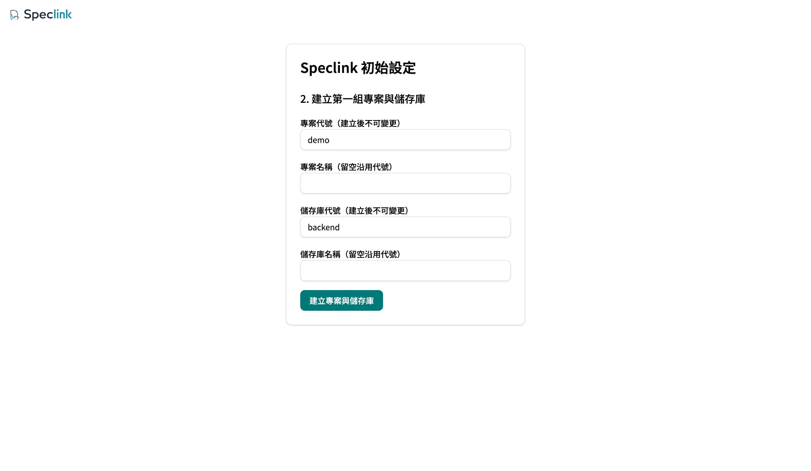

# Remote Getting Started: Server, Desktop, and CLI

[繁體中文](remote-getting-started.zh-TW.md) · **English**

Follow this guide once. You start a Speclink server on your own computer, and then you connect the Desktop app and the CLI to the same project. Each step shows the result that you must see. For the local path without a server, see [Local Repo Getting Started](getting-started.md). [Project Capability Status](product-status.md) is the reference for what works today.

The `speclink-server` in this guide is the official **reference implementation**. It lets you start out of the box and try the remote features. Remote mode does not depend on this server. Two public contracts under `openspec/specs/` define remote mode: `host-runtime` and `client-protocol`. You can write your own server on the Speclink engine and connect your own authentication, database, and permission model. The CLI and the Desktop app connect to it in the same way. The screens and commands below belong to the official server. After you connect, the contracts control what the CLI and the Desktop app do, so the behavior is the same on your own server.

## <a id="before-you-begin"></a>Before you begin

You need:

- Node.js 18 or later, to run `npx @speclink/server`. You do not need to clone this repo.
- The `speclink` CLI. The [README](../README.en.md#install) shows how to install it.
- The Desktop app (optional).

After you connect to a remote, the server keeps the specs and the changes. Your computer does not keep a writable copy. All writes go through the server.

This guide uses three types of URL. Each type has a different use. Do not mix them:

| Name | Example | Where you use it |
| --- | --- | --- |
| Server base URL | `http://localhost:8080` | New Desktop connection, `curl` health check |
| Browser page URL | `http://localhost:8080/account`, `http://localhost:8080/admin/users` | Open in a browser and sign in |
| project-scoped URL | `http://localhost:8080/api/speclink/v1/projects/demo` | CLI `speclink link` |

A project-scoped URL is the Server base URL plus `/api/speclink/v1/projects/<project key>`.

## <a id="start-server"></a>1. Start the server

Go to an empty folder and run:

```bash
npx @speclink/server
```

**Expected output**: one first-run line with a one-time setup link.

```text
Speclink 首次啟動：開啟 http://localhost:8080/setup?token=spk_setup_… 完成初始設定（此連結 24 小時內有效，且僅顯示這一次）。
```

The server prints this link only once. The link is valid for 24 hours. Copy it now.

The current folder now also contains `speclink-data/`. All data is in this folder:

- `config.yaml`: the configuration file that the launcher makes from environment variables. The launcher writes it again at each start without arguments, so manual edits do not stay.
- `store.db`: the project data (specs, changes, and more). The `store.db-wal` and `store.db-shm` files next to it are SQLite work files.
- `identity.db`: accounts, memberships, and credentials.

By default, the server listens only on `127.0.0.1:8080`. Only this computer can connect. To use a different port, run `SPECLINK_PORT=8090 npx @speclink/server`, and change the port in all later URLs. For other settings and team deployments, see [Server Deployment](server-deployment.md).

Keep this terminal open. Press `Ctrl+C` to stop the server cleanly.

Open a second terminal and make sure that the server is alive:

```bash
curl -o /dev/null -w "%{http_code}\n" http://localhost:8080/healthz
```

**Expected output**: `200`.

## <a id="first-run-setup"></a>2. Complete the first-run setup

Open the setup link in a browser. Keep `localhost` as the host in the address bar. Do not change it to `127.0.0.1`. If the host is different, the server rejects the form as a cross-origin request.

The setup has two steps:

1. Create the admin account: enter an email, a display name, and a password.
2. Create the first project and repository: this guide uses the project key `demo` and the repository key `backend`. You cannot change a key later. An empty name uses the key.



(The screenshots show the interface in Traditional Chinese. You can change the interface language.)

When the setup finishes, the browser opens the admin console overview as the admin. The "Getting started" block at the top shows the service URL, the project key, and the repository key. This block appears only once, right after the setup. Write the values down.

With the example values, the project-scoped URL for the CLI is `http://localhost:8080/api/speclink/v1/projects/demo`.

## <a id="grant-membership"></a>3. Add yourself to the project (required)

The setup creates your admin account and the `demo` project. It does **not** make you a member of `demo`. Project membership is a separate permission layer, and the admin flag does not skip it.

Without membership, you see these results:

- A read of a project resource returns `403` (`permission_denied`), not 404. A 404 means only that the project key does not exist.
- The Desktop Project and Repo list is empty.
- The CLI `speclink auth login` or `speclink auth status` shows `access denied`.

So you must do this step:

1. Open `http://localhost:8080/admin/users` in the browser.
2. Click your own account, open the "Memberships" tab, and click "＋ Add to project".
3. Select the project `demo` and the role `editor`, and then click "Add".

There are only two roles:

- `editor`: can read and write.
- `reader`: can only read.

A membership applies to a full project, so it covers every repository in that project.

To add a teammate, click "Invite user" on the same page and select the projects. The page shows a one-time invitation link. Give the link to the teammate to finish the sign-up. After the teammate accepts, the teammate is an `editor` in those projects. For the command-line method, see [Server Deployment](server-deployment.md#manage).

## <a id="access-key"></a>4. Create an access key (for CI)

You do not need an access key (PAT, Personal Access Token) for daily sign-in. By default, the Desktop app and the CLI use device sign-in: you click "Approve" once in a browser. Access keys are for CI and for environments without a browser. If you do not need one now, go to the next step.

To create an access key:

1. Open `http://localhost:8080/account` in the browser.
2. Under "Access keys", enter a name. You can leave the expiry date empty, and then the key never expires.
3. Click "Create access key", and copy the key immediately. The page shows it only once. After you leave the page, you cannot get it back.

When you click the button, the page sends POST `/api/speclink/v1/web/account/tokens` in the background. This URL accepts only POST. It is not a page that you can open. If you open it directly in a browser, you get `405 Method Not Allowed`.

Keep these three rules in mind:

- A key has no permission scope of its own. When you connect with it, you get the memberships of your account.
- Paste the key only into an app input field, or give it to the CLI through standard input (stdin). Do not put it in a URL, `.speclink.yaml`, a repo, or a documentation example. Do not type it as the value of a shell argument.
- If you lose a key, revoke it on `/account` and create a new one.

## <a id="desktop"></a>5. Connect the Desktop app

1. In the Desktop tab bar, click "Add Workspace", and then select "Server" as the source.
2. Under "Choose a Server", enter the server URL `http://localhost:8080` (the Server base URL), and then click "Add and sign in".
3. The Desktop app opens the device sign-in page `/activate` in a browser. Sign in if necessary. Make sure that the code is the same as the code in the Desktop app, and then click "Approve".
4. Go back to the Desktop app. Under "Choose a Project and Repo", select `demo` and `backend`.
5. Under "Connect a local checkout?", select one of the two modes below.
6. Click "Open Workspace".

An empty list means that you did not do section 3. Add the membership, and then reload the list in the Desktop app.

The two modes:

- **"Skip (spec mode)"**: spec-only. You read and write the remote specs and changes, with no local folder. Use it if you only work with specs.
- **"Choose local folder"**: checkout. You bind the remote project to a local Git folder. The folder must already point to the same remote, or it must be a Git repo with no binding. Select at least one AI tool. Before the workspace opens, the Desktop app writes the Speclink skill files into the folder. If a step fails, the screen stays on that step so you can try again.

The Desktop app keeps your credentials in the system keychain, not in project files. On one computer, the Desktop app and the CLI share the same device sign-in.

The Desktop app shows an access key field only when the server does not support device sign-in. The official server supports device sign-in, so you do not see this field. If the field appears with your own server, paste the key that you copied from `/account`.

For the differences between the remote board and the local board, see [Project Capability Status](product-status.md).

## <a id="cli"></a>6. Connect the CLI

**Do this step in a separate test folder.** `speclink link` writes the connection into the `.speclink.yaml` file of the current project. If you run it in the root of a product repo, that repo connects to this test server.

```bash
mkdir speclink-remote-test
cd speclink-remote-test
speclink link http://localhost:8080/api/speclink/v1/projects/demo --repo backend
```

**Expected output** (when this computer is not signed in to this server):

```text
✓ Linked to http://localhost:8080/api/speclink/v1/projects/demo
  No credentials yet — run `speclink auth login` to connect
```

Use the repository key for `--repo`. If the key does not match, `link` shows the available keys and stops. It writes nothing.

The Desktop app and the CLI share the device sign-in. If you signed in with the Desktop app in section 5, the output has one more line, `✓ Repo 'backend' is registered in this project`, and you can skip `auth login` below. If not, sign in and check the result:

```bash
speclink auth login
speclink auth status
```

`auth login` shows a URL and a code, and it opens `/activate` in a browser. Click "Approve" to finish the sign-in. `auth status` shows your identity. Its last line is `Repo 'backend' is registered in this project`, which means that the repository key matches.

Do one read and write test:

```bash
speclink new change smoke-test
speclink list
```

**Expected output** (from `list`):

```text
Changes:
  • smoke-test
```

The Desktop board also shows `smoke-test`. When you finish the test, run `speclink discard smoke-test` to remove it.

### In CI or without a terminal

Device sign-in needs an interactive terminal. Outside a terminal, `speclink auth login` stops with an error. In that case, use an access key in one of these ways:

- Set the environment variable `SPECLINK_TOKEN` from the secret store of your CI. The CLI uses it first.
- Run `speclink auth login --token-stdin` to read the key from standard input. To paste the key by hand, use `speclink auth login --pat`.

After a sign-in with a key, the CLI keeps the key in a credentials file in your user configuration folder. Only your account can read that file, and it is not in the repo. `speclink auth logout` removes only this local copy. The key on the server stays valid until you revoke it on `/account`.

### Verb differences in remote mode

Most verbs work as usual in remote mode, and they write to the server. These are the exceptions. If you run one in the wrong mode, the CLI refuses it:

- Local only: `demo`, `trace`, `change rank`, `plan --strict-overlap`.
- Remote only: `claim`.

For the full list, see the [Verb and Flag Contract](verb-contract.md). In checkout mode, AI tools read the read-only `.speclink/context/` folder. Do not edit it. To update it, run `speclink instructions` again.

## <a id="restart"></a>7. Data stays after a restart

Press `Ctrl+C` in the server terminal. Then run `npx @speclink/server` again in the same folder.

This time the server does **not** print a setup link. This is correct: the setup is complete, and the data is in `speclink-data/`. Then check these results:

- `speclink list` still shows `smoke-test`.
- The remote tab in the Desktop app is still there. It connects again when the server comes back.
- If you open the setup link again, the page shows "Setup link is not valid", because the setup is closed.

If you restart before the setup is complete, the server does not print a new link either. The first link stays valid for 24 hours. If you cannot find it, wait until it expires and restart, and the server prints a new one. Or reset as in section 9.

## <a id="offline"></a>8. When the server is offline

Try this once on purpose: keep a remote tab open in the Desktop app, and press `Ctrl+C` in the server terminal. The tab goes offline:

- The Desktop app shows "Connection interrupted". The screen keeps the last content that loaded successfully, and you can still read it.
- The Desktop app disables all write actions (check a task, save a document, change settings). It does not queue them for later.
- CLI commands fail with `Error: server unreachable — …`.

Start the server again. The Desktop app connects again by itself, queries the server again, and updates the screen. You do not need to reload. Changes that other people made during the outage also appear.

## <a id="reset"></a>9. Full reset

With npx, all data is in `speclink-data/`. To start from zero:

1. In the test folder, run `speclink auth logout` to remove the sign-in for this server from this computer.
2. Stop the server and remove the data folder:

   ```bash
   rm -rf ./speclink-data
   ```

3. Remove the test folder `speclink-remote-test`. In the Desktop app, remove this connection in Settings → Servers.

The next `npx @speclink/server` prints a new setup link, and everything starts again.

To move data or to make regular backups, see [Server Backup and Restore](server-backup.md). To develop inside a Speclink source checkout, use `npm run dev`, and use `npm run dev:reset` to reset. See [Development](development.md).

## <a id="troubleshooting"></a>Troubleshooting

| Symptom | Cause and fix |
| --- | --- |
| You cannot find the setup link, and a restart does not print it | The server prints the link only once. Before the setup is complete, the first link is valid for 24 hours. After it expires, a restart prints a new one. If you do not need the data, reset as in section 9. |
| After the setup, the setup link shows "Setup link is not valid" | This is correct: the setup closes permanently when it is complete. Sign in at `/admin`. |
| A form shows a cross-origin rejection | The scheme, host, and port in the address bar must be the same as the server `public_url`. For example, use `localhost`, not `127.0.0.1`. |
| The Desktop Project and Repo list is empty, the CLI shows `access denied`, or the API returns `403` (`permission_denied`) | The account is signed in but has no membership. This applies to admins too. Give the account `reader` or `editor` on `/admin/users`, and then reload the list in the Desktop app. |
| You open `/api/speclink/v1/web/account/tokens` in a browser and get `405` | This URL accepts only POST. Use the form on the `/account` page to create an access key. |
| You lost an access key | You cannot get it back. Revoke it on `/account` and create a new one. |
| `speclink auth login` says that it needs a terminal | You are not in an interactive terminal. Use `--token-stdin` or `SPECLINK_TOKEN`. See section 6. |
| `link` or `auth status` says `repo '…' is not registered in this project` | The `--repo` value does not match the repository key. The message shows the available keys. Run `speclink link` again with the correct key. |
| The server URL changed | In the test folder, run `speclink unlink`, and then run `link` with the new URL. In the Desktop app, add a new connection. |
| The server does not start, or `/healthz` does not return `200` | Read the error in the server terminal. If the configuration has an error, the server stops. It never starts with a bad configuration. |
| You run `speclink-server` directly and see `missing required argument --config` | The binary always needs `--config`. Use `npx @speclink/server`, or give your own configuration file. See [Server Deployment](server-deployment.md). |
| The CLI behavior does not match this guide | Usually, an old `speclink` is on your PATH. Run `speclink --version` to check the version. Inside a Speclink source checkout, use `npm run cli -- <args>`. It always runs the CLI built from that checkout. |
