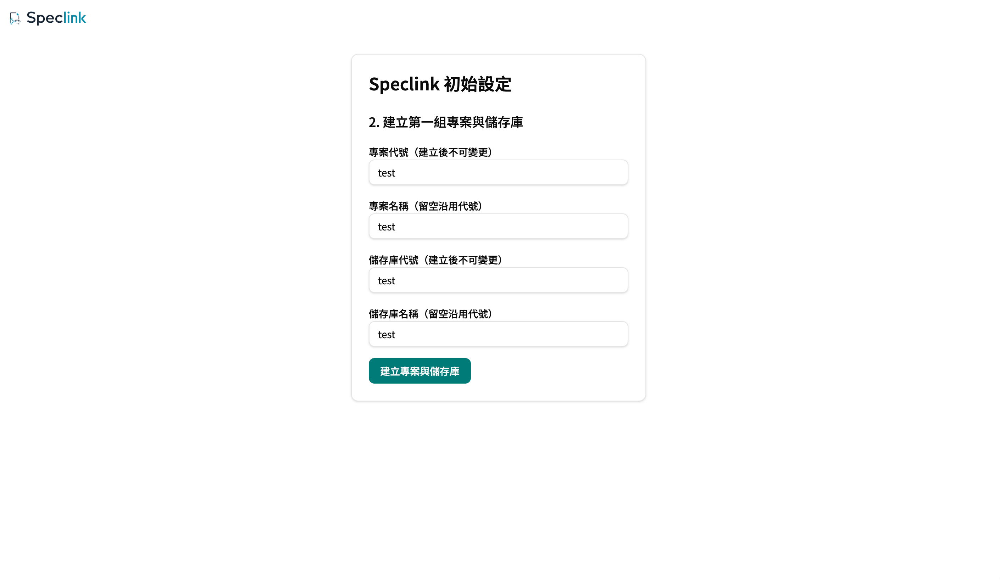

# Speclink Remote Server、Desktop 與 CLI 入門

**繁體中文** · [English](remote-getting-started.md)

這份文件從零帶到一個可用的 Remote Store：起 server → 完成首次設定 → 授予成員資格 → 建立憑證 → 接上 Desktop 與 CLI → 失聯後怎麼回來。

本文只寫今天確認可走的入口。哪些能力真的可用，以[專案能力狀態](product-status.zh-TW.md)為準。本地不需要 server 的那條路徑，見[Local Repo 入門](getting-started.zh-TW.md)。

這裡用的 `speclink-server` 是官方的**參考實作**，目的是讓你開箱即用、或直接試遠端功能。遠端模式本身不綁它：Host 與 Protocol 是公開契約，你也可以拿 Speclink 引擎自己寫一個 server 端，接自家的認證、資料庫與權限模型。下面的操作步驟屬於官方那一份；接上之後的 CLI 與桌面行為則由契約決定，換 server 也一樣。

## 1. Before you begin / 開始前

你需要：

- 一台可執行 server 的機器——Node.js 或 Docker 擇一即可，不必 clone 這個 repo。
- 一份 `speclink` CLI（安裝方式見 [README](../README.md#install--安裝)）。
- 想用圖形介面的話，再加一份 Desktop app。

先確定 Local 與 Remote 的分工：Remote Store **不會**同步成第二份可寫的本地真相。有 checkout 的 Agent 讀的是唯讀的 `.speclink/context/`，寫入一律走 Host command。

## 2. Start a server / 啟動 Server

最短路徑是 npx，有 Node 就能跑：

```bash
npx @speclink/server
```

**預期輸出**：一行首次啟動訊息，帶著只顯示一次的 setup 連結——

```text
Speclink 首次啟動：開啟 http://localhost:8080/setup?token=spk_setup_… 完成初始設定（此連結 24 小時內有效，且僅顯示這一次）。
```

同時在當前目錄產生 `speclink-data/`，裡面有三個檔案：`config.yaml`、`store.db` 與 `identity.db`。`config.yaml` 是 launcher 由環境變數產生的單一組態來源。要換埠或換後端，用環境變數：

```bash
SPECLINK_PORT=8099 SPECLINK_STORE=serverfs npx @speclink/server
```

確認活著：

```bash
curl -o /dev/null -w "%{http_code}\n" http://localhost:8080/healthz
```

**預期輸出**：`200`。

另外還有兩條路徑。正式對外部署走 Docker 或 compose，見[Server 部署](server-deployment.zh-TW.md)。在這個 repo 的 checkout 內開發則走 `npm run dev`，只要後端就用 `npm run dev:server`，見[開發環境入口](development.zh-TW.md)。

走 checkout 這條時，`npm run dev` 會**先建置當前 checkout 的 `speclink-cli`**，成功之後才啟動 server 與 Desktop。建置失敗就以非零結束，不留下任何長時間執行的 process。這個順序是刻意的：它保證第 7 節用來核對的 CLI 與這台 server 來自同一份原始碼。

直接執行 `speclink-server` binary 時**必須**帶 `--config <yaml>`，它不會自己從環境變數組出組態——那是 launcher 的工作。

保持這個終端執行，`Ctrl+C` 正常停止。

## 3. Complete first-run setup / 完成首次設定

在瀏覽器開啟終端印出的 `/setup?token=…`：



依畫面建立三樣東西：

1. 第一位管理員：email、顯示名稱與密碼。
2. 第一個 Project：本文件使用 key `demo`。
3. 第一個 Repo：本文件使用 key `backend`。

完成頁會顯示服務網址、專案代號與儲存庫代號。依這組範例，project-scoped URL（第 7 節 `link` 要用的連線網址）是：

```text
http://localhost:8080/api/speclink/v1/projects/demo
```

之後重啟 server，`/setup` 會關閉且 setup token 不再重印——**這代表身分與 Store 已經持久化，不是啟動失敗**。

## 4. Grant Project membership / 授予 Project membership

帳號能登入不等於看得到專案，成員資格是另一層，Server Admin 身分也不會繞過它。

**先給你自己——這一步是必經的。**`/setup` 建立了你的 Admin 帳號與 `demo` 專案，但沒有授予任何 membership；在你補上之前，`speclink auth status` 會回 access denied、Desktop 的 scope 清單也是空的。以管理員登入後開 `/admin/users`，把你自己的帳號加入 `demo` 並給 `editor` 角色；若 Desktop 的 scope 清單已經開著，之後重新載入一次。接著再用同樣的兩種做法授予其他人：

**從後台**——開 `/admin/users`，把對象加入 `demo` 專案並指定角色。沒有 membership 的人即使登入成功，讀取該專案的資源也只會拿到 `403`（`permission_denied`）。

**從命令列**（headless，適合腳本化）——邀請一位新成員並直接帶上專案：

```bash
speclink-server invite --config ./speclink-data/config.yaml \
  --email teammate@example.com --display "Teammate" --project demo
```

**預期輸出**：一次性的接受邀請網址，把它交給對方完成註冊。

其餘管理動作同樣有 headless 入口：`speclink-server user suspend|reactivate`、`speclink-server token revoke`、`speclink-server project create` 與 `speclink-server repo create`。全部都需要 `--config` 指向資料目錄裡的組態檔。

## 5. Create a PAT safely / 安全建立 PAT

日常登入用不到 PAT，CLI 預設走 device authorization。PAT 是給 CI 或無瀏覽器環境用的。

在 `/account` 頁面建立 PAT。按下建立時，該頁送出一個同源的瀏覽器 API 請求：POST `/api/speclink/v1/web/account/tokens`。這個端點只接受 POST，不是可以直接開的網頁，所以不要用瀏覽器 GET 它。

建立時記住三件事：只給需要的專案範圍、設定到期日，而且**全文只顯示一次**。離開頁面後就拿不回來，只能撤銷重發：

```bash
speclink-server token revoke --config ./speclink-data/config.yaml <token-id>
```

不要把 PAT 放進 repo、shell 歷史或截圖裡。

## 6. Connect the Desktop app / 連接 Desktop app

在 Desktop 的「設定 → 伺服器」新增一個連線，填入服務網址，然後登入。預設走 device 流程，瀏覽器開一次授權即可；無瀏覽器時可改貼 PAT。憑證存在 OS 的 Keychain，不落在專案檔案裡。

登入之後，在 workspace chooser 選這個連線，挑 Project 與 Repo，接著決定要不要接一個本機資料夾。這一步有兩種模式：

- **略過（規格模式，spec-only）**：直接開遠端規格，不連本機 working tree。適合只看規格、不動程式碼的人。
- **選擇本機資料夾**：把遠端 workspace 綁到一個本機 Git checkout。這個資料夾必須帶對應的 remote 標記，或者是一個尚未綁定的 Git repo；開啟前會先把選定的受管產物（技能檔那類）同步進去，任一步失敗就停在原步驟讓你重試，不會開出半套分頁。

開起來之後，遠端看板和本地看板一樣可以瀏覽 change、勾任務、讀寫 artifact。

還沒閉合的小縫：在這個遠端看板勾任務不會回報 touched files（CLI 路徑會），認領也還沒有釋放或搶佔的動詞。逐項現況見[專案能力狀態](product-status.zh-TW.md)的 Desktop Remote Workspace 一列——請以那裡為準，不要從這份文件推論。

## 7. Connect the CLI / 連接 CLI

在要接上遠端的 repo 目錄：

```bash
speclink link http://localhost:8080/api/speclink/v1/projects/demo --repo backend
speclink auth login
speclink auth status
```

`link` 記錄連線與這個 repo 在遠端的註冊名稱。`auth login` 預設走 device authorization，終端會給一組代碼與網址。`auth status` 回報目前身分與 repo 的核對結果。

接上之後，日常動詞照舊。`list`、`show`、`status`、`instructions`、`new`、`task`、`in-progress`、`discuss`、`review`、`verify` 與 `archive` 都有遠端臂，會作用在遠端 Store 而不是本地。

有兩個例外：`demo` 只在本地可用，`claim` 只在遠端可用。兩者在錯誤的模式下都會明確拒絕，不會靜默改道。動詞的模式歸屬見[動詞與旗標契約](verb-contract.zh-TW.md)。

有 checkout 時，Agent 讀的是唯讀的 `.speclink/context/` 投影。**不要直接編輯它**——那不算遠端寫入，下一個命令會判定投影已被改動而拒絕。要刷新就重新取得 instructions。

**在這個 repo 的 checkout 內核對時，一律用 wrapper 而不是 PATH 上的 `speclink`**：

```bash
npm run cli -- auth status
npm run --silent cli -- list --json
```

`npm run cli -- <args>` 固定執行這個 checkout 的 CLI，binary 不存在時會先自動建置，絕不 fallback 到 PATH。需要純機器可讀的 stdout 時加 `--silent`。Node SDK 不是 npm workspace 成員，要測它得用 `npm --prefix crates/speclink-node test`。

## 8. Recover from a lost connection / 失聯恢復

值得刻意觀察一次：開著遠端分頁時把 server 停掉，讓分頁進入離線（offline）狀態。看板會把最後載入的內容保留成唯讀 snapshot，可讀、標示 stale，所有寫入操作（勾任務、存 artifact 或設定）都被停用——不會排隊等重送。把 server 重新啟動，分頁會自己收斂：以 ETag 輪詢、回到 online、清掉 stale 標示，全程不需要手動重整；失聯期間別人做的變更會在重查後出現。

若沒有自動恢復，再對照症狀表：

| 症狀 | 怎麼回來 |
| --- | --- |
| 憑證過期或被撤銷 | 重跑 `speclink auth login`；device 流程會重新授權。 |
| `auth status` 說 repo 核對失敗 | 遠端的 repo 註冊名稱與 `link --repo` 對不上，重跑 `speclink link` 並帶正確名稱。 |
| 投影標記為 STALE 或被改動 | 不要手動修，重新執行 `speclink instructions ... --json` 讓它重新物化。 |
| server 換了網址 | `speclink unlink` 之後以新網址重新 `link`。 |
| 想徹底登出這台裝置 | `speclink auth logout`——撤銷這台裝置的憑證族並清除本地憑證。 |
| server 起不來、`/healthz` 不回 200 | 看 server 終端的錯誤；組態不合法時它會以非零結束而不是帶病啟動。 |

## 9. Reset and clean up / 重置與清除

npx 路徑的所有狀態都在 `speclink-data/`，刪掉它就回到全新的 `/setup`：

```bash
rm -rf ./speclink-data
```

repo 內開發用的 `npm run dev`，對應的重置指令是 `npm run dev:reset`，它只清 `.dev/`、不動 `.env`。要保留資料的搬遷與定期備份，見[Server 備份與還原](server-backup.zh-TW.md)。

## 10. Troubleshooting / 故障排除

- **`/setup` 打不開、token 不再出現**：那是正常的——設定已完成一次，token 只顯示一次。要重來就清掉資料目錄。
- **直接跑 `speclink-server` 說 `missing required argument --config`**：binary 不讀環境變數，改用 `npx @speclink/server`，或自己帶 `--config`。
- **登入得了卻看不到專案（`auth status` 回 access denied，或 Desktop 的 scope 清單是空的）**：那是成員資格沒給——第一位管理員也一樣，Admin 身分不會繞過 membership；回第 4 節。
- **PAT 弄丟了**：拿不回來，撤銷後重發。
- **CLI 行為和文件對不上**：多半是 PATH 上有一顆過期的 `speclink`，來自另一個 checkout 或沒跟上的安裝版。在這個 repo 內改用 `npm run cli -- <args>`，它只跑當前 checkout 的 CLI。要確認你手上那顆是哪一版，跑 `speclink --version` 與 `npm run --silent cli -- --version` 比對引擎版號。
- **不確定某項遠端能力到底有沒有**：查[專案能力狀態](product-status.zh-TW.md)的本地與遠端對照表，一列就看得到兩邊狀態。
