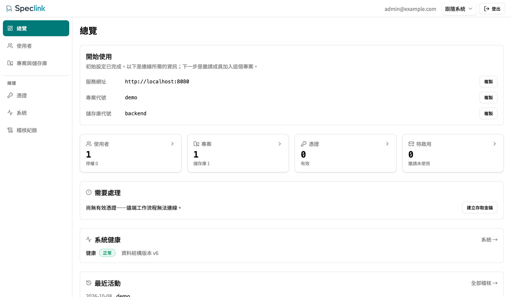
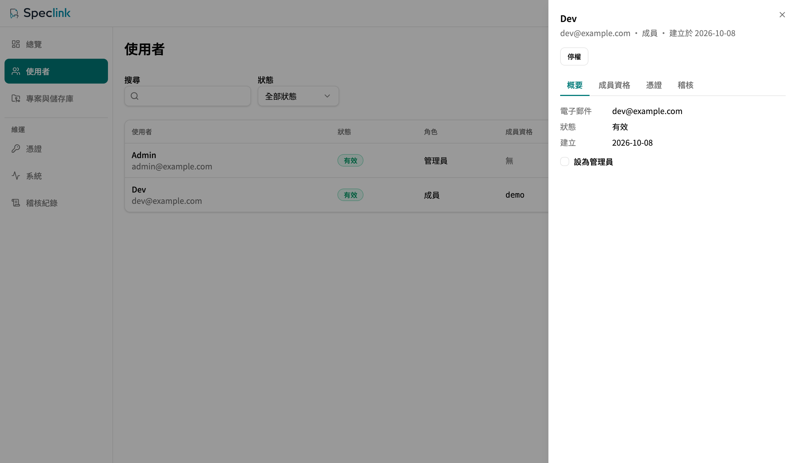

# Server Deployment

[繁體中文](server-deployment.zh-TW.md) · **English**

This document shows how to run the official `speclink-server` for a team. It covers the run modes, the configuration, HTTPS, the management commands, and upgrade and rollback. For a first trial, follow [Remote Getting Started](remote-getting-started.md) once. That guide takes you through the first-run setup, the memberships, and the Desktop and CLI connections.

## <a id="reference-implementation"></a>The official server is a reference implementation

`speclink-server` is the official Speclink **reference implementation**. It lets you start out of the box and try the remote features. Remote mode does not depend on this server. Two public contracts under `openspec/specs/` define remote mode: `host-runtime` and `client-protocol`. You can write your own server on the Speclink engine and connect your own authentication, database, and permission model. The CLI and the Desktop app connect to it in the same way. This document covers only the deployment of the official server.

## <a id="choose"></a>Choose a run mode

| Run mode | Use it for | Data location |
| --- | --- | --- |
| [npx](#npx) | A single-machine trial with Node.js | `./speclink-data/` |
| [Docker](#docker) | One container | `/data` in the container |
| [Docker Compose (SQLite)](#compose) | The default for a production deployment | A named volume |
| [Docker Compose (PostgreSQL)](#compose) | Teams that already operate PostgreSQL | PostgreSQL and a named volume |
| [Build from source](#build-from-source) | Your own binary | The paths in the configuration file |

All run modes use the same binary. The build embeds the browser console (`apps/server-web`) into `speclink-server` at compile time. The console and the API use the same URL. At run time, the server needs no Node.js, no external `dist` folder, no CDN, and no second static file server.

Each storage backend supports only **one** server instance. Do not use `--scale`, and do not point two servers at the same data. SQLite and PostgreSQL do not block a second instance. For details, see [Server Storage Backends](server-store-drivers.md).

After the start, all run modes behave the same:

- `GET /healthz` returns `200` when the process is alive. `GET /readyz` returns `200` when the storage backend is available, and `503` when it is not.
- At the first start (no admin yet), the server prints a one-time `/setup?token=…` link to stdout. The link is valid for 24 hours. When the setup is complete, the setup closes permanently.
- If the configuration has an error (an unreadable file, a bad format, an unknown storage backend), the server opens no port and stops with a non-zero exit code.

## <a id="npx"></a>npx

You need Node.js 18 or later. The supported platforms are macOS (arm64, x64), Linux (x64, arm64), and Windows (x64).

```bash
npx @speclink/server
```

Without arguments, the launcher does three things:

1. It makes `speclink-data/config.yaml` from the [environment variables](#configuration). It writes this file again at each start, so manual edits do not stay.
2. It uses SQLite by default and keeps the data in `./speclink-data/`.
3. It starts the server, which listens only on `127.0.0.1:<SPECLINK_PORT>`.

With arguments, the launcher gives the arguments to the server binary without changes, for example `npx @speclink/server invite --config ./speclink-data/config.yaml …`. To get a fixed `speclink-server` command, run `npm i -g @speclink/server`.

By default, only the local computer can connect to an npx server. For a team, use Docker Compose with an [HTTPS reverse proxy](#https) in front. If you must use npx, keep your own configuration file and start with `npx @speclink/server --config <file> --addr 0.0.0.0:8080`. With `--config`, the launcher does not change your configuration file.

## <a id="docker"></a>Docker

The official image is `ghcr.io/momochenisme/speclink-server`. It supports `linux/amd64` and `linux/arm64`. Each release pushes three tags: the full version (for example `0.8.0`), the `major.minor` version (for example `0.8`), and `latest`.

```bash
docker run -d --name speclink \
  -p 8080:8080 \
  -v speclink-data:/data \
  ghcr.io/momochenisme/speclink-server:latest
docker logs speclink        # get the one-time setup link
```

The image contains a default configuration. It keeps the store and identity SQLite files in `/data`, and `public_url` is the default `http://localhost:8080`. The server runs as a non-root user with uid 10001. The container health check calls `/healthz`.

The configuration file does not expand environment variables. To change `public_url` or the storage backend, mount your own configuration file over the file in the image:

```bash
docker run -d --name speclink \
  -p 8080:8080 \
  -v speclink-data:/data \
  -v ./server.yaml:/etc/speclink/config.yaml:ro \
  ghcr.io/momochenisme/speclink-server:latest
```

If the port mapping is not `8080:8080`, or the public URL is not `http://localhost:8080`, you must change `public_url`. If you do not, the setup link shows the wrong URL, and the server rejects browser forms because the origin does not match.

## <a id="compose"></a>Docker Compose

The `deploy/` folder of the repo contains two compose files. Both keep `/data` in a named volume and make the configuration from environment variables.

SQLite (default):

```bash
cd deploy
docker compose pull          # get the official image first
docker compose up -d
docker compose logs server   # get the one-time setup link
```

PostgreSQL (two services: server and postgres):

```bash
cd deploy
cp .env.example .env         # set SPECLINK_POSTGRES_PASSWORD; .env stays out of version control
docker compose -f docker-compose.postgres.yml pull
docker compose -f docker-compose.postgres.yml up -d
```

In the PostgreSQL file, the server starts only after postgres is healthy. The account data (identity) stays in a SQLite file under `/data`. For the limits of this storage backend, see [Server Storage Backends](server-store-drivers.md#postgres).

The compose files contain both `image:` and `build:`. If you do not run `pull` first and the image is not on the machine, `up` builds the image from source. This needs the full repo, and the Rust build takes several minutes.

After a container restart, the data stays in the volume, and the server does not print the setup link again.

## <a id="build-from-source"></a>Build from source

The build order from source is `npm ci`, then `npm run build -w apps/server-web`, and then the `speclink-server` build. Run these commands in a checkout of the repo:

```bash
npm ci
npm run build -w apps/server-web
cargo build --release -p speclink-server
```

The output is `target/release/speclink-server`. Step 3 embeds the `apps/server-web/dist` output of step 2 into the binary. If `apps/server-web/dist/index.html` is missing, the release build fails at compile time. It never makes a binary with the API but no console. The Docker image uses a multi-stage build with the same order, and the final image contains no Node.js.

Prepare a configuration file, and then start the server:

```bash
./target/release/speclink-server --config /etc/speclink/server.yaml --addr 0.0.0.0:8080
```

The binary always needs `--config`. The default `--addr` is `127.0.0.1:8080`, so only the local computer can connect. To serve other computers, set the bind address. With a process manager such as systemd, set `Restart=on-failure`.

## <a id="configuration"></a>Environment variables and configuration file

### Environment variables

| Variable | Run modes | Default | Description |
| --- | --- | --- | --- |
| `SPECLINK_STORE` | npx | `sqlite` | The storage backend: `sqlite`, `serverfs`, or `postgres`. |
| `SPECLINK_DATA_DIR` | npx | `./speclink-data` | The data folder for the configuration file and the databases. |
| `SPECLINK_PORT` | npx, Compose | `8080` | npx: the port that the server listens on at `127.0.0.1`. Compose: the host port (the container port is always 8080). |
| `SPECLINK_PUBLIC_URL` | npx, Compose | `http://localhost:<SPECLINK_PORT>` | The public URL: the scheme, host, and port in the browser address bar of your users. Setup links, invitation links, and the same-origin check use it. Always set it for production. |
| `SPECLINK_POSTGRES_URL` | npx | None (required for `postgres`) | The PostgreSQL connection URL. Keep the password out of it. |
| `SPECLINK_POSTGRES_PASSWORD` | All | None (required for the PostgreSQL compose file) | The PostgreSQL password. The server reads this variable itself and adds it to a connection URL without a password. |
| `SPECLINK_CONFIG` | npx | None | Use an existing configuration file. With it, the npx-only variables above have no effect, and the launcher does not set `--addr`, so the server listens on `127.0.0.1:8080`. Subcommands such as `invite` still need their own `--config`. |

When you run the binary directly or with `docker run`, the server reads only `SPECLINK_POSTGRES_PASSWORD`. All other settings are in the configuration file.

### Configuration file

The server reads one YAML configuration file:

| Field | Required | Description |
| --- | --- | --- |
| `store` | Yes | The storage backend (`driver` plus `path` or `url`). See [Server Storage Backends](server-store-drivers.md). |
| `identity` | Yes | The account database: `driver: sqlite` plus `path`. |
| `public_url` | No | The public URL. The default is `http://localhost:8080`. |
| `events` | No | Settings for the live event stream: `retention` (events kept per scope, default 1024), `buffer` (buffer per connection, default 256), and `heartbeat_secs` (heartbeat interval in seconds, default 15). |

Example:

```yaml
store:
  driver: sqlite
  path: /var/lib/speclink/store.db
identity:
  driver: sqlite
  path: /var/lib/speclink/identity.db
public_url: https://speclink.example.com
```

The old `tokens` and `projects` sections are no longer valid. If the file contains one of them, the server does not start, and the error shows what to use instead.

## <a id="https"></a>HTTPS and reverse proxy

The server does not handle TLS. For a team, put a reverse proxy in front of the server to provide HTTPS.

You need this: the sign-in cookie always has the `Secure` attribute, and browsers keep it only over HTTPS or on `http://localhost`. If you deploy with `http://` and a host that is not localhost, the browser does not keep the sign-in. Then nobody can sign in to the console or to the device approval page.

The reverse proxy must do these things:

- Provide HTTPS and send the requests to the server port.
- Set `public_url` to the HTTPS URL that your users open. If the scheme, host, or port is different, the server rejects write requests from the browser (`403`, `same_origin_required`).
- Do not buffer `/api/speclink/v1/projects/<project key>/events`. This is a long-lived event stream (Server-Sent Events). The server sends a heartbeat every 15 seconds, so the idle timeout of the proxy must be longer than that.

## <a id="manage"></a>Management commands

Most console actions also have a command-line version for scripts. Each subcommand needs `--config` with the path of the server configuration file:

| Command | Purpose |
| --- | --- |
| `invite --email <email> --display <name>` | Make a one-time invitation and print the acceptance URL. You can repeat `--project <project key>`; after the invitee accepts, the invitee is an `editor` in that project. `--admin` gives the admin flag. `--expires-in-days` defaults to 7 days. |
| `user suspend --email <email>` / `user reactivate --email <email>` | Suspend or reactivate a user. You cannot suspend the last active admin. |
| `token revoke --token-id <id>` | Revoke an access key. The id starts with `pat_`, and it is not the key itself. The console shows only the key prefix, so it is usually easier to revoke a key on `/admin/credentials`. |
| `project create --key <project key> [--name <name>]` | Make a project. |
| `repo create --project <project key> --key <repository key> [--name <name>]` | Make a repository in a project. |

No command adds a membership to an existing account. Use `/admin/users` for that.

The start of the command depends on the run mode:

```bash
# npx (run it in the folder that contains the data folder)
npx @speclink/server invite --config ./speclink-data/config.yaml \
  --email dev@example.com --display "Dev" --project demo

# Docker Compose (while the server runs)
docker compose exec server speclink-server invite \
  --config /etc/speclink/config.yaml \
  --email dev@example.com --display "Dev" --project demo
```

For the backup, verify, and restore commands, see [Server Backup and Restore](server-backup.md).

## <a id="verify-deployment"></a>Check the deployment

After the deployment and the `/setup`, do these three checks to make sure that the server works.

First, look at the console overview. Right after the setup, the top of the overview shows a "Getting started" block one time. It shows the service URL, the project key, and the repository key:



- The service URL must be the same as the URL that your users open. If it is not, change `public_url`.
- "System health" shows "Healthy", and the data schema version has a value.
- The "Needs attention" item "No active credentials — remote workflows cannot connect." is normal. It goes away after a person signs in with the Desktop app or the CLI, or creates an access key.

Second, look at the Users page to check the memberships. A sign-in does not give access to a project. The role and the membership are two separate columns. The admin from the setup starts with no membership:



Each person who uses the remote must see the target project in the "Memberships" column. For the steps to add a membership, see [Remote Getting Started](remote-getting-started.md#grant-membership).

Third, run a health check from a different computer:

```bash
curl -o /dev/null -w "%{http_code}\n" https://<your-url>/healthz
```

The check passes only with `200`.

## <a id="upgrade"></a>Upgrade

To upgrade, change to the new version and restart. The server runs as one instance, so there is no rolling update.

1. Make a backup first, and make sure that `verify-backup` passes. See [Server Backup and Restore](server-backup.md).
2. Change to the new version and restart:
   - Docker Compose: `docker compose pull && docker compose up -d`. The volume does not change.
   - npx: `npx @speclink/server@<new version>`.
   - Your own binary: replace the binary and restart.
3. Make sure that `/healthz` and `/readyz` both return `200`.

If the new version needs a newer account database (identity) structure, the server upgrades the database automatically at start. If the configuration or the data is not compatible, the server stops with a non-zero exit code. It never starts with an error.

## <a id="rollback"></a>Rollback

To roll back, deploy the **previous** binary or image:

- Docker Compose: change `image:` in the compose file to the previous tag (for example `ghcr.io/momochenisme/speclink-server:0.7.0`), and then run `docker compose up -d`. The volume does not change.
- npx: `npx @speclink/server@<previous version>`.
- Your own binary: check out the previous tag and build again, or use the previous image.

Up to 0.8.0, all versions use the same data format (account database structure version 6, storage format version 1). A rollback needs no data change. The "Data schema version" on the console "System" page shows the current account database version.

A future version can raise the account database version. In that case, the upgrade changes the database automatically, and an older server refuses to open the newer database. A rollback then needs the backup from before the upgrade, restored into an empty target. So always make a backup before an upgrade.

## <a id="related"></a>Related documents

- [Remote Getting Started](remote-getting-started.md): first-run setup, memberships, and the Desktop and CLI connections.
- [Server Storage Backends](server-store-drivers.md): how to choose SQLite, serverfs, or PostgreSQL.
- [Server Backup and Restore](server-backup.md): `backup`, `verify-backup`, `restore`, and schedules.
