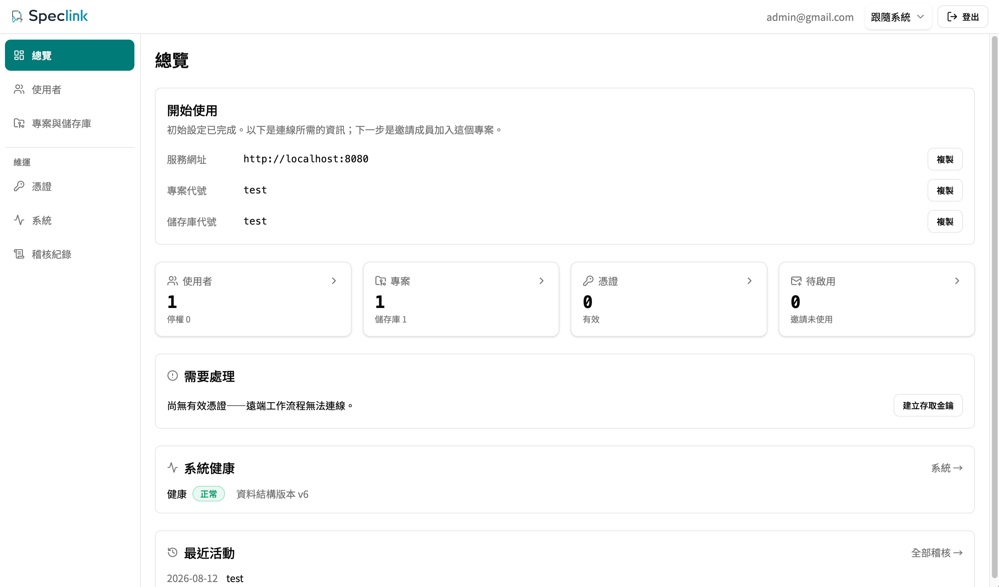
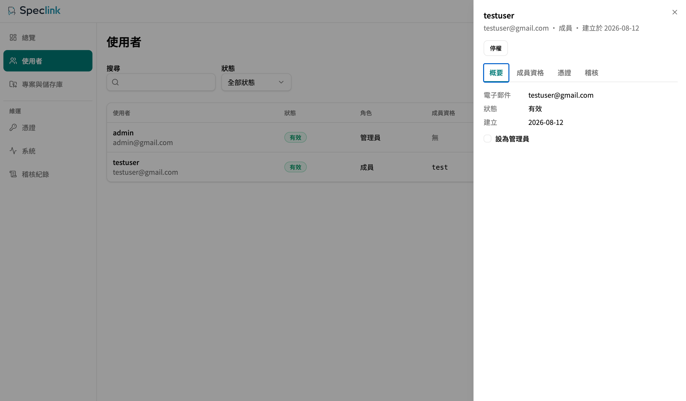

# Server 部署

`speclink-server` 是 Speclink Host 的**官方參考實作**——它是 wire contract 的活基準，也是給你開箱即用與測試遠端功能的那一份。遠端模式不限定用它：Host 與 Protocol 是公開契約（見 `openspec/specs/` 的 `host-runtime` 與 `client-protocol`），你可以照契約做自己的 server 端。本文只講官方這一份怎麼部署。

它有四種發布形態：

1. npx 一行啟動（npm 套件）
2. Docker image 直跑
3. SQLite 單容器 compose
4. PostgreSQL compose profile

後三種共用同一個映像，發布於 `ghcr.io/momochenisme/speclink-server`；tag 對齊 release 版本，另附 `latest`。native binary 不隨 GitHub Release 發布，需要時走[從原始碼建置](#替代路徑從原始碼建置native-binary)的替代路徑。

若目標是從全新資料完成 `/setup`、membership、Desktop 與 Remote CLI，而不是部署正式服務，請先依
[Remote Server、Desktop 與 CLI 入門](remote-getting-started.zh-TW.md)操作。

## 交付物：內嵌 SPA 的單一 binary／image

瀏覽器主控台是 `apps/server-web` 的 React SPA，它在**編譯期內嵌**進 `speclink-server`。`index.html`、manifest、hashed JS 與 CSS、字型與圖示，全部與 API 打包在同一支 binary 或 image 裡，永遠 same-origin、永遠同版本。

**runtime 不需要 Node、外部 `dist` volume、CDN，也不需要第二個靜態檔服務。** 把單一 binary 或 image 放進空環境，就載入得出完整 UI。

需要編譯的三種形態——native binary、Docker image、本機 production build——都走同一個建置順序：

1. `npm ci`：依 lockfile 安裝依賴。
2. `npm run build -w apps/server-web`：Vite production build 產出 `dist`。
3. `cargo build --release -p speclink-server`：於編譯期內嵌 `dist`。

缺少 `index.html` 或 manifest 時，server 的 release build **fail closed**：以非零 exit code 結束，並提示「先建置 `apps/server-web`」。它不會產出只有 API、沒有 UI 的 artifact。

Docker image 以 multi-stage 達成同一個保證：Node stage 產 `dist`，Rust stage 內嵌，最終 runtime 只有 non-root server binary。映像內不帶 Node runtime。

不論哪種形態，啟動後的行為一致：

- **健康檢查**：`GET /healthz` 回程序存活、`GET /readyz` 回 store 就緒（未就緒為 503）。
- **setup token**：首次啟動（尚無 admin）時，stdout 印一行含 `/setup?token=…` 的一次性連結，24 小時內有效。容器形態用 `docker compose logs server`（或 `docker logs <容器>`）取得。開瀏覽器走完 `/setup`（建立 admin → 首個 project/repo）後 setup 永久關閉。
- **組態**：YAML 檔經 `--config` 指定，欄位與各 store driver 的選型見[Server Store Driver 選型](server-store-drivers.zh-TW.md)。組態壞或 driver 未知時 server 拒絕啟動並以非零 exit code 結束（fail closed），不會以部分預設服務。

## 單一 instance 限制

SQLite 與 serverfs profile **只允許一個 server instance**。不要 `--scale`，也不要讓多個 replica 指向同一個資料目錄或 volume。SQLite 的單寫者檔案鎖會讓第二個 instance 顯性報錯，而不是靜默共用。

需要多 instance 之前，先換 PostgreSQL driver。即便如此，目前的官方形態仍以單 instance 為設計定位。

## 形態一：npx 一行啟動

有 Node.js（18+）就能起一個本機 server，毋須 Docker：

```bash
npx @speclink/server
```

首次執行會下載對應平台的 server 套件，並在 `./speclink-data` 產生組態與資料檔，預設走 SQLite。啟動後 stdout 印出 `/setup` 的一次性連結。基礎參數用環境變數調：

| 變數 | 預設 | 說明 |
| --- | --- | --- |
| `SPECLINK_STORE` | `sqlite` | 資料放哪種後端：`sqlite`（單檔資料庫）、`serverfs`（純目錄）、`postgres`（連現成的 PostgreSQL）。 |
| `SPECLINK_DATA_DIR` | `./speclink-data` | 資料目錄（組態、store 與 identity 檔都在這裡）。 |
| `SPECLINK_PUBLIC_URL` | `http://localhost:<埠>` | 對外網址；setup 連結與同源檢查以此為準。 |
| `SPECLINK_PORT` | `8080` | 綁定埠（僅本機 127.0.0.1）。 |
| `SPECLINK_POSTGRES_URL` | （`postgres` 時必填） | PostgreSQL 連線 URL；密碼可拆到 `SPECLINK_POSTGRES_PASSWORD`。 |
| `SPECLINK_CONFIG` | （無） | 直接指定既有組態 YAML，跳過上面全部插值。 |

launcher 做的事只有一件：把環境變數寫成一份組態 YAML，再啟動 server binary。那份 YAML 落在資料目錄，你可以打開檢視。server 的單一組態來源與 fail closed 契約都不變。

帶 `--config` 或子命令（`invite`、`backup` 等）時，launcher 純透傳，行為與直接執行 binary 完全相同。正式對外部署仍建議下面的 Docker 或 compose 形態。

## 形態二：docker run

映像的 ENTRYPOINT 是 server binary。它內建預設組態，store 與 identity 兩個 SQLite 檔都落在 `/data`。它以非 root 使用者（uid 10001）執行，HEALTHCHECK 打 `/healthz`：

```bash
docker run -d --name speclink \
  -p 8080:8080 \
  -v speclink-data:/data \
  ghcr.io/momochenisme/speclink-server:latest
docker logs speclink        # 取 setup token
```

要改 `public_url` 等欄位時，掛載自訂組態覆蓋映像內的預設檔（組態 YAML 不做環境變數展開）：

```bash
docker run -d --name speclink \
  -p 8080:8080 \
  -v speclink-data:/data \
  -v ./server.yaml:/etc/speclink/config.yaml:ro \
  ghcr.io/momochenisme/speclink-server:latest
```

## 形態三：SQLite compose（一行開箱）

`deploy/docker-compose.yml` 是正典示範：named volume 持久化 `/data`，`public_url` 經環境變數插值。

```bash
cd deploy
docker compose pull          # 取官方映像；略過則直接從原始碼建置
docker compose up -d
docker compose logs server   # 取 setup token，開瀏覽器完成 /setup
```

compose 同時寫了 `image:` 與 `build:`。本機沒有映像時，`up` 會就地從原始碼建置——需要完整的 repo，Rust 編譯要數分鐘。所以**首次正式發版前也能起**。要用官方映像，就先跑 `docker compose pull`。

容器重啟後資料存留於 volume，setup token 不會重印、`/setup` 維持關閉。

## 形態四：PostgreSQL compose profile

`deploy/docker-compose.postgres.yml` 起 server ＋ postgres 兩服務：postgres 帶 `pg_isready` healthcheck，server 等它 healthy 才啟動。密碼只經環境變數注入——store url 不含密碼，由 `SPECLINK_POSTGRES_PASSWORD` 補全（見 [Server Store Driver 選型](server-store-drivers.zh-TW.md)的密碼來源）。identity 資料庫維持 `/data` 下的 SQLite 檔。

```bash
cd deploy
cp .env.example .env         # 填入 SPECLINK_POSTGRES_PASSWORD；.env 不入版本控制
docker compose -f docker-compose.postgres.yml pull
docker compose -f docker-compose.postgres.yml up -d
```

## 驗收：部署完成後該看到什麼

四種形態任一條走完、`/setup` 也完成之後，用下面兩個畫面確認這台 server 真的可用。

先看總覽。它把連線所需的三項資訊擺在最上面：服務網址、專案代號、儲存庫代號。這三項組成使用者 `speclink link` 要用的 project-scoped URL。再下面是使用者、專案與憑證的計數，以及系統健康：



驗收判準：

- 服務網址要與你實際對外的位址一致，不該是 `localhost`——除非你就是要本機用。不一致就改 `SPECLINK_PUBLIC_URL`，或組態裡的 `public_url`。setup 連結與同源檢查都以它為準。
- 系統健康顯示「正常」，資料結構版本有值。
- 「需要處理」區塊如果說「尚無有效憑證——遠端工作流程無法連線」，那是預期的。憑證要由使用者自己在 `/account` 建立，或由你發邀請。

再看使用者頁，確認成員資格這一層。帳號能登入不等於看得到專案——角色與成員資格是分開的兩欄：



驗收判準：至少有一位管理員，且每位要用遠端的成員在「成員資格」欄看得到目標專案。發邀請與角色指派的操作見[Remote 入門](remote-getting-started.zh-TW.md)。

最後用 CLI 從外面打一次，確認不是只有瀏覽器連得到：

```bash
curl -o /dev/null -w "%{http_code}\n" https://<你的網址>/healthz
```

回 `200` 才算通過。

## 替代路徑：從原始碼建置（native binary）

在 repo checkout 依上述建置順序自行建出單一 binary（產物在 `target/release/speclink-server`）：

```bash
npm ci
npm run build -w apps/server-web
cargo build --release -p speclink-server
```

準備組態檔後啟動：

```bash
speclink-server --config /etc/speclink/server.yaml --addr 0.0.0.0:8080
```

`--addr` 預設 `127.0.0.1:8080`（僅本機）；要對外服務必須明示綁定位址。搭配 systemd 等程序管理器時，`Restart=on-failure` 即可承接 fail closed 的退出。

## 環境變數清單

compose 形態可用的環境變數（`.env` 或 shell 匯出皆可）：

| 變數 | 預設 | 說明 |
| --- | --- | --- |
| `SPECLINK_PUBLIC_URL` | `http://localhost:8080` | 對外網址。同源檢查與 setup 連結都以此為準，正式部署必設。 |
| `SPECLINK_PORT` | `8080` | 對外埠映射（容器內固定 8080）。 |
| `SPECLINK_POSTGRES_PASSWORD` | （必填，僅 PostgreSQL profile） | 資料庫密碼。同一值初始化 postgres 服務並補全 server 連線 URL；server 程序本身也讀這個變數。 |

## 容器內執行子命令

映像的 ENTRYPOINT 是 server binary，`docker run`／`docker compose run` 的尾參數就是子命令。`backup`、`verify-backup`、`restore` 對**未運行**的資料操作（離線一致性，詳見[Server 備份、還原與驗證](server-backup.zh-TW.md)），流程是停 server → 以同一 volume 起一次性容器跑子命令 → 再啟動。

映像以 uid 10001 執行，因此**掛進去的宿主目錄必須先開放給該 uid 寫入**，否則 `--output` 會得到 Permission denied（Docker Desktop 會做 ownership 重映射而看不出來，Linux 主機則必然踩到）：

```bash
cd deploy
mkdir -p backups && sudo chown 10001:10001 backups   # 一次性；容器內的 uid

docker compose stop server
docker compose run --rm -v ./backups:/backups server \
  backup --config /etc/speclink/config.yaml --output /backups/backup-$(date -u +%Y%m%dT%H%M%SZ).tar
docker compose start server

# 驗證備份不需要停機、不需要空目標
docker compose run --rm -v ./backups:/backups server \
  verify-backup --input /backups/backup-latest.tar
```

還原**只接受空目標**（store 與 identity 皆空，非空即拒絕）。在全新環境把 volume 準備好但**不啟動 server**（不走 /setup），直接以一次性容器還原，完成後再啟動：

```bash
cd deploy
docker compose create server      # 建立容器與空 volume，不啟動
docker compose run --rm -v ./backups:/backups server \
  restore --config /etc/speclink/config.yaml --input /backups/backup-latest.tar
docker compose start server
```

`invite` 等 identity 操作可直接在運行中的容器內執行：

```bash
docker compose exec server speclink-server invite \
  --config /etc/speclink/config.yaml \
  --email dev@example.com --display "Dev" --project demo
```

## 升級

升級＝換映像重啟，沒有滾動更新（單 instance 定位）：

1. 先備份（上一節），確認 `verify-backup` 綠。
2. `docker compose pull && docker compose up -d` 以新映像重建容器（volume 不動）。
3. 啟動守門承接相容性：組態或資料不相容時容器以非零 exit code 結束，資料不會被半升級；資料庫 schema 落後新版時 server 會啟動但 `/readyz` 回 503。
4. 需要資料層遷移時，由 admin 在 `/admin` 資料操作頁觸發 store 遷移（前置 health 檢查通過才執行，成功記入 audit）。
5. `/healthz`、`/readyz` 皆綠即完成。

## 回退（rollback）

回退＝部署**上一版** binary／image，沒有資料修復步驟：

- 沒有 identity schema、TeamStore 或設定 migration；資料與 session schema 跨版本相容，回退不需要動資料。
- 新 SPA release 若出現資產或呈現問題，直接以上一版 binary／image 重啟即可回退；切換前的 git revision 就是短期 rollback surface。
- Docker 形態把 `docker compose` 指回上一版 image tag 後 `up -d` 重建容器（volume 不動）；自建 binary 則 checkout 上一版 tag 重新建置（或乾脆改用上一版 image）。

## 相關文件

- [Server 備份、還原與驗證](server-backup.zh-TW.md)——backup/verify-backup/restore 的完整語意與排程範例
- [Server Store Driver 選型](server-store-drivers.zh-TW.md)——sqlite/serverfs/postgres 的組態欄位、前提與 fail closed 條件
- 發布形態、secret 紀律與開箱流程的正典是 `openspec/specs/` 的 `server-release`、`server-setup` 與 `reference-server`
