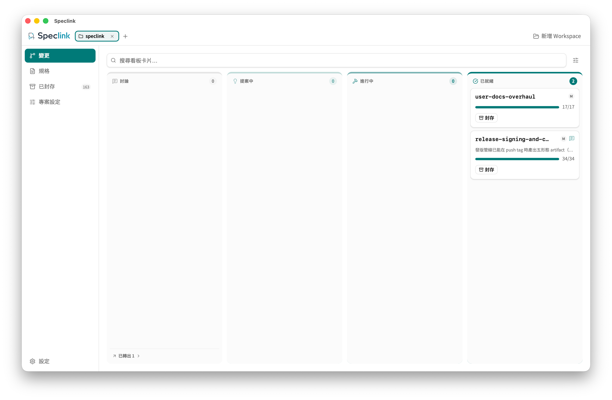
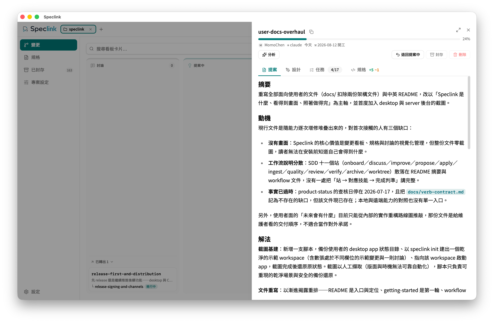

# Complete Speclink SDD Workflow

[繁體中文](workflow.zh-TW.md) · **English**

This is the user-facing workflow canon. For every station it answers: what it does, which skill invokes it, when to skip it, what counts as done, and where you go next. For a first Local Repo loop, start with [Getting Started](getting-started.md). To decide whether a capability is usable today, see [Project Capability Status](product-status.md).

## Mental model / 心智模型

```text
onboard? → discuss?/improve? → propose → apply ⇄ ingest → (quality? | review? ∥ verify?) → archive
                                            ↑
                                  resuming after a pause: drift first

worktree: apply-with-worktree ⇄ ingest → (quality? | review? ∥ verify?) → worktree-merge → archive

utilities: validate / analyze / audit / commit / config
```

- `onboard` creates current-behavior canonical specs once for an existing codebase.
- `discuss` and `improve` are both optional convergence entries; the difference is who brings the topic. **You bring the topic to `discuss`; you ask the model to find topics with `improve`.**
- `propose → apply ⇄ ingest → archive` is the main change lifecycle.
- The two quality stations (`review`, `verify`) run in parallel and depend on neither the other nor a fixed order. Skipping both on a low-risk change is a legitimate choice.
- `drift` conditionally precedes resumed work. `validate`, `analyze`, `audit`, `commit`, and `config` are utilities or gates, not lifecycle states every change visits in sequence.

The board draws this route as three columns — proposed, in progress, archived — and every card is one change standing at its current station:



(Screenshots are captured with the interface in Traditional Chinese; the interface language is switchable in settings.)

## Choose the entry / 選擇入口

Ask six questions in order. The first match is the recommended entry:

| Question / 問題 | Answer / 判斷 | Recommended entry / 推薦入口 |
| --- | --- | --- |
| Do you only want to understand something, with nothing to decide? | Yes | Just ask. Do not open a discussion. |
| Does a related change already exist? | Yes | To keep implementing, use `apply`. If new context changes artifacts, use `ingest`. |
| Has the change been idle, or might its baseline have moved? | Yes | Run `drift` first, then return to `apply` or `ingest` as directed. |
| Have requirements or outside context shifted mid-implementation? | Yes | `ingest`, update artifacts, then return to `apply`. |
| Do you want to improve the codebase but cannot name what to change? | Yes | `improve` — let the model scan and propose candidates. |
| Is the new requirement already clear? | Yes/No | Clear means `propose`; still weighing trade-offs means `discuss`. |

If an existing codebase has no canonical specs yet, run `onboard` once before any of the above. It creates no change and describes no future ideal.

## Lifecycle and utilities / 生命週期與工具

| Kind / 類型 | Stages / 階段 | Meaning / 意義 |
| --- | --- | --- |
| Main lifecycle / 主生命週期 | `propose`, `apply`, `ingest`, `archive` | A change from planning through implementation and requirement updates to merging into canon. |
| Conditional / 條件式 | `onboard`, `discuss`, `improve`, `drift`, the worktree flow | Only for first-time spec creation, requirement convergence, resumed work, or pushing several changes in parallel. |
| Quality stations / 品質關卡 | `review`, `verify`, `quality` | Two optional gates before archiving — craft and compliance — each with its own ticket and stamp. |
| Utilities / 工具 | `validate`, `analyze`, `audit`, `commit`, `config` | Structure checks, artifact consistency, security sharp edges, change-scoped commits, and workflow configuration. |

## Stage reference / 階段參考

Every station uses the same shape. It gives the purpose, when to use it, and when to skip it. It then gives the input, the outputs, and how each surface invokes it. It ends with the completion criteria, the next station, and the recovery route.

### onboard

- **Purpose / 目的:** Derive current-behavior canonical specs from existing code and tests.
- **Use / 使用:** An adopted codebase has no specs, or uncovered capabilities need gap-filling.
- **Skip / 跳過:** Canonical coverage is adequate, or the request describes new behavior.
- **Input / 輸入:** README, entry points, source, tests, configuration, and a user-confirmed capability map.
- **Outputs / 產物:** `openspec/specs/<capability>/spec.md` directly; no change is created.
- **Claude:** `/speclink-onboard [scope]`.
- **Codex:** `$speclink-onboard [scope]`.
- **CLI/Host:** There is no `speclink onboard` subcommand. The Agent writes canonical specs after investigation, then runs `speclink validate --specs --all --strict`.
- **Done / 完成:** The user confirms capability boundaries, specs cite observable evidence, and strict validation passes.
- **Next / 下一步:** Use `propose` for new behavior, or `discuss` first when it is fuzzy.
- **Recover / 恢復:** If an existing spec must change, open a change instead of rewriting it in onboard.

### discuss

- **Purpose / 目的:** Converge a question that needs trade-offs, round by round, keeping a traceable conclusion.
- **Use / 使用:** Requirements are fuzzy, several designs are defensible, or a decision must be recorded.
- **Skip / 跳過:** You only want to understand something and there is no verdict to reach, or the requirement is already clear enough to propose.
- **Input / 輸入:** One focused topic, current code and spec context, and the question to settle. The topic may also be a file path: a plan you wrote, plan-mode output, or any readable document. The station then triages its claims clause by clause against the codebase.
- **Outputs / 產物:** Context, rounds, and a conclusion in `openspec/discussions/<slug>.md`.
- **Claude:** `/speclink-discuss <topic>`.
- **Codex:** `$speclink-discuss <topic>`.
- **CLI/Host:** `speclink discuss new/context/add-round/conclude`. After concluding, pick `promote`, `link`, `seal`, or `archive` per [Discussion outcomes](#discussion-outcomes--討論結論分流).
- **Done / 完成:** The conclusion carries a decision, rationale, rejected alternatives, deferred items, where it lands, and the next step.
- **Next / 下一步:** Create a full change, scaffold one quickly, fold it into an existing change, or decide against it and archive.
- **Recover / 恢復:** A discussion with substantive rounds should be concluded and archived; `discuss discard` is only for one that never produced content.

### improve

- **Purpose / 目的:** Scan the codebase, propose structural improvement candidates, and record them as a discussion.
- **Use / 使用:** You want to improve the codebase but cannot name what to change.
- **Skip / 跳過:** You already know what to change — that is a `discuss` or a straight `propose`.
- **Input / 輸入:** A direction you name (preferred), or a scope inferred from git log hotspots. Always narrow the scope before scanning; sweeping the whole repo only yields generic candidates.
- **Outputs / 產物:** The same discussion record `discuss` produces, marked with `--kind improve` (board cards and the discussion drawer show a badge). Every candidate carries Files, Problem, Solution, Wins, and a recommendation strength.
- **Claude:** `/speclink-improve [scope]`.
- **Codex:** `$speclink-improve [scope]`.
- **CLI/Host:** `speclink discuss new <topic> --kind improve`. Rounds, conclusion, promotion, and archiving are identical to `discuss`.
- **Done / 完成:** The station lists the candidates, you interrogate one in depth, and you write a conclusion. **Write and archive a conclusion even when you adopt none of them.** The rejection reasoning stops the next scan from raising them again.
- **Next / 下一步:** Adopted candidates go to `propose` → `apply`; a full rejection archives the discussion.
- **Recover / 恢復:** The opening pass reads ruled-out items from archived discussions and in-flight changes so it does not re-raise settled or ongoing work. When something is re-raised anyway, point at the source discussion.

Two limits keep this entry from misuse. First, `improve` **is user-initiated only**; the model never runs it on its own. Second, it **produces a discussion record, never code**. To land an improvement you still go through `propose` → `apply`.

### propose

- **Purpose / 目的:** Create a change and the artifacts its schema requires, ready to hand to an implementer.
- **Use / 使用:** New work whose requirements are clear, or a concluded discussion that should become a full proposal.
- **Skip / 跳過:** Pure Q&A, capturing current behavior only, or an existing change that just needs new context folded in.
- **Input / 輸入:** A clear requirement, a concluded discussion slug, or a file path via `--from-doc`.
- **Outputs / 產物:** Change metadata, proposal, delta specs, tasks, and a design where warranted. The actual set is decided by the schema DAG and `applyRequires`.
- **Claude:** `/speclink-propose <change>`, `/speclink-propose --from-discussion <slug>`, or `/speclink-propose --from-doc <path>`.
- **Codex:** The same commands as `$speclink-propose ...`.
- **CLI/Host:** `speclink new change`, `speclink instructions <artifact> --json`, `speclink new artifact ... --stdin`, `speclink analyze`, `speclink validate`.
- **Done / 完成:** `speclink status --change <name> --json` shows every `applyRequires` artifact complete, analyze reports no Critical or Warning, and validate passes.
- **Next / 下一步:** You decide when to call `apply`.
- **Recover / 恢復:** When `discuss promote` only scaffolds, run propose again on the same change to fill it in. If requirements are unclear, go back to `discuss`.

### apply

- **Purpose / 目的:** Change code and docs against the tasks and the implementation contract, verifying and recording each one.
- **Use / 使用:** The change's `applyRequires` artifacts are complete.
- **Skip / 跳過:** Artifacts are missing, requirements are shifting, or the change sat idle without a `drift` pass.
- **Input / 輸入:** Proposal, design (if any), delta specs, tasks, and the current workspace.
- **Outputs / 產物:** Implementation changes, test and verification results, checked tasks, and touched-file evidence in `openspec/changes/<name>/.evidence.json`, committed with the change directory.
- **Claude:** `/speclink-apply <change>`.
- **Codex:** `$speclink-apply <change>`.
- **CLI/Host:** Before starting, `speclink review prepare <change>` records the Apply baseline the quality stations resolve against, then `speclink in-progress add <change>`. The Agent reads context via `speclink instructions apply --change <name> --json` and marks each finished item with `speclink task done --change <name> <id>`.
- **Done / 完成:** Every task's behavior, contract, and verification target passes, and apply instructions report `state: all_done`. Tasks prefixed `[M]` are manual verification you perform; the model will not check them off for you.
- **Next / 下一步:** Run whichever quality stations the risk warrants, then `archive`. If requirements changed, `ingest` first.
- **Recover / 恢復:** After rolling back a task, use `speclink task undone`. A change started by mistake with zero work traces returns to proposed via `speclink in-progress remove`. When a remote Context Projection is stale or modified, re-fetch apply instructions to refresh it.

The change drawer is the main view during apply. Its proposal, design, tasks, and specs tabs map onto the same artifact set. The tasks tab shows exactly what `speclink task done` records.



### worktree (parallel implementation)

- **Purpose / 目的:** Push several independent changes at once, each implemented in its own git worktree without interference.
- **Use / 使用:** You have two or more changes in hand that do not conflict.
- **Skip / 跳過:** A single change, or several changes touching the same files — queueing those is faster.
- **Prerequisite / 前置:** Turn the `worktree` policy on first with `speclink workflow-config set worktree true`. The two worktree skills are generated only while that policy is on; with it off they do not exist.
- **Input / 輸入:** Several apply-ready changes.
- **Outputs / 產物:** One worktree and branch per change; implementation, quality stations, and commits all happen inside it.
- **Claude:** `/speclink-apply-with-worktree <changes>`, closing with `/speclink-worktree-merge <change>`.
- **Codex:** `$speclink-apply-with-worktree` and `$speclink-worktree-merge`.
- **CLI/Host:** `speclink list` marks worktree-backed changes with `[worktree]`.
- **Done / 完成:** Tasks inside the worktree are complete, the quality stations you chose carry a stamp, and you commit the change. `worktree-merge` then lands the branch on the main branch and removes the worktree.
- **Next / 下一步:** Return to the main checkout for `archive` — **archiving only runs from the main checkout**; the engine refuses it inside a linked worktree.
- **Recover / 恢復:** Quality stations belong inside the worktree, since the Apply baseline lives there. A worktree change has two copies of `tasks.md`; edit only the worktree's copy.

### ingest

- **Purpose / 目的:** Fold new conversation, plans, external documents, or discussion decisions into an existing change's artifacts.
- **Use / 使用:** Requirements or context shifted mid-implementation, or a concluded discussion belongs to a change that already exists.
- **Skip / 跳過:** Pure implementation with no artifact change, or no change yet (use `propose`).
- **Input / 輸入:** The existing change plus the new outside context. For a discussion, run `discuss link` first.
- **Outputs / 產物:** Merged proposal, design, specs, and tasks. Completed tasks are left untouched.
- **Claude:** `/speclink-ingest <change>`.
- **Codex:** `$speclink-ingest <change>`.
- **CLI/Host:** Fetch `speclink instructions ... --json` per artifact, then run `speclink analyze` and `speclink validate`. After the discussion content lands, run `speclink discuss seal <slug> <change>`.
- **Done / 完成:** The new context is mapped onto every affected artifact, completed tasks are unrewritten, analyze and validate pass, and any link is sealed.
- **Next / 下一步:** Back to `apply`.
- **Recover / 恢復:** If ingest shows an existing assumption is dead, repair the artifacts before continuing. Never seal without reflecting the content.

### drift

- **Purpose / 目的:** Judge whether an idle change drifted from the current codebase, design anchors, touched files, and baseline.
- **Use / 使用:** You resume a paused change, or you suspect outside commits reached the same scope.
- **Skip / 跳過:** Short continuous apply sessions with an unchanged baseline.
- **Input / 輸入:** Change artifacts, git history, current code, and evidence.
- **Outputs / 產物:** A Light, Moderate, or Heavy drift report with one recommended next step.
- **Claude:** `/speclink-drift <change>`.
- **Codex:** `$speclink-drift <change>`.
- **CLI/Host:** `speclink drift <change> --json`.
- **Done / 完成:** The report names elapsed time, broken anchors, task collisions, and a recommended route.
- **Next / 下一步:** Light usually returns to `apply`; stale requirement or delta assumptions route to `ingest`; Heavy updates artifacts first.
- **Recover / 恢復:** Preserve outside modifications you cannot explain. Do not resolve them by resetting or overwriting the user's worktree.

### quality (both stations together)

- **Purpose / 目的:** Orchestrate both quality stations over one change: neither stamps up front, and every round stops for your call.
- **Use / 使用:** A large change where both craft and compliance matter.
- **Skip / 跳過:** Only one station — call `/speclink-review` or `/speclink-verify` directly and keep that station's stamp-when-clean default.
- **Input / 輸入:** A change with every task complete.
- **Outputs / 產物:** Two tickets (`review.md`, `verify.md`) and two stamps.
- **Claude:** `/speclink-quality <change>`.
- **Codex:** `$speclink-quality <change>`.
- **CLI/Host:** Underneath it is `speclink review` and `speclink verify` with their own `scope`, `add-round`, `show`, and `stamp`.
- **Done / 完成:** Only once you say so do both stamps land, back to back — review first, verify second.
- **Next / 下一步:** `archive` (or `worktree-merge` first, in the worktree flow).
- **Recover / 恢復:** A clean round stops too; nothing stamps or archives itself. Do not commit midway through a re-verification loop — that silently leaves the frozen review scope.

How the two divide the work:

| | `review` | `verify` |
| --- | --- | --- |
| Question answered | Is the code well made (craft)? | Does the delivery match the spec (compliance)? |
| Criteria | Repo convention docs, a Fowler smells baseline (repo docs win), and bug hunting | The change's specs, clause by clause, across three dimensions |
| Role of artifacts | Context for judgement; produces no compliance verdict | The center of the check |
| Precondition | Every task complete | Runs any time (a mid-flight run is a progress audit); closing the ticket requires every task complete |
| Output | A multi-round `review.md` ticket, stamped once the must-fix set is empty | A multi-round `verify.md` ticket, stamped once the must-fix set is empty |
| Stamp order | First | Second |

Running both is a four-beat sequence. Neither station stamps at first. Every round stops for your call: fix all, fix some, or stop without fixing. The fixes you chose then land together, both stations re-check, and it stops again. Both stamps land only when you say so.

The sequence exists because **a stamp freezes a content fingerprint of the files in scope**. The other station's fixes knock an earlier stamp down to "modified since". Finish the fixes before you stamp and that cannot happen.

### review

- **Purpose / 目的:** Review the implementation against craft standards, recording graded findings in a ticket.
- **Use / 使用:** Large changes, cross-subsystem work, or code that will be maintained for a long time.
- **Skip / 跳過:** Small low-risk edits. Skipping is a legitimate choice, not a debt.
- **Input / 輸入:** The change scope frozen from the Apply baseline — the HEAD and initially-dirty files `speclink review prepare` recorded before work started.
- **Outputs / 產物:** A `review.md` ticket with findings graded CRITICAL, WARNING, and SUGGESTION.
- **Claude:** `/speclink-review <change>`.
- **Codex:** `$speclink-review <change>`.
- **CLI/Host:** `speclink review prepare/scope/add-round/show/stamp/discard`.
- **Done / 完成:** Every task complete and the last round's must-fix set empty — **SUGGESTION never blocks the stamp**.
- **Next / 下一步:** `verify` if you are running it, otherwise `archive`.
- **Recover / 恢復:** Editing a file in scope after stamping downgrades the card to "reviewed · modified since". Archiving detects an open ticket and stops (go stamp it, abandon the review, or take it anyway). Finding paths in the ticket must carry no line numbers and must match files in the frozen snapshot verbatim.

### verify

- **Purpose / 目的:** Check the delivery clause by clause against the change's specs.
- **Use / 使用:** Specs with many clauses, or where compliance is itself the deliverable.
- **Skip / 跳過:** Small low-risk edits — again, a legitimate choice.
- **Input / 輸入:** All of the change's artifacts and the frozen change patch.
- **Outputs / 產物:** A multi-round `verify.md` ticket.
- **Claude:** `/speclink-verify <change>`.
- **Codex:** `$speclink-verify <change>`.
- **CLI/Host:** `speclink verify scope/add-round/show/stamp/discard`.
- **Done / 完成:** Every task complete and the last round's must-fix set empty; **SUGGESTION does not block here either**.
- **Next / 下一步:** `archive`.
- **Recover / 恢復:** After every task is complete, the first round is the only full discovery pass. It reads all artifacts and confines code evidence to the frozen change patch. Every later round checks only two things: the previous round's unresolved findings, and regressions the fixes caused directly. It does not re-sweep unmodified areas. **The must-fix set must shrink strictly every round** to earn another attempt. The first round without progress stops as "not passed". It keeps the ticket and withholds the stamp.

Cards and the tray panel show the verify and review stamps side by side (review first, verify second). With both tickets open, archiving requires disposing of each station separately.

### archive

- **Purpose / 目的:** Merge delta specs into canonical specs and archive the finished change with its linked discussion.
- **Use / 使用:** Every task complete, artifacts valid, assumptions current, and any quality station you ran closed out.
- **Skip / 跳過:** Unfinished tasks, a stale delta, failed verification, or requirements still in motion.
- **Input / 輸入:** A ready change, complete final-state deltas, and completion evidence.
- **Outputs / 產物:** Updated canonical specs and a record under `openspec/changes/archive/`. Archiving the last surviving change also archives its linked discussion.
- **Claude:** `/speclink-archive <change>`.
- **Codex:** `$speclink-archive <change>`.
- **CLI/Host:** `speclink archive <change>`. Do not reach for `--no-validate` or `--mark-tasks-complete` to route around unfinished work.
- **Done / 完成:** The CLI succeeds, the canonical spec delta counts are right, and the change moves into the archive.
- **Next / 下一步:** Commit the archived result with a change-scoped commit when you want it recorded.
- **Recover / 恢復:** Normalize an incomplete delta first. Stale assumptions route back to `drift` or `ingest` rather than a forced archive. A MODIFIED block replaces the whole block. So a renamed scenario reads as an undeclared deletion. Neither validate nor analyze catches it before archive. Declare the rename with a `REMOVED-SCENARIO` note.

### validate

- **Purpose / 目的:** Check a change or spec against structure, required fields, and schema rules.
- **Use / 使用:** After a proposal completes, after artifact updates, before archiving, and during doc acceptance.
- **Skip / 跳過:** Never before delivery; exploratory reading may skip it.
- **Input / 輸入:** A change name, a spec, or the `--all` scope.
- **Outputs / 產物:** A valid or invalid result, optionally as `--json`.
- **Claude/Codex:** No standalone skill; the propose, ingest, and archive flows call it.
- **CLI/Host:** `speclink validate <change>`, or `speclink validate --specs --all --strict` for the whole canon.
- **Done / 完成:** Exit code 0 and the target reported valid.
- **Next / 下一步:** Move on to analyze, implementation verification, or `archive`.
- **Recover / 恢復:** Fix the artifacts per the error and rerun. Do not paper over it with `--no-validate`.

### analyze

- **Purpose / 目的:** Check Coverage, Consistency, Ambiguity, and Gaps across proposal, design, specs, and tasks.
- **Use / 使用:** After a proposal or ingest completes, and as a final artifact regression.
- **Skip / 跳過:** Plain queries against existing specs. Never mistake it for a code test.
- **Input / 輸入:** One active change.
- **Outputs / 產物:** Findings across four dimensions with severity, location, and recommendation.
- **Claude:** `/speclink-analyze <change>`.
- **Codex:** No skill is generated yet; use the CLI directly.
- **CLI/Host:** `speclink analyze <change> --json`.
- **Done / 完成:** At minimum no Critical or Warning; Suggestions need an explicit call on whether they affect delivery.
- **Next / 下一步:** Fix artifacts, `apply`, or final acceptance.
- **Recover / 恢復:** Repair the artifact contract behind a Critical before starting implementation.

### audit

- **Purpose / 目的:** Audit changed code for dangerous defaults, type confusion, and silent failures.
- **Use / 使用:** Security-sensitive APIs, configuration, authentication, Store and Server boundaries, or a project set to `audit: true`.
- **Skip / 跳過:** Documentation-only work introducing no interface or security semantics.
- **Input / 輸入:** The change's diff, design, and specs.
- **Outputs / 產物:** Sharp-edge findings ordered by severity. It changes no lifecycle state.
- **Claude:** `/speclink-audit <change>`.
- **Codex:** `$speclink-audit <change>`.
- **CLI/Host:** There is no `speclink audit` subcommand; the skill audits from artifacts and the diff.
- **Done / 完成:** Every finding names a location, a misuse path, and a repair direction — or it reports no findings explicitly.
- **Next / 下一步:** Back to tests and `apply` after fixes; otherwise on to archive preparation.
- **Recover / 恢復:** "The caller's responsibility" is not a reason to leave a dangerous interface alone.

### commit

- **Purpose / 目的:** Stage and commit only one change's artifacts and related implementation files.
- **Use / 使用:** You want an auditable commit scoped to a single change.
- **Skip / 跳過:** You have another commit strategy, or the scope is not settled.
- **Input / 輸入:** The change name, git status, touched files, and task progress.
- **Outputs / 產物:** A selective stage you confirmed, and a git commit.
- **Claude:** `/speclink-commit <change>`.
- **Codex:** `$speclink-commit <change>`.
- **CLI/Host:** The skill combines `speclink status` and `speclink artifact` with git. It never runs `git add .` or `git add -A`.
- **Done / 完成:** The commit contains only confirmed files for that change, and reports its hash and message.
- **Next / 下一步:** Continue with `apply`, or `archive` once finished. A commit is not a substitute for archiving.
- **Recover / 恢復:** Exclude unrelated files and re-confirm rather than overwriting or clearing them. When parallel sessions touch the same files, re-check `git status` right before committing.

### config

- **Purpose / 目的:** Compose the workflow configuration's context and rules from the codebase (`openspec/config.yaml`).
- **Use / 使用:** You want Agent-produced artifacts to match this repo's conventions.
- **Skip / 跳過:** The defaults are good enough.
- **Input / 輸入:** Codebase conventions, existing docs, and tests.
- **Outputs / 產物:** An approved diff landed into `openspec/config.yaml`.
- **Claude:** `/speclink-config`.
- **Codex:** `$speclink-config`.
- **CLI/Host:** `speclink workflow-config`.
- **Done / 完成:** The diff is approved and applied.
- **Next / 下一步:** Any station. The configuration shapes every artifact produced afterwards.
- **Recover / 恢復:** A bad configuration is undone by running it again; existing changes are unaffected.

## Discussion outcomes / 討論結論分流

| Outcome / 結論去向 | Use when / 使用時機 | Command or skill / 呼叫 | Result / 結果 | Required next step / 必要下一步 |
| --- | --- | --- | --- | --- |
| New change, complete proposal | The conclusion is clear and you want every required artifact at once | `/speclink-propose --from-discussion <slug>` (`$speclink-propose` in Codex) | Creates and links the change, then runs the full artifact workflow | Once artifacts are green, you decide when to `apply` |
| New change, fast scaffold | You only need the change to exist now and will fill in the proposal later | `speclink discuss promote <slug> [--name <change>]` | Creates the change, prefills the proposal's Why from the conclusion, links both sides, and marks the discussion promoted; not apply-ready | Run propose again on that change to complete the required artifacts |
| Existing change | The conclusion corrects work already in flight and warrants no new change | `speclink discuss link <slug> <change>` → `/speclink-ingest <change>` → `speclink discuss seal <slug> <change>` | `link` only forges the change-side source chain; ingest reflects the content; `seal` marks it promoted | Back to `apply` |
| Do not implement | The reasoning was substantive but the answer is no | `speclink discuss archive <slug>` | Preserves the conclusion and reasoning without creating an empty change | None; a future question opens a new discussion |

One discussion can fan out into several changes; `promoted_to` accumulates their names. It is archived automatically along with the last surviving change linked to it. After `link`, never `seal` before the content lands — sealing asserts the decision is already reflected in the artifacts.

## Recovery paths / 恢復路徑

| Symptom / 症狀 | Route / 恢復路徑 |
| --- | --- |
| A promoted change has only a proposal scaffold | Run propose on that change; do not apply directly. |
| A discussion conclusion belongs to an existing change | `link → ingest → seal`; all three. |
| A change sat idle | Run drift first. Light returns to apply; stale assumptions route to ingest. |
| Requirements changed mid-implementation | ingest to update artifacts, re-run analyze and validate, then return to apply. |
| apply reports a missing artifact | Return to propose and complete the `applyRequires` chain. |
| A task was checked by mistake or rolled back | `speclink task undone --change <name> <id>`. |
| A change was started by mistake | `speclink in-progress remove <change>`, possible only with zero work traces. |
| The Context Projection is STALE or modified | Never edit the projection; re-fetch instructions to refresh it. |
| analyze reports a Critical | Fix the artifacts' coverage, consistency, or gap before implementing. |
| Files changed after a station stamped | The card downgrades to "modified since"; return to that station for another round. |
| Archiving is blocked by an open ticket | Go stamp it, abandon that station, or explicitly take it anyway. |
| Archiving inside a worktree is refused | Run `worktree-merge` first; archiving only runs from the main checkout. |
| archive reports a stale delta or incomplete final state | Return to drift or ingest, normalize the delta, and validate again. |

## Call layers / 呼叫層級

| Layer / 層級 | Responsibility / 責任 | Example / 範例 |
| --- | --- | --- |
| Speclink skill | Tells the Agent when to read context, how to produce and validate artifacts, and when to stop. It is workflow knowledge. | Claude `/speclink-propose`, Codex `$speclink-propose` |
| `speclink` CLI | The command-line adapter for Local and Remote, running status, instructions, artifact, task, and lifecycle verbs. | `speclink status --change demo --json` |
| Speclink Host/Runtime | Composes Engine, Store, auth, binding, revision, transactions, and events. This is the application boundary that owns execution semantics. | Embedded Host or `speclink-server` |

Do not treat a skill as a runtime, and do not assume every Host uses the same invocation literal. Claude uses slash commands. Codex invokes a skill explicitly with `$skill-name`, and `/skills` lists the same skills for you to pick. The CLI is a separate lower-level entry.

## Current limitations / 目前限制

- `validate` and `analyze` check artifacts. Neither equals code tests nor full implementation conformance; the quality stations cover the implementation side.
- Desktop Server Connections work. The full Desktop Remote Workspace is still partial: checking a task from the desktop remote board reports no touched files (the CLI path stores them).
- The legacy remote REST v1 prototype is deprecated; new work follows the current Client Protocol and Host path.
- Per-item evidence and the last audit date live in [Project Capability Status](product-status.md); this document does not maintain a second status matrix.

## Related documents / 相關文件

- [Getting Started](getting-started.md)
- [Remote Server, Desktop, and CLI Getting Started](remote-getting-started.md)
- [Project Capability Status](product-status.md)
- [Verb and Flag Contract](verb-contract.md)
- [Project Roadmap](roadmap.md)
