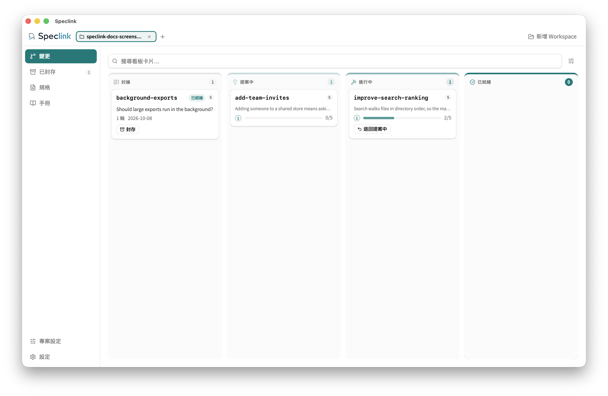
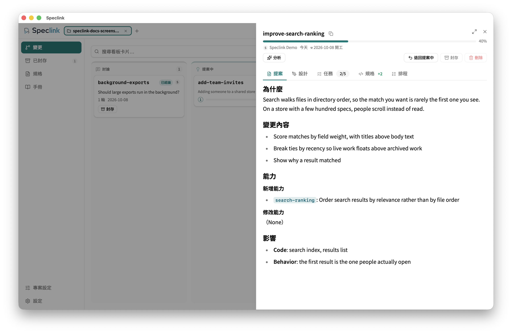

# SDD workflow

[繁體中文](workflow.zh-TW.md) · **English**

This document explains each stage of Speclink: what it does, which skill to use, when to skip it, when it is done, and where to go next.

If this is your first time, do one round with [Getting started](getting-started.md). To know if a capability is available now, see [Product status](product-status.md).

## <a id="mental-model"></a>The whole flow

```text
baseline? → discuss?/improve? → propose → apply ⇄ ingest → (quality? | review? ∥ verify?) → archive
                                            ↑
                                    resume after a pause: drift first

worktree: apply-with-worktree ⇄ ingest → (quality? | review? ∥ verify?) → worktree-merge → archive

tools: validate / analyze / audit / commit / config / manual / trace / plan
```

- A stage with `?` is optional.
- `propose → apply → archive` is the main line for each change. If the requirement changes during the work, go between `apply` and `ingest`.
- Before archive, two optional quality stations are available. `review` checks code craft. `verify` checks that the delivery matches the specs. The two stations do not depend on each other. Choose them from the risk. For a low-risk change, you can skip both.
- Use the tool stages only when you need them. A change does not have to go through them.

The desktop app shows this flow as a board with four columns: Discussions, Proposed, In progress, and Ready. Each card is a change or a discussion. Archived changes have their own page.



## <a id="entry"></a>Where to start

Answer these questions in order. The first "yes" gives your entry:

| Question | Entry |
| --- | --- |
| Do you only want to understand something, with no decision to make? | Ask the agent directly. Do not create a discussion record. |
| Does the code have no specs yet? | Run `baseline` first. It describes only the current behavior and creates no change. |
| Does a related change exist? | To continue the work, use `apply`. If new context changes the documents, use `ingest`. |
| Did the change stop for a while, so the plan can be out of date? | Run `drift` first. Then go back to `apply` or `ingest` from its result. |
| Do you want better code, but cannot name the area? | Use `improve`. The model scans the code and suggests candidates. |
| Is the new requirement clear? | If it is clear, use `propose`. If it needs decisions, use `discuss`. |

## <a id="stage-types"></a>Types of stages

| Type | Stages | Note |
| --- | --- | --- |
| Main line | `propose`, `apply`, `ingest`, `archive` | A change goes from plan to work to requirement updates, and then merges into the specs. |
| Conditional | `baseline`, `discuss`, `improve`, `drift`, worktree flow | Use them for the first specs of existing code, for requirements that need decisions, to resume after a pause, or to work on several changes at the same time. |
| Quality stations | `review`, `verify`, `quality` | Two optional checks before archive. Each one keeps a ticket and gives a stamp. |
| Tools | `validate`, `analyze`, `audit`, `commit`, `config`, `manual`, `trace`, `plan` | Document checks, security checks, commits, settings, manuals, trace, and execution order. |

## <a id="how-to-call"></a>How to call a stage

| Layer | What it does | Example |
| --- | --- | --- |
| Skill | Workflow knowledge for the agent: what to read, how to write and check documents, and when to stop and ask you. | Claude `/speclink-propose`, Codex `$speclink-propose` |
| `speclink` CLI | The command line that does the actual work. Local and remote mode both use it. | `speclink status --change add-csv-export` |
| Host | Joins the engine, the Store, authentication, revisions, transactions, and events. The CLI, the server, and the Node SDK all go through it. | Built into the CLI, or `speclink-server` |

The skill names below use the Claude syntax. In Codex, change the first `/` to `$`, or enter `/skills` and pick from the list. One exception: Codex has no `analyze` skill. Use the CLI instead.

After you upgrade Speclink, run `speclink update` to write the skill files again.

## <a id="stages"></a>Stages

Each stage uses the same format. The first sentence gives the purpose. The list below it gives the details.

### <a id="baseline"></a>baseline: write the first specs

Write specs for the current behavior from the existing code and tests. The old name of this stage is onboard.

- **When to use**: An existing project starts to use Speclink and has no specs, or you want to add a capability that the specs do not cover. **Skip**: The specs are already sufficient, or you want to describe a new requirement.
- **Input → output**: The README, entry points, source code, tests, the project context and rules in `openspec/config.yaml`, and the capability list that you approve → specs in `openspec/specs/<capability>/spec.md`. It creates no change.
- **Skill**: `/speclink-baseline [scope]`
- **CLI**: No `speclink baseline` command exists. After the agent writes the specs, it runs `speclink validate --specs --all --strict`.
- **Done**: You approve the capability boundaries, each spec has evidence from the code, and the strict check passes.
- **Next**: For a new requirement, use `propose`. If it is not clear, use `discuss` first.
- **If something goes wrong**: If an existing spec must change, do not change it in baseline. Start a new change.

### <a id="discuss"></a>discuss: discussion

Talk through a decision round by round, and keep a conclusion with its sources.

- **When to use**: The requirement is not clear, several approaches are possible, or you must make a decision. **Skip**: You only want to understand something, or the requirement is clear (use `propose`).
- **Input → output**: A topic, or the path of a document (your own plan, or a plan-mode output) → `openspec/discussions/<slug>.md` with the context, the rounds, and the conclusion.
- **Skill**: `/speclink-discuss <topic or document path>`. At the start, it searches old discussions so that it does not bring back a rejected idea.
- **CLI**: `speclink discuss new`, `context`, `add-round`, `conclude`, `search`.
- **Done**: The conclusion states the decision, the reasons, the rejected options, the deferred items, and the next step.
- **Next**: See [Discussion outcomes](#discussion-outcomes).
- **If something goes wrong**: If a discussion has content, write a conclusion and archive it. Use `speclink discuss discard` only when the discussion has no content yet.

### <a id="improve"></a>improve: find improvements

Ask the model to scan the code and suggest candidates for improvement. The result is a discussion.

- **When to use**: You want better code, but you cannot name the area. **Skip**: You know what to change. That is a topic for `discuss` or `propose`.
- **Limits**: Only you can start it. The model does not start it by itself. It writes only a discussion record and does not change code.
- **Input → output**: A direction from you (recommended), or a scope from the hot spots in the Git history → a discussion record with the improve mark. Each candidate shows the files, the problem, the solution, the benefit, and a strength.
- **Skill**: `/speclink-improve [scope]`
- **CLI**: `speclink discuss new <topic> --kind improve`. After that, the flow is the same as `discuss`.
- **Done**: All candidates are listed, you discuss one of them, and the conclusion is written. If you reject all candidates, write a conclusion and archive it too. Then the next scan does not suggest them again.
- **Next**: Use `propose` for an accepted candidate. If you reject all of them, archive the discussion.
- **If something goes wrong**: If the model suggests a rejected candidate again, it names the discussion that rejected it.

### <a id="propose"></a>propose: proposal

Create a change that is ready for the work.

- **When to use**: The requirement is clear, or a concluded discussion must become a full proposal. **Skip**: You only have a question, you only want specs for the current code (use `baseline`), or the change exists and only needs an update (use `ingest`).
- **Input → output**: A requirement, a discussion (`--from-discussion <slug>`), or a document (`--from-doc <path>`) → `proposal.md`, delta specs, `tasks.md`, and `design.md` when it is necessary. The workflow schema sets the exact list.
- **Skill**: `/speclink-propose <change-name>`. After it writes the documents, it runs `analyze` and fixes the problems (two rounds at most). Then it runs `validate`. At the end, it uses `speclink change depends` to record the changes that must come first.
- **CLI**: `speclink new change`, `instructions`, `new artifact`, `analyze`, `validate`, `change depends`.
- **Done**: `speclink status --change <name>` shows that the documents for the work are complete, and `validate` passes.
- **Next**: You decide when to `apply`.
- **If something goes wrong**: If the requirement is not clear, go back to `discuss`.

### <a id="apply"></a>apply: do the work

Do the tasks in the task list, and check each task when it is done.

- **When to use**: The documents for the work are complete. **Skip**: Documents are missing, the requirement is changing, or the change stopped for a while and you did not run `drift`.
- **Input → output**: The proposal, specs, design (if one exists), and tasks → code and test changes, checked tasks, and file evidence. The evidence lists the files that each task touched. It goes into `openspec/changes/<name>/.evidence.json`, and you commit it with the change.
- **Skill**: `/speclink-apply <change-name>`
- **CLI**: Before the work starts, the agent runs `speclink plan` and stops if another change blocks this one. Then it runs `speclink review prepare` (to record the start point for the quality stations) and `speclink in-progress add`. During the work, it uses `speclink instructions apply --change <name> --json` for context and runs `speclink task done --change <name> <number>` after each task.
- **Done**: The behavior and tests of each task pass, and `instructions apply` reports `state: all_done`. You check the `[M]` manual tasks yourself. The agent does not check them.
- **Next**: Choose the quality stations from the risk, then `archive`. If the requirement changes, use `ingest` first.
- **If something goes wrong**:
  - A wrong check, or work that you rolled back: `speclink task undone --change <name> <number>`.
  - You started the change by mistake and changed nothing: `speclink in-progress remove <name>` moves it back to Proposed.
  - You do not want the change: `speclink discard <name>`. After the work starts, add `--force`.

During the work, the detail panel of the change is the best view. The Proposal, Design, Tasks, and Specs tabs show the same documents. The progress in the Tasks tab is the result of `speclink task done`.



### <a id="ingest"></a>ingest: update the requirement

Merge a new requirement, a plan, or a discussion conclusion into an existing change.

- **When to use**: The requirement or the context changes during the work, or a discussion conclusion must go into an existing change. **Skip**: You only continue the work and the documents do not change (use `apply`), or no change exists yet (use `propose`).
- **Input → output**: An existing change, and the conversation or a plan file → updated proposal, design, specs, and tasks. Done tasks stay the same.
- **Skill**: `/speclink-ingest` (uses the current conversation) or `/speclink-ingest <plan-file>`. The argument is a plan file, not a change name. The skill finds the change from the conversation, or it asks you.
- **CLI**: `speclink instructions <artifact> --json`, `analyze`, `validate`. For a discussion, run `speclink discuss seal <slug> <change-name>` after the content is in the documents.
- **Done**: The new context is in all affected documents, no done task changed, and `analyze` and `validate` pass. If you used `link`, the discussion is sealed.
- **Next**: Go back to `apply`.
- **If something goes wrong**: Do not seal first and add the content later. A seal means that the content is already in the documents.

### <a id="drift"></a>drift: check for drift

Check how far a paused change is from the current code.

- **When to use**: You resume a paused change, or you think that other commits touched the same area. **Skip**: You work without a pause and the base did not change. If a change is more than 5 days old and nobody touched it in the last 3 days, `apply` recommends drift first.
- **Input → output**: The documents of the change, the Git history, the current code, and the evidence → a report. The report shows the drift level (light, medium, or heavy), broken references, task conflicts, and one recommended next step.
- **Skill**: `/speclink-drift <change-name>`
- **CLI**: `speclink drift <change-name> --json`
- **Done**: The report shows the time gap, broken references, task conflicts, and a recommendation, and you choose the next step.
- **Next**: For light, go back to `apply`. For medium, use `ingest` to update the plan. For heavy, the recommendation is to close the change with `speclink archive <name> --skip-specs` and start again. You can also try `ingest` first.
- **If something goes wrong**: Keep outside changes that you do not understand. Do not reset or overwrite them.

### <a id="worktree"></a>worktree: parallel work

Work on several independent changes at the same time. Each change gets its own git worktree, so the changes do not interfere.

- **When to use**: You have two or more changes that do not conflict. **Skip**: You have only one change, or the changes touch the same files (one after another is faster).
- **Before you start**: Turn on the worktree setting with `speclink workflow-config set worktree true`. The two worktree skills exist only when this setting is on.
- **Input → output**: A change that is ready to start → one worktree and one branch. The work, the quality stations, and the commit all happen in the worktree.
- **Skill**: `/speclink-apply-with-worktree <change-name>`. To finish, use `/speclink-worktree-merge <change-name>`. Each run takes one change. For parallel work, open one session for each change.
- **CLI**: `speclink plan` shows which changes can run in parallel. `speclink list` marks the changes in a worktree with `[worktree]`.
- **Done**: The tasks in the worktree are done, the quality stations that you chose have stamps, and the change is committed. `worktree-merge` merges the branch back into the main branch and removes the worktree.
- **Next**: Go back to the main checkout and run `archive`. Archive works only in the main checkout. In a worktree, it fails.
- **If something goes wrong**: Run the quality stations in the worktree, because the start point is there. The worktree and the main checkout each have their own `tasks.md`. Change only the one in the worktree.

### <a id="quality"></a>quality: run both stations

When you want both quality stations for one change, use this skill to run them together.

- **When to use**: The change is large, and both code craft and spec match are important. **Skip**: If you want only one station, use `/speclink-review` or `/speclink-verify`.
- **Input → output**: A change with all code tasks done → two tickets (`review.md` and `verify.md`), and then two stamps.
- **Skill**: `/speclink-quality <change-name>`
- **CLI**: `scope`, `add-round`, `show`, and `stamp` of `speclink review` and `speclink verify`.
- **Done**: Both stations check first and do not stamp. After each round, the skill stops for your decision: fix all, fix some, or fix none. When you say that the result is good, the skill stamps review first, then verify.
- **Next**: `archive` (in the worktree flow, `worktree-merge` first).
- **If something goes wrong**: The skill also stops after a clean round. It does not stamp or archive by itself. Do not commit during the checks. A commit moves the changes out of the checked scope.

### <a id="review"></a>review: code review

Check the craft of the code, and record the problems by severity in a ticket.

- **When to use**: The change is large, crosses modules, or adds code that people will maintain for a long time. **Skip**: A small, low-risk change. Skipping is a valid choice, not a debt.
- **Input → output**: The changes from the start point that apply recorded → a `review.md` ticket. Problems have three levels: CRITICAL, WARNING, and SUGGESTION. The criteria are the convention documents of the repo, common code smells, and bug hunting.
- **Skill**: `/speclink-review <change-name>`
- **CLI**: `speclink review prepare`, `scope`, `add-round`, `show`, `stamp`, `discard`.
- **Done**: When all code tasks are done and the last round has no must-fix problems (CRITICAL or WARNING), you can stamp. A SUGGESTION does not block the stamp.
- **Next**: If you also want `verify`, run it. If not, `archive`.
- **If something goes wrong**: If must-fix problems remain and you accept them, use `speclink review stamp --accept` to stamp with the problems.

### <a id="verify"></a>verify: spec check

Compare the delivery with each spec of the change, one by one.

- **When to use**: The specs have many requirements, or spec match is the main goal of the delivery. **Skip**: A small, low-risk change.
- **Input → output**: All documents of the change and the frozen changes → a `verify.md` ticket.
- **Skill**: `/speclink-verify <change-name>`. You can also run it before the tasks are done, as a progress check.
- **CLI**: `speclink verify scope`, `add-round`, `show`, `stamp`, `discard`.
- **Done**: All code tasks are done, and the last round has no must-fix problems. A SUGGESTION does not block the stamp.
- **Next**: `archive`.
- **If something goes wrong**: The first round is a full check. Each later round looks only at the open problems of the last round and at new problems that the fixes caused. The must-fix count must go down in each round. If it does not, the station stops as "not passed", keeps the ticket, and gives no stamp.

### <a id="quality-rules"></a>Rules for both quality stations

| | `review` | `verify` |
| --- | --- | --- |
| Question | Is the code well written? | Does the delivery match the specs? |
| Looks at | The changed code, against the repo conventions | Each spec of the change, against the changes |
| Output | `review.md` ticket | `verify.md` ticket |
| Stamp order | First | Second |

- **Start condition**: Only code tasks count. A `[M]` manual task that is not checked does not block a check or a stamp. Archive still needs it.
- **With both stations, fix everything first, then stamp both**: A stamp records the content of the files in scope. A fix for the second station makes the first stamp "changed since".
- **A stamp uses up the ticket**: One write adds the stamp and deletes the ticket (`review.md` or `verify.md`). Thus an archived change with stamps has no ticket files, and `show` reports no ticket after a stamp. That is normal. In local mode, the ticket text stays only in the Git history. In remote mode, you cannot read the ticket text after the stamp.
- **Only open tickets go with the archive**: You must ask for this with `--carry-review` or `--carry-verify`.
- **Files change after the stamp**: The card shows "Reviewed · changed since" or "Verified · changed since", and archive stops. Run that station again and stamp again.
- **Archive stops at an open ticket**: Go back and stamp, give up that station with `discard`, or take the ticket with `--carry-*`.

On cards and in the tray panel, the review stamp and the verify stamp show side by side, review first.

### <a id="archive"></a>archive: archive

Merge the delta specs into the specs, and move the done change into the archive.

- **When to use**: All tasks are done (`[M]` manual tasks too), the document checks pass, the plan is not out of date, and the quality stations that you chose are complete. **Skip**: Some tasks are not done, `validate` fails, or the requirement still changes.
- **Input → output**: A change that is ready → updated specs and `openspec/changes/archive/<date>-<name>/`.
- **Skill**: `/speclink-archive <change-name>`. Before the archive, it uses `plan` to show the archive order. After the archive, it names the next change that is ready to start.
- **CLI**: `speclink archive <name>`. You can give several names, or use `--all` to archive every change that is ready. Remote mode archives one change at a time.
- **Done**: The command succeeds, shows the merge counts for the specs, and the change is in the archive. If the change came from a concluded discussion and it is the last open change of that discussion, the discussion goes into the archive too (not when the discussion has `hold`).
- **Next**: Commit with `/speclink-commit` or your own method.
- **If something goes wrong**:
  - Do not use `--no-validate` or `--mark-tasks-complete` to skip work that is not done.
  - The plan is out of date: go back to `drift` or `ingest`. Do not force the archive.
  - A stale stamp or an open ticket stops the archive: see [Rules for both quality stations](#quality-rules).

### <a id="validate"></a>validate: format check

Check the format, the required sections, and the rules of a change or of the specs. It also finds, early, the deltas that archive would reject: a target requirement that does not exist, a name conflict, or a removed scenario without a declaration.

- **When to use**: After a proposal, after a document update, and before archive. Do not skip it before a delivery.
- **Skill**: No separate skill. `propose`, `ingest`, and `archive` call it.
- **CLI**: `speclink validate <name>`. For all specs: `speclink validate --specs --all --strict`.
- **Done**: The exit code is 0, and the output shows valid.
- **Next**: `analyze`, the work, or `archive`.
- **If something goes wrong**: Fix the documents from the error message, then run it again.

### <a id="analyze"></a>analyze: cross-check

Compare the proposal, design, specs, and tasks, and find four types of problems: coverage, consistency, ambiguity, and gaps.

- **When to use**: After a proposal or an ingest (the skills run it for you). It is not a code test.
- **Skill**: `/speclink-analyze <change-name>` (Claude only; Codex uses the CLI).
- **CLI**: `speclink analyze <name> [--json]`
- **Done**: No CRITICAL. You read each WARNING and SUGGESTION and decide what to do.
- **Next**: Fix the documents, or `apply`.
- **If something goes wrong**: If a CRITICAL exists, fix the documents before you start the work.

### <a id="audit"></a>audit: security check

Check the code changes that are not committed yet, from a security view: dangerous defaults, type confusion, and silent failures.

- **When to use**: The change touches authentication, permissions, settings, outside input, or public interfaces. When `openspec/config.yaml` has `audit: true`, `apply` also uses a short version of this check during the work. **Skip**: Changes to documents only.
- **Input → output**: `git diff HEAD` (changes that are not committed yet) → a list of problems by severity. It does not change the state of a change, and a change does not have to go through it.
- **Skill**: `/speclink-audit` (no change name)
- **CLI**: No `speclink audit` command exists.
- **Done**: Each problem shows the location, how someone can misuse it, and how to fix it. Or the report says that no problems exist.
- **Next**: Fix the problems, then go back to `apply` or run the tests.

### <a id="commit"></a>commit: scoped commit

Commit only the files that belong to one change.

- **When to use**: You want a commit that holds only one change. **Skip**: You have your own commit method. A change does not have to go through this stage.
- **Input → output**: The change name, the Git status, and the task evidence → a file list that you approve, and one commit.
- **Skill**: `/speclink-commit <change-name>`. It also supports "archive first, then commit both".
- **CLI**: The skill uses `speclink list --json`, `.evidence.json`, `speclink artifact cat`, `speclink plan`, and Git to find the files. It does not use `git add .`.
- **Done**: The commit holds only the files that you approved, and the skill reports the hash and the message.
- **Next**: Continue with `apply`, or `archive`. A commit does not replace the archive.
- **If something goes wrong**: If the list has files that do not belong, leave them out. Do not overwrite or delete them.

### <a id="config"></a>config: workflow settings

Write the project context and rules from the code into `openspec/config.yaml`, so that the documents from the agent fit this repo.

- **When to use**: When you start with Speclink, or after the project conventions change. **Skip**: The defaults are sufficient.
- **Input → output**: The code, package settings, README, and tests → a diff that you approve.
- **Skill**: `/speclink-config`
- **CLI**: `speclink workflow-config show`, `set`, `context`, `rules`. For the fields, see [Configuration](configuration.md).
- **Done**: You approve the diff, and the skill writes it.
- **Next**: Go back to any stage. New documents use the new settings.
- **If something goes wrong**: Run it again to correct a wrong setting. Existing changes stay the same.

### <a id="manual"></a>manual: manual

Generate a manual for people from the specs (`openspec/manual/`), or get a tour of the system in the conversation.

- **When to use**: You need a manual, or a tour for a new person. Or, after an archive, you want to know which manual pages can be stale. **Skip**: No specs describe user-facing behavior, or nobody reads the manual.
- **Input → output**: Only the specs. It does not read the README, docs, or code → manual pages (with a home page and a source page). The tour mode writes no files.
- **Skill**: `/speclink-manual` (generate), `/speclink-manual tour` (tour)
- **CLI**: No `speclink manual` command exists. The Manual page of the desktop app shows the manual.
- **Done**: The summary shows the counts of new, rewritten, and unchanged pages, and the pages that can be stale.
- **Next**: Commit the manual changes. Remote projects cannot generate a manual yet. The tour works.
- **If something goes wrong**: Manual pages are normal files. Delete or restore them.

### <a id="trace"></a>trace: trace

Answer "how did this feature come to be, and why does it work this way". It goes back from the specs to the archived changes, the discussions, and the code.

- **When to use**: You take over a feature that you do not know, or you want to change a design. Local only.
- **Input → output**: A capability name or a question → a trace chain: which changes, which discussions, and which files, each with its source.
- **Skill**: `/speclink-trace <capability or question>`
- **CLI**: `speclink trace <capability> [--json]`
- **Next**: To change something, use `discuss` or `propose`.

### <a id="plan"></a>plan: execution order

Put all open changes in an execution order.

- **When to use**: You have several changes and do not know which one comes first. The skills also use it: propose records dependencies at the end, apply checks it before the work, and archive shows the order before and after.
- **Input → output**: All open changes and their declared dependencies → an order that shows:
  - Waves. The changes in one wave can run in parallel.
  - The blockers of each change.
  - The next change that is ready.
  - The archive order when two changes touch the same requirement.
- **Skill**: No separate skill.
- **CLI**:
  - `speclink plan [--json]`
  - Declare a dependency: `speclink change depends <change> --on <prerequisite>` (add `--remove` to drop it)
  - Change the order in one column: `speclink change rank <change> --before <other-change>` (or `--after`; local only)
- **Next**: Start the change that `next` names. The Schedule tab in the desktop detail panel shows the same data.

## <a id="discussion-outcomes"></a>Discussion outcomes

| Outcome | When | How | Result | Next step |
| --- | --- | --- | --- | --- |
| New change, all documents at once | The conclusion is clear, and you want all documents now | `/speclink-propose --from-discussion <slug>` | Creates and links the change, and writes all documents for the work | After the checks pass, you decide when to `apply` |
| New change, placeholder first | You want the change now and the full proposal later | `speclink discuss promote <slug> [--name <change-name>]` | Creates the change, fills the Why of the proposal from the conclusion (or from the topic when no conclusion exists), and marks the discussion as promoted. **Not ready for the work yet** | Run `propose` on this change to complete the documents |
| Merge into an existing change | The conclusion corrects an active change | `speclink discuss link <slug> <change>` → `/speclink-ingest` → `speclink discuss seal <slug> <change>` | `link` adds only the source link. `ingest` writes the content into the documents. `seal` marks the discussion as promoted | Go back to `apply` |
| Do not do it | The discussion has content, but the decision is "no" | `speclink discuss archive <slug>` | Keeps the conclusion and the reasons, and creates no empty change | None |

- A discussion does not have to end before you promote part of it.
- One discussion can produce several changes. To promote in parts, keep the discussion open with `speclink discuss conclude --hold`. For the last part, add `--last` (`discuss promote`, `new change --from-discussion`, and `discuss seal` accept it).
- When the discussion has a conclusion and no `hold`, and its last linked change goes into the archive, the discussion goes into the archive too.
- After `link`, do not `seal` first and add the content later. A seal means that the decision is already in the documents.
- To find an old decision, run `speclink discuss search <keyword>`. It searches open and archived discussions.

## <a id="recovery"></a>When something goes wrong

| Problem | What to do |
| --- | --- |
| After promote, the change has only a proposal skeleton | Run `propose` on the same change. Do not `apply` directly. |
| A discussion conclusion must go into an existing change | `link` → `ingest` → `seal`. You need all three. |
| The change stopped for a while | Run `drift` first. For light, go back to `apply`. If the plan is out of date, use `ingest`. |
| The requirement changes during the work | Use `ingest` to update the documents, run `analyze` and `validate`, then go back to `apply`. |
| `apply` reports missing documents | Go back to `propose` and complete them. |
| `apply` reports that another change blocks this one | Do the blocking change first, or drop a dependency that you do not need with `speclink change depends --remove`. |
| A wrong task check, or work that you rolled back | `speclink task undone --change <name> <number>`. |
| You started a change by mistake | `speclink in-progress remove <name>`. This works only if you changed nothing. |
| The remote read-only projection is stale or changed | Do not edit the projection. Get the instructions again to refresh it. |
| `analyze` reports a CRITICAL | Fix the coverage, consistency, and gap problems in the documents before the work. |
| Files changed after a stamp | Run that station again and stamp again. |
| An open ticket stops the archive | Go back and stamp, give up that station, or take the ticket with `--carry-*`. |
| Archive fails in a worktree | Run `worktree-merge` first, then archive in the main checkout. |
| Archive reports a stale or incomplete delta | Go back to `drift` or `ingest`, correct the delta, and run `validate`. |

## <a id="limits"></a>Current limits

- `validate` and `analyze` check only the documents. They are not code tests, and they do not show that the code matches the specs. The quality stations check the code.
- When you check a task on a remote board in the desktop app, the app does not report the touched files (the CLI does). For other limits, see [Product status](product-status.md).

## <a id="related"></a>Related documents

- [Getting started](getting-started.md)
- [Remote getting started](remote-getting-started.md)
- [Configuration](configuration.md)
- [Product status](product-status.md)
- [Verb and flag contract](verb-contract.md)
